> 使用Node-RED的权威指南。

## 入门

### 安装Node-RED

略。

### 创建第一个工作流

#### 概述

本教程介绍Node-RED编辑器，并且创建一个演示Inject、Debug和Function节点的工作流。

#### 进入编辑器

启动node-red后，在浏览器中打开编辑器。

如果node-red和浏览器安装在同一台主机上，则使用[http://localhost:1880](http://localhost:1880/)即可访问编辑器。

如果浏览器在另一台电脑上，则要使用运行node-red的电脑的ip地址访问：`http://<ip-address>:1880`

#### 添加inject节点

inject节点允许向工作流注入信息，可以点击节点上的按钮注入信息，也可以设置时间间隔注入信息。

从控件区拖拽即可将节点添加到工作空间。

点击选中刚刚添加的inject节点，可以在侧边栏看到节点的属性信息和描述信息。

节点属性信息：

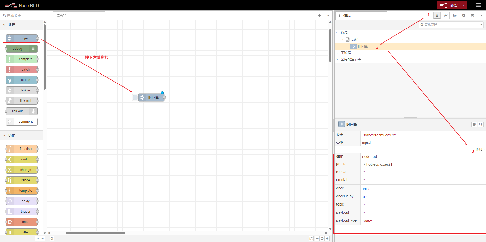

节点描述信息;

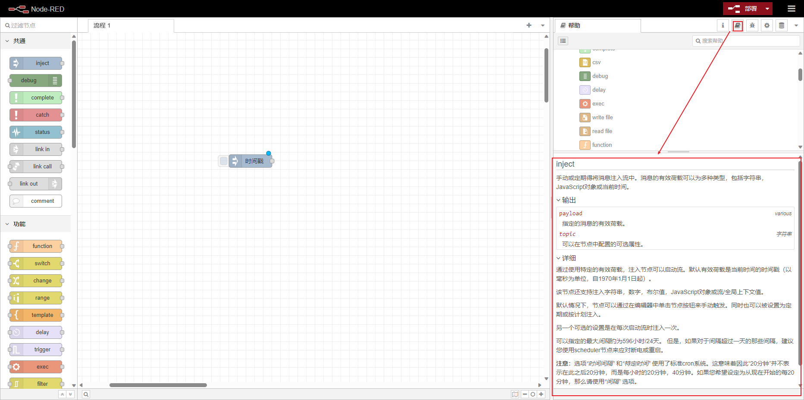

#### 添加Debug节点

Debug会输出任何信息，展示到Debug侧边栏中。默认情况下，只显示message的payload数据，但也可以显示整个message对象。

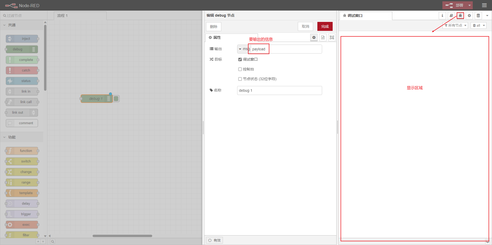

#### 连接两个节点

按下左键，使用连线连接inject节点的输出端口和debug节点的输入端口，即可完成节点之间的数据连通。

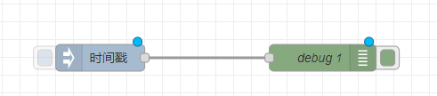

#### 部署

点击顶部Header区的部署按钮，即可将编辑器内的工作流部署到服务器上。

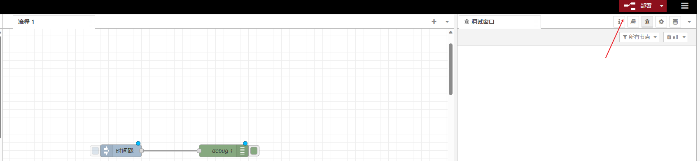

#### 注入数据

点击injet节点旁边的方形按钮，可以在侧边栏debug区看到数据输出。默认情况下，inject节点输出1970年1月1日到现在的时间戳，作为paylad数据。

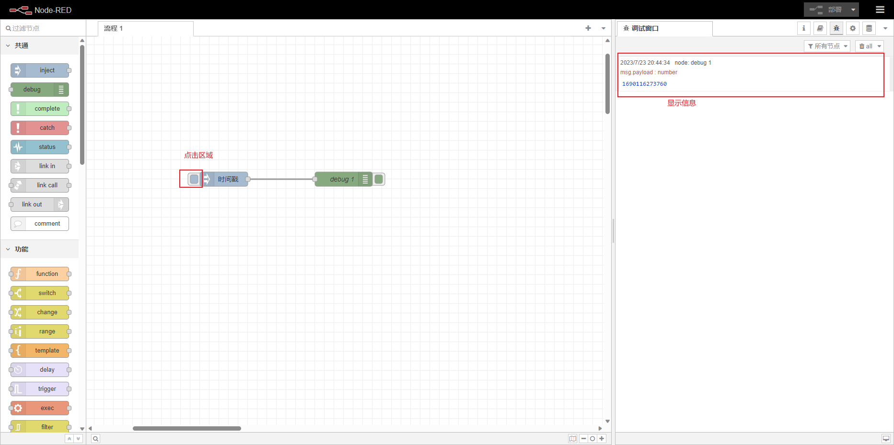

#### 添加function节点

function可以使用javascript语言处理节点数据。

删除injet节点和debug节点间的连线，在inject和debug节点中间插入一个function节点，并用连线连接。

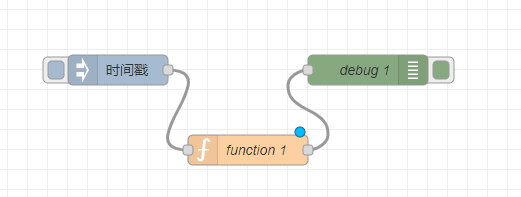

双击funciton节点，打开编辑器对话框，复制下面的代码，点击完成关闭对话框并重新部署，然后在点击inject旁的小方形重新注入数据，可以看到侧边栏输出了时间戳格式化后的数据。

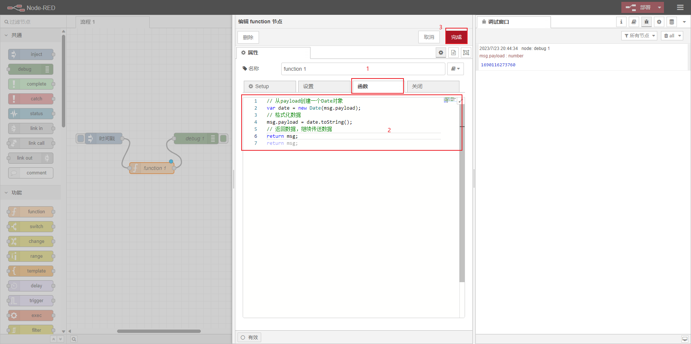

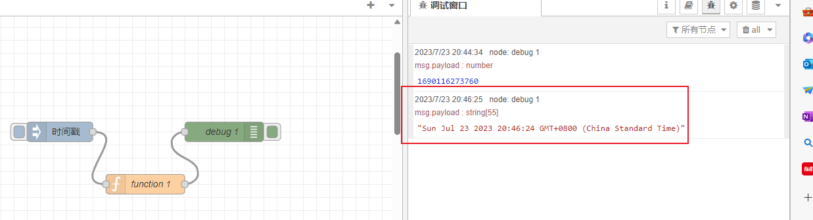

```js
// 从payload创建一个Date对象
var date = new Date(msg.payload);
// 格式化数据
msg.payload = date.toString();
// 返回数据，继续传送数据
return msg;
```

#### 总结

本工作流演示了基本的工作流创建过程。本工作流中，展示了inject节点手动触发数据、debug节点在侧边栏显示数据。也展示了function节点能够通过编写自定义JavaScript脚本的方式处理数据。

#### 源代码

本工作流的代码导出后是如下的json。你也可以导入这段json，检查自己创建的流程是否一致。

```json
[{"id":"58ffae9d.a7005","type":"debug","name":"","active":true,"complete":false,"x":640,"y":200,"wires":[]},{"id":"17626462.e89d9c","type":"inject","name":"","topic":"","payload":"","repeat":"","once":false,"x":240,"y":200,"wires":[]("2921667d.d6de9a")},{"id":"2921667d.d6de9a","type":"function","name":"Format timestamp","func":"// Create a Date object from the payload\nvar date = new Date(msg.payload);\n// Change the payload to be a formatted Date string\nmsg.payload = date.toString();\n// Return the message so it can be sent on\nreturn msg;","outputs":1,"x":440,"y":200,"wires":[]("58ffae9d.a7005")}]
```

导入：

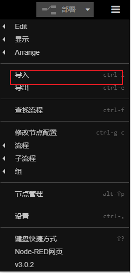.

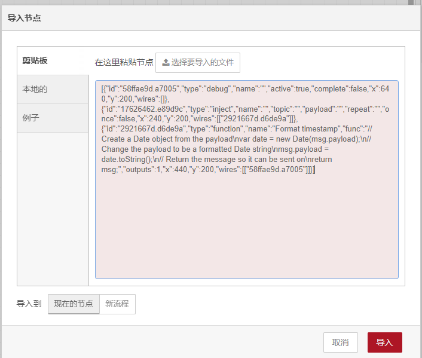

*导出同理*

### 名词释义

本节主要解释下Node-RED中的术语含义，具体指代意义可以参考“编辑器”一章。

#### Node - 节点

节点是工作流基本的构建块。

节点可以通过从流中的前一个节点接收消息来触发，也可以通过等待一些外部事件(如传入的 HTTP 请求、计时器或 GPIO 硬件更改)来触发。它们处理该消息或事件，然后可能向流中的下一个节点发送消息。

一个节点最多只能有一个输入端口和它所需要的任意多个输出端口。

#### Configuration node - 配置节点

Configuration (config) Node 是一种特殊类型的节点，它持有可重用的配置，流中的常规节点可以共享这些配置。

MQTT In 和 Out 节点使用 MQTT Broker 配置节点来表示到 MQTT 代理的共享连接。

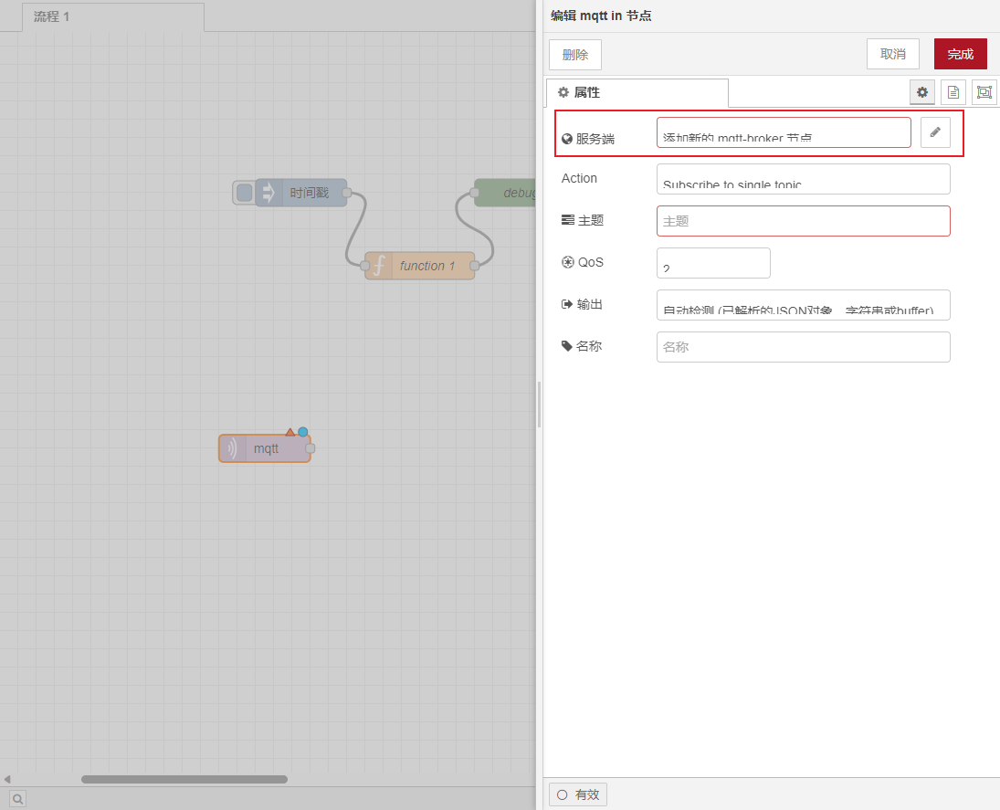

*双击mqtt in节点，打开的对话框要指定服务端，这个服务端其实就是配置节点（mqtt broker）。*

#### flow - 工作流

一个工作流 （Flow） 表示为编辑器工作区中的一个选项卡，是组织节点的主要方式。

术语“流”也用于非正式地描述一组连接的节点。因此，一个流(tab)可以包含多个流(连接的节点集)。即，一个流既可以表达一个工作空间的选项卡，也可以表达一个连接节点的流程。

#### context - 上下文

上下文是一种存储信息的方法，这些信息可以在节点之间共享，而无需使用通过流传递的消息。*应当可以理解为消息的作用域*

上下文有三种类型：

- 节点 - 消息内容只有本节点可见。
- 流 - 对同一流程中的所有节点(或编辑器中的选项卡)可见.
- 全局 - 对所有节点可见。

默认情况下，Node-RED的上下文信息存储在内存中，因此值不会在重新启动时保存。可以将其配置为使用基于文件系统的存储来使值持久化。也可以使用插件存储。

#### message - 消息

消息是在流中的节点之间传递的。它们是普通的 JavaScript 对象，可以具有任何属性集。它们在编辑器中通常被称为 `msg`。

按照惯例，它们有一个包含最有用信息的`payload`属性。

#### subflow - 子流程

Subflow 是折叠成工作区中单个节点的节点的集合。

它们可以用来降低流的可视化复杂性，或者将一组节点打包为在多处使用的可重用组件。

#### wire - 连接线

连线连接节点并表示消息如何通过流。

#### palette - 

Palette 位于编辑器的左侧，列出了可以在流中使用的节点。

扩展节点可以使用命令行或面板管理器安装到面板中。

#### workspace - 工作空间

工作区是流程开发的主要区域，通过从面板中拖动节点并将它们连接在一起。

工作区顶部有一行选项卡; 每个选项卡对应一个已打开的流和任何子流。

#### sidebar - 侧边栏

侧边栏包含一些面板，这些面板在编辑器中提供了许多有用的工具。这些面板包括查看有关节点的更多信息和帮助、查看调试消息和查看流的配置节点。

### 编辑器

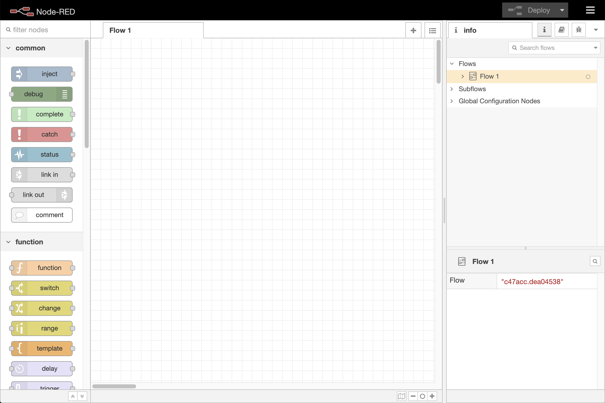

node-red编辑器包含四个组件;

- 上方头部区，包含部署按钮、主菜单，如果设置了用户认证，还有用户中心。
- 左侧控制板，包含可用的节点。
- 中间区域的工作空间，用于创建工作流。
- 右侧的侧边栏。

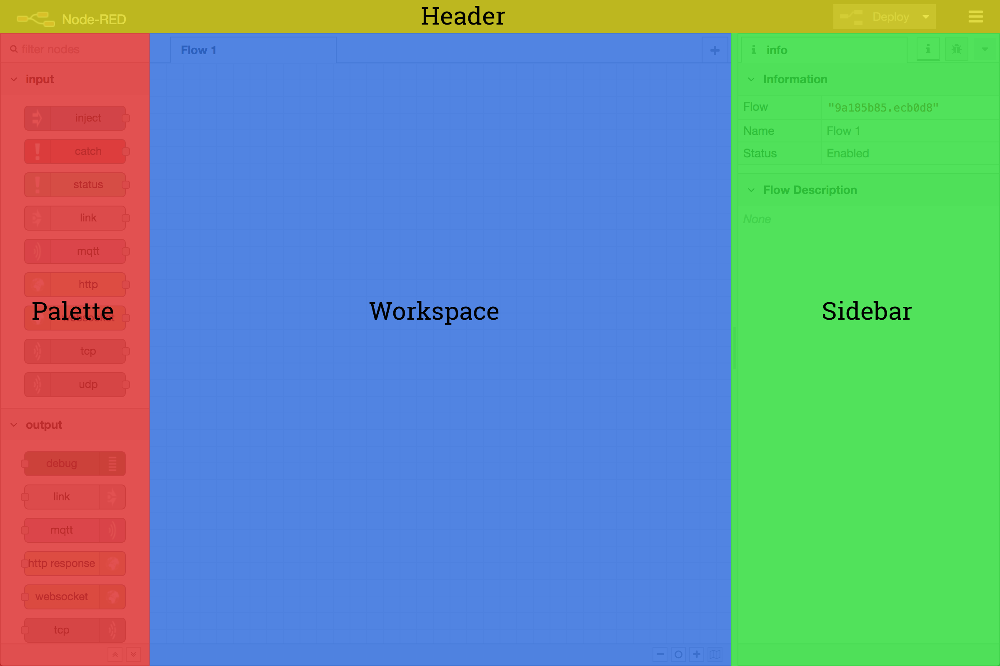

#### workspace - 工作空间

主工作区是通过从面板中拖动节点并将它们连接在一起来开发流的地方。

工作区顶部有一行选项卡; 每个选项卡对应一个已打开的流和任何子流。

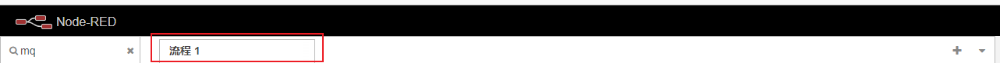

**视图工具**

工作区的页脚包含用于放大和缩小以及重置为默认缩放级别的按钮。

它还包含一个用于视图导航器的切换按钮。

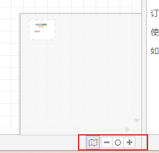

视图导航器提供整个工作区的缩小视图，突出显示当前可见的区域。可以在导航器周围拖动该区域，以便快速跳转到工作区的其他部分。它对于查找在工作区的更远边缘“丢失”的节点也很有用。

**自定义视图**

工作区视图可以通过“用户设置”对话框的“视图”选项卡进行定制。

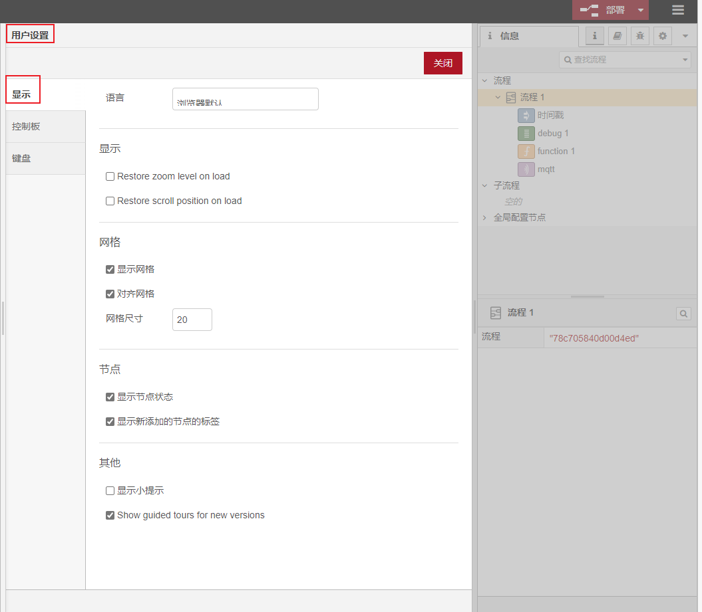

**快捷键**

| 操作         | 快捷键   | 备注 |
| ------------ | -------- | ---- |
| 放大工作区   | ctrl + + |      |
| 缩小工作区   | ctrl + - |      |
| 重置工作区   | ctrl + 0 |      |
| 切换视图导航 | 无       |      |
| 显示用户设置 | ctrl + ，         |      |

##### flow - 工作流

流表示为编辑器工作区中的一个选项卡，是组织节点的主要方式。


> 注意: 术语“流”也用于非正式地描述一组连接的节点。因此，一个流(tab)可以包含多个流(连接的节点集)。

每个流都有名称和描述信息，显示在侧边栏中。

流中的所有节点有相同的流作用域上下文访问权限。

**添加流**

若要添加新的流，请单击顶部栏中的`+`按钮，或双击选项卡栏中的空白区域。

**流排序**

通过在选项卡栏中拖动，可以在工作区中对流进行重新排序。

**编辑流属性**

要编辑流程的属性，双击顶部栏中的选项卡。这将打开流程属性对话框。

- 属性：设置流的名称和描述。描述可以使用 Markdown 语法进行格式化，并将显示在“信息”侧栏中。
- 环境变量：整个流可用的环境变量。

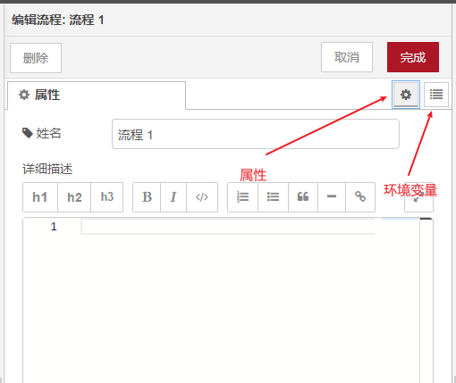

**启用或不启用流**

可以使用对话框底部的切换按钮启用或禁用流。如果禁用流，则在部署流时不会创建它包含的任何节点。

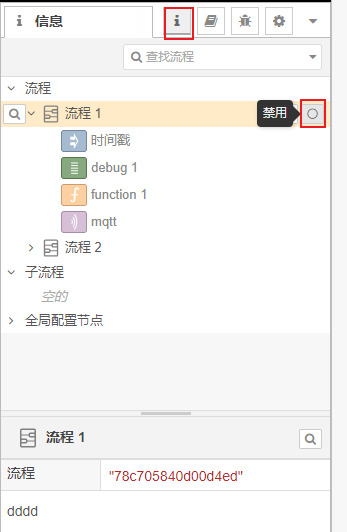

启用/禁用流均使用上图的按钮。

**隐藏流**

在选项卡上点击隐藏按钮，即可隐藏该流程。

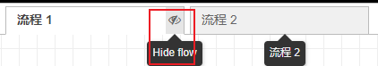

流程隐藏后，在“信息”面板界面可以看到一个打着斜线的眼睛，要想再次显示流，可以再次点击此按钮。

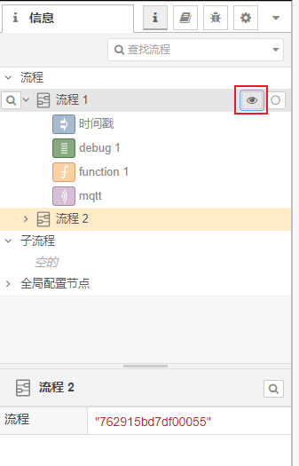
**删除流**

点击流属性对话框（双击流选项卡调出）的删除按钮，即可删除该流。

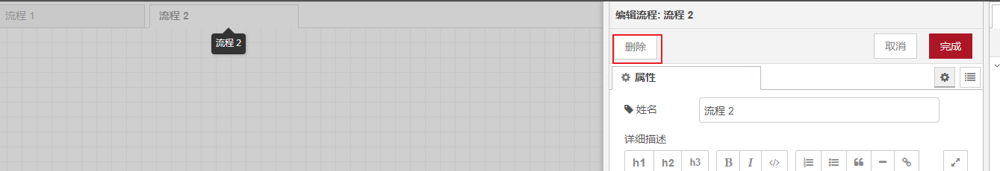

**切换流**

若要打开可用流的列表，请单击顶部栏中的下拉菜单按钮。然后选择 List Flows 选项。

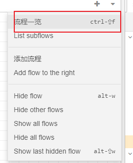

**操作指南**

| 操作内容             | 快捷键           | 备注                             |
| -------------------- | ---------------- | -------------------------------- |
| 添加流               | 无               |                                  |
| 编辑流               | 无               |                                  |
| 禁用流               | 无               |                                  |
| 启用流               | 无               |                                  |
| 隐藏流               | alt + w          |                                  |
| 显示流               | alt + shift + w  | 工作区没有打开的流时，操作无效。 |
| 隐藏其他流           | 无               |                                  |
| 隐藏所有流           | 无               |                                  |
| 显示所有流           | 无               |                                  |
| 删除流               | 无               |                                  |
| 列表展示所有流       | ctrl + shift + f |                                  |
| 切换至上一个流选项卡 | ctrl + `[`         |                                  |
| 切换至下一个流选项卡 | ctrl + `]`                 |                                  |

##### nodes - 节点

节点可以通过以下任意一种方式添加到工作区：

- 从palette区拖拽添加
- 使用快速添加对话框
- 从库或剪贴板导入

节点通过连线将端口连接在一起。一个节点最多可以有一个输入端口和多个输出端口。节点可以指定标签，一个端口可能有一个标签，当鼠标悬停在该端口上时显示出来。节

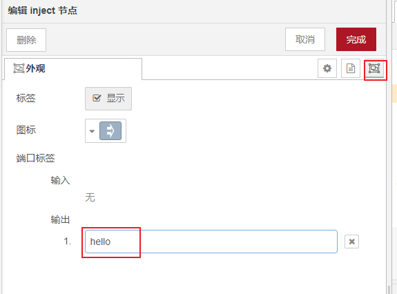

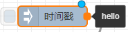

有些节点在节点下方显示状态消息和图标。这用于指示节点的运行时状态-例如，MQTT 节点指示它们是否当前连接。

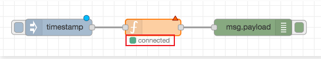

如果一个节点有任何未部署的更改，它将在其上方显示一个蓝色圆圈。如果其配置有错误，它将显示一个红色三角形。

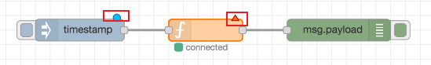

有些节点在其左边或右边包含一个按钮。它们允许从编辑器内部与节点进行一些交互。inject和debug节点是唯一具有按钮的核心节点。

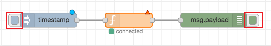

**快速添加对话框**

Quick-Add 对话框提供了一种简单的方法，可以将节点添加到鼠标所在的工作区中，而无需将其从控制板中拖动过来。

按住 Ctrl 或 Command 键，单击工作区可以打开该对话框。

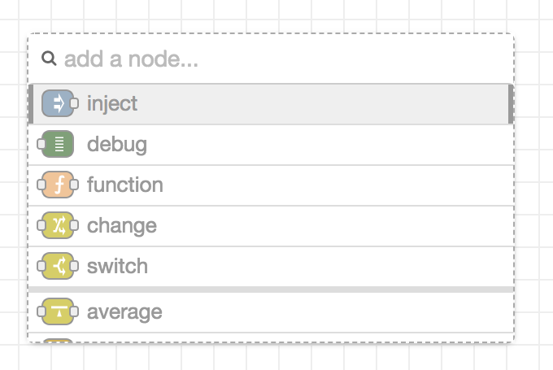

该对话框包含可添加的所有节点的完整列表。它显示列表顶部的五个主要核心节点，然后是最近添加的任何节点，最后是剩余节点的完整的按字母顺序排列的列表。

与主面板一样，该对话框在顶部有一个输入，用于筛选列表并快速查找节点。

如果在单击列表中的某个节点时按住 Ctrl 或 Command，则将添加该节点，并保持打开 Quick-Add 对话框以在流中添加下一个节点。

如果在选中某个连接线时，按住 Ctrl 或 Command并单击左键，该节点会被添加到该连接线上。

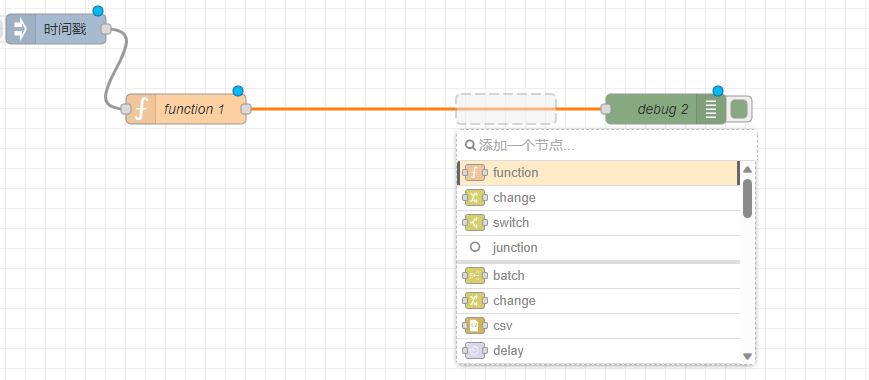

**编辑节点**

可以通过双击节点来编辑节点的配置。或者在节点获取焦点时按 Enter也可打开编辑框，如果选择了多个节点，则将编辑所选内容中流的第一个节点。

编辑对话框有三个选项卡：

- 属性：指定节点类型的编辑表单
- 描述：每个节点使用 Markdown 格式化的文档。当选择节点时，将显示在信息侧边栏中。
- 外观：定义节点外观的选项

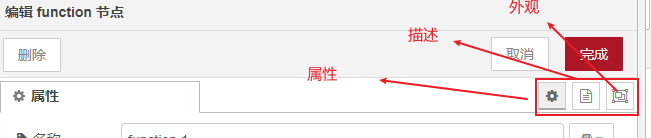

外观选项卡提供以下选项：

- 选择是否显示节点的标签。
- 切换节点的图标。
- 提供自定义端口标签。

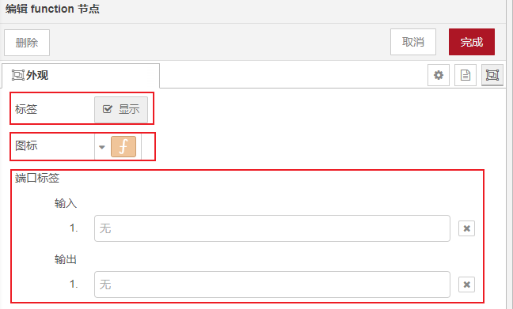

**启用或禁用节点**

可以使用对话框底部的切换按钮启用或禁用节点。如果禁用节点，则在部署流时不会创建该节点。如果禁用的节点位于流的中间，则不会有任何消息通过该节点。

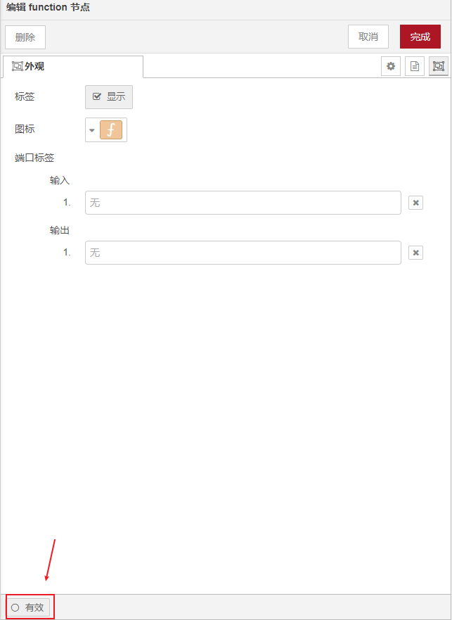

**配置节点**

Configuration (config) Node 是一种特殊类型的节点，它持有可重用的配置，流中的常规节点可以共享这些配置。

例如，MQTT In 和 Out 节点使用 MQTT Broker 配置节点来表示到 MQTT 代理的共享连接。

配置节点通过需要配置节点的编辑对话框添加，单击选择框旁边的按钮将打开编辑对话框，然后可以添加一个配置节点实例。


对话框的页脚显示了有多少节点使用这个配置节点。它还提供了一个选择框来设置配置节点的作用域。范围确定配置节点可用于哪个流。默认情况下，它在所有流上都可用，但是可以使用选择框使其仅局部于一个流。

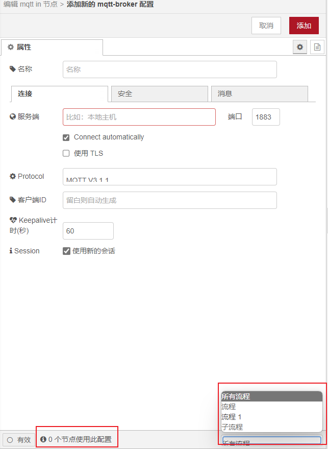

与普通节点一样，也可以使用页脚中的切换按钮启用或禁用它。

配置节点边栏可用于管理所有配置节点。

**快捷键**

| 操作内容           | 快捷键 | 备注 |
| ------------------ | ------ | ---- |
| 显示选定的节点标签 | 无     |      |
| 隐藏选定的节点标签 | 无     |      |

##### wires - 连接线

鼠标移动到输出节点的端口上，按住鼠标左键，移动到输入节点的端口上松开，即可连接两个节点。

或者，鼠标移动到输出节点的端口上，按下ctrl键，并点击鼠标左键，然后移动鼠标到输入节点的端口上，再次点击鼠标左键，也可连接两个节点。

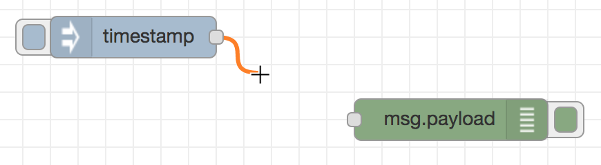

后面的方法也可以与 Quick-Add 对话框结合使用，该对话框由工作区上的 Ctrl/Command-Click 触发，可以快速插入新节点，并将它们连接到流中的前一个节点。

**打断连接线**

如果一个同时具有输入和输出端口的节点被拖到连接线的中间，则连接线会变成虚线，松开拖动的节点时，这个节点会自动添加到连接线的中间。

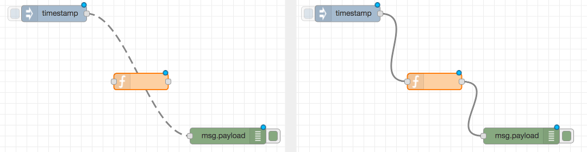

**移动连接线**

如果要改版连接线的连接节点，然后按下shift键并左键点击要断开的节点端口位置，鼠标移动到要链接的节点端口上松开，则完成连接。如果没有移动到要连接的节点端口上，则会删除该连接线。

如果一个端口有多根连接线连接到它，按下 Shift 键时没有选择任何一根连接线，所有的电线都会移动。

**多选连接线**

按下ctrl键，点击连接线可以多选。

当选择多个节点时，将突出显示它们之间的任何连接线。这将会使得根据选择的节点观察工作流变得简单。

**删除连接线**

1. 选择一个或多个连接线：
	1. 要选择单线，请左键单击1线。
	2. 要选择多条连接线，左键单击1条连接线，然后按住 Ctrl/Command，单击其他连接线。
2. 按下delete按钮

**切线**

也可以通过切断连接来移除它们。按住 Alt/Option 键，然后用鼠标按住左键并划过要删除的连接线。

)

**分离节点**

删除节点但保持原来的连接线：选中要删除的节点 → 按住ctrl → 按下delte

将节点拖出连接线：过程如下：


*没有从连线分离节点的默认快捷方式，但是可以在“设置”对话框的“键盘”窗格中自己分配一个快捷方式*

**快捷键**

| 操作内容                       | 快捷键        | 备注 |
| ------------------------------ | ------------- | ---- |
| 删除选中的节点并重新建立连接线 | ctrl + delete |      |
| 分离选定的节点保持原来的连接   | 无              |      |

##### group - 分组

节点可以连接在一起形成一个组。然后可以在编辑器中将它们作为单个对象移动或复制。

可以给组一个边框和背景颜色，以及一个可选的标签。

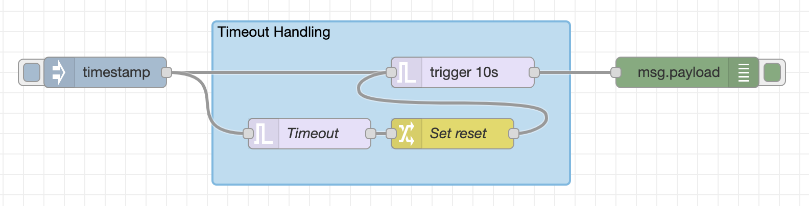

**创建组**

要创建一个组，请选择节点，然后在菜单中选择“ Groups-> Group select”选项。

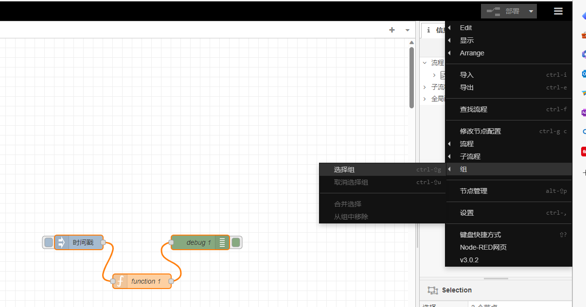

**编辑组属性**

可以通过双击组来编辑组的属性，或者在工作区具有焦点并选中组时按 Enter打开组属性编辑框。

编辑对话框包含两个选项卡：

- 属性：要编辑的组的属性
- 环境变量：组内公开为环境变量的属性。
- 描述：每个节点使用 Markdown 格式化的文档。当组被选中时，这将显示在信息侧边栏中

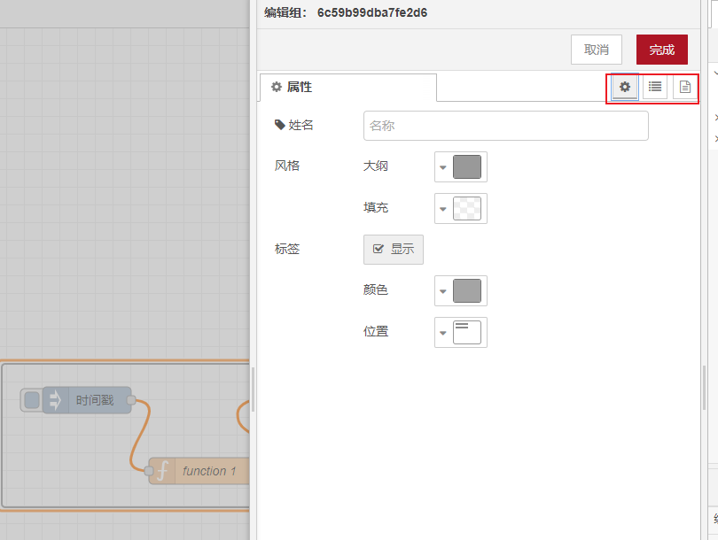

Group properties 选项卡提供了以下选项：

- 设定组的轮廓和填充颜色。
- 选择组名是否显示为标签，如果是的话，标签的颜色和位置会出现在设定的地方。

**重用组样式**

要复制现有组的样式(边框、填充、颜色和标签位置) ，请选择该组，然后按 Ctrl-Shift-c。

若要将该样式应用于另一个组，请选择该组并按 Ctrl-Shift-v。

**组中添加节点**

可以通过将节点拖动到现有组中来将它们添加到现有组中。这只适用于一次添加一个节点。

**合并节点/组**

可以合并当前所选内容以形成单个组。选择要合并到单个组中的所有组和节点。然后在菜单中选择“ Groups-> Merge select”选项。

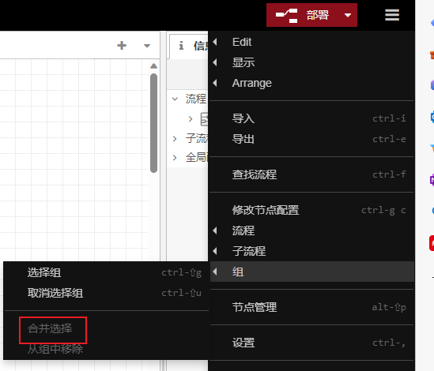

**取消分组**

要取消组节点分组，请选择组，然后在菜单中选择“ Groups-> Ungroup select”选项。

**组中移除节点**

若要从组中删除节点，请选择该节点，然后在菜单中选择“ Groups-> Removefrom group”选项。

**快捷键**

| 操作内容       | 快捷键           | 备注           |
| -------------- | ---------------- | -------------- |
| 创建组         | ctrl + shift + g | 提前选择好节点 |
| 复用组（拷贝） | ctrl + shift + c | 提前选择好节点 |
| 复用组（粘贴） | ctrl + shift + v |                |
| 合并组         | 无               |                |
| 解除分组       | ctrl + shift + u | 提前选择好组   |
| 组中移除节点   | 无                 |                |

##### subflows - 子流程

子流是折叠成工作区中单个节点的节点的集合。

它们可以用来降低流的某些可视化复杂性，或者将一组节点打包为在多个位置使用的可重用流。

一旦创建，子流就会添加到可用节点的palette中。然后，子流的各个实例可以像其他节点一样添加到工作区中。

*注意: 子流不能包含它自己的实例——无论是直接的还是间接的。*

**创建空的子流程**

通过选择菜单中的“ Subflow-> Create Subflow”选项可以创建子流。这将创建一个空白子流并在工作区中打开它。

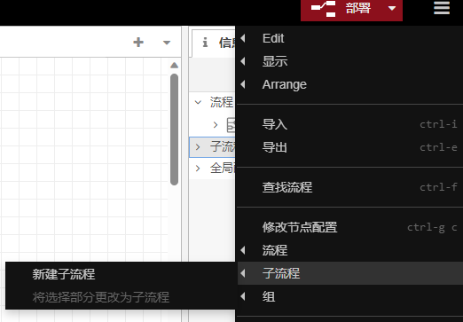

**将节点转换为子流程**

也可以通过在菜单中选择“ Subflow-> Select to Subflow”选项将当前选择的节点转换为子流。这些节点将被移动到一个新的子流，并由流中的一个子流实例节点替换。

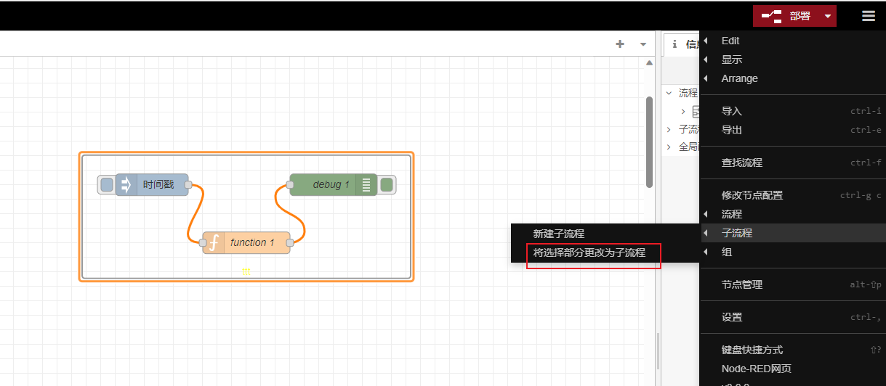

子流程最多只能有一个节点输入端，即节点中有两个节点输入端的流程不能成为子流程。如下图（如split节点有两个输入的话也能组成子流程）：

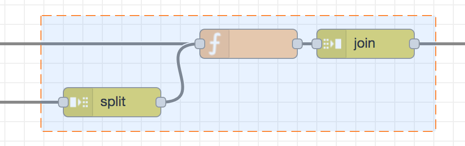

**编辑子流程**

有两种方法可以打开子流来编辑其内容。在pakette面板中双击它的节点，或者在工作区中双击子流实例节点打开编辑对话框，然后单击“编辑流模板”按钮。

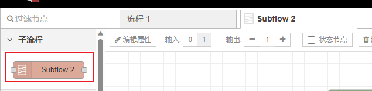

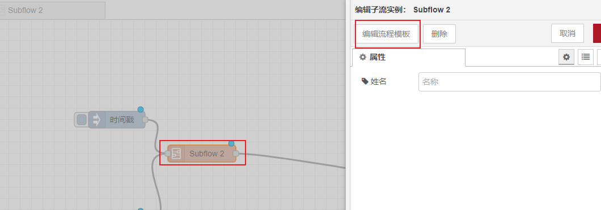

子流作为一个新的选项卡在工作区中打开。与常规的流选项卡不同，子流选项卡可以关闭以隐藏它们。

**输入&输出**

子流的输入和输出由灰色方形节点表示，这些灰色方形节点可以像正常情况一样连接到子流中。

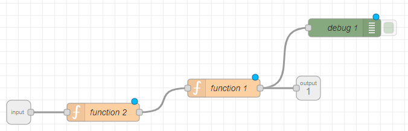

工具栏提供了添加和删除这些节点的选项。与普通流节点一样，最多只能有一个输入和所需的多个输出。

**节点状态**

工具栏提供了一个向子流添加“ status”输出的选项。这可用于更新子流实例节点的 Status。

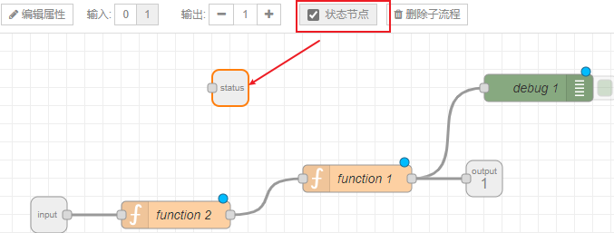

**编辑子流程属性**

“编辑属性”按钮可以打开子流属性对话框。与 Flow 属性对话框一样，可以设置子流的名称和描述。

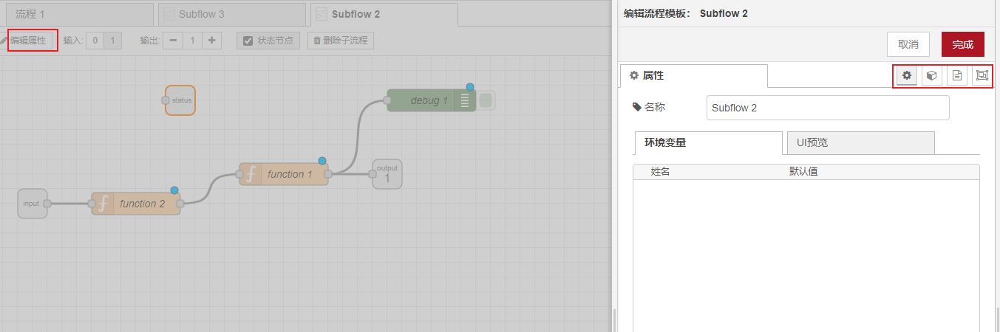

- 属性：每个实例属性都会成为子流中公开的环境变量。
	- 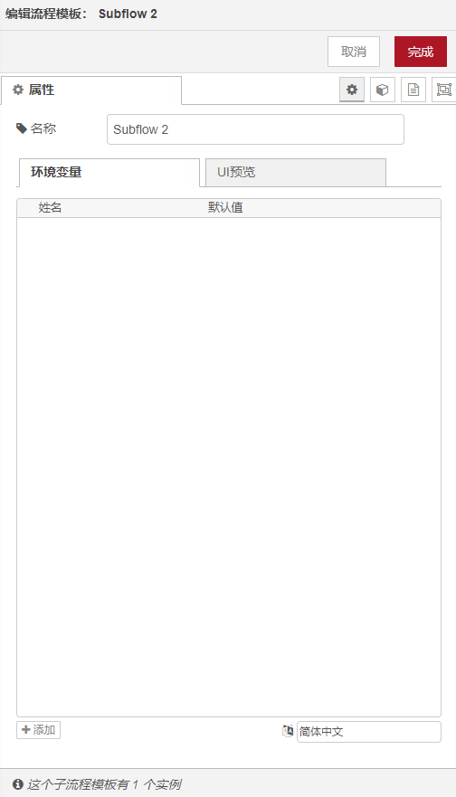
- 模块属性：子流程的元数据。
	- 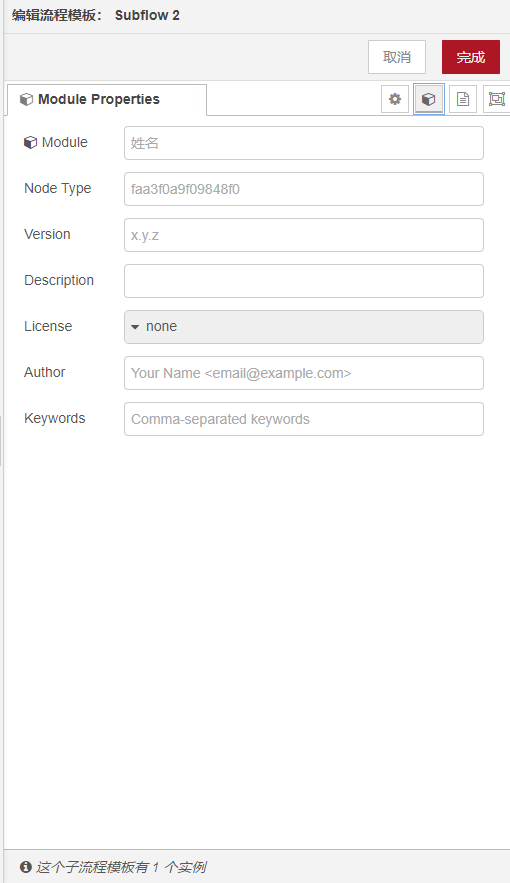
- 描述：每个节点使用 Markdown 格式化的文档。当选择节点时，这将显示在信息侧边栏中。
	- 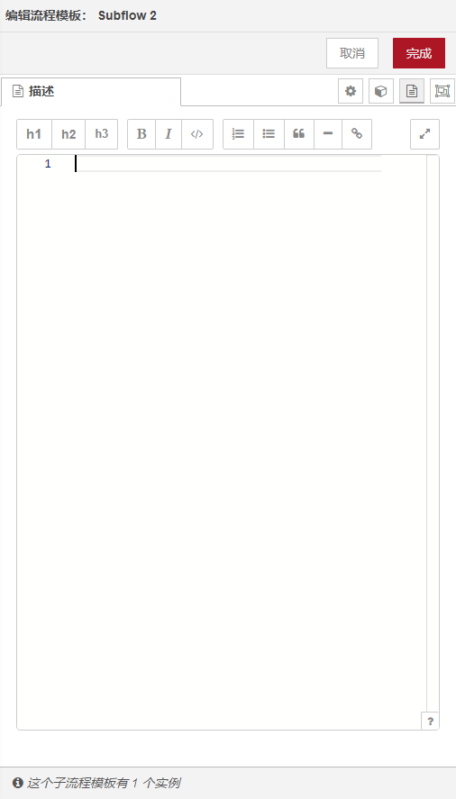
- 外观：自定义节点外观的选项。
	- 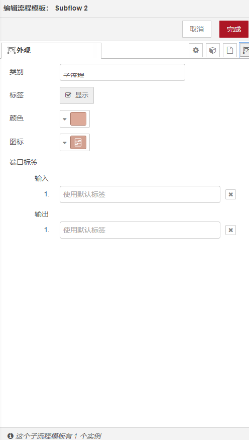

**属性**

编辑对话框的“ Properties”选项卡可以用来定义一组属性，然后可以为子流的每个实例定制这些属性。然后，这些属性作为子流中的环境变量公开。

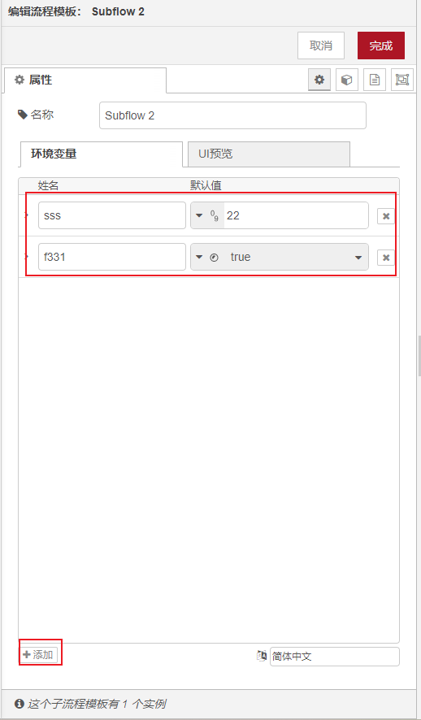

“ UI 预览”选项卡提供了这些属性如何呈现，在编辑子流程实例时，可以展开属性表中的每个条目。

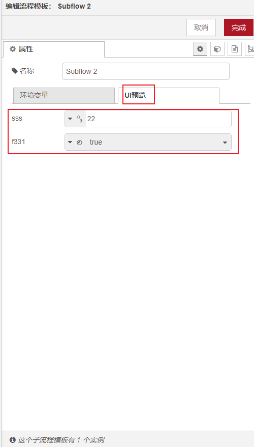

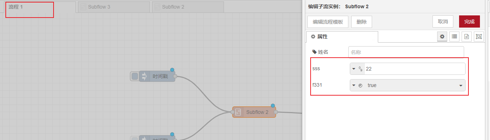

**模块属性**

ModuleProperties 选项卡可用于设置关于 Subflow 的其他元数据，包括版本、许可证和模块名称。当将 Subflow 打包为 npm 模块时，将会使用到这些信息。

**外观**

外观选项卡提供以下配置：

- 更改节点在palette中的显示类别。
- 选择是否显示节点的标签
- 改变节点的颜色
- 更改节点的图标
- 提供自定义端口标签。

**删除子流程**

子流工具栏中的“删除子流”按钮可用于删除子流及其所有实例。

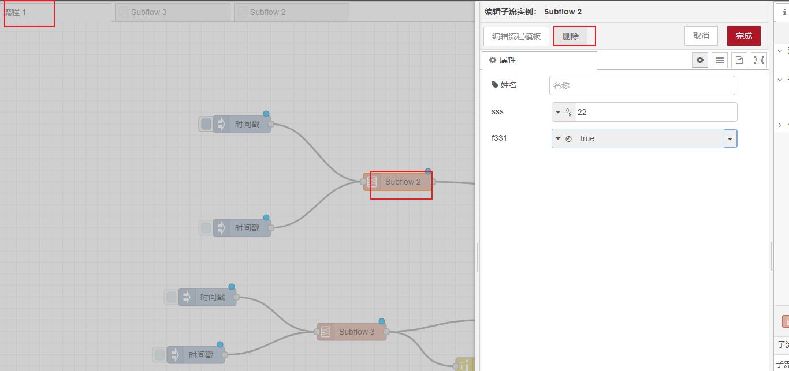

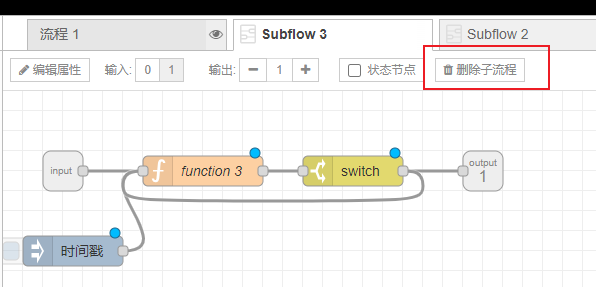

**快捷键**

| 操作内容     | 快捷键 | 备注 |
| ------------ | ------ | ---- |
| 创建空子流程 |   无     |      |
| 转换为子流程 |     无   |      |

##### selection - 框选

当单击某个节点时，该节点将被选中。但这会取消当前选定节点之前选定的任何内容。“信息侧边栏”将显示选定节点的属性和其类型的帮助文本。

如果在单击节点时按下 Ctrl 或 Command 键，则该节点将被添加到当前选定内容中(如果已经选定，则删除该节点)。

如果在单击节点中间时按下 Shift 键，它将选择该节点以及它所连接到的所有其他节点。单击节点的左侧，它将选择该节点以及流中位于它前面的所有节点——“上游”节点。单击该节点的右侧，它将选择该节点以及在该节点之后的所有流节点——“下游”节点。

当单击连接线时，将选择连接线。与节点不同，一次只能选择一条线，按下ctrl键会将选定的连接线添加到已选定的连接线中。按下shift键则只选中当前连接线，之前选中的会被取消。

**套索工具**

套索工具可以用来选择多个节点。它是通过在工作区中按下鼠标左键并拖动来启用的。

它不能用来选择连接线。

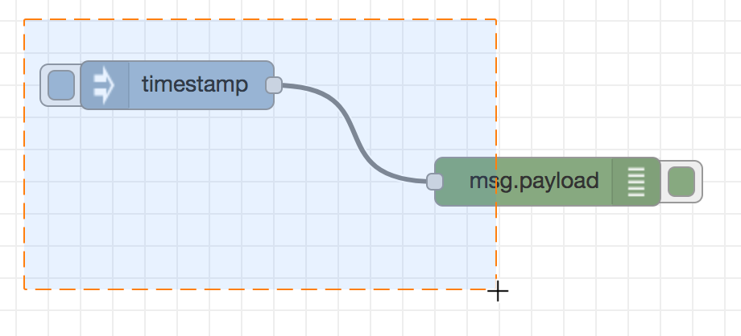

**选择所有节点**

要选择当前流上的所有节点，请确保工作区具有焦点，然后按 Ctrl/Command-a。

**选择连接的节点**

要选择连接到特定节点的所有节点，请按住 Shift 键，同时单击该节点的中间。

**选择上游或下游节点**

若要选择一个节点及其所有上游或下游节点，请在按住 Shift 键的同时单击该节点的左侧或右侧。

**选择流**

当单击编辑器的选项卡时，通过按住 Ctrl/Command 键可以选择编辑器中的多个流。

一旦选中，它们可以像任何选择区一样被删除、复制或导出。

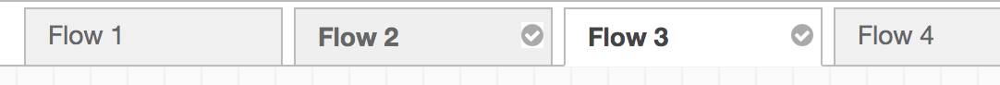

**编辑剪贴板**

编辑器支持标准的复制/剪切/粘贴操作。

**快捷键**

| 操作                       | 快捷键   | 备注 |
| -------------------------- | -------- | ---- |
| 选择连接的节点             |          |      |
| 选择节点的上游节点         |          |      |
| 选择节点的下游节点         |          |      |
| 选择所有节点               | ctrl + a |      |
| 复制选择的节点到剪贴板     | ctrl + c |      |
| 剪切选择的节点到剪贴板     | ctrl + x |      |
| 从剪贴板粘贴节点到工作空间 | ctrl + v |      |

##### Arranging Nodes - 节点编排

编辑器提供了许多操作来帮助安排工作区中的节点。它们可用于对齐和分发节点。

它们都可以在“编排”菜单下找到。

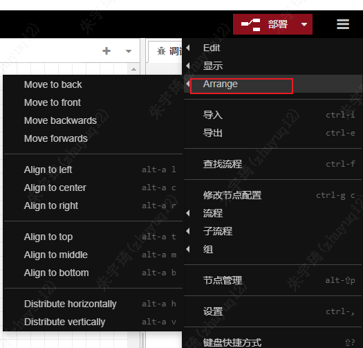

**快捷键**

| 操作                 | 快捷键 | 备注 |
| -------------------- | ------ | ---- |
| 选择内容网格对齐     |        |      |
| 选择内容左对齐       |        |      |
| 选择内容右对齐       |        |      |
| 选择内容顶部对齐     |        |      |
| 选择内容底部对齐     |        |      |
| 选择内中垂直中间对齐 |        |      |
| 选择内容水平中间对齐 |        |      |
| 选择内容中心对齐     |        |      |
| 选择内容中心                     |        |      |

##### import/export - 导入/导出

可以使用 JSON 格式从编辑器导入和导出流，从而非常容易与其他人共享流。

**导入流**

导入对话框可以通过以下方法导入流：

- 直接粘贴json格式文件内容。
- 上传一个json文件。
- 从本地的流库文件中导入。
- 导入node-red安装时提供的示例。
	- 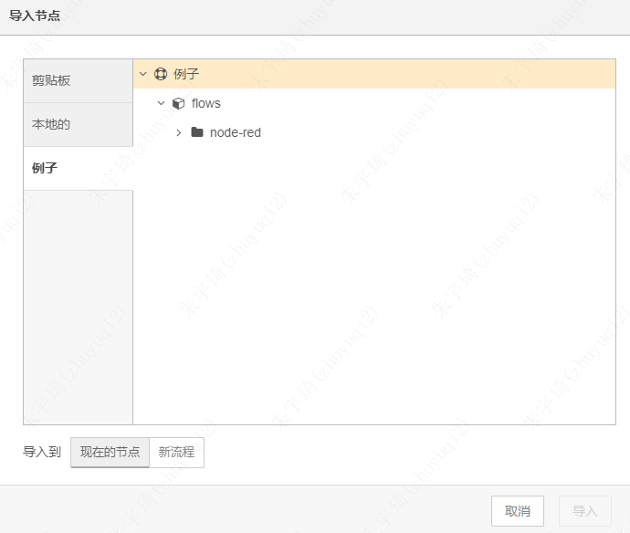

不论哪种导入方式，对话框都提供了将节点导入当前流或为它们创建新流的选项。

**导出流**

可以通过以下方法使用 Export 对话框将流导出为json文件。

- 将 JSON 复制到系统剪贴板。
- 下载json到本地。
- 保存json到本地的流库。

导出功能可以导出选定的节点、当前流(包括其制表符节点)或完整的流配置。

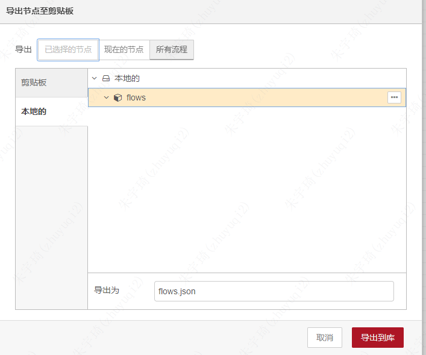

导出功能提供了导出压缩或格式化 JSON 的选项。压缩选项生成一行没有空格的 JSON。格式化的 JSON 选项通过多行格式化，带有完全缩进——这样更容易阅读。

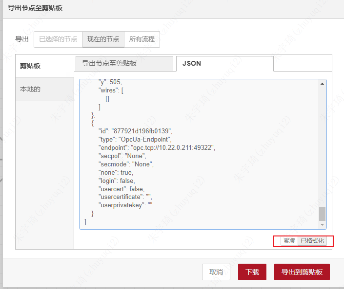

**快捷键**

| 操作                 | 快捷键   | 备注 |
| -------------------- | -------- | ---- |
| 显示导入对话框       | ctrl + i |      |
| 显示本地库导入对话框 | 无       |      |
| 显示示例导入对话框   | 无       |      |
| 显示导出对话框       | ctrl + e |      |
| 显示库导出对话框     | 无       |      |

##### search - 搜索

Search 对话框可用于查找工作区中的节点，包括配置节点。

它对节点的所有属性进行索引，因此可以使用它根据节点的 id、类型、名称或任何其他属性搜索节点。

在结果列表中选择一个节点将在编辑器中显示该节点。

单击该按钮将把当前搜索复制到 Information 侧栏搜索。?

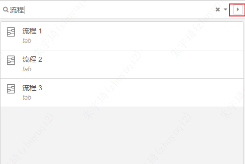

**搜索语法**

该搜索支持许多额外的过滤器，以帮助缩小搜索结果的范围。

| 过滤器       | 描述                   |
| ------------ | ---------------------- |
| `is:config`  | 将结果限制在配置节点中 |
| `is:subflow` | 将结果限制在子流程中   |
| `is:invalid` | 匹配存在配置错误的节点 |
| `uses:<config-node-id>`             |       将结果限制为依赖于特定配置节点的节点                 |

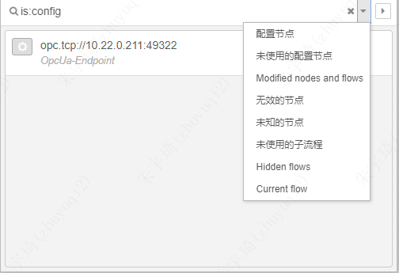

**快捷键**

| 操作   | 快捷键 | 备注 |
| ------ | ------ | ---- |
| 搜索流 | ctrl + f       |      |

#### Palette - 控制板

控制板包含所有已安装并可以使用的节点。

控制板中节点被组织成各种类别，输入、输出类节点位于顶部。如果有任何子工作流，它们将出现在控制板顶部的类别中。

点击分类可以展开该类别下的节点。

控制板栏底部的按钮可以展开或收起所有节点。

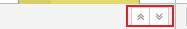

控制板上部是一个过滤器，可以筛选需要的节点列表。

鼠标放置在控制板区域时，会出现一个按钮，点击该按钮可以收起或展示控制板。

| 操作     | 快捷键 | 备注 |
| -------- | ------ | ---- |
| 显示控制板 | ctrl + p       |      |

##### 控制板管理

控制板管理器可以安装新节点到控制板中，可以通过菜单栏的“用户设置”对话框打开控制板对话框。

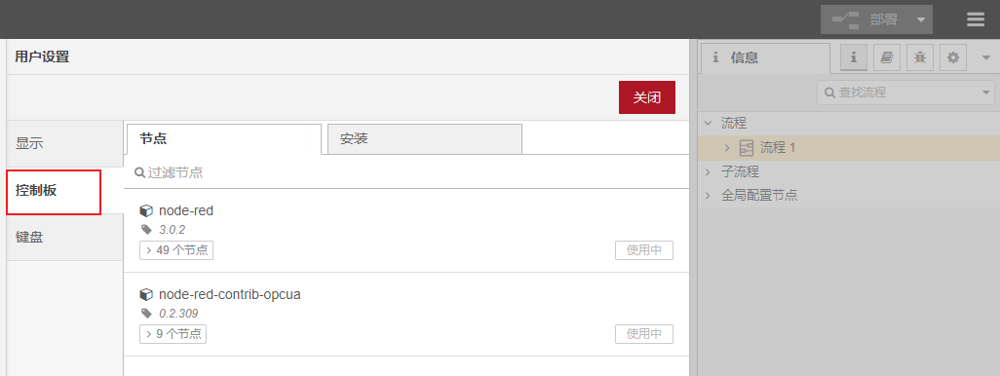

可以使用面板管理器将新节点安装到面板中。可以在“用户设置”对话框的“控制板”选项卡下访问它

控制板管理器有两个选项卡：

- 节点选项卡：列出当前安装的所有运行库模块。
- 安装选项卡：列出可以安装的可用模块。

**管理节点**

Nodes 列表中的每个条目显示了节点模块的名称和版本。

同时，节点管理面板提供了删除、禁用或升级每个模块的选项。如果某个节点当前正在流中使用，则不能删除或禁用该节点。

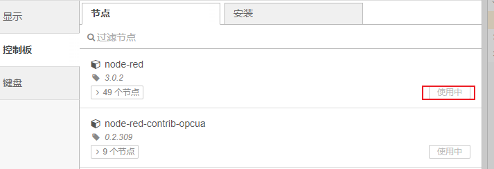

**安装节点**

Install 选项卡可用于搜索可用模块并安装它们。

若要搜索模块，请在搜索栏中输入其名称。搜索结果显示了模块的详细信息，包括最后一次更新的时间和指向其文档的链接。它可以通过点击“安装”按钮来安装。

**快捷键**

| 操作             | 快捷键           | 备注 |
| ---------------- | ---------------- | ---- |
| 打开控制板对话框 | ctrl + shift + p |      |

#### sidebar - 侧边栏

侧边栏包含了许多在编辑器中提供有用工具的面板。

- 信息栏：查看节点以及节点帮助信息。
- debug栏：查看传递到debug节点的消息。
- 配置节点栏：管理配置节点。
- 上下文数据：插线上下文内容。

通过单击侧边栏标题中的面板图标，或者通过单击按钮在下拉列表中选择面板，可以打开面板。

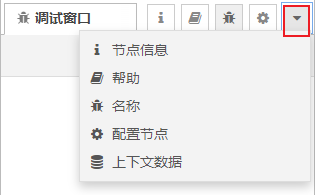

有些节点提供自己的侧栏面板，例如 node-red-dashboard。

可以通过在工作区中拖动侧边来调整侧边栏的大小。

如果将侧边栏边框拖动到靠近编辑器右边缘的位置，则侧边栏将被隐藏。可以通过选择“视图”菜单中的“显示侧栏”选项或使用 Ctrl/something-Space 快捷方式再次显示

**快捷键**

| 操作                 | 快捷键 | 备注 |
| -------------------- | ------ | ---- |
| 切换侧边栏显示与隐藏 | ctrl + space       |      |

##### information - 信息

信息侧边栏显示有关流的信息。包括所有流和节点的概要视图，以及当前选择的详细信息。

可以使用与主搜索对话框相同的语法搜索大纲视图。

将鼠标悬停在大纲中的一个条目上可以看到一组选项：

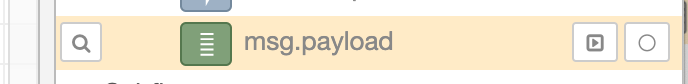

- 搜索：可以在主工作区高亮显示当前条目。
	- 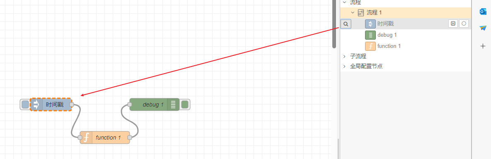
- 触发：如果节点有一个按钮，例如 Debug 和 Inject 节点，则可以使用该按钮触发该按钮。
- 启用/禁用：该按钮用于启用或禁用节点/流。

在 Information 侧边栏的底部，显示了当前选择内容的详细信息。包括以下内容：

- 属性摘要
- 用户提供的节点/流的描述。
- 指向节点帮助的链接。

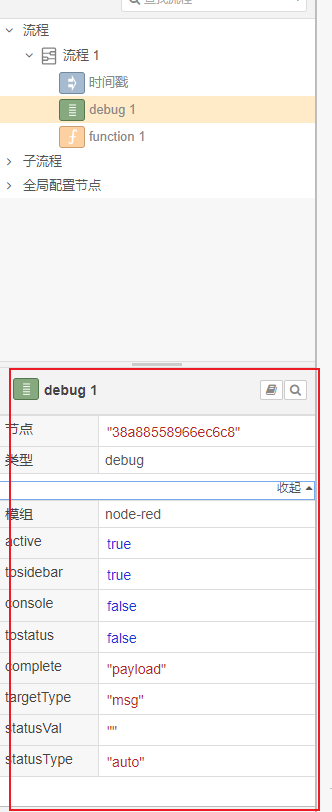

如果没有选择任何内容，它将显示当前流程的描述——可以在 Flow Properties 编辑对话框中进行编辑。

**快捷键**

| 操作           | 快捷键 | 备注 |
| -------------- | ------ | ---- |
| 显示信息选项卡 |        |      |

##### help - 帮助

在 Node-RED 的早期版本中，当前选定节点的帮助文本显示在 Information 侧栏中。

在 Node-RED 1.1.0中引入的 Help 侧栏提供了对编辑器中所有节点的帮助内容的访问——而不仅仅是当前选择的内容。

顶部部分提供了完整的目录，可以使用”显示主题“按钮进行切换。

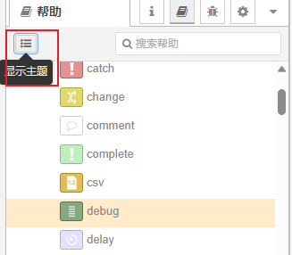

**快捷键**

| 操作           | 快捷键 | 备注 |
| -------------- | ------ | ---- |
| 显示帮助选项卡 |        |      |

##### debug - 调试

Debug 侧栏显示传递给流中的 Debug 节点的消息，以及来自运行库的某些日志消息。

有关如何使用“调试”侧栏来理解消息结构的详细信息，请阅读“使用消息工作”指南。

默认情况下，Debug 侧栏显示传递给它的所有消息。这可以通过单击”过滤日志“按钮来打开筛选选项面板进行筛选。面板提供了三种选择:

- 所有节点-显示所有消息
- 选择节点 - 从所有可用节点的列表中选择特定的调试节点
- 当前流——仅显示来自工作区中当前流上的节点的消息

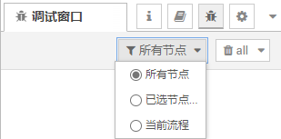

**注意**：Debug 侧边栏只能显示最近的100条消息。如果侧边栏当前显示的是经过过滤的消息列表，则隐藏的消息仍计入100个限制。如果一个流有复杂的 Debug 节点，与其从侧边栏过滤它们，不如通过单击工作区中的按钮禁用它们。

可以通过单击删除按钮随时清除侧边栏的内容。

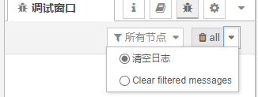

侧边栏页脚中的“新窗口打开”按钮可用于打开包含“调试”侧边栏的单独浏览器窗口。

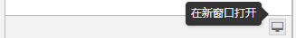

**快捷键**

| 操作                 | 快捷键         | 备注 |
| -------------------- | -------------- | ---- |
| 显示debug选项卡      |                |      |
| 清除debug的消息      | ctrl + alt + l |      |
| 激活选择的调试节点   |                |      |
| 激活所有调试节点     |                |      |
| 激活所有流的调试节点 |                |      |
| 停用选择的调试节点   |                |      |
| 停用所有调试节点     |                |      |
| 停用所有流的调试节点 |                |      |

#### config nodes - 配置节点

Configuration 节点侧栏提供了所有配置节点的列表，按照它们的作用域进行组织。

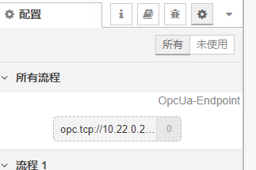

每个节点显示其类型和标签，以及当前有多少常规流节点使用该配置节点。

如果配置节点未使用，则显示为虚线轮廓。还可以通过选择标题中的“未使用”筛选器来筛选视图，从而只显示未使用的节点。

通过双击配置节点可以打开该节点的编辑对话框。

**快捷键**

| 操作           | 快捷键 | 备注 |
| -------------- | ------ | ---- |
| 显示配置节点选项卡 |        |      |

#### context data - 上下文数据

上下文侧栏显示上下文数据存储区的内容。

有关使用上下文的更多信息，请阅读使用上下文指南。

面板分为三个部分，每个部分对应一个上下文作用域; 节点、流和全局。

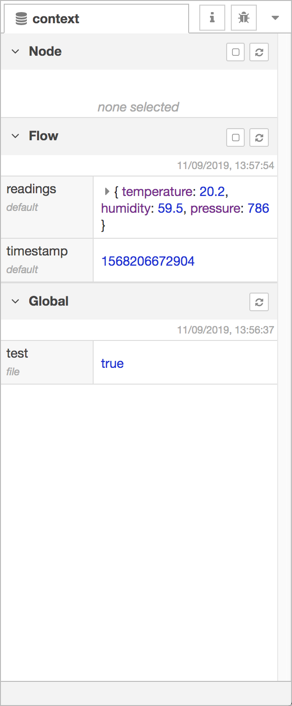

必须单击刷新按钮才能加载上下文内容。

Node 和 Flow 部分的刷新按钮旁边都有一个复选框，可以在选定的节点或流更改时自动刷新内容。

将鼠标悬停在任何上下文属性名称上将显示一个刷新按钮，该按钮只能用于刷新该值。

将鼠标悬停在上下文属性的值上将显示一个按钮，用于将其内容复制到系统剪贴板。该值将被转换为 JSON，因此不能复制所有的值。

**快捷键**

| 操作           | 快捷键 | 备注 |
| -------------- | ------ | ---- |
| 显示上下文数据选项卡 |        |      |