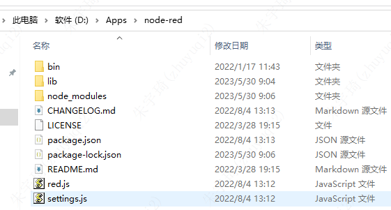
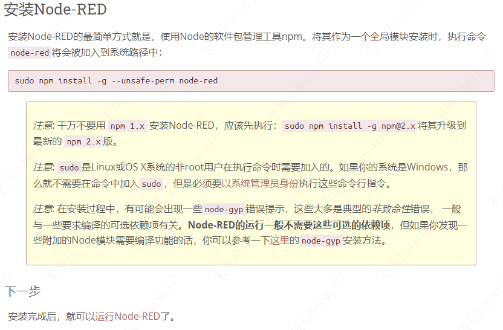

## node-red安装

官方文档：[Node-RED](https://nodered.17coding.net/)

### 非全局安装

1. 官方文档：[Node-RED](https://nodered.17coding.net/)
2. 下载windows版本：[下载](https://github.com/node-red/node-red/releases/latest)
    - 
3. 将node-red解压到想要安装的文件夹，如：
    - 
4. 该文件夹下执行：`npm install --production`
5. 启动：在该文件夹下执行`node red.js`
    - 
6. 访问：浏览器地址栏输入：[打开](http://localhost:1880/)

#### 全局安装

1. 安装：
    - 
2. 运行
    - 

#### 离线安装节点模块

使用UI界面下载和使用命令行安装node-red节点模块，都会下载到：`C:\Users\zhuyuqi2\.node-red\node_modules`，对于windows系统，将`C:\Users\zhuyuqi2\.node-red`打包放到对应的位置即可。

