*ApacheShiro 是一个功能强大且易于使用的 Java 安全(权限)框架。Shiro 可以完成：认证、授权、加密、会话管理、与 Web 集成、缓存等。*
<!-- more -->
## 1 Shrio 概述

### 1.1 是什么

- ApacheShiro 是一个功能强大且易于使用的 Java 安全(权限)框架。
- Shiro 可以完成：认证、授权、加密、会话管理、与 Web 集成、缓存等。

### 1.2 特点

- 易于使用：使用 Shiro 构建系统安全框架非常简单。就算第一次接触也可以快速掌握。
- 全面：Shiro 包含系统安全框架需要的功能，满足安全需求的“一站式服务”。
- 灵活：Shiro 可以在任何应用程序环境中工作。虽然它可以在 Web、EJB、IoC 环境中工作，但不需要依赖它们。Shiro 也没有强制要求任何规范，甚至没有很多依赖项。
- 强力支持 Web：Shiro 具有出色的 Web 应用程序支持，可以基于应用程序 URL 和 Web 协议（例如 REST）创建灵活的安全策略，同时还提供一组 JSP 库来控制页面输出。
- 兼容性强：Shiro 的设计模式使其易于与其他框架和应用程序集成。Shiro 与 Spring、Grails、Wicket、Tapestry、Mule、ApacheCamel、Vaadin 等框架无缝集成。

### 1.3 对比 SrpingSecurity

- SpringSecurity 基于 Spring 开发，项目若使用 Spring 作为基础，配合 Spring Security 做权限更加方便，而 Shiro 需要和 Spring 进行整合开发。
- SpringSecurity 功能比 Shiro 更加丰富些，例如安全维护方面。
- SpringSecurity 社区资源相对比 Shiro 更加丰富。
- Shiro 的配置和使用比较简单，SpringSecurity 上手复杂些。
- Shiro 依赖性低，不需要任何框架和容器，可以独立运行.SpringSecurity 依赖 Spring 容器。
- Shiro 不仅仅可以使用在 web 中，它可以工作在任何应用环境中。在集群会话时 Shiro 最重要的一个好处或许就是它的会话是独立于容器的。

### 1.4 基本功能

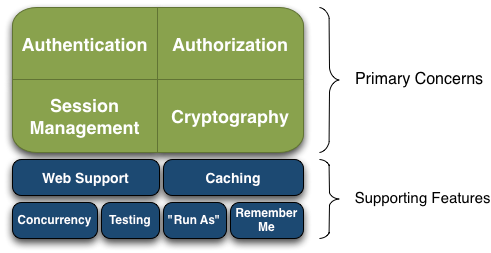

- Authentication：身份认证/登录，验证用户是不是拥有相应的身份。
- Authorization：授权，即权限验证，验证某个已认证的用户是否拥有某个权限；即判断用户是否能进行什么操作，如：验证某个用户是否拥有某个角色。或者细粒度的验证某个用户某个资源是否具有某个权限。
- SessionManager：会话管理，即用户登录后就是一次会话，在没有退出之前，它的所有信息都在会话中；会话可以是普通 JavaSE 环境，也可以是 Web 环境的。
- Cryptography：加密，保护数据的安全性，如密码加密存储到数据库，而不是明文存储。
- WebSupport：Web 支持，可以非常容易的集成到 Web 环境。
- Caching：缓存，比如用户登录后，其用户信息、拥有的角色/权限不必每次去查，这样可以提高效率。
- Concurrency：Shiro 支持多线程应用的并发验证，即如在一个线程中开启另一个线程，能把权限自动传播过去。
- Testing：提供测试支持。
- RunAs：允许一个用户假装为另一个用户（如果他们允许）的身份进行访问。
- RememberMe：记住我，这个是非常常见的功能，即一次登录后，下次再来的话不用登录了。

### 1.5 原理

#### 1.5.1 外部视角

即从应用程序角度观察 Shiro 如何完成工作。
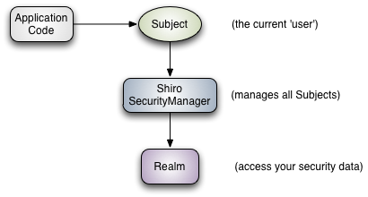

- **Subject**：应用代码直接交互的对象是 Subject，也就是说 Shiro 的对外 API 核心
  就是 Subject。Subject 代表了当前“用户”，这个用户不一定是一个具体的人，与当前应用交互的任何东西都是 Subject，如网络爬虫，机器人等；与 Subject 的所有交互都会委托给 SecurityManager；Subject 其实是一个门面，SecurityManager 才是实际的执行者。
- **SecurityManager**：安全管理器；即所有与安全有关的操作都会与 SecurityManager 交互；且其管理着所有 Subject；可以看出它 Shiro 的核心，它负责与 Shiro 的其他组件进行交互，它相当于 SpringMVC 中 DispatcherServlet 的角色。
- **Realm**：Shiro 从 Realm 获取安全数据（如用户、角色、权限），就是说 SecurityManager 要验证用户身份，那么它需要从 Realm 获取相应的用户进行比较以确定用户身份是否合法；也需要从 Realm 得到用户相应的角色/权限进行验证用户是否能进行操作；可以把 Realm 看成 DataSource。

#### 1.5.2 内部视角

即从 Shiro 架构角度观察 Shiro 如何完成工作。
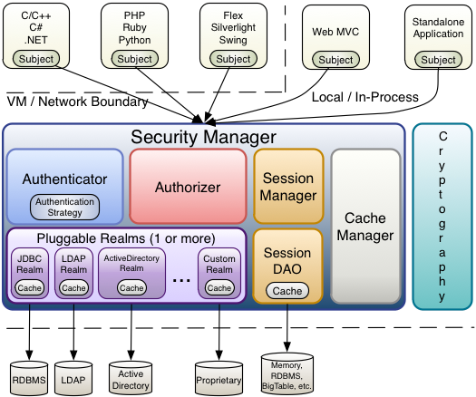

- **Subject**：主体，可以看到主体可以是任何可以与应用交互的“用户”。
- **SecurityManager**：相当于 SpringMVC 中的 DispatcherServlet 或者 Struts2 中的 FilterDispatcher；是 Shiro 的心脏；所有具体的交互都通过 SecurityManager 进行控制；它管理着所有 Subject、且负责进行认证和授权、及会话、缓存的管理。
- **Authenticator**：认证器，负责主体认证的，这是一个扩展点，如果用户觉得 Shiro 默认的不好，可以自定义实现；其需要认证策略（AuthenticationStrategy），即什么情况下算用户认证通过了。
- **Authorizer**：授权器，或者访问控制器，用来决定主体是否有权限进行相应的操作；即控制着用户能访问应用中的哪些功能。
- **Realm**：可以有 1 个或多个 Realm，可以认为是安全实体数据源，即用于获取安全实体的；可以是 JDBC 实现，也可以是 LDAP 实现，或者内存实现等等；由用户提供；注意：Shiro 不知道你的用户/权限存储在哪及以何种格式存储；所以我们一般在应用中都需要实现自己的 Realm；
- **SessionManager**：如果写过 Servlet 就应该知道 Session 的概念，Session 需要有人去管理它的生命周期，这个组件就是 SessionManager；而 Shiro 并不仅仅可以用在 Web 环境，也可以用在如普通的 JavaSE 环境、EJB 等环境；所以 Shiro 就抽象了一个自己的 Session 来管理主体与应用之间交互的数据；这样的话，比如在 Web 环境用，刚开始是一台 Web 服务器；接着又上了台 EJB 服务器；这时想把两台服务器的会话数据放到一个地方，这个时候就可以实现自己的分布式会话（如把数据放到 Memcached 服务器）。
- **SessionDAO**：DAO 大家都用过，数据访问对象，用于会话的 CRUD，比如想把 Session 保存到数据库，那么可以实现自己的 SessionDAO，通过如 JDBC 写到数据库；比如想把 Session 放到 Memcached 中，可以实现自己的 MemcachedSessionDAO；另外 SessionDAO 中可以使用 Cache 进行缓存，以提高性能。
- **CacheManager**：缓存控制器，来管理如用户、角色、权限等的缓存的；因为这些数据基本上很少去改变，放到缓存中后可以提高访问的性能。
- **Cryptography**：密码模块，Shiro 提供了一些常见的加密组件用于如密码加密/解密的。

## 2 权限概念

### 2.1 登录认证

#### 2.1.1 概念

身份验证：一般需要提供如身份 ID 等一些标识信息来表明登录者的身份，如提供
email，用户名/密码来证明。
在 shiro 中，用户需要提供 principals（身份）和 credentials（证明）给 shiro，从
而应用能验证用户身份：

- principals：身份，即主体的标识属性，可以是任何属性，如用户名、邮箱等，唯一即可。一个主体可以有多个 principals，但只有一个 Primaryprincipals，一般是用户名/邮箱/手机号。
- credentials：证明/凭证，即只有主体知道的安全值，如密码/数字证书等。

最常见的 principals 和 credentials 组合就是用户名/密码。

#### 2.1.2 基本流程

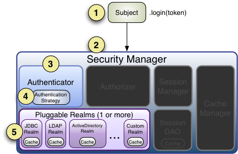

1. 执行登录：Subject 对象调用 login(token)方法。login(token)方法中，调用了`this.securityManager.login(this,token)`。
   - 这里的`this.securityManager`是程序员通过`SecurityUtils.setSecurityManager(securityManager)`创建的。

```java
Factory<SecurityManager> factory = new IniSecurityManagerFactory("classpath:shiro.ini");
SecurityManager securityManager = factory.getInstance();
SecurityUtils.setSecurityManager(securityManager);
```

2. SecurityManager 负责真正的身份验证逻辑；它会委托给 Authenticator 进行身份验证；
3. Authenticator 才是真正的身份验证者，ShiroAPI 中核心的身份认证入口点，此处可以自定义插入自己的实现；
4. Authenticator 可能（多个 realm 时）会委托给相应的 AuthenticationStrategy 进行多 Realm 身份验证，默认 ModularRealmAuthenticator 会调用 AuthenticationStrategy 进行多 Realm 身份验证；
5. Authenticator 会把相应的 token 传入 Realm，从 Realm 获取身份验证信息，如果没有返回/抛出异常表示身份验证成功了。此处可以配置多个 Realm，将按照相应的顺序及策略进行访问。

底层：SecurityManager 要验证用户身份，那么它需要从 Realm 获取相应的用户进行比较以确定用户身份是否合法；也需要从 Realm 得到用户相应的角色/权限进行验证用户是否能进行操作；可以把 Realm 看成 DataSource，即安全数据源。

#### 2.1.3 多个 Realm 认证

当应用程序配置多个 Realm 时，例如：用户名密码校验、手机号验证码校验等等。
Shiro 的 ModularRealmAuthenticator 会使用内部的 AuthenticationStrategy 组件判断认证是成功还是失败。
AuthenticationStrategy 是一个无状态的组件，它在身份验证尝试中被询问 4 次（这
4 次交互所需的任何必要的状态将被作为方法参数）：
（1） 在所有 Realm 被调用之前
（2） 在调用 Realm 的 getAuthenticationInfo 方法之前
（3） 在调用 Realm 的 getAuthenticationInfo 方法之后
（4） 在所有 Realm 被调用之后
认证策略的另外一项工作就是聚合所有 Realm 的结果信息封装至一个 AuthenticationInfo 实例中，并将此信息返回，以此作为 Subject 的身份信息。
Shiro 中定义了 3 种认证策略的实现：

| AuthenticationStrategy class | 描述                                                             |
| ---------------------------- | ---------------------------------------------------------------- |
| AtLeastOneSuccessfulStrategy | 只要有一个（或更多）的 Realm 验证成功，那么认证将视为成功        |
| FirstSuccessfulStrategy      | 第一个 Realm 验证成功，整体认证将视为成功，且后续 Realm 将被忽略 |
| AllSuccessfulStrategy        | 所有 Realm 成功，认证才视为成功                                  |

ModularRealmAuthenticator 内置的认证策略默认实现是 AtLeastOneSuccessfulStrategy 方式。可以通过配置修改策略 。

### 2.2 角色、授权

#### 2.2.1 概念

- 授权，也叫访问控制，即在应用中控制谁访问哪些资源（如访问页面/编辑数据/页面操作等）。在授权中需了解的几个关键对象：主体（Subject）、资源（Resource）、权限（Permission）、角色（Role）。
- 主体(Subject)：访问应用的用户，在 Shiro 中使用 Subject 代表该用户。用户只有授权后才允许访问相应的资源。
- 资源(Resource)：在应用中用户可以访问的 URL，比如访问 JSP 页面、查看/编辑某些数据、访问某个业务方法、打印文本等等都是资源。用户只要授权后才能访问。
- 权限(Permission)：安全策略中的原子授权单位，通过权限我们可以表示在应用中用户有没有操作某个资源的权力。即权限表示在应用中用户能不能访问某个资源，如：访问用户列表页面查看/新增/修改/删除用户数据（即很多时候都是 CRUD 式权限控制）等。权限代表了用户有没有操作某个资源的权利，即反映在某个资源上的操作允不允许。
- Shiro 支持粗粒度权限（如用户模块的所有权限）和细粒度权限（操作某个用户的权限，即实例级别的）。
- 角色(Role)：权限的集合，一般情况下会赋予用户角色而不是权限，即这样用户可以拥有一组权限，赋予权限时比较方便。典型的如：项目经理、技术总监、CTO、开发工程师等都是角色，不同的角色拥有一组不同的权限。

#### 2.2.2 授权方式

Shiro 支持三种方式的授权：

1. 编程式：通过写 if/else 授权代码块完成：

```java
Subject subject = SecurityUtils.getSubject();
if(subject.hasRole(“admin”)) {
    //有权限
} else {
    //无权限
}
```

2. 注解式：通过在执行的 Java 方法上放置相应的注解完成：

```java
@RequiresRoles("admin")
public void hello() {
    //有权限
}
```

没有权限将抛出相应的异常；

3. JSP/GSP 标签：在 JSP/GSP 页面通过相应的标签完成：

```java
<shiro:hasRole name="admin">
<!— 有权限 —>
</shiro:hasRole>
```

#### 2.2.3 授权流程

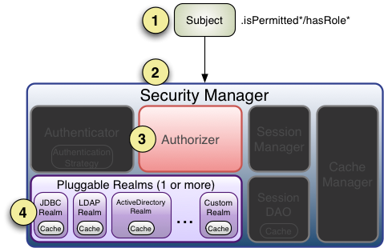

1. 首先调用 Subject.isPermitted*/hasRole*接口，其会委托给 SecurityManager，而 SecurityManager 接着会委托给 Authorizer。
2. Authorizer 是真正的授权者，如果我们调用如 isPermitted(“user:view”)，其首先会通过 PermissionResolver 把字符串转换成相应的 Permission 实例。
3. 在进行授权之前，其会调用相应的 Realm 获取 Subject 相应的角色/权限用于匹配传入的角色/权限。
4. Authorizer 会判断 Realm 的角色/权限是否和传入的匹配，如果有多个 Realm，会委托给 ModularRealmAuthorizer 进行循环判断，如果匹配如 isPermitted*/hasRole*会返回 true，否则返回 false 表示授权失败。

## 3 基本使用（不结合其他环境）

### 3.1 搭建 Maven 环境

引入 shiro 和日志包

```xml
 <dependencies>
    <dependency>
      <groupId>org.apache.shiro</groupId>
      <artifactId>shiro-core</artifactId>
      <version>1.9.1</version>
    </dependency>
    <dependency>
      <groupId>commons-logging</groupId>
      <artifactId>commons-logging</artifactId>
      <version>1.2</version>
    </dependency>
  </dependencies>
```

### 3.2 测试登录

#### 3.2.1 添加登录认证信息

既可以使用数据库的用户信息，也可以使用 INI 文件进行配置。本例使用 INI 文件。
在 resources 目录下创建`shiro.ini`文件（名称任意），写入用户信息：

```xml
[users]
zhangsan=z3
lisi=l4
```

#### 3.2.2 测试登录

调用`subject.login(token)`方法。

```java
package top.sk370.shiro;

import org.apache.shiro.SecurityUtils;
import org.apache.shiro.authc.*;
import org.apache.shiro.config.IniSecurityManagerFactory;
import org.apache.shiro.mgt.SecurityManager;
import org.apache.shiro.subject.Subject;
import org.apache.shiro.util.Factory;

public class App {
    public static void main(String[] args) {
        // 1 初始化获取 SecurityManager
        Factory<SecurityManager> factory = new IniSecurityManagerFactory("classpath:shiro.ini");
        SecurityManager securityManager = factory.getInstance();
        SecurityUtils.setSecurityManager(securityManager);
        //2 获取 Subject 对象
        Subject subject = SecurityUtils.getSubject();
        //3 创建 token 对象， web 应用用户名密码从页面传递
        AuthenticationToken token = new UsernamePasswordToken("zhangsan", "z3");
        //4 完成登录
        try {
            subject.login(token);
            System.out.println("登录成功");
        } catch (UnknownAccountException e) {
            e.printStackTrace();
            System.out.println("用户不存在");
        } catch (IncorrectCredentialsException e) {
            e.printStackTrace();
            System.out.println("密码错误");
        } catch (AuthenticationException ae) {
            //unexpected condition? error?
        }
    }
}

```

### 3.3 测试角色

#### 3.3.1 添加角色信息

在 shiro.ini 文件中添加角色配置：

```xml
[users]
zhangsan=z3,role1,role2
lisi=l4
```

#### 3.3.2 测试角色

调用`subject.hasRole(role)`方法。
登录成功后确认是否具有相关角色：
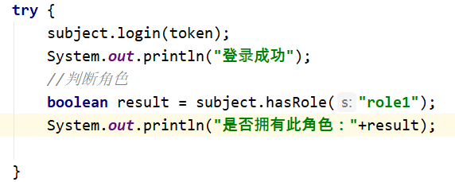

### 3.4 测试权限

#### 3.4.1 添加角色的权限的对应关系

```xml
[users]
zhangsan=z3,role1,role2
lisi=l4
[roles]
role1=user:insert,user:select
```

#### 3.4.2 测试角色的权限

调用`subject.isPermitted(auth)`方法。
也可以用 checkPermission 方法，但没有返回值，没权限抛 AuthenticationException。
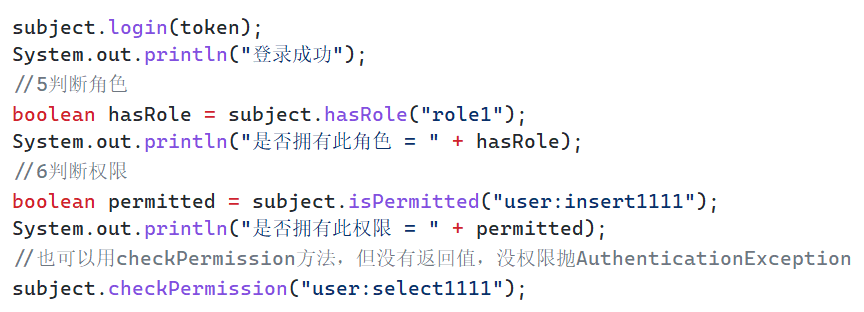

### 3.5 测试加密

Shiro 内嵌很多常用的加密算法，比如 MD5 加密、盐值加密、父类加密：

- MD5 加密：`new Md5Hash(str)`
- 盐值加密：`new Md5Hash(str, "salt")`
- 多次盐值加密：`new Md5Hash(str, "salt", 3)`
- 父类加密：Md5Hash 继承了 SimpleHash 类，使用父类可以指定加密方式，如 MD5 加密——`new SimpleHash("MD5",password,"salt",3)`

```java
public static void main(String[] args) {
    //密码明文
    String password = "z3";
    //使用md5加密
    Md5Hash md5Hash = new Md5Hash(password);
    System.out.println("md5加密 = " + md5Hash.toHex());
    //带盐的md5加密，盐就是在密码明文后拼接新字符串，然后再进行加密
    Md5Hash md5Hash2 = new Md5Hash(password,"salt");
    System.out.println("带盐的md5加密 = " + md5Hash2.toHex());
    //为了保证安全，避免被破解还可以多次迭代加密，保证数据安全
    Md5Hash md5Hash3 = new Md5Hash(password,"salt",3);
    System.out.println("md5带盐的3次加密 = " + md5Hash3.toHex());
    //使用父类进行加密
    SimpleHash simpleHash = new SimpleHash(
            "MD5",password,"salt",3);
    System.out.println("父类带盐的3次加密 = " + simpleHash.toHex());
}
```

### 3.6 自定义带加密的登录认证

shiro 默认的登录不带加密，想要使用自定义加密登录认证，需要创建自定义 Realm 类，继承 org.apache.shiro.realm.AuthenticatingRealm 或 AuthorizingRealm 类，实现`doGetAuthenticationInfo()`方法：

> - org.apache.shiro.realm.AuthenticatingRealm 和 org.apache.shiro.realm.AuthorizingRealm 的区别是：
>   - AuthenticatingRealm：至有认证 AuthenticationInfo 这一个 doGetAuthenticationInfo()方法。
>   - AuthorizingRealm：有认证 AuthenticationInfo 和授权 AuthenticationInfo 两个 doGetAuthenticationInfo()方法。

1. 编写自定义 Realm 类：

```java
public class MyRealm extends AuthenticatingRealm {
    //自定义登录认证方法，shiro的login方法底层会调用该类的认证方法进行认证
    //需要配置自定义的realm生效，在ini文件中配置，在Springboot中配置
    //该方法只是获取进行对比的信息，认证逻辑还是按照shiro底层认证逻辑完成
    protected AuthenticationInfo doGetAuthenticationInfo(AuthenticationToken authenticationToken) throws AuthenticationException {
        //1获取前台的身份信息
        String principal = authenticationToken.getPrincipal().toString();
        //2获取前台的凭证信息
        String password = new String((char[])authenticationToken.getCredentials());
        System.out.println("认证用户信息："+principal+"---"+password);
        //3获取数据库中存储的用户信息——模拟
        if(principal.equals("zhangsan")){
            //3.1数据库中存储的加盐3次迭代的密码，这里没有读取数据库，也没读取shiro.ini文件，直接写出来了
            String pwdInfo = "7174f64b13022acd3c56e2781e098a5f";
            //4创建封装校验逻辑对象，封装数据返回
            AuthenticationInfo info = new SimpleAuthenticationInfo(
                authenticationToken.getPrincipal(),
                pwdInfo,
                ByteSource.Util.bytes("salt"),
                authenticationToken.getPrincipal().toString()
            );
            return info;
        }
        return null;
    }
}
```

2. shiro.ini 文件中配置，使自定义 Realm 类生效

```java
[main]
md5CredentialsMatcher=org.apache.shiro.authc.credential.Md5CredentialsMatcher #加密方式
md5CredentialsMatcher.hashIterations=3 #盐值加密次数

myrealm=top.sk370.shiro.MyRealm
myrealm.credentialsMatcher=$md5CredentialsMatcher
securityManager.realms=$myrealm

[users]
zhangsan=7174f64b13022acd3c56e2781e098a5f,role1,role2 # 密码视为数据库中已加密的的密码
lisi=l4

[roles]
role1=user:insert,user:select

```

3. 测试登录：原先的登录代码不变

```java
package top.sk370.shiro;

import org.apache.shiro.SecurityUtils;
import org.apache.shiro.authc.*;
import org.apache.shiro.config.IniSecurityManagerFactory;
import org.apache.shiro.mgt.SecurityManager;
import org.apache.shiro.subject.Subject;
import org.apache.shiro.util.Factory;

public class App {
    public static void main(String[] args) {
        // 1 初始化获取 SecurityManager
        Factory<SecurityManager> factory = new IniSecurityManagerFactory("classpath:shiro.ini");
        SecurityManager securityManager = factory.getInstance();
        SecurityUtils.setSecurityManager(securityManager);
        //2 获取 Subject 对象
        Subject subject = SecurityUtils.getSubject();
        //3 创建 token 对象， web 应用用户名密码从页面传递
        AuthenticationToken token = new UsernamePasswordToken("zhangsan", "z3");
        //4 完成登录
        try {
            subject.login(token);
            System.out.println("登录成功");
        } catch (UnknownAccountException e) {
            e.printStackTrace();
            System.out.println("用户不存在");
        } catch (IncorrectCredentialsException e) {
            e.printStackTrace();
            System.out.println("密码错误");
        } catch (AuthenticationException ae) {
            //unexpected condition? error?
        }
    }
}

```

## 4 整合 SpringBoot

搭建目标：实现访问数据库登录的过程。

### 4.1 搭建环境

1. 引入依赖：

```xml
<dependencies>
  <dependency>
    <groupId>org.apache.shiro</groupId>
    <artifactId>shiro-spring-boot-web-starter</artifactId>
    <version>1.9.0</version>
  </dependency>
  <!--mybatis-plus-->
  <dependency>
    <groupId>com.baomidou</groupId>
    <artifactId>mybatis-plus-boot-starter</artifactId>
    <version>3.0.5</version>
  </dependency>
  <!--mysql-->
  <dependency>
    <groupId>mysql</groupId>
    <artifactId>mysql-connector-java</artifactId>
    <version>5.1.46</version>
  </dependency>
  <dependency>
    <groupId>org.projectlombok</groupId>
    <artifactId>lombok</artifactId>
  </dependency>
  <dependency>
    <groupId>org.springframework.boot</groupId>
    <artifactId>spring-boot-starter-thymeleaf</artifactId>
  </dependency>
  <!--配置Thymeleaf与Shrio的整合依赖-->
  <dependency>
    <groupId>com.github.theborakompanioni</groupId>
    <artifactId>thymeleaf-extras-shiro</artifactId>
    <version>2.0.0</version>
  </dependency>
</dependencies>
```

2. 配置 mysql 等

```xml
mybatis-plus:
  configuration:
    log-impl: org.apache.ibatis.logging.stdout.StdOutImpl
  mapper-locations: classpath:mapper/*.xml
spring:
  datasource:
    type: com.zaxxer.hikari.HikariDataSource
    driver-class-name: com.mysql.jdbc.Driver
    url: jdbc:mysql://localhost:13306/shirodb?characterEncoding=utf-8&useSSL=false
    username: root
    password: dimitre123
  jackson:
    date-format: yyyy-MM-dd HH:mm:ss
    time-zone: GMT+8
shiro:
  loginUrl: /myController/login # 登录页面的路径
```

3. 编写后台

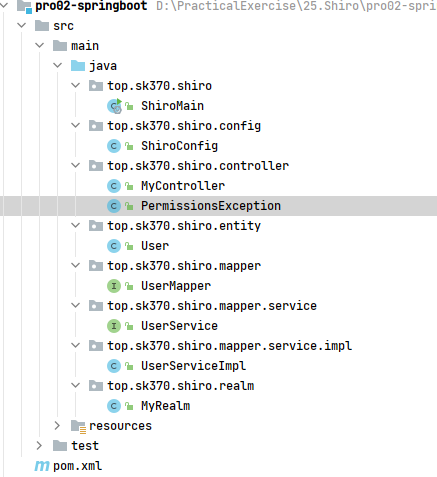

### 4.2 测试登录

#### 4.2.1 创建自定义 Realm

自定义 realm 实现与数据源的链接，代替 shiro.ini 文件，完成认证过程。

```java
@Component
public class MyRealm extends AuthorizingRealm {
    @Autowired
    private UserService userService;

    /**
     * 自定义登录认证
     *
     * @param token
     * @return
     * @throws AuthenticationException
     */
    @Override
    protected AuthenticationInfo doGetAuthenticationInfo(AuthenticationToken token) throws AuthenticationException {
        //1 获取用户身份信息
        String name = token.getPrincipal().toString();
        //2 调用业务层获取用户信息（数据库中）
        User user = userService.getUserInfoByName(name);
        //3 判断并将数据完成封装
        if (user != null) {
            AuthenticationInfo info = new SimpleAuthenticationInfo(
                    token.getPrincipal(),
                    user.getPwd(),
                    ByteSource.Util.bytes("salt"),
                    token.getPrincipal().toString()
            );
            return info;
        }
        return null;
    }

    /**
     * 自定义授权
     * @param principals
     * @return
     */
    @Override
    protected AuthorizationInfo doGetAuthorizationInfo(PrincipalCollection principals) {
        return null;
    }
}
```

这里的 token 对象是 handler 中封装的：`AuthenticationToken token = new UsernamePasswordToken(name, pwd);`

- token.getPrincipal()：获取用户名对象
- token.getPrincipal().toString()：将用户名转为字符串

#### 4.2.2 创建自定义配置类

自定义配置类完成 DefaultWebSecurityManager 和 DefaultShiroFilterChainDefinition 组件的创建：

- DefaultWebSecurityManager：用于认证操作，对获取到的前端用户信息进行处置，
- DefaultShiroFilterChainDefinition：用于授权操作（过滤器链接，对符合规则的请求进行放行）

```java
@Configuration
public class ShiroConfig {
    @Autowired
    private MyRealm myRealm;
    //配置 SecurityManager
    @Bean
    public DefaultWebSecurityManager defaultWebSecurityManager() {
        //1 创建 defaultWebSecurityManager 对象
        DefaultWebSecurityManager defaultWebSecurityManager = new DefaultWebSecurityManager();
        //2 创建加密对象，并设置相关属性
        HashedCredentialsMatcher matcher = new HashedCredentialsMatcher();
        //2.1 采用 md5 加密
        matcher.setHashAlgorithmName("md5");
        //2.2 迭代加密次数
        matcher.setHashIterations(3);
        //3 将加密对象存储到 myRealm 中
        myRealm.setCredentialsMatcher(matcher);
        //4 将 myRealm 存入 defaultWebSecurityManager 对象
        defaultWebSecurityManager.setRealm(myRealm);
        //5 返回
        return defaultWebSecurityManager;
    }
    //配置 Shiro 内置过滤器拦截范围
    @Bean
    public DefaultShiroFilterChainDefinition shiroFilterChainDefinition() {
        DefaultShiroFilterChainDefinition definition = new DefaultShiroFilterChainDefinition();
        //设置不认证可以访问的资源
        definition.addPathDefinition("/myController/userLogin", "anon");
        definition.addPathDefinition("/login", "anon");
        //设置需要进行登录认证的拦截范围
        definition.addPathDefinition("/**", "authc");
        return definition;
    }
}

```

#### 4.2.3 编写 handler 方法

```java
@Controller
@RequestMapping("myController")
public class MyController {
    /**
     * 访问登录页面
     */
    @GetMapping("login")
    public String login(){
        return "login";
    }

    /**
     * 执行登录
     */
    @GetMapping("userLogin")
    public String userLogin(String name, String pwd, HttpSession session) {
        //1 获取 Subject 对象
        Subject subject = SecurityUtils.getSubject();
        //2 封装请求数据到 token 对象中
        AuthenticationToken token = new UsernamePasswordToken(name, pwd);
        //3 调用 login 方法进行登录认证
        try {
            subject.login(token);
            session.setAttribute("user", token.getPrincipal().toString());
            return "main";//跳转页面
        } catch (AuthenticationException e) {
            e.printStackTrace();
            System.out.println("登录失败");
            return "登录失败";
        }
    }
}
```

此时就可以正常进行登陆了。

### 4.3 测试退出

退出功能只需要在配置类的 DefaultShiroFilterChainDefinition 组件中，添加退出的路径即可：

```java
@Configuration
public class ShiroConfig {
……
    //配置 Shiro 内置过滤器拦截范围
    @Bean
    public DefaultShiroFilterChainDefinition shiroFilterChainDefinition() {
        DefaultShiroFilterChainDefinition definition = new DefaultShiroFilterChainDefinition();
        //设置不认证可以访问的资源
        definition.addPathDefinition("/myController/userLogin", "anon");
        definition.addPathDefinition("/login", "anon");
        //设置登出过滤器，设置了登出过滤器，就不用设置handler方法了
        definition.addPathDefinition("/logout","logout");
        //设置需要进行登录认证的拦截范围
        definition.addPathDefinition("/**", "authc");
        return definition;
    }
}

```

注意：设置了登出过滤器，就不用设置 handler 方法了

### 4.4 多个 Realm

在配置类中修改：
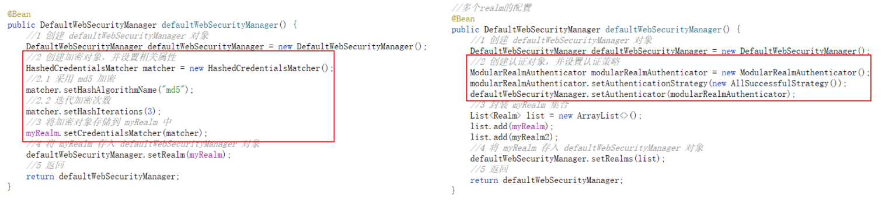
疑问：这里怎么实现 MyRealm 的 md5 加密功能？

### 4.5 Remberme

#### 4.5.1 基本流程

RememberMe 功能，比如访问一些网站时，关闭了浏览器，下次再打开时还是能记住你是谁， 无需再登录即可访问。
在登录页面选中 RememberMe 然后登录成功；如果是浏览器登录，一般会把 RememberMe 的 Cookie 写到客户端并保存下来。
但是，如果访问电商平台时，如果要查看我的订单或进行支付时，此时还是需要再进行身份认证的，以确保当前用户还是你。

#### 4.5.2 修改配置类

```java
@Configuration
public class ShiroConfig {
    @Autowired
    private MyRealm myRealm;

    //配置 SecurityManager
    @Bean
    public DefaultWebSecurityManager defaultWebSecurityManager() {
	……
        //4 将 myRealm 存入 defaultWebSecurityManager 对象
        defaultWebSecurityManager.setRealm(myRealm);
        //4.5 设置 rememberMe
        defaultWebSecurityManager.setRememberMeManager(rememberMeManager());
        //5 返回
        return defaultWebSecurityManager;
    }
    //cookie 属性设置——记住我功能
    public SimpleCookie rememberMeCookie() {
        SimpleCookie cookie = new SimpleCookie("rememberMe");
        //设置跨域
        //cookie.setDomain(domain);
        cookie.setPath("/");
        cookie.setHttpOnly(true);
        cookie.setMaxAge(30 * 24 * 60 * 60);
        return cookie;
    }
    //创建 Shiro 的 cookie 管理对象
    public CookieRememberMeManager rememberMeManager() {
        CookieRememberMeManager cookieRememberMeManager = new CookieRememberMeManager();
        cookieRememberMeManager.setCookie(rememberMeCookie());
        cookieRememberMeManager.setCipherKey("1234567890987654".getBytes());
        return cookieRememberMeManager;
    }
    //配置 Shiro 内置过滤器拦截范围
    @Bean
    public DefaultShiroFilterChainDefinition shiroFilterChainDefinition() {
       	……
        //rememberMe的用户无需登录
        definition.addPathDefinition("/**","user");
        return definition;
    }
}

```

#### 4.5.3 修改 handler 方法

接收前台是否传过来 remberme 的勾选：

#### 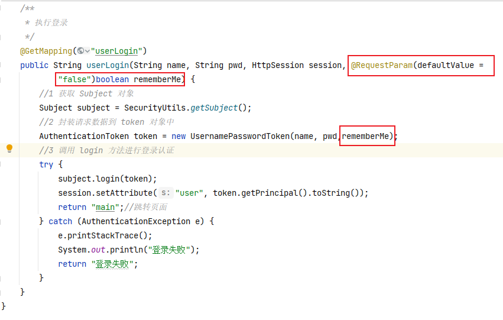

4.5.4 登录表单增加记住我
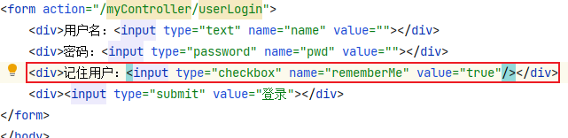

### 4.6 角色、权限

#### 4.6.1 角色、权限访问过程

角色认证即执行权限判断的过程，共有两种方式：
（1） 在前端页面中通过`shiro:****`属性判断。
（2） 在接口服务中通过注解`@Requires****`进行判断。
给接口服务方法添加注解可以加在控制器方法上，也可以加在 service 业务方法上，一般加在控制器方法上。常用注解如下：

- @RequiresAuthentication：
  - 验证用户是否登录，等同于方法 subject.isAuthenticated()。
- @RequiresUser：
  - 验证用户是否被记忆：等同于方法 subject.isAuthenticated()+subject.isRemembered()。
- @RequiresGuest：
  - 验证是否是一个游客请求：等同于方法 subject.getPrincipal()，注意返回结果为 null 代表为游客请求。
- @RequiresRoles：
  - 验证 subject 是否有相应角色，等同于方法 subject.hasRole()，没有则抛出 AuthorizationException 异常。可以编写异常类返回指定内容。
- @RequiresPermissions：
  - 验证 subject 是否有相应权限，等同于方法 subject.isPermitted(auth)。没有则抛出 AuthorizationException 异常。可以编写异常类返回指定内容。
    - 例如： @RequiresPermissions (“file:read”,”wite:aFile.txt”)，subject 必须同时含有 file:read 和 wite:aFile.txt 权限才能访问方法。

#### 4.6.2 编写角色、权限查询方法，完成数据库角色查询

数据库表及关联关系如下：
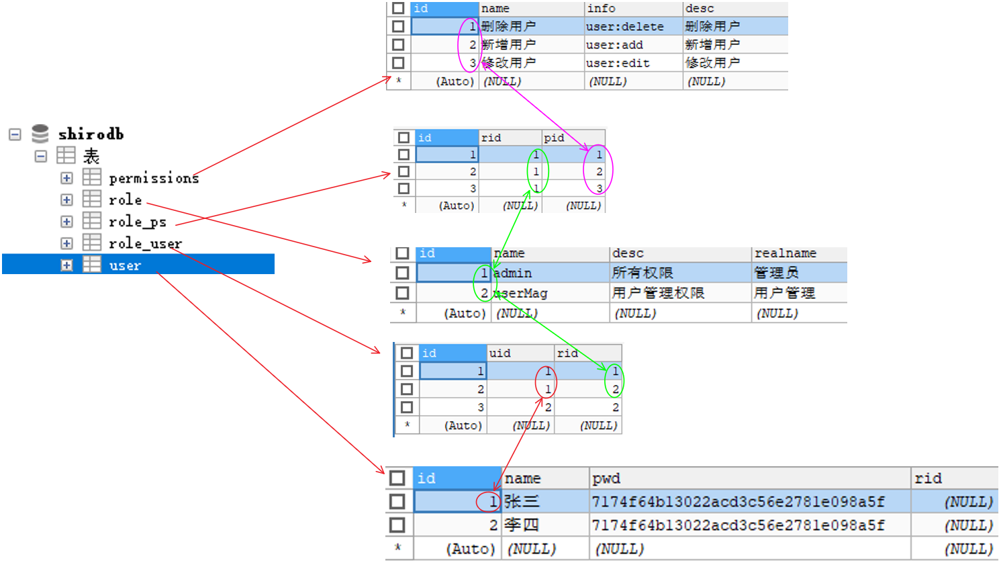
登录时访问数据库的方法使用了 Mybatis-plus 的方法，但进行角色、权限检查时没有现成的方法，所以需要自己编写。

1. mapper 方法

```java
@Repository
public interface UserMapper extends BaseMapper<User> {
    /**
     * 自定义mapper方法：角色检查
     * @param principal
     * @return
     */
    @Select("SELECT NAME FROM role WHERE id IN (SELECT rid FROM role_user WHERE uid=(SELECT id FROM USER WHERE NAME=#{principal}))")
    List<String> getUserRoleInfoMapper(@Param("principal")String principal );
        /**
     * 自定义mapper方法：权限检查
     * @param roles
     * @return
     */
    @Select({
            "<script>",
            "select info FROM permissions WHERE id IN ",
            "(SELECT pid FROM role_ps WHERE rid IN (",
            "SELECT id FROM role WHERE NAME IN ",
            "<foreach collection='roles' item='name' open='(' separator=',' close=')'>",
            "#{name}",
            "</foreach>",
            "))",
            "</script>"
    })
    List<String> getUserPermissionInfoMapper(@Param("roles")List<String> roles);
}
```

2. service 及 serviceimpl 方法：

```java
public interface UserService {
	List<String> getUserRoleInfo(@Param("principal")String principal );
    List<String> getUserPermissionInfo(List<String> roles);
}
```

```java
@Service
public class UserServiceImpl implements UserService {
    @Override
    public List<String> getUserRoleInfo(String principal) {
        return userMapper.getUserRoleInfoMapper(principal);
    }
    @Override
    public List<String> getUserPermissionInfo(List<String> roles) {
        return userMapper.getUserPermissionInfoMapper(roles);
    }
}

```

#### 4.6.3 角色、权限认证过程

自定义 MyRealm 类的 doGetAuthenticationInfo 方法执行登录认证过程，而 doGetAuthorizationInfo 方法进行角色、权限检验过程。

1. 角色认证：创建 SimpleAuthorizationInfo 对象，调用 addRole()方法、或 addRoles()方法，再将该对象返回：
2. 权限认证：创建 SimpleAuthorizationInfo 对象，调用 addStringPermission()方法、或 addStringPermissions()方法，再将该对象返回：

```java
@Override
protected AuthorizationInfo doGetAuthorizationInfo(PrincipalCollection principals) {
    // 1. 获取当前用户身份信息
    String principal = principals.getPrimaryPrincipal().toString();
    // 2.1 调用接口方法获取用户的角色信息
    List<String> roles = userService.getUserRoleInfo(principal);
    System.out.println("当前用户角色信息： "+roles);
    // 2.2 调用接口方法获取用户角色的权限信息
    List<String> permissions = userService.getUserPermissionInfo(roles);
    System.out.println("当前用户权限信息： "+permissions);
    // 3. 创建对象，存储当前登录的用户的权限和角色
    SimpleAuthorizationInfo info = new SimpleAuthorizationInfo();
    // 4.1 存储角色
    info.addRoles(roles);
    // 4.2 存储权限信息
    info.addStringPermissions(permissions);
    // 5.返回
    return info;
}
```

#### 4.6.4 测试角色及授权

handler 方法添加具有角色、权限才能访问的路径（控制器方法）：

```java
@Controller
@RequestMapping("myController")
public class MyController {
    /**
     * 访问该页面，测试有无相应角色
     * @return
     */
    @RequiresRoles("admin")
    @GetMapping("userLoginRoles")
    @ResponseBody//由于引入了thymelaf，这里不写ResponseBody则相当于返回页面，加了相当于在页面返回内容
    public String userLoginRoles() {
        System.out.println("登录认证验证角色");
        return "验证角色成功";
    }
    /**
     * 访问该页面，测试有无相应权限
     * @return
     */
    @RequiresPermissions("user:delete")
    @GetMapping("userPermissions")
    @ResponseBody
    public String userLoginPermissions() {
        System.out.println("登录认证验证权限");
        return "验证权限成功";
    }
}

```

在登录成功后的 main.html 页面编写链接，进行 handler 路径（方法）的访问：

```html
<a shiro:hasRole="admin" href="/myController/userLoginRoles"
  >测试授权-角色验证</a
>
<a shiro:hasPermission="user:delete" href="/myController/userPermissions"
  >测试授权-权限验证</a
>
```

### 4.7 异常处理

@RequiresRoles 验证失败会抛出 AuthorizationException 异常。@RequiresPermissions 验证失败会抛出 AuthorizationException 异常。
相应的，可以编写异常处理类进行对应的异常处理：

```java
@ControllerAdvice
public class PermissionsException {
    @ResponseBody
    @ExceptionHandler(UnauthenticatedException.class)
    public String unauthenticatedException(Exception e){
        return "未验证";
    }
    @ResponseBody
    @ExceptionHandler(AuthorizationException.class)
    public String authorizationException(Exception e){
        return "权限认证失败";
    }
}
```

### 4.8 前端的授权验证

#### 4.8.1 添加 thymeleaf 与 shiro 的整合依赖

4.6.1 节中描述了还可以使用前端标签的方式进行验证，这里利用了 thymeleaf 标签的功能（jsp 同理，但是要有相应的依赖支持）。

```xml
<!--配置 Thymeleaf 与 Shrio 的整合依赖-->
<dependency>
  <groupId>com.github.theborakompanioni</groupId>
  <artifactId>thymeleaf-extras-shiro</artifactId>
  <version>2.0.0</version>
</dependency>
```

#### 4.8.2 配置类注册 ShiroDialect 组件

用于解析 thymeleaf 中的`<shiro:>`标签相关属性：

```java
@Configuration
public class ShiroConfig {
    @Bean
    public ShiroDialect shiroDialect(){
        return new ShiroDialect();
    }
}

```

#### 4.8.3 常用标签

1. **guest 标签**：`<shiro:guest></shiro:guest>`
   - 用户没有身份验证时显示相应信息，即游客访问信息。
2. **user 标签**：`<shiro:user></shiro:user>`
   - 用户已经身份验证/记住我登录后显示相应的信息。
3. **authenticated 标签：**`<shiro:authenticated></shiro:authenticated>`
   - 用户已经身份验证通过，即 Subject.login 登录成功，不是记住我登录的。
4. **notAuthenticated 标签**：`<shiro:notAuthenticated></shiro:notAuthenticated>`
   - 用户已经身份验证通过，即没有调用 Subject.login 进行登录，包括记住我自动登录的，也属于未进行身份验证。
5. **principal 标签：**`<shiro: principal/><shiro:principal property="username"/>`
   - 相当于((User)Subject.getPrincipals()).getUsername()，判断是否是某个用户。
6. **lacksPermission 标签：**`<shiro:lacksPermission name="org:create"></shiro:lacksPermission>`
   - 如果当前 Subject 没有权限将显示标签内的内容。
7. **hasRole 标签：**`<shiro:hasRole name="admin"></shiro:hasRole>`
   - 如果当前 Subject 有角色将显示标签内的内容。
8. **hasAnyRoles 标签：**`<shiro:hasAnyRoles name="admin,user"></shiro:hasAnyRoles>`
   - 如果当前 Subject 有任意一个角色（或的关系）将显示标签内的内容。
9. **lacksRole 标签：**`<shiro:lacksRole name="abc"></shiro:lacksRole>`
   - 如果当前 Subject 没有角色将显示 body 体内容。
10. **hasPermission 标签：**`<shiro:hasPermission name="user:create"></shiro:hasPermission>`

- 如果当前 Subject 有权限将显示标签内的内容

## 5. SessionManager

### 5.1 介绍

会话管理器，负责创建和管理用户的会话（Session）生命周期，它能够在任何环境中
在本地管理用户会话，即使没有 Web/Servlet/EJB 容器，也一样可以保存会话。
默认情况下，Shiro 会检测当前环境中现有的会话机制（比如 Servlet 容器）进行适配，如果没有（比如独立应用程序或者非 Web 环境），它将会使用内置的企业会话管理器来提供相应的会话管理服务，其中还涉及一个名为 SessionDAO 的对象。
SessionDAO 负责 Session 的持久化操作（CRUD），允许 Session 数据写入到后端持久化数据库。

### 5.2 会话管理实现

SessionManager 由 SecurityManager 管理。 Shiro 提供了三种实现：
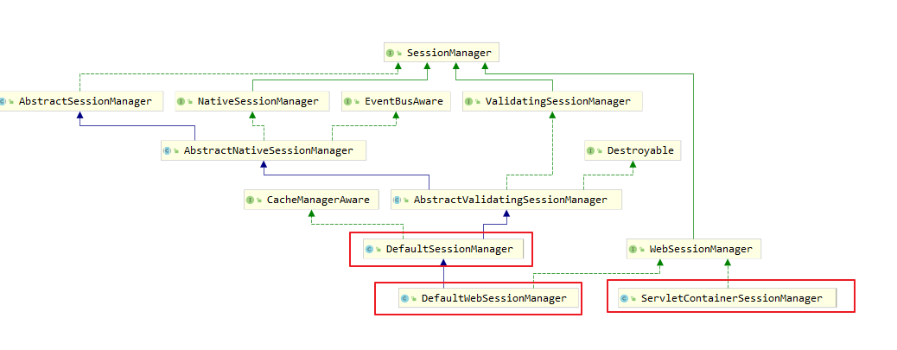

- DefaultSessionManager：用于 JavaSE 环境
- ServletContainerSessionManager：用于 web 环境，直接使用 Servlet 容器的会话
- DefaultWebSessionManager：用于 web 环境，自己维护会话（不使用 Servlet 容器的会话管理）

### 5.3 获取 session

实现：

- `Session session = SecurityUtils.getSubject().getSession()`
- `session.setAttribute("key","value")`

说明：

- Controller 中的 request，在 shiro 过滤器中的 doFilerInternal 方法，被包装成 ShiroHttpServletRequest。
- SecurityManager 和 SessionManager 会话管理器决定 session 来源于 ServletRequest，还是由 Shiro 管理的会话。
- 无论是通过 request.getSession 或 subject.getSession 获取到 session，操作 session，两者都是等价的。
