*MySQL 是最流行的关系型数据库管理系统，在 WEB 应用方面 MySQL 是最好的 RDBMS(Relational Database Management System：关系数据库管理系统)应用软件之一。*
<!-- more -->

## 1. 数据库概述

### 1.1 数据库与数据库管理系统

#### 1.1.1 数据库相关概念

1. 数据库：（DB、Database），存储数据的仓库，本质是一个文件系统，保存了一系列有组织的数据。
2. 数据库管理系统：（DBMS、Database Management System），是一种操纵和管理数据库的大型软件，用于建立、使用和维护数据库，对数据库进行统一管理和控制。用户通过数据库管理系统访问数据库中表内的数据。
   - 图形化管理工具实际上不是数据库管理系统。它是代替了数据库管理系统功能的工具而已。
3. 结构化查询语言：（SQL、Structured Query Language），用来与数据库通信的语言。

#### 1.1.2 数据库、表、数据库管理系统的关系


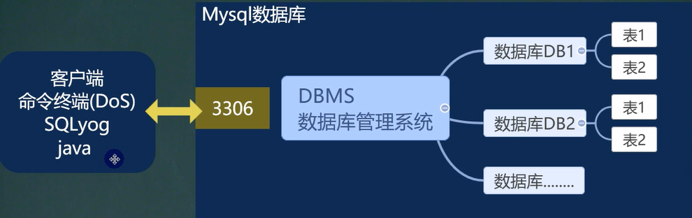
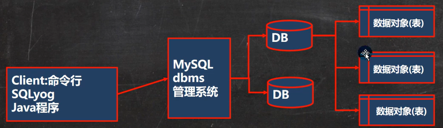

#### 1.1.3 常见数据库

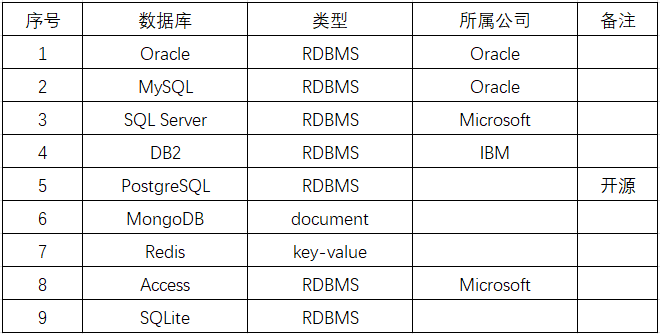

### 1.2 MySQL 介绍

#### 1.2.1 特点

1. 开放源代码。6.x 版本之后分为社区版和商业版。
2. 是一种关联数据库管理系统。
3. 使用标准的 SQL 数据语言形式。
4. 支持大型数据库，支持 5000 万条记录的数据仓库，32 位系统表文件最大可支持 4GB ，64 位系统支持最大的表文件为 8TB 。

#### 1.2.2 发展历史

1. 1995 年瑞典 MySQL AB 公司开发。
2. 2008 年被 Sun 公司收购。
3. 2009 年 Sun 被 Oracle 收购。MySQL 的开发者创建了 MySQL 的分支项目 MarialDB
4. 2010 年，发布 5.5 版本
5. 2013 年，发布 5.6 版本
6. 2015 年，发布 5.7 版本
7. 2016 年 9 月，发布 8.0 版本

#### 1.2.3 常见数据库对象

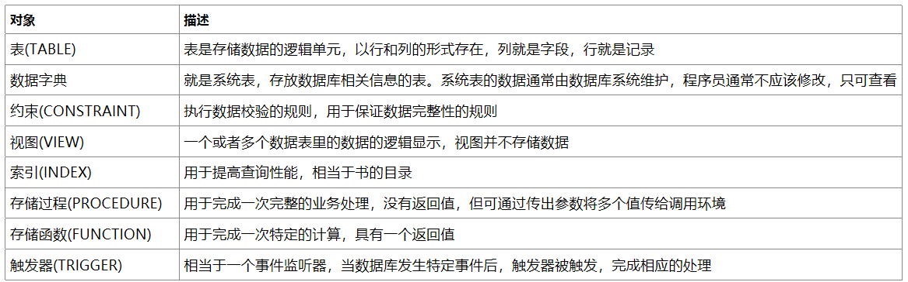

### 1.3 RDBMS 与非 RDBMS

#### 1.3.1 RDBMS

1. 关系型数据库以行(row) 和列(column) 的形式存储数据，以便于用户理解。这一系列的行和列被称为表(table) ，一组表组成了一个库(database)。
2. 表与表之间的数据记录有关系(relationship)。现实世界中的各种实体以及实体之间的各种联系均用关系模型来表示。关系型数据库，就是建立在关系模型基础上的数据库。
3. 优点：
   - 复杂查询：可以用 SQL 语句方便的在一个表以及多个表之间做非常复杂的数据查询。
   - 事务支持：使得对于安全性能很高的数据访问要求得以实现。

#### 1.3.2 非 RDBMS

1. 基于键值对存储数据，不需要经过 SQL 层的解析， 性能非常高
2. NoSQL 泛指非关系型数据库，包括了榜单上的键值型数据库、文档型数据库、搜索引擎和列存储等，除此以外还包括图形数据库。
3. 日志收集、排行榜、定时器等使用性能更高、成本更低的非关系型数据库是更明智的选择。
4. 键值型数据库:
   - 通过 Key-Value 键值的方式来存储数据，其中 Key 和 Value 可以是简单的对象，也可以是复杂的对象。Key 作为唯一的标识符，优点是查找速度快，但无法像关系型数据库一样使用条件过滤（比如 WHERE），如果不知道 key，就要遍历所有的键。
   - 键值型数据库典型的使用场景是作为内存缓存。
   - Redis 是最流行的键值型数据库。
5. 文档型数据库：
   - 此类数据库可存放并获取文档，可以是 XML、JSON 等格式。
   - 在数据库中文档作为处理信息的基本单位，一个文档就相当于一条记录。
   - 文档数据库所存放的文档，就相当于键值数据库所存放的“值”。
   - MongoDB 是最流行的文档型数据库。
6. 搜索引擎数据库：
   - 搜索引擎数据库是应用在搜索引擎领域的数据存储形式，由于搜索引擎会爬取大量的数据，并以特定的格式进行存储，这样在检索的时候才能保证性能最优。核心原理是“倒排索引”。
7. 列式数据库：
   - 列式数据库是相对于行式存储的数据库，Oracle、MySQL、SQL Server 等数据库都是采用的行式存储（Row-based），而列式数据库是将数据按照列存储到数据库中，这样做的好处是可以大量降低系统的 I/O，适合于分布式文件系统，不足在于功能相对有限。
8. 图形数据库：
   - 利用了图这种数据结构存储了实体（对象）之间的关系。
   - 数据模型主要是以节点和边（关系）来实现。
   - 能高效地解决复杂的关系问题。

### 1.4 关系型数据库的设计规则

#### 1.4.1 基本原则

1. 关系型数据库的典型数据结构就是数据表，这些数据表的组成都是结构化的（Structured）。
2. 将数据放到表中，表再放到库中。
3. 一个数据库中可以有多个表，每个表都有一个名字，用来标识自己。表名具有唯一性。
4. 表具有一些特性，这些特性定义了数据在表中如何存储，类似 Java 和 Python 中 “类”的设计。

#### 1.4.2 相关概念

1. E-R（entity-relationship，实体-联系）模型：中有三个主要概念是： 实体集、属性、联系集。
   - 一个实体集（class）对应于数据库中的一个表（table）。
   - 一个实体（instance）对应于数据库表中的一行（row），也称为一条记录（record）。
   - 一个属性（attribute）对应于数据库表中的一列（column），也称为一个字段（field）。
2. ORM 思想 (Object Relational Mapping)体现：
   - 数据库中的一个表 <---> Java 或 Python 中的一个类
   - 表中的一条数据 <---> 类中的一个对象（或实体）
   - 表中的一个列 <----> 类中的一个字段、属性(field)

#### 1.4.3 表的关联关系

1. 一对一关联（one-to-one）：
   - 外键唯一：主表的主键和从表的外键（唯一），形成主外键关系，外键唯一。
   - 外键是主键：主表的主键和从表的主键，形成主外键关系。
2. 一对对关系（one-to-many）：
   - 在从表(多方)创建一个字段，字段作为外键指向主表(一方)的主键
3. 多对多（many-to-many）：
   - 要表示多对多关系，必须创建第三个表，该表通常称为联接表，它将多对多关系划分为两个一对多关系。将这两个表的主键都插入到第三个表中。
4. 自我引用（Self reference）：

## 2. 环境搭建

[02.\_MySQL 环境搭建.pdf](https://www.yuque.com/attachments/yuque/0/2022/pdf/1604140/1655452909332-7caff9fa-6e2d-463e-8e8d-86f383b303ac.pdf)

### 2.1 MySQL 环境搭建

#### 2.1.1 8.x 版本


Development Machine（开发机器） ：该选项代表典型个人用桌面工作站。此时机器上需要运行多个应用程序，那么 MySQL 服务器将占用最少的系统资源。

Server Machine（服务器） ：该选项代表服务器，MySQL 服务器可以同其他服务器应用程序一起运行，例如 Web 服务器等。MySQL 服务器配置成适当比例的系统资源。

Dedicated Machine（专用服务器） ：该选项代表只运行 MySQL 服务的服务器。MySQL 服务器配置成使用所有可用系统资源。

配置环境变量：将`MySQL Server 8.0\bin`添加到环境变量。

#### 2.1.2 5.x 版本


- 5.x 版本的端口设置如图
- 两个版本的服务器密码均为 dimitre123

### 2.2 连接 mysql 数据库

- `mysql -h 主机名 -P 端口号 -u 用户名 -p密码`
  - -p 与密码之间不能有空格，其他参数名与参数值之间可以有空格也可以没有空格。
  - 输入完 p 后，按下回车，将密码在下一行输入，保证安全
  - 客户端和服务器在同一台机器上，所以输入 localhost 或者 IP 地址 127.0.0.1。
  - 连接本机-h 和主机名可以省略；如果端口号没有修改，-P 和 3306 也可以省略
- 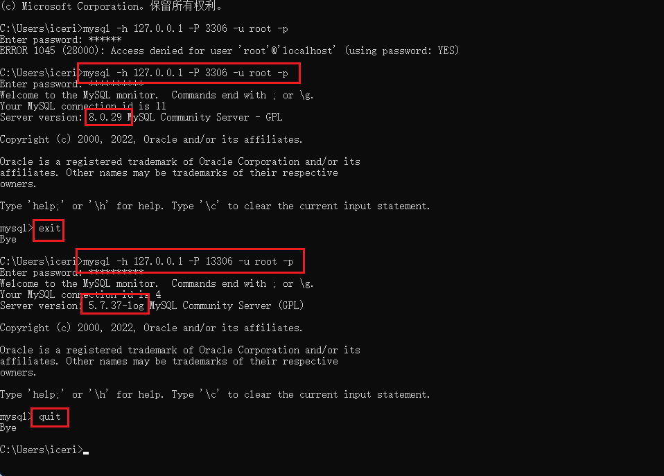

退出登录：`exit`或`quit`

### 2.3 命令行操作 MySQL 服务

1. 删除服务：`sc delete 服务名`
2. 新建服务：`mysqlld --install 服务名`须在 mysql/bin 目录下执行
   - 不写服务名时为 mysql
3. 启动服务：`net start 服务名`
4. 停止服务：`net stop 服务名`

### 2.4 修改 mysql5.x 默认字符集

- 为解决中文乱码以及默认字符集为`latin1`的问题，需要修改配置文件。
- 在 mysql 命令模式下查看编码：`show variables like 'character_%'`
- 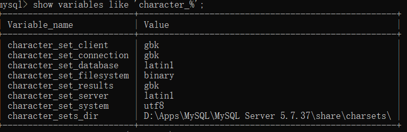
- 查看比较规则：`show variables like 'collation_%';`
- 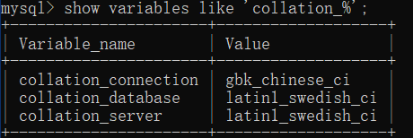
- 修改 mysql5.7 配置文件：`C:\ProgramData\MySQL\MySQL Server 5.7.37\my.ini`
- 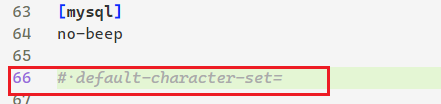
  - 
- 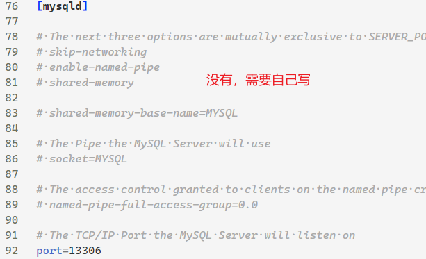
  - 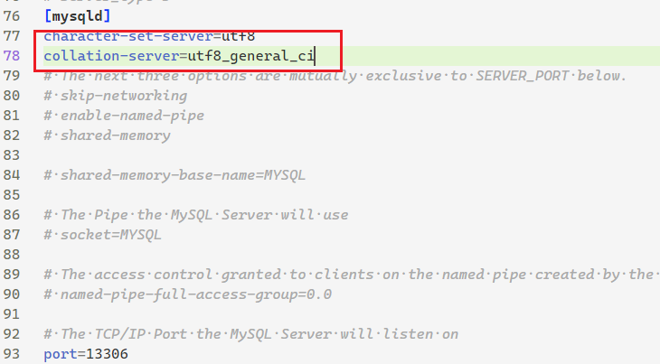
- 配置完后需要重新启动 mysql 服务

### 2.5 卸载 MySQL

1. 停止 mysql 服务。
2. 卸载软件。
3. 清理残余文件。
   - 清理服务目录：mysql 服务的安装目录。
   - 数据目录：默认在 C:\ProgramData\MySQL
4. 清理注册表：
   - `HKEY_LOCAL_MACHINE\SYSTEM\ControlSet001\Services\Eventlog\Application\MySQL服务` 目录删除
   - `HKEY_LOCAL_MACHINE\SYSTEM\ControlSet001\Services\MySQL服务 `目录删除
   - `HKEY_LOCAL_MACHINE\SYSTEM\ControlSet002\Services\Eventlog\Application\MySQL服务` 目录删除
   - `HKEY_LOCAL_MACHINE\SYSTEM\ControlSet002\Services\MySQL服务` 目录删除
   - `HKEY_LOCAL_MACHINE\SYSTEM\CurrentControlSet\Services\Eventlog\Application\MySQL服务目录` 删除
   - `HKEY_LOCAL_MACHINE\SYSTEM\CurrentControlSet\Services\MySQL服务` 删除
5. 删除 mysql 环境变量。

### 2.6 图形化管理软件

#### 2.6.1 Navicat

[清除注册表.bat](https://www.yuque.com/attachments/yuque/0/2022/bat/1604140/1655453179045-794f2dcd-7d61-49a5-bea6-7ae5c48c12e1.bat)

- 定期清除注册表，一直试用

#### 2.6.2 创建数据库

1. 双击数据库，连接数据库服务。右键创建新数据库。


2. 设置数据库格式

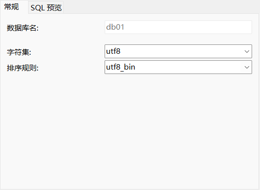

3. 打开数据库新建表

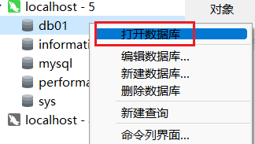

4. 设置表字段名称、类型，保存，设置表名称


5. 在 user 表内添加数据

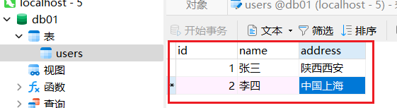

### 2.7 Linux 系统下安装

### 2.8 重置密码

1. 通过任务管理器或者服务管理，关掉 mysqld(服务进程)
2. 通过命令行+特殊参数开启`mysqld mysqld --defaults-file="D:\ProgramFiles\mysql\MySQLServer5.7Data\my.ini" --skip-grant-tables`
3. 此时，mysqld 服务进程已经打开。并且不需要权限检查
4. mysql -uroot 无密码登陆服务器。另启动一个客户端进行
5. 修改权限表 （1） use mysql; （2）update user set authentication_string=password('新密
   码') where user='root' and Host='localhost'; （3）flush privileges;
6. 通过任务管理器，关掉 mysqld 服务进程。
7. 再次通过服务管理，打开 mysql 服务。 8: 即可用修改后的新密码登陆。

## 3. SQL 概述

### 3.1 背景

1. 由 IBM20 世纪 70 年代开发。
2. 由美国国家标准局（ANSI）定制 SQL 标准。
3. SQL-92、SQL-99 是最重要的两个标准。
4. 不同数据库生产厂商都支持 SQL 语句，但都有其特有内容。

### 3.2 SQL 语句分类

- DDL：数据定义语句【create、drop、alter 表，库……】
- DML：数据操作语句【增加 insert、修改 update、删除 delete】
- DQL：数据查询语句【select】
- DCL：数据控制语句【管理数据库：如用户权限提升 grant、移除 revoke、commit、rollback、savepoint】

### 3.3 SQL 语言规则与规范

#### 3.3.1 基本规则

- SQL 可以写在一行或者多行。为了提高可读性，各子句分行写，必要时使用缩进
- 每条命令以 `;` 或 `\g` 或 `\G` 结束
  - 图形化界面中，根据执行情况的不同，该规则较为灵活，但必须确保执行的语句上下文按规则结束。
- 关键字不能被缩写也不能分行
- 关于标点符号
  - 必须保证所有的`()`、单引号、双引号是成对结束的
  - 必须使用英文状态下的半角输入方式
  - 字符串型和日期时间类型的数据可以使用单引号`''`表示
  - 列的别名，尽量使用双引号`""`，而且不建议省略 as

#### 3.3.2 SQL 大小写规范

- MySQL 在 Windows 环境下是大小写不敏感的（因为 windows 系统对大小写不敏感）
- MySQL 在 Linux 环境下是大小写敏感的
  - 数据库名、表名、表的别名、变量名是严格区分大小写的
  - 关键字、函数名、列名(或字段名)、列的别名(字段的别名) 是忽略大小写的。
- 推荐采用统一的书写规范：
  - 数据库名、表名、表别名、字段名、字段别名等都小写
  - SQL 关键字、函数名、绑定变量等都大写

#### 3.3.3 注释

- 单行注释：`#注释文字`
- 单行注释：`-- 注释文字 --`
- 多行注释：`/* 注释文字 */`

#### 3.3.4 命名规则

- 数据库、表名不得超过 30 个字符，变量名限制为 29 个
- 必须只能包含` A–Z`、 `a–z`、 `0–9`、`_`共 63 个字符
- 数据库名、表名、字段名等对象名中间不要包含空格
- 同一个 MySQL 软件中，数据库不能同名；同一个库中，表不能重名；同一个表中，字段不能重名
- 必须保证你的字段没有和保留字、数据库系统或常用方法冲突。如果坚持使用，请在 SQL 语句中使用````（着重号）引起来
- 保持字段名和类型的一致性，同一个数据库的不同表在命名字段并为其指定数据类型的时候一定要保证一致性。

## 4. 数据库操作

### 4.1 创建、使用数据库

1. `CREATE DATABASE [IF NOT EXISTS] db_name [CHARSET xxx COLLATE xxx ……]`
   - `[IF NOT EXISTS]`（可选）：不写时数据库已存在则报错
   - `[CHARSET xxx]`（可选）：指定数据库字符集，默认 uft8
   - `[COLLATE xxx]`（可选）：指定数据库字符集校对规则，默认 utf8_general_ci，不区分大小写。
     - utf8_bin：区分大小写
   - 表不指定字符集及字符集校对规则时，按照数据库规则执行。
   - db_name 与关键字冲突时，可采用反引号包裹。
2. 使用数据库：`USE 数据库名`
   - `show tables`：选中数据库后执行此操作可以查看当前数据库下所有的表。
3. `show tables from 数据库名;`查看制定数据库下的所有表。

### 4.2 查看、删除数据库

1. 显示数据库：`SHOW DATABASES`，查看当前数据库服务器中的所有数据库
2. 显示数据库（使用全局函数）：`SELECT DATABASE()`
3. 显示数据库的创建信息：`SHOW CREATE DATABASE db_name`
   - 例：`SHOW CREATE DATABASE `db01` `
4. 删除数据库：`DROP DATABSE db_name`
   - `DROP DATABASE IF EXISTS 数据库名;`

### 4.3 备份、恢复数据库

1. 备份数据库：
   - （DOS 命令下）`mysqldump -h 主机名 -P 端口号 -u 用户名 -p -B 数据库1 数据库2 > 文件绝对路径\文件名.sql`
     - 省略规则同开启 mysql 服务。
     - 备份表：`mysqldump -h 主机名 -P 端口号 -u 用户名 -p 数据库 表1 表2 > 文件绝对路径\文件名.sql`
2. 恢复数据库：
   - 方式一：（mysql 环境下）`source 文件绝对路径\文件名.sql`
   - 方式二：（图形界面下）
     - 文本模式打开要恢复的数据库文件，拷贝至图形化界面的查询语句输入区，点击运行
     - 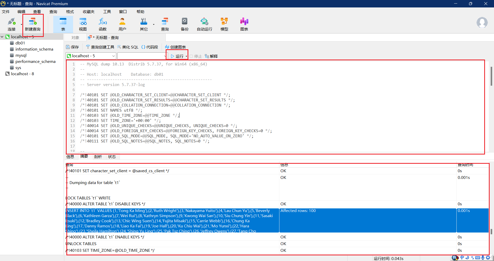
3. 安装（导入）数据库：方式同恢复数据库。

### 4.4 修改数据库

更改数据库字符集：`ALTER DATABASE 数据库名 CHARACTER SET 字符集;`

## 5. 表（结构）操作——DDL

### 5.1 创建表

#### 5.1.1 方式一

```sql
CREATE TABLE [IF NOT EXISTS] 表名(
  字段1, 数据类型 [约束条件] [默认值],
  字段2, 数据类型 [约束条件] [默认值],
  字段3, 数据类型 [约束条件] [默认值],
  ……
  [表约束条件]
)character set 字符集 collate 校对规则 engine 存储引擎;
```

- character、collate、engine 为可选内容
- character set 与 charset 等价
- 存储引擎默认为 INNODB
- `CREATE TABLE table_name1 LIKE table_name2;`将 table_name2 的结构复制到 table_name1。

#### 5.1.2 方式二

使用 AS subquery 选项，将创建表和插入数据结合起来。subquery 表示查询条件，例如：

```sql
CREATE TABLE dept80
AS
  SELECT employee_id, last_name, salary*12 ANNSAL, hire_date
  FROM employees
  WHERE department_id = 80;
```

#### 5.1.3 MySQL8 新特性：计算列

某一列的值是通过别的列计算得来的。例如，a 列值为 1、b 列值为 2，c 列不需要手动插入，定义 a+b 的结果为 c 的值，那么 c 就是计算列，是通过别的列计算得来的。

在 MySQL 8.0 中，CREATE TABLE 和 ALTER TABLE 中都支持增加计算列。

```sql
CREATE TABLE tb1(
  id INT,
  a INT,
  b INT,
  c INT GENERATED ALWAYS AS (a + b) VIRTUAL
);
```

#### 5.1.4 阿里 MySQL 字段命名规范

1. 【强制】 表达是与否概念的字段，必须使用 is_xxx 的方式命名，数据类型是 unsigned tinyint（ 1 表示是， 0 表示否）。
   说明： 任何字段如果为非负数，必须是 unsigned。
   注意： POJO 类中的任何布尔类型的变量，都不要加 is 前缀，所以，需要在设置从 is_xxx 到 Xxx 的映射关系。数据库表示是与否的值，使用 tinyint 类型，坚持 is_xxx 的命名方式是为了明确其取值含义与取值范围。
   正例： 表达逻辑删除的字段名 is_deleted， 1 表示删除， 0 表示未删除。
2. 【强制】 表名、字段名必须使用小写字母或数字， 禁止出现数字开头，禁止两个下划线中间只出现数字。数据库字段名的修改代价很大，因为无法进行预发布，所以字段名称需要慎重考虑。
   说明： MySQL 在 Windows 下不区分大小写，但在 Linux 下默认是区分大小写。因此，数据库名、表名、字段名，都不允许出现任何大写字母，避免节外生枝。
   正例： aliyun_admin， rdc_config， level3_name
   反例： AliyunAdmin， rdcConfig， level_3_name
3. 【强制】 表名不使用复数名词。
   说明： 表名应该仅仅表示表里面的实体内容，不应该表示实体数量，对应于 DO 类名也是单数形式，符合表达习惯。
4. 【强制】 禁用保留字，如 desc、 range、 match、 delayed 等， 请参考 MySQL 官方保留字。
5. 【强制】 主键索引名为 pk*字段名；唯一索引名为 uk*字段名； 普通索引名则为 idx*字段名。
   说明： pk* 即 primary key； uk* 即 unique key； idx* 即 index 的简称。
6. 【强制】 小数类型为 decimal，禁止使用 float 和 double。
   说明： 在存储的时候， float 和 double 都存在精度损失的问题，很可能在比较值的时候，得到不正确的结果。如果存储的数据范围超过 decimal 的范围，建议将数据拆成整数和小数并分开存储。
7. 【强制】 如果存储的字符串长度几乎相等，使用 char 定长字符串类型。
8. 【强制】 varchar 是可变长字符串，不预先分配存储空间，长度不要超过 5000，如果存储长度大于此值，定义字段类型为 text，独立出来一张表，用主键来对应，避免影响其它字段索引效率。
9. 【强制】 表必备三字段： id, gmt_create, gmt_modified。
   说明： 其中 id 必为主键，类型为 bigint unsigned、单表时自增、步长为 1。 gmt_create, gmt_modified 的类型均为 datetime 类型，前者现在时表示主动式创建，后者过去分词表示被动式更新。
10. 【推荐】 表的命名最好是遵循“业务名称\_表的作用” 。
    正例： alipay_task / force_project / trade_config
11. 【推荐】 库名与应用名称尽量一致。
12. 【推荐】 如果修改字段含义或对字段表示的状态追加时，需要及时更新字段注释。
13. 【推荐】 字段允许适当冗余，以提高查询性能，但必须考虑数据一致。冗余字段应遵循：
    1） 不是频繁修改的字段。
    2） 不是唯一索引的字段。
    3） 不是 varchar 超长字段，更不能是 text 字段。
    正例： 各业务线经常冗余存储商品名称，避免查询时需要调用 IC 服务获取。
14. 【推荐】 单表行数超过 500 万行或者单表容量超过 2GB，才推荐进行分库分表。
    说明： 如果预计三年后的数据量根本达不到这个级别，请不要在创建表时就分库分表。
15. 【参考】 合适的字符存储长度，不但节约数据库表空间、节约索引存储，更重要的是提升检索速度。
    正例： 无符号值可以避免误存负数， 且扩大了表示范围。
    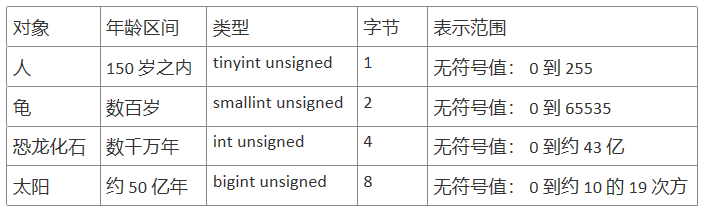

### 5.2 删除表

在 MySQL 中，当一张数据表 没有与其他任何数据表形成关联关系 时，可以将当前数据表直接删除。

- 数据和结构都被删除
- 所有正在运行的相关事务被提交
- 所有相关索引被删除
- `DROP TABLE table_name`
- MySQL8 由于使用了 InnoDB 引擎，所以删除多个表时，也支持事务的完整性（即 DDL 操作要么全部成功要么回滚）。

### 5.3 备份、恢复表

- 备份表：`mysqldump -h 主机名 -P 端口号 -u 用户名 -p 数据库 表1 表2 > 文件绝对路径\文件名.sql`
- 恢复表：同数据库恢复操作

### 5.4 修改表

#### 5.4.1 添加列

`ALTER TABLE table_name ADD (column datatype [NOT NULL DEFAULT 'XXX']) AFTER TARGETCOLUMN;`

- 在目标列`TARGETCOLUMN`后添加指定列，目标列可以大写，也可以小写。
- 可以一次添加多列（使用`()`包裹），添加一列时，可以不使用括号。
- 不指定添加在哪一列后面时，默认添加到最后一列

#### 5.4.2 修改列

`ALTER TABLE table_name MODIFY(TARGETCOLUMN datatype [NOT NULL DEFAULT 'XXX']);`
可以修改列的数据类型，长度、默认值和位置。 对默认值的修改只影响今后对表的修改。

#### 5.4.3 重命名列

`ALTER TABLE table_name CHANGE 旧名 新名 datatype`

#### 5.4.4 删除列

`ALTER TABLE 表名 DROP 【COLUMN】字段名`

#### 5.4.5 修改表名

方式一：`RENAME table_name TO new_name;`
方式二：`ALTER table dept RENAME [TO] detail_dept; -- [TO]可以省略`

#### 5.4.6 修改表字符集

`ALTER TABLE table_name CHARSET utf8`

#### 5.4.7 修改表存储引擎

`ALETER TABLE table_name ENGINE = 引擎类型`

### 5.5 显示表结构

`DESCRIBE employees;`或 `DESC employees;`
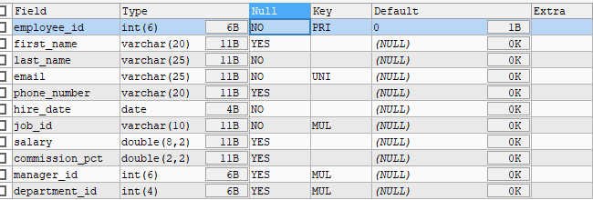

- Field：表示字段名称。
- Type：表示字段类型。
- Null：表示该列是否可以存储 NULL 值。
- Key：表示该列是否已编制索引。PRI 表示该列是表主键的一部分；UNI 表示该列是 UNIQUE 索引的一部分；MUL 表示在列中某个给定值允许出现多次。
- Default：表示该列是否有默认值，如果有，那么值是多少。
- Extra：表示可以获取的与给定列有关的附加信息，例如 AUTO_INCREMENT 等。

### 5.6 清空表

- 删除表中所有的数据
- 释放表的存储空间
- `TRUNCATE TABLE detail_dept;`
- 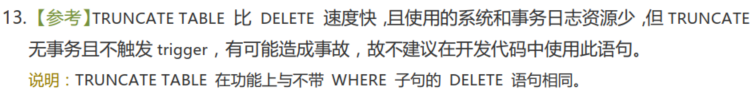
  - 对比的是`delete from table_name`

## 6. 常用数据类型（列类型）

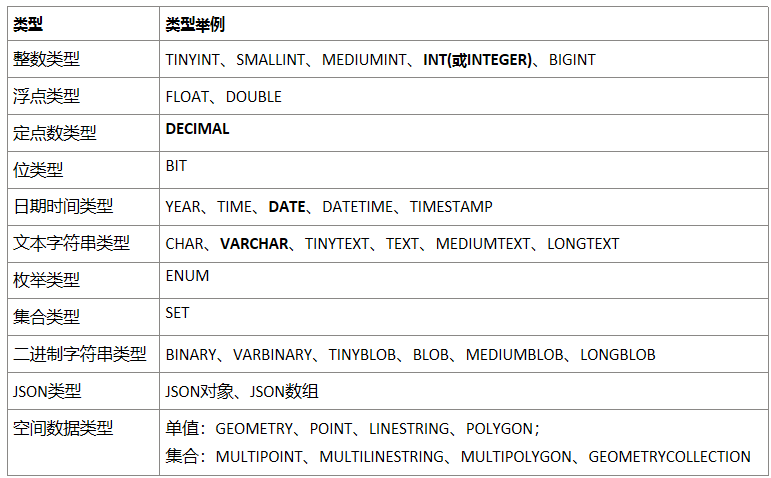
其中，常用的积累数据类型如下：
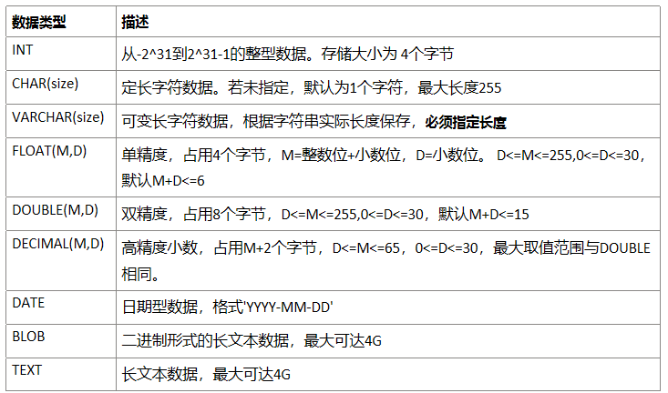
[MySQL 数据类型.mmap](https://www.yuque.com/attachments/yuque/0/2022/mmap/1604140/1665670436496-8f7eaf76-3b98-47d9-af91-c3fdddee75e2.mmap)

### 6.1 整数类型

#### 6.1.1 类型介绍

整数类型一共有 5 种，包括 TINYINT、SMALLINT、MEDIUMINT、INT（INTEGER）和 BIGINT，区别如下：
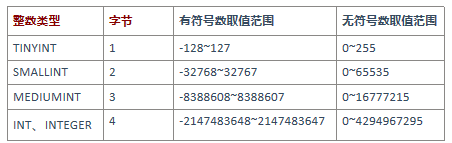

#### 6.1.2 可选属性

##### 6.1.2.1 宽度 M

M 的取值范围是(0, 255)。例如，int(5)：当数据宽度小于 5 位的时候在数字前面需要用字符填满宽度。该项功能需要配合“ ZEROFILL ”使用，表示用“0”填满宽度，否则指定显示宽度无效。

- 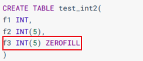
- 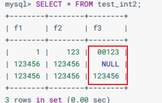
- 上图中可以看出，f3 的实际数据位数（123）不足 5 位时，前面使用 0 进行了补齐。当实际数据位数（123456）超出 5 位时，按照实际数据显示。

从 MySQL 8.0.17 开始，整数数据类型不推荐使用显示宽度属性。 之前的版本中，整型数据类型可以在定义表结构时指定所需要的显示宽度，如果不指定，则系统为每一种类型指定默认的宽度值 。

- 查看表结构 （MySQL5.7 中显式如下，MySQL8 中不再显式范围）
  - 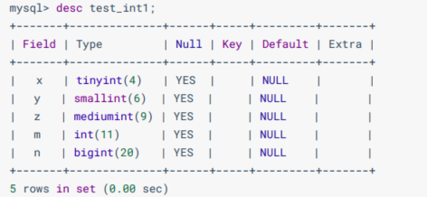
  - TINYINT 有符号数和无符号数的取值范围分别为-128~127 和 0~255，由于负号占了一个数字位，因此 TINYINT 默认的显示宽度为 4。同理，其他整数类型的默认显示宽度与其有符号数的最小值的宽度相同。
- 查看表结构 （MySQL8 整数类型已经不显示范围）
  - 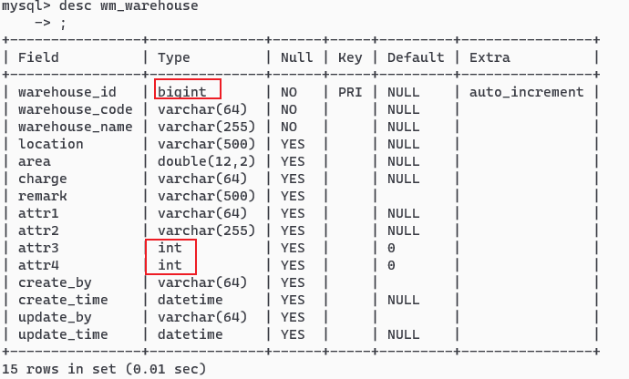

##### 6.1.2.2 UNSIGNED

UNSIGNED ：无符号类型（非负），所有的整数类型都有一个可选的属性 UNSIGNED（无符号属性），无符号整数类型的最小取值为 0。所以，如果需要在 MySQL 数据库中保存非负整数值时，可以将整数类型设置为无符号类型。

int 类型默认显示宽度为 int(11)，无符号 int 类型默认显示宽度为 int(10)——MySQL5.7，MySQL8 不显示。
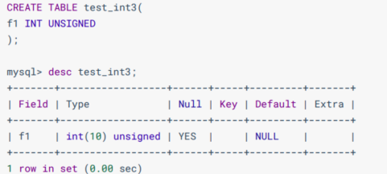
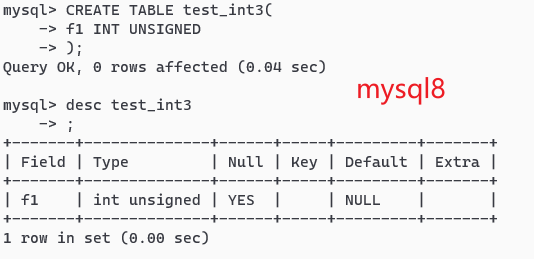

##### 6.1.2.3 ZEROFILL

ZEROFILL：0 填充,（如果某列是 ZEROFILL，那么 MySQL 会自动为当前列添加 UNSIGNED 属性），如果指定了 ZEROFILL 只是表示不够 M 位时，用 0 在左边填充，如果超过 M 位，只要不超过数据存储范围即可。

在 int(M) 中，M 的值跟 int(M) 所占多少存储空间并无任何关系。 int(3)、int(4)、int(8) 在磁盘上都是占用 4 bytes 的存储空间。
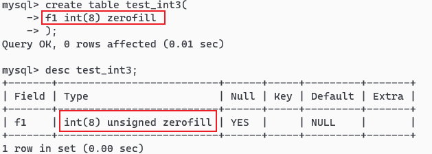
mysql5 和 mysql8 显示结果相同，均如上。当使用 ZEROFILL 时，自动添加 UNSIGNED。

#### 6.1.3 适用场景

- TINYINT ：一般用于枚举数据，比如系统设定取值范围很小且固定的场景。如性别，男 1，女 0。
- SMALLINT ：可以用于较小范围的统计数据，比如统计工厂的固定资产库存数量等。
- MEDIUMINT ：用于较大整数的计算，比如车站每日的客流量等。
- INT、INTEGER ：取值范围足够大，一般情况下不用考虑超限问题，用得最多。比如商品编号。
- BIGINT ：只有当你处理特别巨大的整数时才会用到。比如双十一的交易量、大型门户网站点击量、证券公司衍生产品持仓等。

#### 6.1.4 选择依据

在评估用哪种整数类型的时候，需要考虑存储空间和可靠性的平衡问题：一方面，用占用字节数少的整数类型可以节省存储空间；另一方面，要是为了节省存储空间， 使用的整数类型取值范围太小，一旦遇到超出取值范围的情况，就可能引起系统错误 ，影响可靠性。

举个例子，商品编号采用的数据类型是 INT。原因就在于，客户门店中流通的商品种类较多，而且，每天都有旧商品下架，新商品上架，这样不断迭代，日积月累。

如果使用 SMALLINT 类型，虽然占用字节数比 INT 类型的整数少，但是却不能保证数据不会超出范围 65535。相反，使用 INT，就能确保有足够大的取值范围，不用担心数据超出范围影响可靠性的问题。

在实际工作中，系统故障产生的成本远远超过增加几个字段存储空间所产生的成本。因此，建议首先确保数据不会超过取值范围，在这个前提之下，再去考虑如何节省存储空间。

总结：可靠性优先，存储空间次之。

### 6.2 浮点类型

#### 6.2.1 类型介绍

浮点数和定点数类型的特点是可以 处理小数，整数可以看成小数的一个特例。因此，浮点数和定点数的使用场景，比整数大多了。

MySQL 支持的浮点数类型，分别是 FLOAT、DOUBLE、REAL。
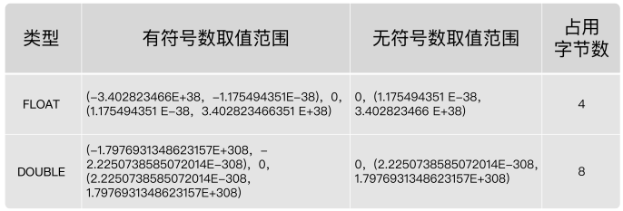

REAL 默认就是 DOUBLE。如果把 SQL 模式设定为启用 REAL_AS_FLOAT，那 么，MySQL 就认为 REAL 是 FLOAT。

启用 REAL_AS_FLOAT：`SET sql_mode = "REAL_AS_FLOAT";`

问题 1：FLOAT 和 DOUBLE 这两种数据类型的区别是啥呢？

FLOAT 占用字节数少，取值范围小；DOUBLE 占用字节数多，取值范围也大。

问题 2：为什么浮点数类型的无符号数取值范围，只相当于有符号数取值范围的一半，也就是只相当于有符号数取值范围大于等于零的部分呢？

MySQL 存储浮点数的格式为： 符号(S) 、 尾数(M) 和 阶码(E) 。因此，无论有没有符号，MySQL 的浮点数都会存储表示符号的部分。因此， 所谓的无符号数取值范围，其实就是有符号数取值范围大于等于零的部分。

#### 6.2.2 数据精度说明

对于浮点类型，在 MySQL 中单精度值使用 4 个字节，双精度值使用 8 个字节。

MySQL 允许使用 非标准语法（其他数据库未必支持，因此如果涉及到数据迁移，则最好不要这么用）： FLOAT(M,D) 或 DOUBLE(M,D) 。这里，M 称为 精度 ，D 称为 标度 。(M,D)中 M=整数位+小数位，D=小数位。 D<=M<=255，0<=D<=30。

- 例如，定义为 FLOAT(5,2)的一个列可以显示为-999.99-999.99。如果超过这个范围会报错。

FLOAT 和 DOUBLE 类型在不指定(M,D)时，默认会按照实际的精度（由实际的硬件和操作系统决定）来显示。

浮点类型也可以加 UNSIGNED ，但是不会改变数据范围，例如：`FLOAT(3,2) UNSIGNED`仍然只能表示 0-9.99 的范围。

不管是否显式设置了精度(M,D)，这里 MySQL 的处理方案如下：

- 如果存储时，整数部分超出了范围，MySQL 就会报错。
- 如果存储时，小数点部分若超出范围，就分以下情况：
  - 若四舍五入后，整数部分没有超出范围，则只警告，但能成功操作并四舍五入删除多余的小数位后保存。例如在 FLOAT(5,2)列内插入 999.009，近似结果是 999.01。
  - 若四舍五入后，整数部分超出范围，则 MySQL 报错，并拒绝处理。如 FLOAT(5,2)列内插入 999.995 和-999.995 都会报错。

从 MySQL 8.0.17 开始，FLOAT(M,D) 和 DOUBLE(M,D)用法在官方文档中已经明确不推荐使用，将来可能被移除。另外，关于浮点型 FLOAT 和 DOUBLE 的 UNSIGNED 也不推荐使用了，将来也可能被移除。

#### 6.2.3 精度误差说明

浮点数类型有个缺陷，就是不精准。

MySQL 用 4 个字节存储 FLOAT 类型数据，用 8 个字节来存储 DOUBLE 类型数据。无论哪个，都是采用二进制的方式来进行存储的。比如 9.625，用二进制来表达，就是 1001.101，或者表达成 1.001101×2^3。如果尾数不是 0 或 5（比如 9.624），你就无法用一个二进制数来精确表达。进而，就只好在取值允许的范围内进行四舍五入。

在编程中，如果用到浮点数，要特别注意误差问题，因为浮点数是不准确的，所以要避免使用“=”来判断两个数是否相等。同时，在一些对精确度要求较高的项目中，千万不要使用浮点数，不然会导致结果错误，甚至是造成不可挽回的损失。那么，MySQL 有没有精准的数据类型呢？当然有，这就是定点数类型： DECIMAL 。

### 6.3 定点数类型

#### 6.3.1 类型介绍

MySQL 中的定点数类型只有 DECIMAL 一种类型。
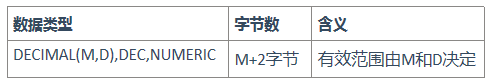
使用 DECIMAL(M,D) 的方式表示高精度小数。其中，M 被称为精度，D 被称为标度。0<=M<=65，0<=D<=30，D<M。例如，定义 DECIMAL（5,2）的类型，表示该列取值范围是-999.99~999.99。

DECIMAL(M,D)的最大取值范围与 DOUBLE 类型一样，但是有效的数据范围是由 M 和 D 决定的。DECIMAL 的存储空间并不是固定的，由精度值 M 决定，总共占用的存储空间为 M+2 个字节。也就是说，在一些对精度要求不高的场景下，比起占用同样字节长度的定点数，浮点数表达的数值范围可以更大一些。

定点数在 MySQL 内部是以 字符串 的形式进行存储，这就决定了它一定是精准的。

当 DECIMAL 类型不指定精度和标度时，其默认为 DECIMAL(10,0)。当数据的精度超出了定点数类型的精度范围时，则 MySQL 同样会进行四舍五入处理。
浮点数 vs 定点数：

- 浮点数相对于定点数的优点是在长度一定的情况下，浮点类型取值范围大，但是不精准，适用于需要取值范围大，又可以容忍微小误差的科学计算场景（比如计算化学、分子建模、流体动力学等）
- 定点数类型取值范围相对小，但是精准，没有误差，适合于对精度要求极高的场景 （比如涉及金额计算的场景）

### 6.4 位类型

BIT 类型中存储的是二进制值，类似 010110。
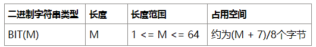
BIT 类型，如果没有指定(M)，默认是 1 位。这个 1 位，表示只能存 1 位的二进制值。这里(M)是表示二进制的位数，位数最小值为 1，最大值为 64 。

- 使用 SELECT 命令查询位字段时，可以用 BIN() 或 HEX() 函数进行读取。
- 使用 b+0 查询数据时，可以直接查询出存储的十进制数据的值。

### 6.5 日期与时间类型

#### 6.5.1 基本介绍

MySQL 有多种表示日期和时间的数据类型，不同的版本可能有所差异，MySQL8.0 版本支持的日期和时间类型主要有：YEAR 类型、TIME 类型、DATE 类型、DATETIME 类型和 TIMESTAMP 类型。

- YEAR 类型通常用来表示年
- DATE 类型通常用来表示年、月、日
- TIME 类型通常用来表示时、分、秒
- DATETIME 类型通常用来表示年、月、日、时、分、秒
- TIMESTAMP 类型通常用来表示带时区的年、月、日、时、分、秒

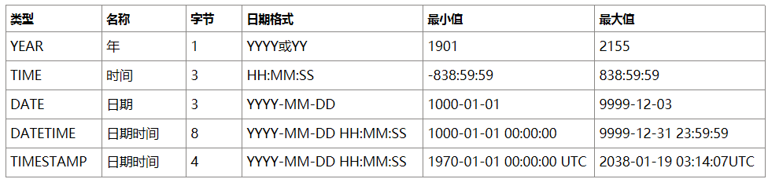
为什么时间类型 TIME 的取值范围不是 -23:59:59 ～ 23:59:59 呢？原因是 MySQL 设计的 TIME 类型，不光表示一天之内的时间，而且可以用来表示一个时间间隔，这个时间间隔可以超过 24 小时。

#### 6.5.2 YEAR 类型

YEAR 类型用来表示年份，在所有的日期时间类型中所占用的存储空间最小，只需要 1 个字节的存储空间。

在 MySQL 中，YEAR 有以下几种存储格式：

- 以 4 位字符串或数字格式表示 YEAR 类型，其格式为 YYYY，最小值为 1901，最大值为 2155。
- 以 2 位字符串格式表示 YEAR 类型，最小值为 00，最大值为 99。
  - 当取值为 01 到 69 时，表示 2001 到 2069；
  - 当取值为 70 到 99 时，表示 1970 到 1999；
    当取值整数的 0 或 00 添加的话，那么是 0000 年；
  - 当取值是日期/字符串的'0'添加的话，是 2000 年。

从 MySQL5.5.27 开始，2 位格式的 YEAR 已经不推荐使用。YEAR 默认格式就是 YYYY，没必要写成 YEAR(4)，从 MySQL 8.0.19 开始，不推荐使用指定显示宽度的 YEAR(4)数据类型。

#### 6.5.3 DATE 类型

DATE 类型表示日期，没有时间部分，格式为 YYYY-MM-DD ，其中，YYYY 表示年份，MM 表示月份，DD 表示日期。需要 3 个字节 的存储空间。在向 DATE 类型的字段插入数据时，同样需要满足一定的格式条件。

- 以 YYYY-MM-DD 格式或者 YYYYMMDD 格式表示的字符串日期，其最小取值为 1000-01-01，最大取值为 9999-12-03。YYYYMMDD 格式会被转化为 YYYY-MM-DD 格式。
- 以 YY-MM-DD 格式或者 YYMMDD 格式表示的字符串日期，此格式中，年份为两位数值或字符串满足 YEAR 类型的格式条件为：当年份取值为 00 到 69 时，会被转化为 2000 到 2069；当年份取值为 70 到 99 时，会被转化为 1970 到 1999。
- 使用 CURRENT_DATE() 或者 NOW() 函数，会插入当前系统的日期。

#### 6.5.4 TIME 类型

TIME 类型用来表示时间，不包含日期部分。在 MySQL 中，需要 3 个字节 的存储空间来存储 TIME 类型的数据，可以使用“HH:MM:SS”格式来表示 TIME 类型，其中，HH 表示小时，MM 表示分钟，SS 表示秒。

在 MySQL 中，向 TIME 类型的字段插入数据时，也可以使用几种不同的格式。

- 可以使用带有冒号的字符串，比如`'D HH:MM:SS' 、'HH:MM:SS'、'HH:MM'、'D HH:MM'、'D HH'或'SS'`格式，都能被正确地插入 TIME 类型的字段中。
  - 其中 D 表示天，其最小值为 0，最大值为 34。
  - 如果使用带有 D 格式的字符串插入 TIME 类型的字段时，D 会被转化为小时，计算格式为 D\*24+HH。
  - 当使用带有冒号并且不带 D 的字符串表示时间时，表示当天的时间，比如 12:10 表示 12:10:00，而不是 00:12:10。
- 可以使用不带有冒号的字符串或者数字，格式为' HHMMSS '或者 'HHMMSS'。如果插入一个不合法的字符串或者数字，MySQL 在存储数据时，会将其自动转化为 00:00:00 进行存储。
  - 比如 1210，MySQL 会将最右边的两位解析成秒，表示 00:12:10，而不是 12:10:00。
- 使用 CURRENT_TIME() 或者 NOW() ，会插入当前系统的时间。

#### 6.5.5 DATETIME 类型

DATETIME 类型在所有的日期时间类型中占用的存储空间最大，总共需要 8 个字节的存储空间。在格式上为 DATE 类型和 TIME 类型的组合，可以表示为 YYYY-MM-DD HH:MM:SS ，其中 YYYY 表示年份，MM 表示月份，DD 表示日期，HH 表示小时，MM 表示分钟，SS 表示秒。

在向 DATETIME 类型的字段插入数据时，同样需要满足一定的格式条件。

- 以 YYYY-MM-DD HH:MM:SS 格式或者 YYYYMMDDHHMMSS 格式的字符串插入 DATETIME 类型的字段时，最小值为 1000-01-01 00:00:00，最大值为 9999-12-03 23:59:59。
  - 以 YYYYMMDD HHMMSS 格式的数字插入 DATETIME 类型的字段时，会被转化为 YYYY-MM-DDHH:MM:SS 格式。
- 以 YY-MM-DD HH:MM:SS 格式或者 YYMMDDHHMMSS 格式的字符串插入 DATETIME 类型的字段时，两位数的年份规则符合 YEAR 类型的规则，00 到 69 表示 2000 到 2069；70 到 99 表示 1970 到 1999。
- 使用函数 CURRENT_TIMESTAMP() 和 NOW() ，可以向 DATETIME 类型的字段插入系统的当前日期和时间。

#### 6.5.6 TIMESTAMP 类型

TIMESTAMP 类型也可以表示日期时间，其显示格式与 DATETIME 类型相同，都是 YYYY-MM-DD HH:MM:SS ，需要 4 个字节的存储空间。但是 TIMESTAMP 存储的时间范围比 DATETIME 要小很多，只能存储 1970-01-01 00:00:01 UTC 到 2038-01-19 03:14:07 UTC 之间的时间。其中，UTC 表示世界统一时间，也叫作世界标准时间。

存储数据的时候需要对当前时间所在的时区进行转换，查询数据的时候再将时间转换回当前的时区。因此，使用 TIMESTAMP 存储的同一个时间值，在不同的时区查询时会显示不同的时间。

向 TIMESTAMP 类型的字段插入数据时，当插入的数据格式满足 YY-MM-DD HH:MM:SS 和 YYMMDDHHMMSS 时，两位数值的年份同样符合 YEAR 类型的规则条件，只不过表示的时间范围要小很多。

如果向 TIMESTAMP 类型的字段插入的时间超出了 TIMESTAMP 类型的范围，则 MySQL 会抛出错误信息。

#### 6.5.7 TIMESTAMP 和 DATETIME 的区别

- TIMESTAMP 存储空间比较小，表示的日期时间范围也比较小
- 底层存储方式不同，TIMESTAMP 底层存储的是毫秒值，距离 1970-1-1 0:0:0 0 毫秒的毫秒值。
- 两个日期比较大小或日期计算时，TIMESTAMP 更方便、更快。
- TIMESTAMP 和时区有关。TIMESTAMP 会根据用户的时区不同，显示不同的结果。而 DATETIME 则只能反映出插入时当地的时区，其他时区的人查看数据必然会有误差。

用得最多的日期时间类型，就是 DATETIME 。虽然 MySQL 也支持 YEAR（年）、 TIME（时间）、DATE（日期），以及 TIMESTAMP 类型，但是在实际项目中，尽量用 DATETIME 类型。因为这个数据类型包括了完整的日期和时间信息，取值范围也最大，使用起来比较方便。毕竟，如果日期时间信息分散在好几个字段，很不容易记，而且查询的时候，SQL 语句也会更加复杂。

但是，一般存注册时间、商品发布时间等，不建议使用 DATETIME 存储，而是使用时间戳 ，因为 DATETIME 虽然直观，但不便于计算。

### 6.6 文本字符串类型

#### 6.6.1 类型介绍

MySQL 中，文本字符串总体上分为 CHAR 、 VARCHAR 、 TINYTEXT 、 TEXT 、 MEDIUMTEXT 、LONGTEXT 、 ENUM 、 SET 等类型。


#### 6.6.2 CHAR 与 VARCHAR 类型

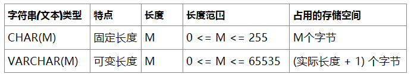
CHAR 类型：

- CHAR(M) 类型一般需要预先定义字符串长度。如果不指定(M)，则表示长度默认是 1 个字符。
- 如果保存时数据的实际长度比 CHAR 类型声明的长度小，则会在右侧填充空格以达到指定的长度。当 MySQL 检索 CHAR 类型的数据时，CHAR 类型的字段会去除尾部的空格。
- 定义 CHAR 类型字段时，声明的字段长度即为 CHAR 类型字段所占的存储空间的字节数。

VARCHAR 类型：

- VARCHAR(M) 定义时， 必须指定 长度 M，否则报错。
- MySQL4.0 版本以下，varchar(20)：指的是 20 字节，如果存放 UTF8 汉字时，只能存 6 个（每个汉字 3 字节） ；MySQL5.0 版本以上，varchar(20)：指的是 20 字符。
- 检索 VARCHAR 类型的字段数据时，会保留数据尾部的空格。VARCHAR 类型的字段所占用的存储空间为字符串实际长度加 1 个字节。

哪些情况使用 CHAR 或 VARCHAR 更好？

| 类型       | 特点     | 空间上       | 时间上 | 适用场景             |
| ---------- | -------- | ------------ | ------ | -------------------- |
| CHAR(M)    | 固定长度 | 浪费存储空间 | 效率高 | 存储不大，速度要求高 |
| VARCHAR(M) | 可变长度 | 节省存储空间 | 效率低 | 非 CHAR 的情况       |

- 情况 1：存储很短的信息。比如门牌号码 101，201……这样很短的信息应该用 char，因为 varchar 还要占个 byte 用于存储信息长度，本来打算节约存储的，结果得不偿失。
- 情况 2：固定长度的。比如使用 uuid 作为主键，那用 char 应该更合适。因为他固定长度，varchar 动态根据长度的特性就消失了，而且还要占个长度信息。
- 情况 3：十分频繁改变的 column。因为 varchar 每次存储都要有额外的计算，得到长度等工作，如果一个非常频繁改变的，那就要有很多的精力用于计算，而这些对于 char 来说是不需要的。
- 情况 4：具体存储引擎中的情况：
  - MyISAM 数据存储引擎和数据列：MyISAM 数据表，最好使用固定长度(CHAR)的数据列代替可变长度(VARCHAR)的数据列。这样使得整个表静态化，从而使 数据检索更快 ，用空间换时间。
  - MEMORY 存储引擎和数据列：MEMORY 数据表目前都使用固定长度的数据行存储，因此无论使用 CHAR 或 VARCHAR 列都没有关系，两者都是作为 CHAR 类型处理的。
  - InnoDB 存储引擎，建议使用 VARCHAR 类型。因为对于 InnoDB 数据表，内部的行存储格式并没有区分固定长度和可变长度列（所有数据行都使用指向数据列值的头指针），而且主要影响性能的因素是数据行使用的存储总量。由于 char 平均占用的空间多于 varchar，所以除了简短并且固定长度的，其他考虑 varchar。这样节省空间，对磁盘 I/O 和数据存储总量比较好。

#### 6.6.3 TEXT 类型

在 MySQL 中，TEXT 用来保存文本类型的字符串，总共包含 4 种类型，分别为 TINYTEXT、TEXT、MEDIUMTEXT 和 LONGTEXT 类型。

在向 TEXT 类型的字段保存和查询数据时，系统自动按照实际长度存储，不需要预先定义长度。这一点和 VARCHAR 类型相同。
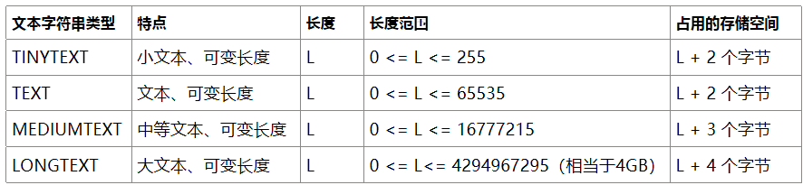
由于实际存储的长度不确定，MySQL 不允许 TEXT 类型的字段做主键。

在保存和查询数据时，并没有删除 TEXT 类型的数据尾部的空格。

TEXT 文本类型，可以存比较大的文本段，搜索速度稍慢，因此如果不是特别大的内容，建议使用 CHAR，VARCHAR 来代替。

TEXT 类型不用加默认值，加了也没用。而且 text 和 blob 类型的数据删除后容易导致“空洞”，使得文件碎片比较多，所以频繁使用的表不建议包含 TEXT 类型字段，建议单独分出去，单独用一个表。

### 6.7 ENUM 类型

ENUM 类型也叫作枚举类型，ENUM 类型的取值范围需要在定义字段时进行指定。设置字段值时，ENUM 类型只允许从成员中选取单个值，不能一次选取多个值。 其所需要的存储空间由定义 ENUM 类型时指定的成员个数决定。
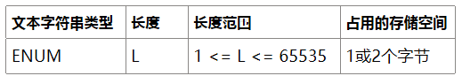

- 当 ENUM 类型包含 1 ～ 255 个成员时，需要 1 个字节的存储空间；
- 当 ENUM 类型包含 256 ～ 65535 个成员时，需要 2 个字节的存储空间。
- ENUM 类型的成员个数的上限为 65535 个。

```sql
CREATE TABLE test_enum(
	season ENUM('春','夏','秋','冬','unknow')
);

# 忽略大小写
INSERT INTO test_enum
VALUES('UNKNOW');
# 允许按照角标的方式获取指定索引位置的枚举值
INSERT INTO test_enum
VALUES('1'),(3);
# Data truncated for column 'season' at row 1
INSERT INTO test_enum
VALUES('ab');
# 当ENUM类型的字段没有声明为NOT NULL时，插入NULL也是有效的
INSERT INTO test_enum
VALUES(NULL);
```

### 6.8 SET 类型

SET 表示一个字符串对象，可以包含 0 个或多个成员，但成员个数的上限为 64 。设置字段值时，可以取取值范围内的 0 个或多个值。
当 SET 类型包含的成员个数不同时，其所占用的存储空间也是不同的，具体如下：
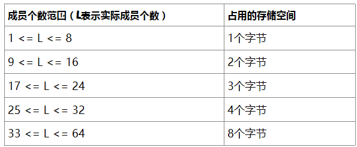
SET 类型在存储数据时成员个数越多，其占用的存储空间越大。注意：SET 类型在选取成员时，可以一次选择多个成员，这一点与 ENUM 类型不同。

```sql
CREATE TABLE test_set(
	s SET ('A', 'B', 'C')
);

#插入重复的SET类型成员时，MySQL会自动删除重复的成员
INSERT INTO test_set (s) VALUES ('A,B,C,A');
#向SET类型的字段插入SET成员中不存在的值时，MySQL会抛出错误。
INSERT INTO test_set (s) VALUES ('A,B,C,D');
```

```sql
CREATE TABLE temp_mul(
gender ENUM('男','女'),
hobby SET('吃饭','睡觉','打豆豆','写代码')
);

INSERT INTO temp_mul VALUES('男','睡觉,打豆豆'); #成功
# Data truncated for column 'gender' at row 1
INSERT INTO temp_mul VALUES('男,女','睡觉,写代码'); #失败
# Data truncated for column 'gender' at row 1
INSERT INTO temp_mul VALUES('妖','睡觉,写代码');#失败
INSERT INTO temp_mul VALUES('男','睡觉,写代码,吃饭'); #成功
```

### 6.9 二进制字符串类型

MySQL 中的二进制字符串类型主要存储一些二进制数据，比如可以存储图片、音频和视频等二进制数据。

MySQL 中支持的二进制字符串类型主要包括 BINARY、VARBINARY、TINYBLOB、BLOB、MEDIUMBLOB 和 LONGBLOB 类型。

#### 6.9.1 BINARY 与 VARBINARY 类型

BINARY 和 VARBINARY 类似于 CHAR 和 VARCHAR，只是它们存储的是二进制字符串。

BINARY (M)为固定长度的二进制字符串，M 表示最多能存储的字节数，取值范围是 0~255 个字符。如果未指定(M)，表示只能存储 1 个字节 。例如 BINARY (8)，表示最多能存储 8 个字节，如果字段值不足(M)个字节，将在右边填充'\0'以补齐指定长度。

VARBINARY (M)为可变长度的二进制字符串，M 表示最多能存储的字节数，总字节数不能超过行的字节长度限制 65535，另外还要考虑额外字节开销，VARBINARY 类型的数据除了存储数据本身外，还需要 1 或 2 个字节来存储数据的字节数。VARBINARY 类型 必须指定(M) ，否则报错。
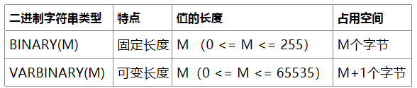

#### 6.9.2 BLOB 类型

BLOB 是一个 二进制大对象 ，可以容纳可变数量的数据。

MySQL 中的 BLOB 类型包括 TINYBLOB、BLOB、MEDIUMBLOB 和 LONGBLOB 4 种类型，它们可容纳值的最大长度不同。可以存储一个二进制的大对象，比如 图片 、 音频 和 视频等。

需要注意的是，在实际工作中，往往不会在 MySQL 数据库中使用 BLOB 类型存储大对象数据，通常会将图片、音频和视频文件存储到 服务器的磁盘上 ，并将图片、音频和视频的访问路径存储到 MySQL 中。
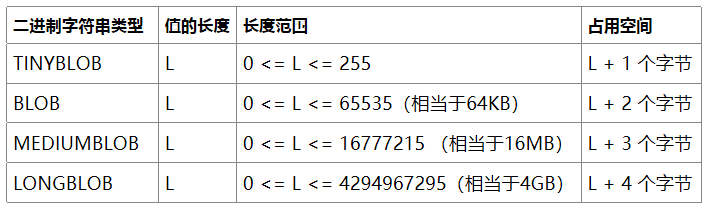

#### 6.9.3 TEXT 和 BLOB 的使用注意事项

- BLOB 和 TEXT 值也会引起自己的一些问题，特别是执行了大量的删除或更新操作的时候。删除这种值会在数据表中留下很大的" 空洞 "，以后填入这些"空洞"的记录可能长度不同。为了提高性能，建议定期使用 OPTIMIZE TABLE 功能对这类表进行 碎片整理 。
- 如果需要对大文本字段进行模糊查询，MySQL 提供了前缀索引 。但是仍然要在不必要的时候避免检索大型的 BLOB 或 TEXT 值。例如，SELECT \* 查询就不是很好的想法，除非你能够确定作为约束条件的 WHERE 子句只会找到所需要的数据行。否则，你可能毫无目的地在网络上传输大量的值。
- 把 BLOB 或 TEXT 列分离到单独的表中。在某些环境中，如果把这些数据列移动到第二张数据表中，可以让你把原数据表中的数据列转换为固定长度的数据行格式，那么它就是有意义的。这会减少主表中的碎片 ，得到固定长度数据行的性能优势。它还使你在主数据表上运行 SELECT \* 查询的时候不会通过网络传输大量的 BLOB 或 TEXT 值。

### 6.10 JSON 类型

JSON（JavaScript Object Notation）是一种轻量级的 数据交换格式 。简洁和清晰的层次结构使得 JSON 成为理想的数据交换语言。它易于人阅读和编写，同时也易于机器解析和生成，并有效地提升网络传输效率。JSON 可以将 JavaScript 对象中表示的一组数据转换为字符串，然后就可以在网络或者程序之间轻松地传递这个字符串，并在需要的时候将它还原为各编程语言所支持的数据格式。

在 MySQL 5.7 中，就已经支持 JSON 数据类型。在 MySQL 8.x 版本中，JSON 类型提供了可以进行自动验证的 JSON 文档和优化的存储结构，使得在 MySQL 中存储和读取 JSON 类型的数据更加方便和高效。 创建数据表，表中包含一个 JSON 类型的字段 js。

```sql
CREATE TABLE test_json(
	js json
);

INSERT INTO test_json (js)
VALUES ('{"name":"songhk", "age":18, "address":{"province":"beijing", "city":"beijing"}}');
```

当需要检索 JSON 类型的字段中数据的某个具体值时，可以使用`->`和`->>`符号。  
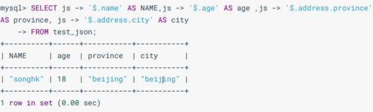

### 6.11 空间类型

MySQL 空间类型扩展支持地理特征的生成、存储和分析。这里的地理特征表示世界上具有位置的任何东西，可以是一个实体，例如一座山；可以是空间，例如一座办公楼；也可以是一个可定义的位置，例如一个十字路口等等。MySQL 中使用 Geometry（几何） 来表示所有地理特征。Geometry 指一个点或点的集合，代表世界上任何具有位置的事物。

MySQL 的空间数据类型（Spatial Data Type）对应于 OpenGIS 类，包括单值类型：GEOMETRY、POINT、LINESTRING、POLYGON 以及集合类型：MULTIPOINT、MULTILINESTRING、MULTIPOLYGON、GEOMETRYCOLLECTION 。

MULTIPOINT、MULTILINESTRING、MULTIPOLYGON、GEOMETRYCOLLECTION 是多个 Point、LineString 或 Polygon 组合而成。

- Geometry 是所有空间集合类型的基类，其他类型如 POINT、LINESTRING、POLYGON 都是 Geometry 的子类。
  - Point，顾名思义就是点，有一个坐标值。例如 POINT(121.213342 31.234532)，POINT(30 10)，坐标值支持 DECIMAL 类型，经度（longitude）在前，维度（latitude）在后，用空格分隔。
  - LineString，线，由一系列点连接而成。如果线从头至尾没有交叉，那就是简单的（simple）；如果起点和终点重叠，那就是封闭的（closed）。例如 LINESTRING(30 10,10 30,4040)，点与点之间用逗号分隔，一个点中的经纬度用空格分隔，与 POINT 格式一致。
  - Polygon，多边形。可以是一个实心平面形，即没有内部边界，也可以有空洞，类似纽扣。最简单的就是只有一个外边界的情况，例如 POLYGON((0 0,10 0,10 10, 0 10))。
  - 


### 6.12 小节及选择建议

在定义数据类型时，如果确定是整数，就用 INT；如果是小数，一定用定点数类型 DECIMAL(M,D) ； 如果是日期与时间，就用 DATETIME。

这样做的好处是，首先确保你的系统不会因为数据类型定义出错。不过，凡事都是有两面的，可靠性好，并不意味着高效。比如，TEXT 虽然使用方便，但是效率不如 CHAR(M) 和 VARCHAR(M)。

关于字符串的选择，建议参考如下阿里巴巴的《Java 开发手册》规范：
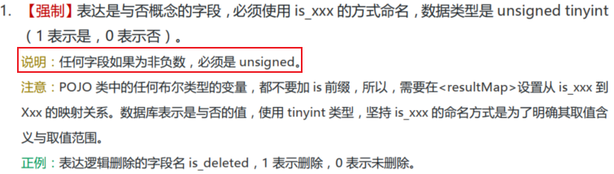
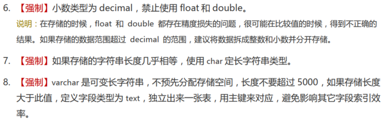

## 7. CRUD（表中数据操作）——DML

### 7.1 Insert 语句

#### 7.1.1 VALUES 的方式添加

```sql
INSERT INTO table_name(column1 [, column2, …, columnn])
VALUES
(value1 [,value2, …, valuen]),
(value1 [,value2, …, valuen]),
……
(value1 [,value2, …, valuen]);
```

- 添加的数据与字段类型须一致。
  - `'34'`这种字符型会自动转换，也能添加到`int`类型的字段中
- 数据长度不能超过字段设定的存储范围。
- 数据的添加数量、顺序须与字段的数量、顺序一致。
- 字符型和日期类型数据必须要用`''`包裹
- 字段可以插入空值`NULL`（前提是字段设置为允许为空）
- 给表中所有字段添加数据，可以不写前面的字段名称。数据的数量与顺序须与表定义时的一致。
- 如果某个字段未指定为`NOT NULL`，添加数据时如果没有给值，则会默认为`null`。
  - 如果需要设定有意义的默认值，则需要在定义表时，在字段声明后增加`NOT NULL DEAFULT 'XXX'`
- VALUES 也可以写成 VALUE ，但是 VALUES 是标准写法 d。
- 使用 INSERT 同时插入多条记录时，MySQL 会返回一些在执行单行插入时没有的额外信息，这些信息的含义如下：
  - Records：表明插入的记录条数。
  - Duplicates：表明插入时被忽略的记录，原因可能是这些记录包含了重复的主键值。
  - Warnings：表明有问题的数据值，例如发生数据类型转换。
- 一个同时插入多行记录的 INSERT 语句等同于多个单行插入的 INSERT 语句，但是多行的 INSERT 语句在处理过程中效率更高 。【批量插入优先】

#### 7.1.2 将查询结果插入到表中

INSERT 还可以将 SELECT 语句查询的结果插入到表中，此时不需要把每一条记录的值一个一个输入，只需要使用一条 INSERT 语句和一条 SELECT 语句组成的组合语句即可快速地从一个或多个表中向一个表中插入多行。

```sql
INSERT INTO 目标表名
(tar_column1 [, tar_column2, …, tar_columnn])
SELECT
(src_column1 [, src_column2, …, src_columnn])
FROM 源表名
[WHERE condition]
```

- 在 INSERT 语句中加入子查询。
- 不必书写 VALUES 子句。
- 子查询中的值列表应与 INSERT 子句中的列名对应。

#### 7.1.3 复制表数据

1. 从其他表拷贝数据：

```sql
INSERT INTO table_name1 (col1, col2, col3)
  SELECT col1, col2, col3 FROM table_name2;
```

- 如果 table_name1 和 table_name2 有一样的表结构，可以采用`INSERT INTO table_name1 SELECT * FROM table_name2;`
- `INSERT INTO table_name1 SELECT DISTINCT * FROM table_name2;`可以去重。

2. 自我复制（蠕虫复制）

```sql
INSERT INTO table_name
  SELECT * FROM table_name;
```

- 执行多次，可以创建`n×COUNT(*)`条数据。

### 7.2 Update 语句

```sql
UPDATE table_name
  SET col_name = expr[,col_name = expr……]
  [WHERE col_name = expr];
```

- 不写 WHERE 语句时，表示将该字段的所有值都修改。

### 7.3 Delete 语句

```sql
DELETE from table_name
  [WHERE col_name = expr];
```

- 不写 WHERE 语句时，表示清空表中数据。

## 8. Select 语句——DQL

### 8.1 基本语法

#### 8.1.1 没有子句

```sql
SELECT 1; #没有任何子句
SELECT 9/2; #没有任何子句
```

#### 8.1.2 有子句

```sql
SELECT 标识选择哪些列
FROM 标识从哪个表中选择
```

注意：在生产环境下，不推荐直接使用 SELECT \* 进行查询：

```sql
SELECT *
FROM departments;
```

#### 8.1.3 列的别名

- 重命名一个列
- 便于计算
- 紧跟列名，也可以在列名和别名之间加入关键字 AS，别名使用双引号，以便在别名中包含空格或特殊的字符并区分大小写。
- AS 可以省略
- 建议别名简短，见名知意

#### 8.1.4 去除重复行

在 SELECT 语句中使用关键字 DISTINCT 去除重复行

```sql
SELECT DISTINCT department_id, salary
FROM employees;
```

1. DISTINCT 需要放到所有列名的前面，如果写成`SELECT salary, DISTINCT department_id FROM employees` 会报错。
2. DISTINCT 其实是对后面所有列名进行组合去重，即去除 department_id+salary 组合后仍重复的行。

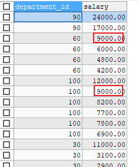

#### 8.1.5 空值参与运算

在 MySQL 里面， 空值不等于空字符串。一个空字符串的长度是 0，而一个空值的长度是空。而且，在 MySQL 里面，空值是占用空间的。所有运算符或列值遇到 null 值，运算的结果都为 null。

```sql
SELECT employee_id,salary,commission_pct, 12 * salary * (1 + commission_pct) "annual_sal"
FROM employees;
```

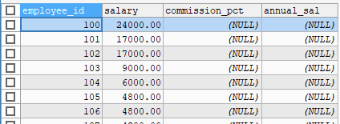

#### 8.1.5 着重号（```）

表中的字段、表名等没有和保留字、数据库系统或常用方法冲突，则需要在 SQL 语句中使用一对````（着重号）引起来。 否则会报错。


#### 8.1.6 查询常数

SELECT 查询还可以对常数进行查询，就是在 SELECT 查询结果中增加一列固定的常数列。这列的取值是指定的，而不是从数据表中动态取出的。

一般来说只从一个表中查询数据，通常不需要增加一个固定的常数列，但如果想整合不同的数据源，用常数列作为这个表的标记，就需要查询常数。

```sql
SELECT 'MySQL' AS corporation, last_name FROM employees;
```

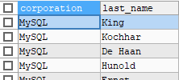

### 8.2 WHERE 过滤

语法：

```sql
SELECT 字段1,字段2
FROM 表名
WHERE 过滤条件
```

- 使用 WHERE 子句，将不满足条件的行过滤掉
- WHERE 子句紧随 FROM 子句

```sql
SELECT employee_id, last_name, job_id, department_id
FROM employees
WHERE department_id = 90 ;
```

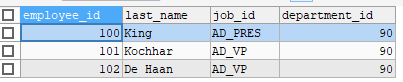

### 8.3 SELECT 的执行过程

#### 8.3.1 查询结构

```sql
SELECT ...,....,...
FROM ... JOIN ...
ON 多表的连接条件
JOIN ...
ON ...
WHERE 不包含组函数的过滤条件
AND/OR 不包含组函数的过滤条件
GROUP BY ...,...
HAVING 包含组函数的过滤条件
ORDER BY ... ASC/DESC
LIMIT ...,...
```

关键字顺序不能颠倒：`SELECT ... FROM ... WHERE ... GROUP BY ... HAVING ... ORDER BY ... LIMIT...`

#### 8.3.2 SELECT 执行顺序

在 MySQL 和 Oracle 中，SELECT 执行顺序基本相同：`FROM -> WHERE -> GROUP BY -> HAVING -> SELECT 的字段 -> DISTINCT -> ORDER BY -> LIMIT`
例如：

```sql
SELECT DISTINCT player_id, player_name, count(*) as num # 顺序 5
FROM player JOIN team ON player.team_id = team.team_id # 顺序 1
WHERE height > 1.80 # 顺序 2
GROUP BY player.team_id # 顺序 3
HAVING num > 2 # 顺序 4
ORDER BY num DESC # 顺序 6
LIMIT 2 # 顺序 7
```

在 SELECT 语句执行这些步骤的时候，每个步骤都会产生一个 虚拟表 ，然后将这个虚拟表传入下一个步骤中作为输入。

#### 8.3.3 SQL 的执行原理

SELECT 是先执行 FROM 这一步的。在这个阶段，如果是多张表联查，还会经历下面的几个步骤：

1. 先先通过 CROSS JOIN 求笛卡尔积，相当于得到虚拟表 vt（virtual table）1-1；
2. 通过 ON 进行筛选，在虚拟表 vt1-1 的基础上进行筛选，得到虚拟表 vt1-2；
3. 添加外部行。如果使用的是左连接、右链接或者全连接，就会涉及到外部行，也就是在虚拟表 vt1-2 的基础上增加外部行，得到虚拟表 vt1-3。

如果操作的是两张以上的表，还会重复上面的步骤，直到所有表都被处理完为止。这个过程得到是原始数据。

当拿到了查询数据表的原始数据，也就是最终的虚拟表 vt1 ，就可以在此基础上再进行 WHERE 阶段 。在这个阶段中，会根据 vt1 表的结果进行筛选过滤，得到虚拟表 vt2 。

然后进入第三步和第四步，也就是 GROUP 和 HAVING 阶段 。在这个阶段中，实际上是在虚拟表 vt2 的基础上进行分组和分组过滤，得到中间的虚拟表 vt3 和 vt4 。

当完成了条件筛选部分之后，就可以筛选表中提取的字段，也就是进入到 SELECT 和 DISTINCT 阶段 。

- 首先在 SELECT 阶段会提取想要的字段，然后在 DISTINCT 阶段过滤掉重复的行，分别得到中间的虚拟表 vt5-1 和 vt5-2 。
- 当提取了想要的字段数据之后，就可以按照指定的字段进行排序，也就是 ORDER BY 阶段 ，得到虚拟表 vt6 。

最后在 vt6 的基础上，取出指定行的记录，也就是 LIMIT 阶段 ，得到最终的结果，对应的是虚拟表 vt7 。

在写 SELECT 语句的时候，不一定存在所有的关键字，相应的阶段就会省略。同时因为 SQL 是一门类似英语的结构化查询语言，所以在写 SELECT 语句的时候，还要注意相应的关键字顺序。

所谓底层运行的原理，即上述执行顺序。

## 9. 运算符

### 9.1 算术运算

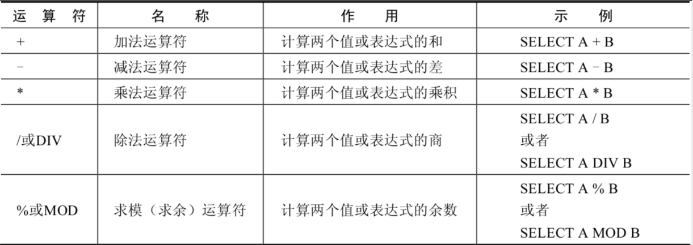

#### 9.1.1 加减运算

```sql
SELECT 100, 100 + 0, 100 - 0, 100 + 50, 100 + 50 -30, 100 + 35.5, 100 - 35.5
FROM dual;
```


- 一个整数类型的值对整数进行加法和减法操作，结果还是一个整数；
- 一个整数类型的值对浮点数进行加法和减法操作，结果是一个浮点数；
- 加法和减法的优先级相同，进行先加后减操作与进行先减后加操作的结果是一样的；
- 在 Java 中，+的左右两边如果有字符串，那么表示字符串的拼接。但是在 MySQL 中+只表示数值相加。如果遇到非数值类型，先尝试转成数值，如果转失败，就按 0 计算。（补充：MySQL 中字符串拼接要使用字符串函数 CONCAT()实现）

#### 9.1.2 乘除运算

SELECT 100, 100 * 1, 100 * 1.0, 100 / 1.0, 100 / 2,100 + 2 * 5 / 2,100 /3, 100 DIV 0
FROM DUAL;

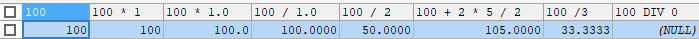

- 一个数乘以整数 1 和除以整数 1 后仍得原数；
- 一个数乘以浮点数 1 和除以浮点数 1 后变成浮点数，数值与原数相等；
- 一个数除以整数后，不管是否能除尽，结果都为一个浮点数；
- 一个数除以另一个数，除不尽时，结果为一个浮点数，并保留到小数点后 4 位；
- 乘法和除法的优先级相同，进行先乘后除操作与先除后乘操作，得出的结果相同。
- 在数学运算中，0 不能用作除数，在 MySQL 中，一个数除以 0 为 NULL。

#### 9.1.1 求模（求余）运算

```sql
SELECT 12 % 3, 12 MOD 5 FROM dual;
```

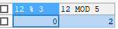

### 9.2 比较运算

比较运算符用来对表达式左边的操作数和右边的操作数进行比较，比较的结果为真则返回 1，比较的结果为假则返回 0，其他情况则返回 NULL。
比较运算符经常被用来作为 SELECT 查询语句的条件来使用，返回符合条件的结果记录。


#### 9.2.1 等号

```sql
SELECT 1 = 1, 1 = '1', 1 = 0, 'a' = 'a', (5 + 3) = (2 + 6), '' = NULL , NULL = NULL;
```

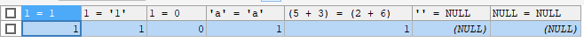

- 等号运算符（=）判断等号两边的值、字符串或表达式是否相等，如果相等则返回 1，不相等则返回 0。
- 在使用等号运算符时，遵循如下规则：
  - 如果等号两边的值、字符串或表达式都为字符串，则 MySQL 会按照字符串进行比较，其比较的是每个字符串中字符的 ANSI 编码是否相等。
  - 如果等号两边的值都是整数，则 MySQL 会按照整数来比较两个值的大小。
  - 如果等号两边的值一个是整数，另一个是字符串，则 MySQL 会将字符串转化为数字进行比较。
  - 如果等号两边的值、字符串或表达式中有一个为 NULL，则比较结果为 NULL。

```sql
SELECT 1 = 2, 0 = 'abc', 1 = 'abc' FROM DUAL;
```

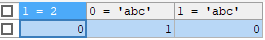

#### 9.2.2 安全等于运算符

安全等于运算符`<=>`与等于运算符`=`的作用是相似的， 唯一的区别 是`<=>`可以用来对 NULL 进行判断。
在两个操作数均为 NULL 时，其返回值为 1，而不为 NULL；当一个操作数为 NULL 时，其返回值为 0，而不为 NULL。

```sql
SELECT 1 <=> '1', 1 <=> 0, 'a' <=> 'a', (5 + 3) <=> (2 + 6), '' <=> NULL, NULL<=> NULL FROM DUAL;
```


#### 9.2.3 不等于运算符

不等于运算符（<>和!=）用于判断两边的数字、字符串或者表达式的值是否不相等，如果不相等则返回 1，相等则返回 0。不等于运算符不能判断 NULL 值。
如果两边的值有任意一个为 NULL，或两边都为 NULL，则结果为 NULL。

```sql
SELECT 1 <> 1, 1 != 2, 'a' != 'b', (3+4) <> (2+6), 'a' != NULL, NULL <> NULL;
```


### 9.3 关键字运算

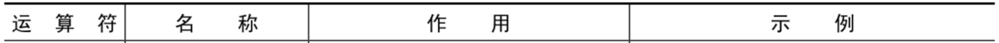


#### 

9.3.1 空运算符
空运算符（IS NULL 或者 ISNULL）判断一个值是否为 NULL，如果为 NULL 则返回 1，否则返回 0。

```sql
SELECT NULL IS NULL, ISNULL(NULL), ISNULL('a'), 1 IS NULL;
```


#### 9.3.2 非空运算符

非空运算符（IS NOT NULL）判断一个值是否不为 NULL，如果不为 NULL 则返回 1，否则返回 0。

```sql
SELECT NULL IS NOT NULL, 'a' IS NOT NULL, 1 IS NOT NULL;
```


#### 9.3.3 最小值运算符

语法格式为：LEAST(值 1，值 2，...，值 n)。其中“值 n”表示参数列表中有 n 个值。在有两个或多个参数的情况下，返回最小值。

```sql
SELECT LEAST (1,0,2), LEAST('b','a','c'), LEAST(1,NULL,2);
```


#### 9.3.4 最大值运算符

语法格式为：GREATEST(值 1，值 2，...，值 n)。其中，n 表示参数列表中有 n 个值。当有两个或多个参数时，返回值为最大值。假如任意一个自变量为 NULL，则 GREATEST()的返回值为 NULL。

```sql
SELECT GREATEST(1,0,2), GREATEST('b','a','c'), GREATEST(1,NULL,2);
```


#### 9.3.5 BETWEEN AND 运算符

BETWEEN 运算符使用的格式通常为 SELECT D FROM TABLE WHERE C BETWEEN A AND B，此时，当 C 大于或等于 A，并且 C 小于或等于 B 时，结果为 1，否则结果为 0。


#### 9.3.6 IN 运算符

IN 运算符用于判断给定的值是否是 IN 列表中的一个值，如果是则返回 1，否则返回 0。如果给定的值为 NULL，或者 IN 列表中存在 NULL，则结果为 NULL。


#### 9.3.7 NOT IN 运算符

NOT IN 运算符用于判断给定的值是否不是 IN 列表中的一个值，如果不是 IN 列表中的一个值，则返回 1，否则返回 0。


#### 9.3.8 LIKE 运算符

LIKE 运算符主要用来匹配字符串，通常用于模糊匹配，如果满足条件则返回 1，否则返回 0。如果给定的值或者匹配条件为 NULL，则返回结果为 NULL。


- `%`：匹配 0 个或多个字符。
  - 
- `_`：只能匹配一个字符。
  - 

#### 9.3.9 ESCAPE

如果使用`\`表示转义，要省略 ESCAPE。如果不用`\`，则要加上 ESCAPE。


#### 9.3.10 REGEXP 运算符

用来匹配字符串，语法格式为： `expr REGEXP 匹配条件 `。如果 expr 满足匹配条件，返回 1；如果不满足，则返回 0。若 expr 或匹配条件任意一个为 NULL，则结果为 NULL。

- `^`匹配以该字符后面的字符开头的字符串。
- `$`匹配以该字符前面的字符结尾的字符串。
- `.`匹配任何一个单字符。
- `[...]`匹配在方括号内的任何字符。例如，[abc]匹配 a 或 b 或 c。为了命名字符的范围，使用一个`-`。[a-z]匹配任何字母，[0-9]匹配任何数字。
- `*`匹配零个或多个在它前面的字符。例如，`x*`匹配任何数量的 x 字符；`[0-9]*`匹配任何数量的数字；`*`匹配任何数量的任何字符。


### 9.4 逻辑运算符

逻辑运算符的返回结果为 1、0 或者 NULL。


#### 9.4.1 逻辑非（NOT 或!）

表示当给定的值为 0 时返回 1；当给定的值为非 0 值时返回 0；当给定的值为 NULL 时，返回 NULL。


#### 9.4.2 逻辑与（AND 或&&）

当给定的所有值均为非 0 值，并且都不为 NULL 时，返回 1；当给定的一个值或者多个值为 0 时则返回 0；否则返回 NULL。


#### 9.4.3 逻辑或（OR 或||）

当给定的值都不为 NULL，并且任何一个值为非 0 值时，则返回 1，否则返回 0；当一个值为 NULL，并且另一个值为非 0 值时，返回 1，否则返回 NULL；当两个值都为 NULL 时，返回 NULL。

OR 可以和 AND 一起使用，但是 AND 的优先级高于 OR。 因此先对 AND 两边的操作数进行操作，再与 OR 中的操作数结合。

#### 9.4.4 逻辑异或（XOR）

当给定的值中任意一个值为 NULL 时，则返回 NULL；如果两个非 NULL 的值都是 0 或者都不等于 0 时，则返回 0；如果一个值为 0，另一个值不为 0 时，则返回 1。


### 9.5 位运算符

位运算符会先将操作数变成二进制数，然后进行位运算，最后将计算结果从二进制变回十进制数。  


#### 9.5.1 按位与（&）

将给定值对应的二进制数逐位进行逻辑与运算。当给定值对应的二进制位的数值都为 1 时，则该位返回 1，否则返回 0。


#### 9.5.2 按位或（|）

将给定的值对应的二进制数逐位进行逻辑或运算。当给定值对应的二进制位的数值有一个或两个为 1 时，则该位返回 1，否则返回 0。


#### 9.5.3 按位异或（^）

将给定的值对应的二进制数逐位进行逻辑异或运算。当给定值对应的二进制位的数值不同时，则该位返回 1，否则返回 0。


#### 9.5.4 按位取反（~）

将给定的值的二进制数逐位进行取反操作，即将 1 变为 0，将 0 变为 1。


#### 9.5.6 按位右移（>>）

将给定的值的二进制数的所有位右移指定的位数。右移指定的位数后，右边低位的数值被移出并丢弃，左边高位空出的位置用 0 补齐。


#### 9.5.7 按位左移（<<）

将给定的值的二进制数的所有位左移指定的位数。左移指定的位数后，左边高位的数值被移出并丢弃，右边低位空出的位置用 0 补齐。


### 9.6 运算符的优先级


### 9.7 正则表达式


## 10. 排序和分页

### 10.1 排序

1. 排序规则：
   - 使用 ORDER BY 子句排序
     - ASC（ascend）：升序
     - DESC（descend）：降序
   - 可以使用不在 SELECT 列表中的列排序。
   - 在对多列进行排序的时候，首先排序的第一列必须有相同的列值，才会对第二列进行排序。如果第一列数据中所有值都是唯一的，将不再对第二列进行排序。
2. 单列排序：

```sql
SELECT last_name, job_id, department_id, hire_date
FROM employees
ORDER BY hire_date DESC ;
```


3. 多列排序

```sql
SELECT last_name, department_id, salary
FROM employees
ORDER BY department_id, salary DESC;
```


### 10.2 分页

1. 分页原理：所谓分页显示，就是将数据库中的结果集，一段一段显示出来需要的条件。
2. 格式：`LIMIT [位置偏移量,] 行数`
   - 第一个“位置偏移量”参数指示 MySQL 从哪一行开始显示，是一个可选参数，如果不指定“位置偏移量”，将会从表中的第一条记录开始（第一条记录的位置偏移量是 0，第二条记录的位置偏移量是 1，以此类推）；第二个参数“行数”指示返回的记录条数。

```sql
-- 前10条记录：
SELECT * FROM 表名 LIMIT 0,10;
-- 或者
SELECT * FROM 表名 LIMIT 10;
-- 第11至20条记录：
SELECT * FROM 表名 LIMIT 10,10;
-- 第21至30条记录：
SELECT * FROM 表名 LIMIT 20,10;
```

3. MySQL 8.0 中可以使用“LIMIT 3 OFFSET 4”，和“LIMIT4,3”返回的结果相同，意思是获取从5 条记录开始后面的 3 条记录。
4. 分页显式公式：`（当前页数-1）*每页条数，每页条数`
5. LIMIT 子句必须放在整个 SELECT 语句的最后。
6. 使用 LIMIT 的好处：
   - 约束返回结果的数量可以 减少数据表的网络传输量 ，也可以提升查询效率 。
   - 如果我们知道返回结果只有 1 条，就可以使用 LIMIT 1 ，告诉 SELECT 语句只需要返回一条记录即可。
   - 这样的好处就是 SELECT 不需要扫描完整的表，只需要检索到一条符合条件的记录即可返回。

### 10.3 其他 DMS 中的分页查询关键字

在 MySQL、PostgreSQL、MariaDB 和 SQLite 中使用 LIMIT 关键字，而且需要放到 SELECT 语句的最后面。
如果是 SQL Server 和 Access，需要使用 `TOP`关键字，比如：

```sql
SELECT TOP 5 name, hp_max FROM heros ORDER BY hp_max DESC
```

如果是 DB2，使用 `FETCH FIRST 5 ROWS ONLY` 这样的关键字：

```sql
SELECT name, hp_max FROM heros ORDER BY hp_max DESC FETCH FIRST 5 ROWS ONLY
```

如果是 Oracle，你需要基于 `ROWNUM `来统计行数：

```sql
SELECT rownum,last_name,salary FROM employees WHERE rownum < 5 ORDER BY salary DESC;
```

需要说明的是，这条语句是先取出来前 5 条数据行，然后再按照 hp_max 从高到低的顺序进行排序。但这样产生的结果和上述方法的并不一样。【没看懂】

## 11. 单行函数

### 11.1 概述

在 SQL 语言中，函数包括内置函数和自定义函数。内置函数是系统内置的通用函数，而自定义函数是根据自己的需要编写的函数。

在使用 SQL 语言的时候，不是直接和这门语言打交道，而是通过它使用不同的数据库软件，即 DBMS。DBMS 之间的差异性很大，远大于同一个语言不同版本之间的差异。实际上，只有很少的函数是被 DBMS 同时支持的。比如，大多数 DBMS 使用（||）或者（+）来做拼接符，而在 MySQL 中的字符串拼接函数为 concat()。大部分 DBMS 会有自己特定的函数，这就意味着采用 SQL 函数的代码可移植性是很差的，因此在使用函数的时候需要特别注意。

MySQL 提供的内置函数从实现的功能角度可以分为数值函数、字符串函数、日期和时间函数、流程控制函数、加密与解密函数、获取 MySQL 信息函数、聚合函数等。

- 单行函数
  - 操作数据对象
  - 接受参数返回一个结果
  - 只对一行进行变换
  - 每行返回一个结果
  - 可以嵌套
  - 参数可以是一列或一个值


### 11.2 数值函数

#### 11.2.1 基本函数


#### 11.2.2 角度与弧度互换函数


#### 12.2.3 三角函数


ATAN2(M,N)与与 ATAN(X)的对比：例如有两个点 point(x1,y1)和 point(x2,y2)，使用 ATAN(X)函数计算反正切值为 ATAN((y2-y1)/(x2-x1))，使用 ATAN2(M,N)计算反正切值则为 ATAN2(y2-y1,x2-x1)。当 x2-x1 等于 0 时，ATAN(X)函数会报错，而 ATAN2(M,N)函数则仍然可以计算。


#### 12.2.4 指数与对数


#### 12.2.5 进制间转换


### 11.3 字符串函数


注意：MySQL 中，字符串的位置是从 1 开始的。


### 11.4 日期和时间函数

#### 11.4.1 获取日期、时间


#### 11.4.2 日期与时间戳的转换


#### 11.4.3 获取月份、星期、星期数、天数等函数


#### 11.4.4 日期操作


type 取值及含义：


#### 11.4.5 时间和秒钟转换


#### 11.4.6 计算日期和时间

##### 11.4.6.1 第一组


type 取值及含义：


##### 11.4.6.2 第二组


举例：查询 7 天内的新增用户数有多少？

```sql
SELECT COUNT(*) as num FROM new_user WHERE TO_DAYS(NOW())-TO_DAYS(regist_time)<=7
```

##### 11.4.6.3 日期的格式化与解析


上述 非 GET_FORMAT 函数中 fmt 参数常用的格式符：

GET_FORMAT 函数中 date_type 和 format_type 参数取值：


### 11.5 流程控制函数

流程处理函数可以根据不同的条件，执行不同的处理流程，可以在 SQL 语句中实现不同的条件选择。

MySQL 中的流程处理函数主要包括 IF()、IFNULL()和 CASE()函数。


```sql
SELECT employee_id,salary, CASE WHEN salary>=15000 THEN '高薪'
				WHEN salary>=10000 THEN '潜力股'
				WHEN salary>=8000 THEN '屌丝'
				ELSE '草根' END "描述"
FROM employees;
```


### 11.6 加密与解密函数

加密与解密函数主要用于对数据库中的数据进行加密和解密处理，以防止数据被他人窃取。这些函数在保证数据库安全时非常有用。

ENCODE(value,password_seed)函数与 DECODE(value,password_seed)函数互为反函数。


### 11.7 信息函数

主要用于帮助数据库开发或运维人员更好地对数据库进行维护工作。


### 11.8 其他函数

不方便分类，但开发和运维中很常用。


## 12. 多表查询（关联查询）

前提条件：这些一起查询的表之间是有关系的（一对一、一对多），它们之间一定是有关联字段，这个关联字段可能建立了外键，也可能没有建立外键。比如：员工表和部门表，这两个表依靠“部门编号”进行关联。

### 12.1 笛卡尔积（交叉连接）

1. `SELECT * FROM table1, table2`：
   - 该种情况下，会取出 table1 的每一行与 table2 的每一行组合进行显示，显示的行数为 table1 的行数 ×table2 的行数，称为笛卡尔积
   - table1 和 table2 共有的 col，需要使用`table1.col`的方式指定是哪个表的 col 列，否则会报错。
   - 多表查询的条件（WHERE）不能少于`表的个数-1`，否则会出现笛卡尔积。
2. 笛卡尔积也称为 交叉连接 ，英文是 CROSS JOIN 。
3. 即使两个表不相关，如下语句也能出现笛卡尔积：

```sql
#案例：查询员工的姓名及其部门名称
SELECT last_name, department_name
FROM employees, departments
WHERE employees.department_id = departments.department_id;
```

4. 笛卡尔积的错误会在下面条件下产生：
   - 省略多个表的连接条件（或关联条件）
   - 连接条件（或关联条件）无效
   - 所有表中的所有行互相连接
5. 为了避免笛卡尔积， 可以在 WHERE 加入有效的连接条件。

### 12.2 等值连接 vs 非等值连接

#### 12.2.1 等值连接

1. 等值连接即多表查询的 WHERE 条件使用等号判断。
2. 由于避免 n 个表笛卡尔积需要 n-1 个条件，所以其他等值的条件可以使用 AND 操作符。
3. 多个表中有相同列时，必须在列名之前加上表名前缀。

```sql
SELECT employees.last_name, departments.department_name,employees.department_id
FROM employees, departments
WHERE employees.department_id = departments.department_id;
```

4. 使用表的别名可以简化查询，同时可以提高查询效率。
   - 如果使用了表的别名，在查询字段中、过滤条件中就只能使用别名进行代替，不能使用原有的表名，否则就会报错。

```sql
SELECT e.employee_id, e.last_name, e.department_id,
			 d.department_id, d.location_id
FROM employees e , departments d
WHERE e.department_id = d.department_id;
```


#### 12.2.2 非等值连接

非等值连接即多表查询的 WHERE 条件`=`变为其他符号，如：

```sql
SELECT e.last_name, e.salary, j.grade_level
FROM employees e, job_grades j
WHERE e.salary BETWEEN j.lowest_sal AND j.highest_sal;
```

### 12.3 自连接 VS 非自连接

#### 12.3.1 自连接

1. 含义：在同一个表查询该表内的多个数据进行显示。
2. 原理：给表起个别名，把它当成多个表，然后用`别名.col`指定多个查询列，进行多表查询
   - 这里只有 emp 一个表，给表起了个 worker 和 boss 两个名字

```sql
SELECT CONCAT(worker.last_name ,'works for', manager.last_name)
FROM employees worker, employees manager
WHERE worker.manager_id = manager.employee_id ;
```


3. 特点：
   - 把同一张表当作两张表使用
   - 需要给表取别名
   - 可以给查询的列取别名。

#### 12.3.2 非自连接

即不同的表查询。

### 12.4 内连接 VS 外连接

#### 12.4.1 内连接

1. 内连接：合并具有同一列的两个以上的表的行，结果集中不包含一个表与另一个表不匹配的行。（不显示不匹配的行）
2. 语法结构：
    ```sql
    SELECT 字段列表
    FROM A表 INNER JOIN B表
    ON 关联条件
    WHERE 等其他子句;
    ```
    - 关键字 JOIN、INNER JOIN、CROSS JOIN 的含义是一样的，都表示内连接。
3. 案例 1，两个表。

```sql
SELECT e.employee_id, e.last_name, e.department_id, d.department_id, d.location_id
FROM employees e JOIN departments d
ON (e.department_id = d.department_id);
```


4. 案例 2，三个表。

```sql
SELECT employee_id, city, department_name
FROM employees e
JOIN departments d
ON d.department_id = e.department_id
JOIN locations l
ON d.location_id = l.location_id;
```


#### 12.4.2 外连接

1. 出现背景：笛卡尔积筛选的数据会根据关联条件匹配，如果关联条件一个表有，另一个表没有，那么就会匹配不上，就不会显示该条数据。（即内连接的情况）
2. 外连接：两个表在连接过程中除了返回满足连接条件的行以外还返回左（或右）表中不满足条件的行，这种连接称为左（或右）外连接。没有匹配的行时, 结果表中相应的列为空(NULL)。
   - 如果是左外连接，则连接条件中左边的表也称为主表 ，右边的表称为从表。
   - 如果是右外连接，则连接条件中右边的表也称为主表 ，左边的表称为从表。
3. 左外连接：左侧表完全显示。
   - left join 和 left outer join 相同
   - A 表完全显示。

```sql
SELECT 字段列表
FROM A表 LEFT JOIN B表
ON 关联条件
WHERE 等其他子句;
```

4. 右外连接：右侧表完全显示。
   - right join 和 right outer join 相同
   - B 表完全显示。

```sql
SELECT 字段列表
FROM A表 RIGHT JOIN B表
ON 关联条件
WHERE 等其他子句;
```

5. 在 SQL92 中采用（+）代表从表所在的位置，但是 MySQL 不支持这种写法，Oracle 可以。LEFT JOIN 和 RIGHT JOIN 只存在于 SQL99 及以后的标准中，在 SQL92 中不存在，只能用 (+) 表示。

```sql
#左外连接
SELECT last_name,department_name
FROM employees ,departments
WHERE employees.department_id = departments.department_id(+);
#右外连接
SELECT last_name,department_name
FROM employees ,departments
WHERE employees.department_id(+) = departments.department_id;
```

6. 满外连接：
   - 满外连接的结果 = 左右表匹配的数据 + 左表没有匹配到的数据 + 右表没有匹配到的数据。
   - SQL99 是支持满外连接，使用 FULL JOIN 或 FULL OUTER JOIN 来实现。
   - MySQL 可以用`LEFT JOIN UNION RIGHT JOIN`语法代替。


### 12.5 UNION 合并查询结果

1. 作用：合并多条 SELECT 单表查询语句的结果，进行多行显示。合并时，两个表对应的列数和数据类型必须相同，并且相互对应。
2. 语法：
    ```sql
    SELECT column,... FROM table1
    UNION [ALL]
    SELECT column,... FROM table2
    ```
    - `UNION`：查询结果会去重。
    - `UNION ALL`：查询结果不会去重。
    - 执行 UNION ALL 语句时所需要的资源比 UNION 语句少。如果明确知道合并数据后的结果数据不存在重复数据，或者不需要去除重复的数据，则尽量使用 UNION ALL 语句，以提高数据查询的效率。

### 12.6 SQL99 扩展

#### 12.6.1 自然连接

SQL99 在 SQL92 的基础上提供了一些特殊语法，比如 NATURAL JOIN 用来表示自然连接。可以把自然连接理解为 SQL92 中的等值连接。它会帮你自动查询两张连接表中 所有相同的字段 ，然后进行等值连接 。

SQL92：

```sql
SELECT employee_id,last_name,department_name
FROM employees e JOIN departments d
ON e.`department_id` = d.`department_id`
AND e.`manager_id` = d.`manager_id`;
```

SQL99：

```sql
SELECT employee_id,last_name,department_name
FROM employees e NATURAL JOIN departments d;
```


#### 12.6.2 USING 连接

SQL99 还支持使用 USING 指定数据表里的 同名字段 进行等值连接。但是只能配合 JOIN 一起使用。比如：

```sql
SELECT employee_id,last_name,department_name
FROM employees e JOIN departments d
USING (department_id);
```


与自然连接 NATURAL JOIN 不同的是，USING 指定了具体的相同的字段名称，USING 的括号()中填入要指定的同名字段。同时使用 JOIN...USING 可以简化 JOIN ON 的等值连接。它与下面的 SQL 查询结果是相同的：

```sql
SELECT employee_id,last_name,department_name
FROM employees e ,departments d
WHERE e.department_id = d.department_id;
```

### 12.7 小结

1. 表连接的约束条件可以有三种方式：WHERE, ON, USING
   - WHERE：适用于所有关联查询。
   - ON ：只能和 JOIN 一起使用，只能写关联条件。虽然关联条件可以并到 WHERE 中和其他条件一起写，但分开写可读性更好。
   - USING：只能和 JOIN 一起使用，而且要求两个关联字段在关联表中名称一致，而且只能表示关联字段值相等。
2. 常用多表查询语句：


```sql
#左上图：左外连接
SELECT employee_id,last_name,department_name
FROM employees e LEFT JOIN departments d
ON e.`department_id` = d.`department_id`;
#右上图：右外连接
SELECT employee_id,last_name,department_name
FROM employees e RIGHT JOIN departments d
ON e.`department_id` = d.`department_id`;
#左中图：A - A∩B
SELECT employee_id,last_name,department_name
FROM employees e LEFT JOIN departments d
ON e.`department_id` = d.`department_id`
WHERE d.`department_id` IS NULL
#中图：内连接 A∩B
SELECT employee_id,last_name,department_name
FROM employees e JOIN departments d
ON e.`department_id` = d.`department_id`;
#右中图：B-A∩B
SELECT employee_id,last_name,department_name
FROM employees e RIGHT JOIN departments d
ON e.`department_id` = d.`department_id`
WHERE e.`department_id` IS NULL
#左下图：满外连接
# 左中图 + 右上图 A∪B
SELECT employee_id,last_name,department_name
FROM employees e LEFT JOIN departments d
ON e.`department_id` = d.`department_id`
WHERE d.`department_id` IS NULL
UNION ALL #没有去重操作，效率高
SELECT employee_id,last_name,department_name
FROM employees e RIGHT JOIN departments d
ON e.`department_id` = d.`department_id`;
#右下图
#左中图 + 右中图 A ∪B- A∩B 或者 (A - A∩B) ∪ （B - A∩B）
SELECT employee_id,last_name,department_name
FROM employees e LEFT JOIN departments d
ON e.`department_id` = d.`department_id`
WHERE d.`department_id` IS NULL
UNION ALL
SELECT employee_id,last_name,department_name
FROM employees e RIGHT JOIN departments d
ON e.`department_id` = d.`department_id`
WHERE e.`department_id` IS NULL
```

## 13. 聚合函数

做聚合（或聚集、分组）函数是对一组数据进行汇总的函数，输入的是一组数据的集合，输出的是单个值。

聚合函数不能嵌套调用。比如不能出现类似“AVG(SUM(字段名称))”形式的调用。

### 13.1 数学计算函数

#### 13.1.1 AVG 和 SUM

可以对数值型数据使用 AVG 和 SUM 函数

```sql
SELECT AVG(salary), MAX(salary),MIN(salary), SUM(salary)
FROM employees
WHERE job_id LIKE '%REP%';
```


#### 13.1.2 MIN 和 MAX

可以对任意数据类型的数据使用 MIN 和 MAX 函数。

```sql
SELECT MIN(hire_date), MAX(hire_date)
FROM employees;
```


#### 11.3.3 COUNT

COUNT(\*)返回表中记录总数，适用于任意数据类型。

COUNT(field) 返回 expr 不为空的记录总数。

- count(\*)，count(1)，count(列名）的对比：
  - 对于 MyISAM 引擎的表是没有区别的。这种引擎内部有一计数器在维护着行数。
  - Innodb 引擎的表用 count(\*),count(1)直接读行数，复杂度是 O(n)，因为 innodb 真的要去数一遍。但好于具体的 count(列名) 。
- 能不能使用 count(列名)替换 count(\*)?
  - 不能，count(\*) 是 SQL92 定义的标准统计行数的语法，跟数据库无关，跟 NULL 和非 NULL 无关。
  - count(\*)会统计值为 NULL 的行，而 count(列名)不会统计此列为 NULL 值的行。

### 13.2 GROUP BY

#### 13.2.1 基本使用

可以使用 GROUP BY 子句将表中的数据分成若干组：

```sql
SELECT column, group_function(column)
FROM table
[WHERE condition]
[GROUP BY group_by_expression]
[ORDER BY column];
```

WHERE 一定放在 FROM 后面。

在 SELECT 列表中所有未包含在组函数中的列都应该包含在 GROUP BY 子句中。

```sql
SELECT department_id, AVG(salary)
FROM employees
GROUP BY department_id ;
```


包含在 GROUP BY 子句中的列不必包含在 SELECT 列表中。

```sql
SELECT AVG(salary)
FROM employees
GROUP BY department_id ;
```


#### 13.2.2 使用多个列分组

```sql
SELECT department_id dept_id, job_id, SUM(salary)
FROM employees
GROUP BY department_id, job_id ;
```


#### 13.2.3 GROUP BY 中使用 WITH ROLLUP

使用 WITH ROLLUP 关键字之后，在所有查询出的分组记录之后增加一条记录，该记录计算查询出的所有记录的总和，即统计记录数。

```sql
SELECT department_id,AVG(salary)
FROM employees
WHERE department_id > 80
GROUP BY department_id WITH ROLLUP;
```


当使用 ROLLUP 时，不能同时使用 ORDER BY 子句进行结果排序，即 ROLLUP 和 ORDER BY 是互相排斥。

### 13.3 HAVING

#### 13.3.1 基本使用

使用前提：

1. 行已经被分组。
2. 使用了聚合函数。
3. 满足 HAVING 子句中条件的分组将被显示。
4. HAVING 不能单独使用，必须要跟 GROUP BY 一起使用。

```sql
SELECT department_id, MAX(salary)
FROM employees
GROUP BY department_id
HAVING MAX(salary)>10000 ;
```


不能在 WHERE 子句中使用聚合函数，会报错：

```sql
SELECT department_id, AVG(salary)
FROM employees
WHERE AVG(salary) > 8000
GROUP BY department_id;
```

#### 13.3.2 WHERE 和 HAVING 的对比

- 区别 1：
  - WHERE 可以直接使用表中的字段作为筛选条件，但不能使用分组中的计算函数作为筛选条件；
  - HAVING 必须要与 GROUP BY 配合使用，可以把分组计算的函数和分组字段作为筛选条件。
  - 这决定了，在需要对数据进行分组统计的时候，HAVING 可以完成 WHERE 不能完成的任务。这是因为，在查询语法结构中，WHERE 在 GROUP BY 之前，所以无法对分组结果进行筛选。HAVING 在 GROUP BY 之后，可以使用分组字段和分组中的计算函数，对分组的结果集进行筛选，这个功能是 WHERE 无法完成的。另外，WHERE 排除的记录不再包括在分组中。
- 区别 2：
  - 如果需要通过连接从关联表中获取需要的数据，WHERE 是先筛选后连接，而 HAVING 是先连接后筛选。
  - 这一点，就决定了在关联查询中，WHERE 比 HAVING 更高效。因为 WHERE 可以先筛选，用一个筛选后的较小数据集和关联表进行连接，这样占用的资源比较少，执行效率也比较高。HAVING 则需要先把结果集准备好，也就是用未被筛选的数据集进行关联，然后对这个大的数据集进行筛选，这样占用的资源就比较多，执行效率也较低。  
    | 优点 | 缺点 | |
    | --- | --- | --- |
    | WHERE | 先筛选数据再关联，执行效率高 | 不能使用分组中的计算函数进行筛选 |
    | HAVING | 可以使用分组中的计算函数 | 在最后的结果集中进行筛选，执行效率较低 |

开发中的选择：

WHERE 和 HAVING 也不是互相排斥的，我们可以在一个查询里面同时使用 WHERE 和 HAVING。包含分组统计函数的条件用 HAVING，普通条件用 WHERE。这样，我们就既利用了 WHERE 条件的高效快速，又发挥了 HAVING 可以使用包含分组统计函数的查询条件的优点。当数据量特别大的时候，运行效率会有很大的差别。

## 14. 子查询

### 14.1 基本使用

子查询指嵌入在其他 sql 语句中的 select 语句，也叫嵌套查询。


- 子查询（内查询）在主查询之前一次执行完成。
- 子查询的结果被主查询（外查询）使用 。
- 子查询要包含在括号内。
- 将子查询放在比较条件的右侧。
- 单行操作符对应单行子查询，多行操作符对应多行子查询。

### 14.2 单行子查询

#### 14.2.1 基本使用

子查询只返回一行数据的查询语句。

假如要查询部门中谁的工资比 Abel 高，有三种方式：

```sql
#方式一分步查询：
SELECT salary
FROM employees
WHERE last_name = 'Abel';
SELECT last_name,salary
FROM employees
WHERE salary > 11000;
#方式二：自连接
SELECT e2.last_name,e2.salary
FROM employees e1,employees e2
WHERE e1.last_name = 'Abel'
AND e1.`salary` < e2.`salary`
#方式三：子查询
SELECT last_name,salary
FROM employees
WHERE salary > (
  SELECT salary
  FROM employees
  WHERE last_name = 'Abel'
);
```


#### 14.2.2 HAVING 中的子查询

首先执行子查询，其次向主查询中的 HAVING 子句返回结果。

查询最低工资大于 50 号部门最低工资的部门 id 和其最低工资：

```sql
SELECT department_id, MIN(salary)
FROM employees
GROUP BY department_id
HAVING MIN(salary) >
                    (SELECT MIN(salary)
                    FROM employees
                    WHERE department_id = 50);
```


#### 14.2.4 CASE 中的子查询

在 CASE 表达式中使用单列子查询：

显示员工的 employee_id,last_name 和 location。其中，若员工 department_id 与 location_id 为 1800 的 department_id 相同，则 location 为’Canada’，其余则为’USA’。

```sql
SELECT employee_id, last_name,
  (CASE department_id
  	WHEN
      (SELECT department_id FROM departments
    		WHERE location_id = 1800)
    THEN 'Canada' ELSE 'USA' END) location
FROM employees;
```


#### 14.2.5 子查询中的空值

子查询不返回任何行

```sql
SELECT last_name, job_id
FROM employees
WHERE job_id =
              (SELECT job_id
              FROM employees
              WHERE last_name = 'Haas');
```


#### 14.2.6 非法使用子查询

多行子查询使用单行比较符

```sql
SELECT employee_id, last_name
FROM employees
WHERE salary =
              (SELECT MIN(salary)
              FROM employees
              GROUP BY department_id)
```


### 14.3 多行子查询

#### 14.3.1 基本使用

也称为集合比较子查询，内查询返回多行，使用多行比较操作符。

| 操作符 | 含义                                                     |
| ------ | -------------------------------------------------------- |
| IN     | 等于列表中的任意一个                                     |
| ANY    | 需要和单行比较操作符一起使用，和子查询返回的某一个值比较 |
| ALL    | 需要和单行比较操作符一起使用，和子查询返回的所有值比较   |
| SOME   | 实际上是 ANY 的别名，作用相同，一般常使用 ANY            |


#### 14.3.2 HAVING 中的子查询

例：查询平均工资最低的部门的 id

```sql
#方式1：
SELECT department_id
FROM employees
GROUP BY department_id
HAVING AVG(salary) = (
  SELECT MIN(avg_sal)
  FROM (
      SELECT AVG(salary) avg_sal
      FROM employees
      GROUP BY department_id
  ) dept_avg_sal
)
#方式2：
SELECT department_id
FROM employees
GROUP BY department_id
HAVING AVG(salary) <= ALL (
  SELECT AVG(salary) avg_sal
  FROM employees
  GROUP BY department_id
)
```

#### 14.3.3 空值问题

同单行子查询。

### 14.4 相关子查询

#### 14.4.1 执行流程

如果子查询的执行依赖于外部查询，通常情况下都是因为子查询中的表用到了外部的表，并进行了条件关联，因此每执行一次外部查询，子查询都要重新计算一次，这样的子查询就称之为 关联子查询（相关子查询）。

相关子查询按照一行接一行的顺序执行，主查询的每一行都执行一次子查询。


- 子查询中使用主查询中的列

#### 14.4.2 在 FROM 中使用子查询

子查询是作为 from 的一部分，子查询要用()引起来，并且要给这个子查询取别名， 把它当成一张“临时的虚拟的表”来使用。

查询员工中工资大于本部门平均工资的员工的 last_name,salary 和其 department_id。

```sql
SELECT last_name,salary,e1.department_id
FROM employees e1,(SELECT department_id,AVG(salary) dept_avg_sal FROM employees GROUP BY department_id) e2
WHERE e1.`department_id` = e2.department_id
AND e2.dept_avg_sal < e1.`salary`;
```


#### 14.4.3 在 ORDER BY 中使用子查询

查询员工的 id,salary,按照 department_name 排序。

```sql
SELECT employee_id,salary
FROM employees e
ORDER BY (
	SELECT department_name
	FROM departments d
	WHERE e.`department_id` = d.`department_id`
);
```


#### 14.4.4 EXISTS 与 NOT EXISTS 关键字

关联子查询通常也会和 EXISTS 操作符一起来使用，用来检查在子查询中是否存在满足条件的行。

- 如果在子查询中不存在满足条件的行：
  - 条件返回 FALSE
  - 继续在子查询中查找
- 如果在子查询中存在满足条件的行：
  - 不在子查询中继续查找
  - 条件返回 TRUE
- NOT EXISTS 关键字表示如果不存在某种条件，则返回 TRUE，否则返回 FALSE。

查询公司管理者的 employee_id，last_name，job_id，department_id 信息：

```sql
SELECT employee_id, last_name, job_id, department_id
FROM employees e1
WHERE EXISTS ( SELECT *
                FROM employees e2
                WHERE e2.manager_id =e1.employee_id);
```


#### 14.4.5 相关更新

使用相关子查询依据一个表中的数据更新另一个表的数据。

在 employees 中增加一个 department_name 字段，数据为员工对应的部门名称：

```sql
UPDATE employees e
SET department_name = (SELECT department_name
                        FROM departments d
                        WHERE e.department_id = d.department_id);
```

#### 14.4.6 相关删除

使用相关子查询依据一个表中的数据删除另一个表的数据。

删除表 employees 中，其与 emp_history 表皆有的数据：

```sql
DELETE FROM employees e
WHERE employee_id in
        (SELECT employee_id
        FROM emp_history
        WHERE employee_id = e.employee_id);
```

### 14.5 自连接和子查询的选择

可以使用子查询，也可以使用自连接的查询中，一般情况使用自连接，因为在许多 DBMS 的处理过程中，对于自连接的处理速度要比子查询快得多。

可以这样理解：子查询实际上是通过未知表进行查询后的条件判断，而自连接是通过已知的自身数据表进行条件判断，因此在大部分 DBMS 中都对自连接处理进行了优化。

## 15. 约束

### 15.1 约束概述

#### 15.1.1 约束的意义

> 作用：确保数据库的数据满足特定的商业规则。

数据完整性（Data Integrity）是指数据的精确性（Accuracy）和可靠性（Reliability）。它是防止数据库中存在不符合语义规定的数据和防止因错误信息的输入输出造成无效操作或错误信息而提出的。

为了保证数据的完整性，SQL 规范以约束的方式对表数据进行额外的条件限制。从以下四个方面考虑：

- 实体完整性（Entity Integrity） ：例如，同一个表中，不能存在两条完全相同无法区分的记录
- 域完整性（Domain Integrity） ：例如：年龄范围 0-120，性别范围“男/女”
- 引用完整性（Referential Integrity） ：例如：员工所在部门，在部门表中要能找到这个部门
- 用户自定义完整性（User-defined Integrity） ：例如：用户名唯一、密码不能为空等，本部门经理的工资不得高于本部门职工的平均工资的 5 倍。

#### 15.1.2 约束的创建与查看

约束是表级的强制规定。

可以在创建表时规定约束（通过 CREATE TABLE 语句），或者在表创建之后通过 ALTER TABLE 语句规定约束。

查看某个表已有的约束

```sql
#information_schema数据库名（系统库）
#table_constraints表名称（专门存储各个表的约束）
SELECT * FROM information_schema.table_constraints
WHERE table_name = '表名称';
```

#### 15.1.3 约束的分类

- 根据约束数据列的限制，约束可分为：
  - 单列约束：每个约束只约束一列
  - 多列约束：每个约束可约束多列数据
- 根据约束的作用范围，约束可分为：
  - 列级约束：只能作用在一个列上，跟在列的定义后面
  - 表级约束：可以作用在多个列上，不与列一起，而是单独定义
  - 
- 根据约束起的作用，约束可分为：
  - NOT NULL 非空约束，规定某个字段不能为空
  - UNIQUE 唯一约束，规定某个字段在整个表中是唯一的
  - PRIMARY KEY 主键(非空且唯一)约束
  - FOREIGN KEY 外键约束
  - CHECK 检查约束
  - DEFAULT 默认值约束

### 15.2 非空约束

#### 15.2.1 作用

限定某个字段/某列的值不允许为空。

#### 15.2.2 特点

- 默认情况（不设置 not null)所有的类型的值都可以是 NULL，包括 INT、FLOAT 等数据类型
- 非空约束只能出现在表对象的列上，只能某个列单独限定非空，不能组合非空
- 一个表可以有很多列都分别限定了非空
- 空字符串''不等于 NULL，0 也不等于 NULL

#### 15.2.3 添加非空约束

1. 建表时

```sql
CREATE TABLE 表名称(
  字段名 数据类型,
  字段名 数据类型 NOT NULL,
  字段名 数据类型 NOT NULL
);
```

2. 建表后

```sql
alter table 表名称 modify 字段名 数据类型 not null;
```

#### 15.2.4 删除非空约束

```sql
alter table 表名称 modify 字段名 数据类型 NULL;#去掉not null，相当于修改某个非注解字段，该字段允许为空
或
alter table 表名称 modify 字段名 数据类型;#去掉not null，相当于修改某个非注解字段，该字段允许为空
```

### 15.3 唯一约束

#### 15.3.1 作用

用来限制某个字段/某列的值不能重复。

#### 15.3.2 特点

- 同一个表可以有多个唯一约束。
- 唯一约束可以是某一个列的值唯一，也可以多个列组合的值唯一。
- 唯一性约束允许列值为空。
- 在创建唯一约束的时候，如果不给唯一约束命名，就默认和列名相同。
- MySQL 会给唯一约束的列上默认创建一个唯一索引。

#### 15.3.3 添加唯一约束

1. 建表时

```sql
create table 表名称(
  字段名 数据类型,
  字段名 数据类型 unique,
  字段名 数据类型 unique key,
  字段名 数据类型
);
create table 表名称(
  字段名 数据类型,
  字段名 数据类型,
  字段名 数据类型,
  [constraint 约束名] unique key(字段名)
);
------------------------------
create table student(
  sid int,
  sname varchar(20),
  tel char(11) unique,
  cardid char(18) unique key
);
CREATE TABLE USER(
  id INT NOT NULL,
  NAME VARCHAR(25),
  PASSWORD VARCHAR(16),
  -- 使用表级约束语法
  CONSTRAINT uk_name_pwd UNIQUE(NAME,PASSWORD) #表示用户名和密码组合不能重复
);
```

2. 建表后添加

```sql
#方式1：
alter table 表名称 add unique key(字段列表);
#方式2：
alter table 表名称 modify 字段名 字段类型 unique;
```

#### 15.3.4 删除唯一约束

- 删除唯一约束只能通过删除唯一索引的方式删除。
- 删除时需要指定唯一索引名，唯一索引名就和唯一约束名一样。
- 如果创建唯一约束时未指定名称，如果是单列，就默认和列名相同；如果是组合列，那么默认和()中排在第一个的列名相同。

```sql
SELECT * FROM information_schema.table_constraints WHERE table_name = '表名'; #查看都有哪些约束
```

```sql
show index from 表名称; #查看表的索引
```

```sql
ALTER TABLE USER
DROP INDEX uk_name_pwd;
```

### 15.4 主键约束

#### 15.4.1 作用

用来唯一标识表中的一行记录。

#### 15.4.2 特点

- 主键约束相当于唯一约束+非空约束的组合，主键约束列不允许重复，也不允许出现空值。
- 一个表最多只能有一个主键约束，建立主键约束可以在列级别创建，也可以在表级别上创建。
- 主键约束对应着表中的一列或者多列（复合主键）
- 如果是多列组合的复合主键约束，那么这些列都不允许为空值，并且组合的值不允许重复。
- MySQL 的主键名总是 PRIMARY，就算自己命名了主键约束名也没用。
- 当创建主键约束时，系统默认会在所在的列或列组合上建立对应的主键索引（能够根据主键查询的，就根据主键查询，效率更高）。如果删除主键约束了，主键约束对应的索引就自动删除了。
- 需要注意的一点是，不要修改主键字段的值。因为主键是数据记录的唯一标识，如果修改了主键的值，就有可能会破坏数据的完整性。

#### 15.4.3 添加主键约束

1. 建表时

```sql
create table 表名称(
  字段名 数据类型 primary key, #列级模式
  字段名 数据类型,
  字段名 数据类型
);
create table 表名称(
  字段名 数据类型,
  字段名 数据类型,
  字段名 数据类型,
  [constraint 约束名] primary key(字段名) #表级模式
);
```

2.  建表后添加：

```sql
ALTER TABLE 表名称 ADD PRIMARY KEY(字段列表); #字段列表可以是一个字段，也可以是多个字段，如果是多个字段的话，是复合主键
```

#### 15.4.4 删除主键约束

```sql
alter table 表名称 drop primary key;
```

删除主键约束，不需要指定主键名，因为一个表只有一个主键，删除主键约束后，非空还存在。

### 15.5 外键约束

#### 15.5.1 作用

限定某个表的某个字段的引用完整性。

#### 15.5.2 主表和从表/父表和子表

主表（父表）：被引用的表，被参考的表
从表（子表）：引用别人的表，参考别人的表
例如：员工表的员工所在部门这个字段的值要参考部门表：部门表是主表，员工表是从表。
例如：学生表、课程表、选课表：选课表的学生和课程要分别参考学生表和课程表，学生表和课程表是主表，选课表是从表。

#### 15.5.3 特点

- 从表的外键列，必须引用/参考主表的主键或唯一约束的列。因为被依赖/被参考的值必须是唯一的。
- 在创建外键约束时，如果不给外键约束命名，默认名不是列名，而是自动产生一个外键名（例如 student_ibfk_1;），也可以指定外键约束名。
- 创建(CREATE)表时就指定外键约束的话，先创建主表，再创建从表。
- 删表时，先删从表（或先删除外键约束），再删除主表。
- 当主表的记录被从表参照时，主表的记录将不允许删除，如果要删除数据，需要先删除从表中依赖该记录的数据，然后才可以删除主表的数据。
- 一个从表可以建立多个外键约束。
- 从表的外键列与主表被参照的列名字可以不相同，但是数据类型必须一样，逻辑意义一致。如果类型不一样，创建子表时，就会出现错误“ERROR 1005 (HY000): Can't create table 'database.tablename'(errno: 150)”
- 当创建外键约束时，系统默认会在所在的列上建立对应的普通索引。但是索引名是外键的约束名。（根据外键查询效率很高）
- 删除外键约束后，必须手动删除对应的索引。

#### 15.5.4 约束等级

- Cascade 方式 ：在父表上 update/delete 记录时，同步 update/delete 掉子表的匹配记录
- Set null 方式 ：在父表上 update/delete 记录时，将子表上匹配记录的列设为 null，但是要注意子表的外键列不能为 not null
- No action 方式 ：如果子表中有匹配的记录，则不允许对父表对应候选键进行 update/delete 操作
- Restrict 方式【默认】：同 no action， 都是立即检查外键约束
- Set default 方式 （在可视化工具 SQLyog 中可能显示空白）：父表有变更时，子表将外键列设置成一个默认的值，但 Innodb 不能识别。

对于外键约束，最好是采用：`ON UPDATE CASCADE ON DELETE RESTRICT`的方式。

#### 15.5.4 添加外键约束

1. 建表时

```sql
create table 主表名称(
  字段1 数据类型 primary key,
  字段2 数据类型
);
create table 从表名称(
  字段1 数据类型 primary key,
  字段2 数据类型,
  [CONSTRAINT <外键约束名称>] FOREIGN KEY（从表的某个字段) references 主表名(被参考字段)
);
```

2. 建表时规定约束等级

```sql
create table dept(
  did int primary key, #部门编号
  dname varchar(50) #部门名称
);
create table emp(
  eid int primary key, #员工编号
  ename varchar(5), #员工姓名
  deptid int, #员工所在的部门
  foreign key (deptid) references dept(did) on update cascade on delete set null
  #把修改操作设置为级联修改等级，把删除操作设置为set null等级
);
```

3. 建表后

```sql
ALTER TABLE 从表名 ADD [CONSTRAINT 约束名] FOREIGN KEY (从表的字段) REFERENCES 主表名(被引用字段) [on update xx][on delete xx];
```

#### 15.5.5 删除外键约束

1. 先查看约束名和删除外键约束

```sql
SELECT * FROM information_schema.table_constraints WHERE table_name = '表名称';#查看某个表的约束名
ALTER TABLE 从表名 DROP FOREIGN KEY 外键约束名;
```

2. 查看索引名和删除索引。（注意，只能手动删除）

```sql
SHOW INDEX FROM 表名称; #查看某个表的索引名
ALTER TABLE 从表名 DROP INDEX 索引名;
```

#### 15.5.6 外键约束规范

#### 

### 15.6 CHECK 约束

检查某个字段的值是否符合 xx 要求，一般指的是值的范围。

MySQL5.7 可以使用 check 约束，但 check 约束对数据验证没有任何作用。添加数据时，没有任何错误或警告。MySQL 8.0 中可以使用 check 约束。

```sql
create table employee(
  eid int primary key,
  ename varchar(5),
  gender char check ('男' or '女')
);
```

### 15.7 DEFAULT 约束

#### 15.7.1 作用

给某个字段/某列指定默认值，一旦设置默认值，在插入数据时，如果此字段没有显式赋值，则赋值为默认值。

默认值约束一般不在唯一键和主键列上加。

#### 15.7.2 添加约束

1. 建表时

```sql
create table 表名称(
  字段名 数据类型 primary key,
  字段名 数据类型 unique key not null,
  字段名 数据类型 unique key,
  字段名 数据类型 not null default 默认值,
);
create table 表名称(再举例：
  字段名 数据类型 default 默认值 ,
  字段名 数据类型 not null default 默认值,
  字段名 数据类型 not null default 默认值,
  primary key(字段名),
  unique key(字段名)
);
```

2. 建表后：

```sql
alter table 表名称 modify 字段名 数据类型 default 默认值;

alter table 表名称 modify 字段名 数据类型 default 默认值 not null;
```

- 如果这个字段原来有非空约束，还需要保留非空约束时，那么在加默认值约束时，还得保留非空约束，否则非空约束就被删除了。
- 同理，在给某个字段加非空约束也一样，如果这个字段原来有默认值约束，还想保留，也要在 modify 语句中保留默认值约束，否则就删除了。

#### 15.7.3 删除约束

```sql
alter table 表名称 modify 字段名 数据类型 ;#删除默认值约束，也不保留非空约束
alter table 表名称 modify 字段名 数据类型 not null; #删除默认值约束，保留非空约束
```

### 15.8 自增列：AUTO_INCREMENT

#### 15.8.1 作用

某个字段的值自增.

#### 15.8.2 特点

- 一个表最多只能有一个自增长列
- 当需要产生唯一标识符或顺序值时，可设置自增长
- 自增长列约束的列必须是键列（主键列，唯一键列）
- 自增约束的列的数据类型必须是整数类型。
- 如果自增列指定了 0 和 null，会在当前最大值的基础上自增；如果自增列手动指定了具体值，直接赋值为具体值。

#### 15.8.3 添加约束

1. 建表时

```sql
create table 表名称(
  字段名 数据类型 primary key auto_increment,
  字段名 数据类型 unique key not null,
  字段名 数据类型 unique key,
字段名 数据类型 not null default 默认值,
);
create table 表名称(
  字段名 数据类型 default 默认值 ,
  字段名 数据类型 unique key auto_increment,
  字段名 数据类型 not null default 默认值,,
  primary key(字段名)
);
```

3. 建表后

```sql
alter table 表名称 modify 字段名 数据类型 auto_increment;
```

#### 15.8.4 删除约束

```sql
alter table 表名称 modify 字段名 数据类型; #去掉auto_increment相当于删除
```

#### 15.8.5 MySQL 8.0 新特性—自增变量的持久化

MySQL8.0 之前，删除自增的某一列，添加新数据时，会从删除前开始，但如果重启数据库，则延续既有的值。

比如，自增列值为 1，2，3，4，此时删除 4，添加一条新数据，则为 1，2，3，5。再删除 5，重启数据库，添加一条新数据，则为 1，2，3，4。

这是因为组件自增没有持久化，在 MySQL 5.7 系统中，对于自增主键的分配规则，是由 InnoDB 数据字典内部一个 计数器 来决定的，而该计数器只在内存中维护 ，并不持久化到磁盘中。当数据库重启时，该计数器会被初始化。

MySQL 8.0 将自增主键的计数器持久化到 重做日志 中。每次计数器发生改变，都会将其写入重做日志中。如果数据库重启，InnoDB 会根据重做日志中的信息来初始化计数器的内存值。

### 15.9 常见面试问题

问题 1：如果两个表之间有关系（一对一、一对多），比如：员工表和部门表（一对多），它们之间是否一定要建外键约束？

答：不是的

问题 2：建和不建外键约束有什么区别？

答：建外键约束，操作（创建表、删除表、添加、修改、删除）会受到限制，从语法层面受到限制。例如：在员工表中不可能添加一个员工信息，它的部门的值在部门表中找不到。

不建外键约束，操作（创建表、删除表、添加、修改、删除）不受限制，要保证数据的 引用完整性 ，只能依靠程序员的自觉，或者是 在 Java 程序中进行限定 。例如：在员工表中，可以添加一个员工的信息，它的部门指定为一个完全不存在的部门。

问题 3：那么建和不建外键约束和查询有没有关系？

答：没有

问题 4：为什么建表时，加 not null default '' 或 default 0

答：不想让表中出现 null 值。

问题 5：为什么不想要 null 的值。

答:（1）不好比较。null 是一种特殊值，比较时只能用专门的 is null 和 is not null 来比较。碰到运算符，通常返回 null。
（2）效率不高。影响提高索引效果。因此，往往在建表时使用`not null default ''`或 `default 0`

问题 6：带 AUTO_INCREMENT 约束的字段值是从 1 开始的吗？

答：在 MySQL 中，默认 AUTO_INCREMENT 的初始值是 1，每新增一条记录，字段值自动加 1。设置自增属性（AUTO_INCREMENT）的时候，还可以指定第一条插入记录的自增字段的值，这样新插入的记录的自增字段值从初始值开始递增，如在表中插入第一条记录，同时指定 id 值为 5，则以后插入的记录的 id 值就会从 6 开始往上增加。添加主键约束时，往往需要设置字段自动增加属性。

问题 7：是不是每个表都可以任意选择存储引擎？

答：MySQL 支持多种存储引擎，每一个表都可以指定一个不同的存储引擎，需要注意的是：外键约束是用来保证数据的参照完整性的，如果表之间需要关联外键，却指定了不同的存储引擎，那么这些表之间是不能创建外键约束的。所以说，存储引擎的选择也不完全是随意的。

## 9. 索引

1. 作用：提高数据库的性能，在不增加内存、不修改程序、不调用 sql 的情况下，提升查询性能。
2. 细节：
   - 创建索引后，会导致表文件的的大小增加。
   - 创建索引只会提升该列的查询速度，不会提升其他列。
3. 原理：没有创建索引时，查询数据采用全表扫描的方式；创建索引后，会按照索引列创建一个易于查询的数据结构，比如二叉树。
4. 类型：
   - 主键索引：有`PRIMAY KEY`约束的索引
   - 唯一索引：有`UNIQUE`约束的索引、
   - 普通索引：通过`INDEX`创建的索引
   - 全文索引：`FULLTEXT`，适用于`MyISAM`
     - 一般不使用 mysql 自带的全文索引，而是使用全文搜索框架`Solr`或`ElasticSearch(ES)`
5. 查询是否有有索引：
   - `SHOW INDEX FROM table_name`
   - `SHOW INDEXES FROM table_name`
   - `SHOW KEYS FROM table_name`
6. 创建：
- 主键索引：`ALTER TABLE table_name ADD PRIMARY KEY (id)`——添加主键的第三种方式，也是创建主键索引的方式
- 唯一索引：`CREATE UNIQUE INDEX 索引名 ON table_name(col)`
- 普通索引：`CREATE INDEX 索引名 ON table_name(col)`
7. 删除：
   - `DROP INDEX 索引名 ON table_name`
   - `ALTER TABLE table_name DROP PRIMARY KEY`
8. 修改：需要先删除，再创建
9. 使用规律：
   - 较频繁的查询字段应创建索引。
   - 唯一性太差的字段即使查询频繁，但一般不作为索引。
   - 更新频繁的字段不适合创建索引。
   - 不会作为`WHERE`查询条件的字段不该创建索引。

## 10. 事务

#### 10.1 基本概念

1. 事务概念：一组相关的 DML 语句（增、删、改）在执行时，为了保证数据的一致性，需要全部成功，或者全部失败。
2. 原理：当执行事务操作（DML 语句）时，mysql 会在表上加锁，防止其他用户改变表的数据。
3. 事务的几个重要操作：
   - `start transaction | set autocommit=off`：开始一个事务
   - `savepoint 点名`：设置保存点
     - 执行`commit`会自动删除该事务所定义的所有保存点。
   - `rollback to 点名`：回退事务到该点
   - `rollback`：回退所有事务
     - 回退所有事务后，不能再执行回退至指定点。
   - `commit`：提交事务，操作后不能再回退。
     - 本事务提交后，所有的 DML 数据会更新到数据库中，其他连接可以看到更新后的数据。
4. 使用细节：
   - 不开始事务，默认情况下 DML 操作是自动提交的，没有保存点，也不能回滚。
   - 开始一个事务，未创建保存点时执行`rollback`，会回退到事务开始的状态。
   - 开启一个事务后，在`commit`前，可以创建多个保存点，并可以回退到指定点。
     - 注意：回退操作是单向的，即一旦回退到更早的位置，想再回退到最近的位置，是不能回退的。（A、B、C 的顺序，选择了回退到 A，这不能再回退至 B 或 C）
   - 事务机制需要`INNODB`引擎，`MYISAM`不起作用。

#### 10.2 事务隔离级别

1. 事务隔离：多个连接开启各自事务操作数据库时，数据库系统负责隔离操作，保证各个俩捏在获取数据时的准确性（保证获取到的数据时开启事务时的数据，每个事务对表中数据的更新，不影响其他事务看到的数据的改变）。
2. 未隔离后果：
   - 脏读（dirty read）：一个事务读取到另一个事务尚未提交的 DML 操作的数据。
   - 不可重复读（nonrepeatable read）：一个事务在执行 DML（修改、删除）操作，另一个事务在进行 DQL（查询）操作，每次查询返回的结果集不同。
   - 幻读（phantom read）：一个事务在执行 DML（插入）操作，另一个事务在进行 DQL（查询）操作，每次查询返回的结果集不同。
3. 事务隔离级别：事务与事务之间的隔离程度。
4. 分类：
   | 隔离级别                    | 脏读 | 不可重复读 | 幻读     | 加锁读 |
   | --------------------------- | ---- | ---------- | -------- | ------ |
   | 读未提交（read uncommitted) | √    | √          | √        | 不加锁 |
   | 读已提交（read committed）  | ×    | √          | √        | 不加锁 |
   | 可重复读（repeatable read） | ×    | ×          | ~~×~~  √ | 不加锁 |
   | 可串行化（serializable）    | ×    | ×          | ×        | 加锁   |

   - 默认级别为`repeatable read`，一般不需要修改。
   - 可串行化级别的隔离会让本事务执行查询时处于等待状态，直到其他事务进行 commit 或者等待超时。

5. 操作：
   - 查看当前会话隔离级别：`select @@tx_isolation`
   - 查看系统当前隔离级别：`select @@global.tx_isolation`
   - 设置当前会话隔离级别：`set session transaction isolation level 隔离级别`
   - 设置系统当前隔离级别：`set global transaction isolation level 隔离级别`
6. 全局修改隔离级别：编辑数据库文件路径下的`my.ini`文件，在最后添加`transaction-isolation = 隔离级别`

#### 10.3 ACID

1. 原子性（atomicity）：事务是一个不可分割的工作单位，事务中的操作要么都发生，要么都不发生。
2. 一致性（consistency）：事务必须使数据库从一个一致性状态变换到另一个一致性状态。
3. 隔离性（isolation）：多个用户并发访问数据库时，多个事务的数据操作相互隔离，不会互相干扰。
4. 持久性（durability）：一个事务一旦被提交，则它对数据库的改变就是永久性的，不会因为数据库发生故障等情况也不会有任何影响。

### 11. mysql 表类型和存储类型

1. 表类型：mysql 的存储引擎（storage engines）决定了表类型。
2. 分类：
   - 事务安全型：
     - innodb
   - 非事务安全型：
     - mysiam
     - memory
3. 显示当前数据库支持的存储引擎：`show engines`


4. 主要的存储引擎/表的特点


5. MyISAM、InnoDB、MEMORY 对比
   - innodb：支持事务、支持外键、支持行级锁
   - myisam：添加速度快、不支持事务和外键、支持表级锁
   - memory：数据存储在内存中【关闭 mysql 服务数据丢失，表结构存在】、执行速度很快（没有 io 读写）、默认支持索引（hash 表）
   - 
6. 表的存储引擎选择
   - 

## 16. 视图

### 16.1 视图的作用

#### 16.1.1 使徒的理解

视图一方面可以帮我们使用表的一部分而不是所有的表，另一方面也可以针对不同的用户制定不同的查询视图。

比如，针对一个公司的销售人员，我们只想给他看部分数据，而某些特殊的数据，比如采购的价格，则不会提供给他。

再比如，人员薪酬是个敏感的字段，那么只给某个级别以上的人员开放，其他人的查询视图中则不提供这个字段。

#### 16.1.2 视图的优点

1.  操作简单

将经常使用的查询操作定义为视图，可以使开发人员不需要关心视图对应的数据表的结构、表与表之间的关联关系，也不需要关心数据表之间的业务逻辑和查询条件，而只需要简单地操作视图即可，极大简化了开发人员对数据库的操作。

2. 减少数据冗余

视图跟实际数据表不一样，它存储的是查询语句。所以，在使用的时候，我们要通过定义视图的查询语句来获取结果集。而视图本身不存储数据，不占用数据存储的资源，减少了数据冗余。

3. 数据安全

MySQL 将用户对数据的 访问限制 在某些数据的结果集上，而这些数据的结果集可以使用视图来实现。用户不必直接查询或操作数据表。这也可以理解为视图具有 隔离性 。视图相当于在用户和实际的数据表之间加了一层虚拟表。

同时，MySQL 可以根据权限将用户对数据的访问限制在某些视图上，用户不需要查询数据表，可以直接通过视图获取数据表中的信息。这在一定程度上保障了数据表中数据的安全性。

4. 适应灵活多变的需求

当业务系统的需求发生变化后，如果需要改动数据表的结构，则工作量相对较大，可以使用视图来减少改动的工作量。这种方式在实际工作中使用得比较多。

5. 能够分解复杂的查询逻辑

数据库中如果存在复杂的查询逻辑，则可以将问题进行分解，创建多个视图获取数据，再将创建的多个视图结合起来，完成复杂的查询逻辑

#### 16.1.3 视图的不足

基表的**结构**变更了，需要及时对相关的视图进行相应的维护。特别是嵌套的视图（就是在视图的基础上创建视图），维护会变得比较复杂， 可读性不好 ，容易变成系统的潜在隐患。因为创建视图的 SQL 查询可能会对字段重命名，也可能包含复杂的逻辑，这些都会增加维护的成本。

实际项目中，如果视图过多，会导致数据库维护成本的问题。

### 16.2 视图的概念

1. 基本概念：虚拟表，内容由查询定义，数据来源于真实表（基表）。
   - 
   - 
2. 特点：
   - 通过视图可以修改基表的数据。
   - 基表的数据改变（MDL），会影响视图的数据。
   - 视图的创建和删除只影响视图本身，不影响对应的基表。
   - 可以将视图理解为存储起来的 SELECT 语句
   - 创建视图后，本地数据库文件并没有视图的数据文件，只有一个视图结构的文件（形式：`视图名.frm）`

### 16.3 视图操作

#### 16.3.1 创建视图

```sql
CREATE [OR REPLACE]
[ALGORITHM = {UNDEFINED | MERGE | TEMPTABLE}]
VIEW 视图名称 [(字段列表)]
AS 查询语句
[WITH [CASCADED|LOCAL] CHECK OPTION]
```

精简版

```sql
CREATE VIEW 视图名称
AS 查询语句
```

在创建视图时，没有在视图名后面指定字段列表，则视图中字段列表默认和 SELECT 语句中的字段列表一致。如果 SELECT 语句中给字段取了别名，那么视图中的字段名和别名相同。

#### 16.3.2 基于视图创建视图

举例：联合 emp_dept 视图和 emp_year_salary 视图查询员工姓名、部门名称、年薪信息创建 emp_dept_ysalary 视图。 【把视图看作一张表即可】

```sql
CREATE VIEW emp_dept_ysalary
AS
SELECT emp_dept.ename,dname,year_salary
FROM emp_dept INNER JOIN emp_year_salary
ON emp_dept.ename = emp_year_salary.ename;
```

#### 16.3.3 查看视图

1. 查看数据库的表对象、视图对象

```sql
SHOW TABLES;
```

2. 查看视图结构

```sql
DESC / DESCRIBE 视图名称;
```

3. 查看视图信息（显示数据表的存储引擎、版本、数据行数和数据大小等）

```sql
SHOW TABLE STATUS LIKE '视图名称'\G
```

4. 查看视图的详细定义信息

```sql
SHOW CREATE VIEW 视图名称;
```

#### 16.3.4 更新视图数据

MySQL 支持使用 INSERT、UPDATE 和 DELETE 语句对视图中的数据进行插入、更新和删除操作。当视图中的数据发生变化时，数据表中的数据也会发生变化，反之亦然。

要使视图可更新，视图中的行和底层基本表中的行之间必须存在 一对一 的关系。另外当视图定义出现如下情况时，视图不支持更新操作：

- 在定义视图的时候指定了“ALGORITHM = TEMPTABLE”，视图将不支持 INSERT 和 DELETE 操作；
- 视图中不包含基表中所有被定义为非空又未指定默认值的列，视图将不支持 INSERT 操作；
- 在定义视图的 SELECT 语句中使用了 JOIN 联合查询 ，视图将不支持 INSERT 和 DELETE 操作；
- 在定义视图的 SELECT 语句后的字段列表中使用了 数学表达式或子查询 ，视图将不支持 INSERT，也不支持 UPDATE 使用了数学表达式、子查询的字段值；
- 在定义视图的 SELECT 语句后的字段列表中使用 DISTINCT 、 聚合函数 、 GROUP BY、HAVING 、UNION 等，视图将不支持 INSERT、UPDATE、DELETE；
- 在定义视图的 SELECT 语句中包含了子查询，而子查询中引用了 FROM 后面的表，视图将不支持 INSERT、UPDATE、DELETE；
- 视图定义基于一个 不可更新视图 ；
- 常量视图。

#### 16.3.5 修改视图

1. 使用 CREATE OR REPLACE VIEW 子句修改视图

```sql
CREATE OR REPLACE VIEW empvu80
(id_number, name, sal, department_id)
AS
SELECT employee_id, first_name || ' ' || last_name, salary, department_id
FROM employees
WHERE department_id = 80;
```

2. ALTER VIEW

```sql
ALTER VIEW 视图名称
AS
查询语句
```

#### 16.3.6 删除视图

删除视图只是删除视图的定义，并不会删除基表的数据。

```sql
DROP VIEW IF EXISTS 视图名称;
```

## 17. 存储过程与函数

### 17.1 存储过程

#### 17.1.1 概述

1. 含义：存储过程的英文是 Stored Procedure 。就是一组经过预先编译 的 SQL 语句的封装。
2. 执行过程：存储过程预先存储在 MySQL 服务器上，需要执行的时候，客户端只需要向服务器端发出调用存储过程的命令，服务器端就可以把预先存储好的这一系列 SQL 语句全部执行。
3. 好处：
   - 简化操作，提高了 sql 语句的重用性，减少了开发程序员的压力
   - 减少操作过程中的失误，提高效率
   - 减少网络传输量（客户端不需要把所有的 SQL 语句通过网络发给服务器）
   - 减少了 SQL 语句暴露在网上的风险，也提高了数据查询的安全性
4. 和视图、函数的对比：
   - 它和视图有着同样的优点，清晰、安全，还可以减少网络传输量。
   - 视图是 虚拟表，通常不对底层数据表直接操作，而存储过程是程序化的 SQL，可以直接操作底层数据表 ，相比于面向集合的操作方式，能够实现一些更复杂的数据处理。
   - 一旦存储过程被创建出来，使用它就像使用函数一样简单，直接通过调用存储过程名即可。相较于函数，存储过程是没有返回值的。
5. 分类：存储过程的参数类型可以是 IN、OUT 和 INOUT（IN、OUT、INOUT 都可以在一个存储过程中带多个）。根据这点分类如下：
   - 没有参数（无参数无返回）
   - 仅仅带 IN 类型（有参数无返回）
   - 仅仅带 OUT 类型（无参数有返回）
   - 既带 IN 又带 OUT（有参数有返回）
   - 带 INOUT（有参数有返回）

#### 17.1.2 创建存储过程

```sql
CREATE PROCEDURE 存储过程名(IN|OUT|INOUT 参数名 参数类型,...)
[characteristics ...]
BEGIN
  存储过程体
END
```

1. 参数名前面的符号的含义：
   - IN ：当前参数为输入参数，也就是表示入参；
     - 存储过程只是读取这个参数的值。如果没有定义参数种类， 默认就是 IN，表示输入参数。
   - OUT ：当前参数为输出参数，也就是表示出参；
     - 执行完成之后，调用这个存储过程的客户端或者应用程序就可以读取这个参数返回的值了。
   - INOUT ：当前参数既可以为输入参数，也可以为输出参数。
2. 形参类型可以是 MySQL 数据库中的任意类型。
3. characteristics 表示创建存储过程时指定的对存储过程的约束条件，其取值信息如下：
    ```sql
    LANGUAGE SQL
    | [NOT] DETERMINISTIC
    | { CONTAINS SQL | NO SQL | READS SQL DATA | MODIFIES SQL DATA }
    | SQL SECURITY { DEFINER | INVOKER }
    | COMMENT 'string'
    ```
    - LANGUAGE SQL ：说明存储过程执行体是由 SQL 语句组成的，当前系统支持的语言为 SQL。
    - [NOT] DETERMINISTIC ：指明存储过程执行的结果是否确定。
      - DETERMINISTIC 表示结果是确定的。每次执行存储过程时，相同的输入会得到相同的输出。
      - NOT DETERMINISTIC 表示结果是不确定的，相同的输入可能得到不同的输出。
      - 如果没有指定任意一个值，默认为 NOT DETERMINISTIC。
    - { CONTAINS SQL | NO SQL | READS SQL DATA | MODIFIES SQL DATA } ：指明子程序使用 SQL 语句的限制。
      - CONTAINS SQL 表示当前存储过程的子程序包含 SQL 语句，但是并不包含读写数据的 SQL 语句；
      - NO SQL 表示当前存储过程的子程序中不包含任何 SQL 语句；
      - READS SQL DATA 表示当前存储过程的子程序中包含读数据的 SQL 语句；
      - MODIFIES SQL DATA 表示当前存储过程的子程序中包含写数据的 SQL 语句。
      - 默认情况下，系统会指定为 CONTAINS SQL。
    - SQL SECURITY { DEFINER | INVOKER } ：执行当前存储过程的权限，即指明哪些用户能够执行当前存储过程。
      - DEFINER 表示只有当前存储过程的创建者或者定义者才能执行当前存储过程；
      - INVOKER 表示拥有当前存储过程的访问权限的用户能够执行当前存储过程。
      - 如果没有设置相关的值，则 MySQL 默认指定值为 DEFINER。
    - COMMENT 'string' ：注释信息，可以用来描述存储过程。
4. 存储过程体中可以有多条 SQL 语句，如果仅仅一条 SQL 语句，则可以省略 BEGIN 和 END。
   - BEGIN…END：BEGIN…END 中间包含了多个语句，每个语句都以（;）号为结束符。
   - DECLARE：DECLARE 用来声明变量，使用的位置在于 BEGIN…END 语句中间，而且需要在其他语句使用之前进行变量的声明。
   - SET：赋值语句，用于对变量进行赋值。
   - SELECT… INTO：把从数据表中查询的结果存放到变量中，也就是为变量赋值。
5. 需要设置新的结束标记：`DELIMITER 新的结束标记`
   - 因为 MySQL 默认的语句结束符号为分号`;`。为了避免与存储过程中 SQL 语句结束符相冲突，需要使用 DELIMITER 改变存储过程的结束符。
   - 比如：`DELIMITER //`语句的作用是将 MySQL 的结束符设置为//，并以`END //`结束存储过程。存储过程定义完毕之后再使用`DELIMITER ;`恢复默认结束符。DELIMITER 也可以指定其他符号作为结束符。
   - 当使用 DELIMITER 命令时，应该避免使用反斜杠（‘\’）字符，因为反斜线是 MySQL 的转义字符。

## 13. Mysql 管理

#### 13.1 mysql 用户

- mysql 用户存储在 mysql 数据库中的 user 表中
  - 
- host：允许登陆的位置，localhost 表示只允许本机登录，可以通过 ip 地址修改
- user：用户名
- authentication_string：默认使用 password()函数加密之后的密码

#### 13.2 创建用户

- `CREATE USER '用户名'@'允许登录位置' IDENTIFIED BY '密码'`
  - 不指定密码时，默认为空（无密码）

#### 13.3 删除用户

- `DROP USER '用户名'@'允许登录位置'`

#### 13.4 修改用户密码

- 修改自己的密码：
  - `SET PASSWORD = PASSWORD('新密码')`
- 修改别人的密码：（需要具有权限）
  - `SET PASSWORD FOR '用户名'@'登录位置' = PASWORD('密码')`

#### 13.5 MYSQL 中的权限


#### 13.6 给用户授权


#### 13.7 回收用户权限


#### 13.8 权限生效指令


#### 13.9 用户管理细节


