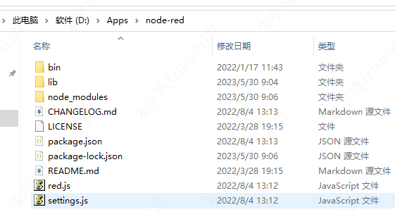

## node-red

### 非全局安装

官方文档：[Node-RED](https://nodered.17coding.net/)

非全局安装：下载windows版本：[下载](https://github.com/node-red/node-red/releases/latest)

将node-red解压到想要安装的文件夹，如：

在该文件夹下执行：`npm install --production`

启动：在该文件夹下执行`node red.js`

访问：浏览器地址栏输入：[打开](http://localhost:1880/)

### 全局安装

1. 设置npm国内源：`npm set`

