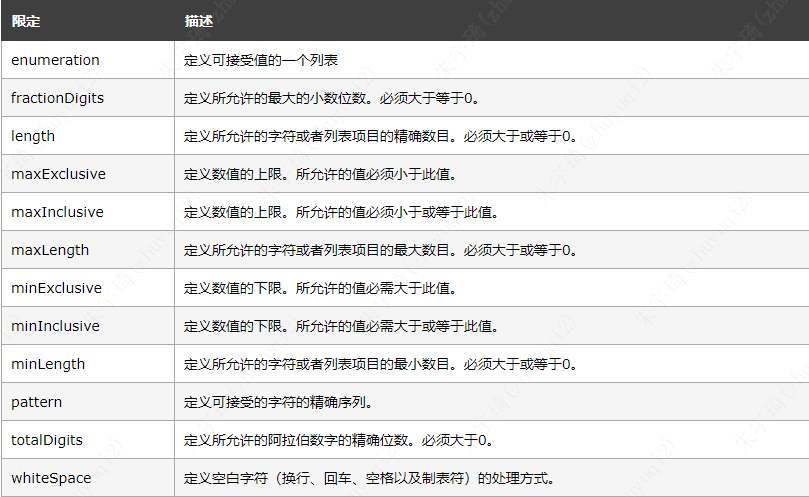

## 简介

简介：

- XML Schema 是基于 XML 的 DTD 替代者。
- XML Schema 描述 XML 文档的结构。
- XML Schema 语言也称作 XML Schema 定义（XML Schema Definition，XSD）。

作用：

- 定义可出现在文档中的元素
- 定义可出现在文档中的属性
- 定义哪个元素是子元素
- 定义子元素的次序
- 定义子元素的数目
- 定义元素是否为空，或者是否可包含文本
- 定义元素和属性的数据类型
- 定义元素和属性的默认值以及固定值

比DTD更优的原因：

- XML Schema 可针对未来的需求进行扩展
- XML Schema 更完善，功能更强大
- XML Schema 基于 XML 编写
- XML Schema 支持数据类型
- XML Schema 支持命名空间

### 使用

原版：
```xml
<?xml version="1.0"?>
<note>
	<to>George</to>
	<from>John</from>
	<heading>Reminder</heading>
	<body>Don't forget the meeting!</body>
</note>
```

dtd文件（note.dtd）：
```dtd
<?xml version="1.0"?>
<note>
<to>George</to>
<from>John</from>
<heading>Reminder</heading>
<body>Don't forget the meeting!</body>
</note>
```

xsd文件（note.xsd）：
```xsd
<?xml version="1.0"?>
<xs:schema xmlns:xs="http://www.w3.org/2001/XMLSchema"
		   targetNamespace="http://www.w3school.com.cn"
		   xmlns="http://www.w3school.com.cn"
		   elementFormDefault="qualified">

	<xs:element name="note">
	    <xs:complexType>
			<xs:sequence>
				<xs:element name="to" type="xs:string"/>
				<xs:element name="from" type="xs:string"/>
				<xs:element name="heading" type="xs:string"/>
				<xs:element name="body" type="xs:string"/>
			</xs:sequence>
	    </xs:complexType>
	</xs:element>

</xs:schema>
```

外部引入dtd：
```xml
<?xml version="1.0"?>
`<!DOCTYPE note SYSTEM "http://www.w3school.com.cn/dtd/note.dtd">`
<note>
	<to>George</to>
	<from>John</from>
	<heading>Reminder</heading>
	<body>Don't forget the meeting!</body>
</note>
```

外部引入xsd：
```xml
<?xml version="1.0"?>
<note xmlns="http://www.w3school.com.cn"
      xmlns:xsi="http://www.w3.org/2001/XMLSchema-instance"
      xsi:schemaLocation="http://www.w3school.com.cn note.xsd"`>

<to>George</to>
<from>John</from>
<heading>Reminder</heading>
<body>Don't forget the meeting!</body>
</note>
```

### 声明

外部声明xsd文件，xml中引入该xsd文件。

#### xsd结构

`<schema>` 元素是每一个 XML Schema 的根元素。`<schema>` 元素可包含属性。一个 schema 声明往往看上去类似这样：

```xml
<?xml version="1.0"?>
 
<xs:schema xmlns:xs="http://www.w3.org/2001/XMLSchema"
targetNamespace="http://www.w3school.com.cn"
xmlns="http://www.w3school.com.cn"
elementFormDefault="qualified">

...
...
</xs:schema>
```

- `xmlns:xs="http://www.w3.org/2001/XMLSchema"`：
	- schema 中用到的元素和数据类型来自命名空间 `http://www.w3.org/2001/XMLSchema`。
	- 来自命名空间 `http://www.w3.org/2001/XMLSchema` 的元素和数据类型应该使用前缀 `xs:`
- `targetNamespace="http://www.w3school.com.cn"`：
	- 默认的命名空间是 `http://www.w3school.com.cn`。
- `elementFormDefault="qualified"`：
	- 任何 XML 实例文档所使用的且在此 schema 中声明过的元素必须被命名空间限定。

#### 外部引入

```xml
<?xml version="1.0"?>

<note xmlns="http://www.w3school.com.cn"
xmlns:xsi="http://www.w3.org/2001/XMLSchema-instance"
xsi:schemaLocation="http://www.w3school.com.cn note.xsd">

	<to>George</to>
	<from>John</from>
	<heading>Reminder</heading>
	<body>Don't forget the meeting!</body>
</note>
```

- `xmlns="http://www.w3school.com.cn"`:
	- 


## 简单类型

### 简单元素

简单元素只包含文本，不包含其他元素或属性。

语法：`<xs:element name="xxx" type="yyy"/>`。xxx 指元素的名称，yyy 指元素的数据类型。

常用类型：

- `xs:string`
- `xs:decimal`
- `xs:integer`
- `xs:boolean`
- `xs:date`
- `xs:time`

案例：

```xsd
<xs:element name="lastname" type="xs:string"/>
<xs:element name="age" type="xs:integer"/>
<xs:element name="dateborn" type="xs:date"/>
```

```xml
<lastname>Smith</lastname>
<age>28</age>
<dateborn>1980-03-27</dateborn>
```

默认值：`<xs:element name="color" type="xs:string" default="red"/>`

固定值：`<xs:element name="color" type="xs:string" fixed="red"/>`

### 简单属性

简易元素无法拥有属性。假如某个元素拥有属性，它就会被当作某种复合类型。但是属性本身总是作为简易类型被声明的。

语法：`<xs:attribute name="xxx" type="yyy"/>`。xxx 指属性名称，yyy 则规定属性的数据类型。

常用类型：

- `xs:string`
- `xs:decimal`
- `xs:integer`
- `xs:boolean`
- `xs:date`
- `xs:time`

案例：

```xsd
<xs:attribute name="lang" type="xs:string"/>
```

```xml
<lastname lang="EN">Smith</lastname>
```

默认值：`<xs:attribute name="lang" type="xs:string" default="EN"/>`

固定值：`<xs:attribute name="lang" type="xs:string" fixed="EN"/>`

### 限定

限定（restriction）用于为 XML 元素或者属性定义可接受的值。对 XML 元素的限定被称为 facet。



#### 范围限定

```xsd
<xs:element name="age">
	<xs:simpleType>
	  <xs:restriction base="xs:integer">
	    <xs:minInclusive value="0"/>
	    <xs:maxInclusive value="120"/>
	  </xs:restriction>
	</xs:simpleType>
</xs:element>
```

- 规定age 的值不能低于 0 或者高于 120。

#### 枚举限定

```xsd
<xs:element name="car">

<xs:simpleType>
  <xs:restriction base="xs:string">
    <xs:enumeration value="Audi"/>
    <xs:enumeration value="Golf"/>
    <xs:enumeration value="BMW"/>
  </xs:restriction>
</xs:simpleType>

</xs:element>
```

- 规定car元素只能取Audi, Golf, BMW。

等价于：

```xsd
<xs:element name="car" `type="carType"`/>

<xs:simpleType `name="carType"`>
  <xs:restriction base="xs:string">
    <xs:enumeration value="Audi"/>
    <xs:enumeration value="Golf"/>
    <xs:enumeration value="BMW"/>
  </xs:restriction>
</xs:simpleType>
```

#### 模式约束（pattern constraint）

把 XML 元素的内容限制定义为一系列可使用的数字或字母。

```xsd
<xs:element name="letter">

<xs:simpleType>
  <xs:restriction base="xs:string">
    <xs:pattern value="[a-z]"/>
  </xs:restriction>
</xs:simpleType>

</xs:element>
```

- 规定letter只能取a-z其中的一个。

value取值示例：

- `value="[a-z]"`：只能取a-z其中的一个。
- `value="[A-Z][A-Z][A-Z]"`：只能取A-Z其中的三个。
- `value="[a-zA-Z][a-zA-Z][a-zA-Z]`：只能取a-Z其中的三个。
- `value="[xyz]"`：只能取x、y、z其中的一个。
- `value="([a-z])*`：a-z中0个或多个
- `value="([a-z][A-Z])+`：每对字母由一个小写字母后跟一个大写字母组成。"sToP"将会通过这种模式的验证，但是 "Stop"、"STOP" 或者 "stop" 无法通过验证。
- `value="male|female`：只能是male或female。
- `value="[a-zA-Z0-9]{8}`：8位字符（*但是不清楚是不是大小写数字都要有，还是纯粹一种类型也行。）*

#### 空白字符

```xml
<xs:element name="address">

<xs:simpleType>
  <xs:restriction base="xs:string">
    <xs:whiteSpace value="preserve"/>
  </xs:restriction>
</xs:simpleType>

</xs:element>
```

- 这个 whiteSpace 限定被设置为 "preserve"，XML 处理器不会移除任何空白字符。

```xml
<xs:element name="address">

<xs:simpleType>
  <xs:restriction base="xs:string">
    <xs:whiteSpace value="replace"/>
  </xs:restriction>
</xs:simpleType>

</xs:element>
```

- 这个 whiteSpace 限定被设置为 "replace"，XML 处理器将移除所有空白字符（换行、回车、空格以及制表符）。

```xml
<xs:element name="address">

<xs:simpleType>
  <xs:restriction base="xs:string">
    <xs:whiteSpace value="collapse"/>
  </xs:restriction>
</xs:simpleType>

</xs:element>
```

- 这个 whiteSpace 限定被设置为 "collapse"，XML 处理器将移除所有空白字符（换行、回车、空格以及制表符会被替换为空格，开头和结尾的空格会被移除，而多个连续的空格会被缩减为一个单一的空格）

#### 长度限定

```xml
<xs:element name="password">

<xs:simpleType>
  <xs:restriction base="xs:string">
    <xs:length value="8"/>
  </xs:restriction>
</xs:simpleType>

</xs:element>
```

- 规定密码必须8位。

```xml
<xs:element name="password">

<xs:simpleType>
  <xs:restriction base="xs:string">
    <xs:minLength value="5"/>
    <xs:maxLength value="8"/>
  </xs:restriction>
</xs:simpleType>

</xs:element>
```

- 规定密码5~8位。

## 复杂类型

