*ElasticSearch 是一款强大的全文搜索引擎，用于海量数据的搜索及分析。Elastic 的底层是开源库 Lucene，Elastic 是 Lucene 的封装， 提供了 REST API 的操作接口， 开箱即用。*
<!-- more -->
> - 在 vagrant 虚拟机中。

## 第 1 章 简介

### 1.1 什么是 ElasticSearch

ElasticSearch 是一款强大的全文搜索引擎，用于海量数据的搜索及分析。

Elastic 的底层是开源库 Lucene，Elastic 是 Lucene 的封装， 提供了 REST API 的操作接口， 开箱即用。

### 1.2 基本概念

#### 1.2.1 Index（索引）

做动词时， 相当于 MySQL 中的 insert。
做名词时， 相当于 MySQL 中的 Database。

#### ~~1.2.2 Type（类型）~~

~~在 Index（索引） 中， 可以定义一个或多个类型。~~
~~类似于 MySQL 中的 Table； 每一种类型的数据放在一起。~~
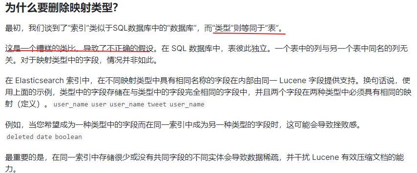
ES7 及以上移除了 type 的概念。 这是因为 elasticsearch 是基于 Lucene 开发的搜索引擎，ES 中不同 type 下名称相同的 filed 最终在 Lucene 中的处理方式是一样的。

- 两个不同 type 下的两个 user_name， 在 ES 同一个索引下其实被认为是同一个 filed，所以必须在两个不同的 type 中定义相同的 filed 映射。 否则，不同 type 中的相同字段名称就会在处理中出现冲突的情况， 导致 Lucene 处理效率下降。
- 去掉 type 就是为了提高 ES 处理数据的效率。

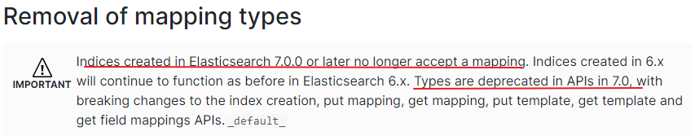
Elasticsearch 7.x：

- URL 中的 type 参数为可选。 比如， 索引一个文档不再要求提供文档类型。

Elasticsearch 8.x：

- 不再支持 URL 中的 type 参数。

解决：

- 将索引从多类型迁移到单类型， 每种类型文档一个独立索引
- 将已存在的索引下的类型数据， 全部迁移到指定位置即可。 详见数据迁移

#### 1.2.3 Document（文档）

保存在某个索引（Index） 下， 某种类型（Type） 的一个数据（Document） ， 文档是 JSON 格式的， Document 就像是 MySQL 中的某个 Table 里面的内容(一条记录)。
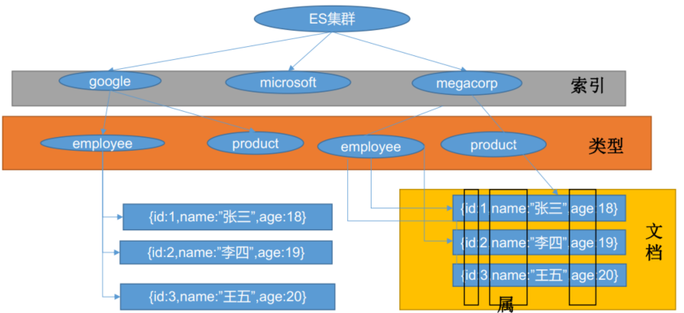
注意：ES6 移除了类型，即索引可以直接对应文档。
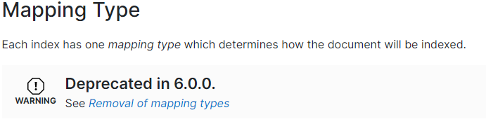

#### 1.2.4 字段

ES 字段的类型主要有五大类：
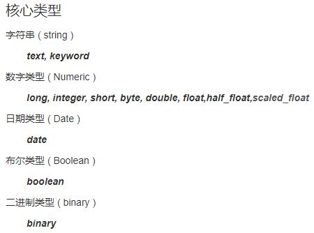
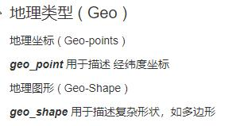
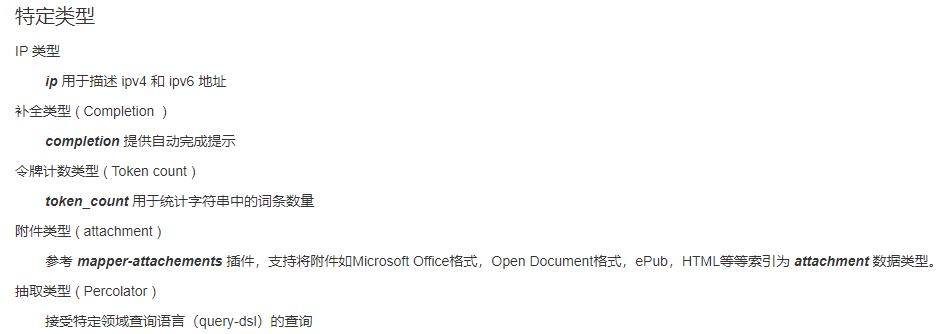


#### 1.2.5 映射

Mapping 是用来定义一个文档（ document），以及它所包含的属性（ field） 是如何存储和索引的【建立文档和属性的对应关系】。 比如， 使用 mapping 来定义：

- 哪些字符串属性应该被看做全文本属性（full text fields） 。
- 哪些属性包含数字， 日期或者地理位置。
- 文档中的所有属性是否都能被索引（\_all 配置） 。
- 日期的格式。
- 自定义映射规则来执行动态添加属性

自动映射机制：ES 能够将存储的 json 数据类型进行自动猜测映射成对应的类型：
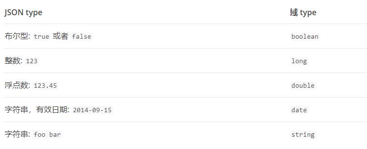
查看 mapping 信息：`GET bank/_mapping`

- 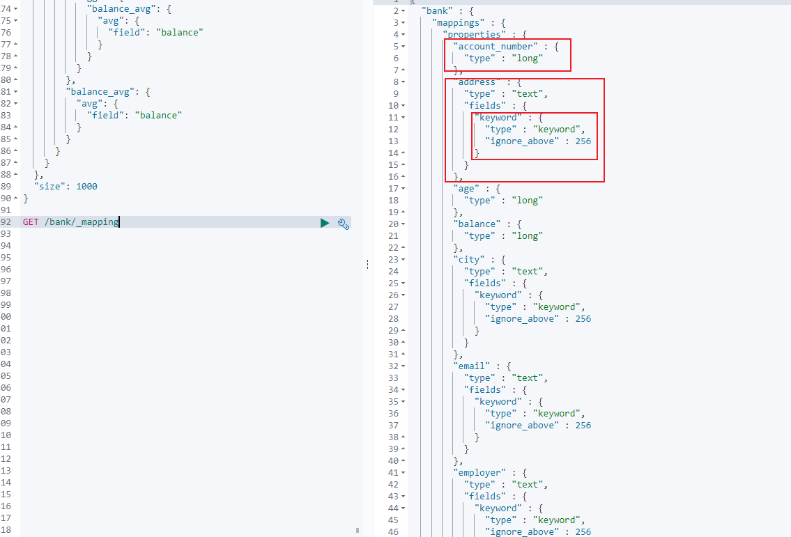

创建 mapping 信息（创建时）：

```json
PUT /my-index
{
  "mappings": {
    "properties": {
      "age": { "type": "integer" },
      "email": { "type": "keyword" },
      "name": { "type": "text" }
    }
  }
}
```

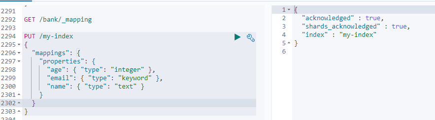
创建 mapping 信息（添加新字段时）：
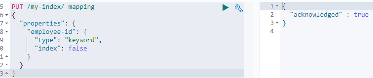
修改 mapping 信息：对于已经存在的映射字段，不能更新 mapping，必须创建新的索引进行数据迁移。
数据迁移：

1. 先创建新的索引，并指定映射：

```json
PUT /newbank
{
  "mappings": {
    "properties" : {
        "account_number" : {
          "type" : "long"
        },
        "address" : {
          "type" : "text"
        },
        "age" : {
          "type" : "integer"
        },
        "balance" : {
          "type" : "long"
        },
        "city" : {
          "type" : "keyword"
        },
        "email" : {
          "type" : "keyword"
        },
        "employer" : {
          "type" : "keyword"
        },
        "firstname" : {
          "type" : "text"
        },
        "gender" : {
          "type" : "keyword"
        },
        "lastname" : {
          "type" : "text",
          "fields" : {
            "keyword" : {
              "type" : "keyword",
              "ignore_above" : 256
            }
          }
        },
        "state" : {
          "type" : "keyword"
        }
      }
  }
}
```

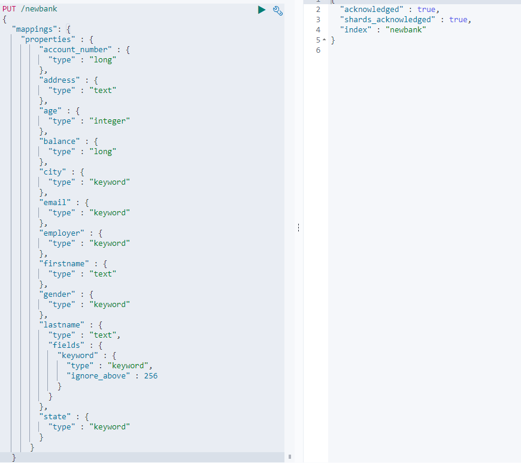

2. 迁移数据：【由于 bank 索引创建时使用了类型 account，所以在迁移的时候要指定该类型】`POST /_reindex`

```json
POST /_reindex
{
  "source": {
    "index": "bank",
    "type": "account"
  },
  "dest":{
    "index": "newbank"
  }
}
```

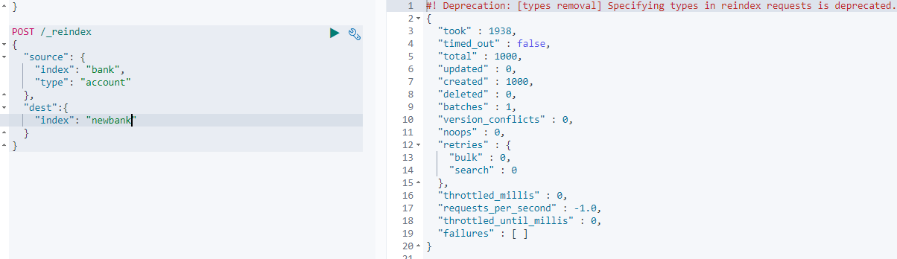

#### 1.2.6 倒排索引机制

比如要保存 5 条记录：

- 红海行动
- 探索红海行动
- 红海特别行动
- 红海记录篇
- 特工红海特别探索

ElasticSearch 存储是存储两张表：数据表和倒排索引表。

倒排索引表中存储数据时，先将要存储的记录按单词拆分，单词对应数据表中出现的位置。

如红海在 1、2、3、4、5 中均出现过，特别在 3、5 号出现过。
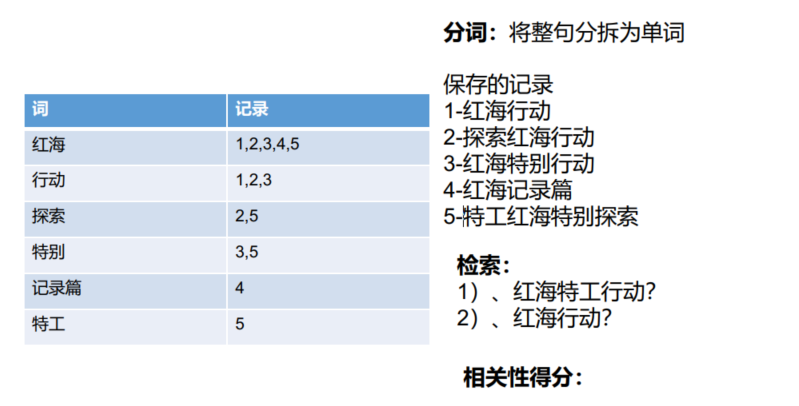
在检索时，先将检索的内容按单词拆分，如红海特工行动，拆分成红海、特工、行动，计算相关性得分，按照相关性得分的高低从高到低排序。

### 1.3 Docker 安装 ES

#### 1.3.1 下载镜像文件

修改虚拟机内存为 1G（关机情况下进行）：
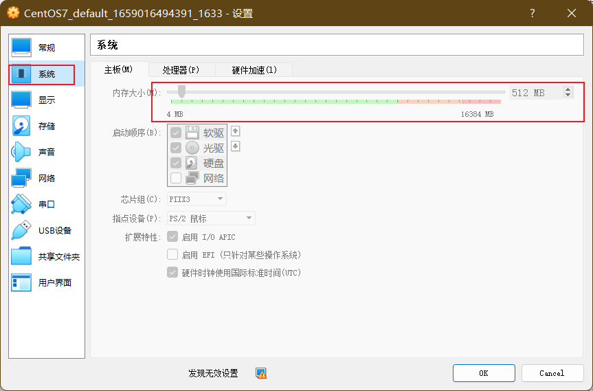
`docker pull elasticsearch:7.4.2` 存储和检索数据

`docker pull kibana:7.4.2` 可视化检索数据

> - free-m：查看可用内存
> - 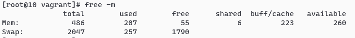

#### 1.3.2 创建实例

1. 创建 ElasticSearch 实例
   - 创建虚拟机的文件，用于后续挂载 docker 中的 ElasticSearch 文件
   - http.host: 0.0.0.0 表示所有用户都可以访问。

```properties
mkdir -p /mydata/elasticsearch/config
mkdir -p /mydata/elasticsearch/data
echo "http.host: 0.0.0.0" >> cat
```

- 挂载文件、配置 ElasticSearch
  - 9200 是虚拟机端口，9300 是 docker 中的端口
  - 特别注意：`-e ES_JAVA_OPTS="-Xms64m -Xmx256m" \` 测试环境下， 设置 ES 的初始内存和最大内存， 否则导致过大启动不了 ES

```properties
docker run --name elasticsearch -p 9200:9200 -p 9300:9300 \
-e "discovery.type=single-node" \
-e ES_JAVA_OPTS="-Xms64m -Xmx256m" \
-v /mydata/elasticsearch/config/elasticsearch.yml:/usr/share/elasticsearch/config/elasticsearch.yml \
-v /mydata/elasticsearch/data:/usr/share/elasticsearch/data \
-v /mydata/elasticsearch/plugins:/usr/share/elasticsearch/plugins \
-d elasticsearch:7.4.2
```

- 启动不成功时查看日志：`docker logs elasticsearch`
  - 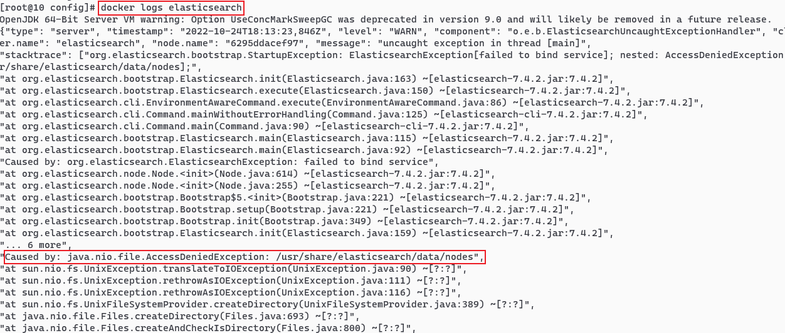
  - 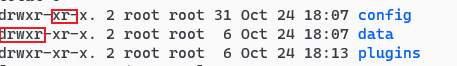
- 提高目录权限
  - 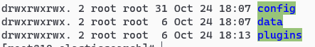

```properties
chmod -R 777 /mydata/elasticsearch/ 保证权限
```

- 访问：[http://192.168.56.10:9200/](http://192.168.56.10:9200/)
  - 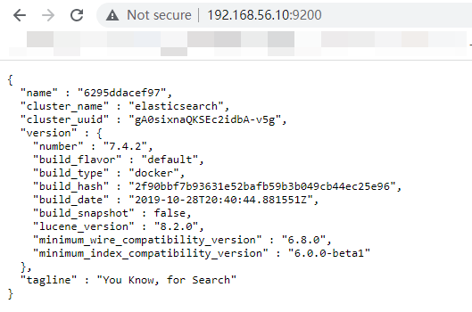
- psotman 测试 es：
  - 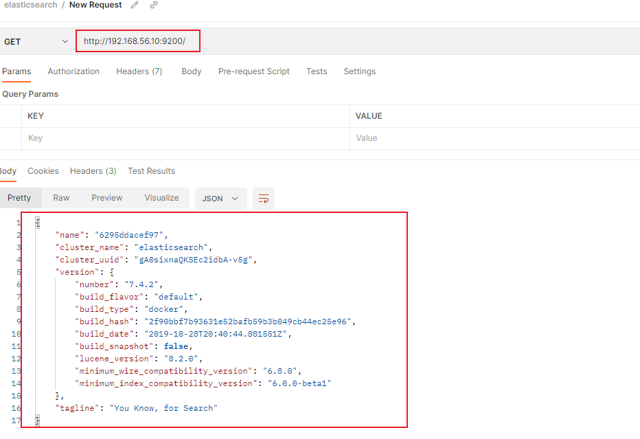
- `docker update 应用id --restart=always`：设置开机自启
  - 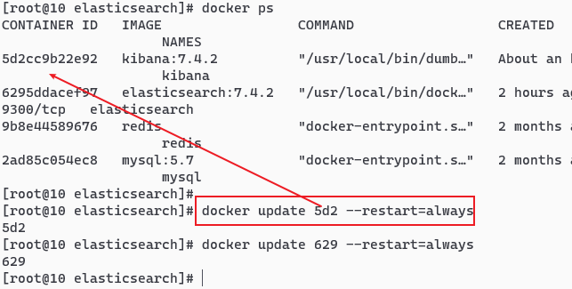

2. 创建 Kibana 实例

```properties
docker run --name kibana -e ELASTICSEARCH_HOSTS=http://192.168.56.10:9200 -p 5601:5601 \
-d kibana:7.4.2
```

- `docker update 应用id --restart=always`：设置开机自启
- 访问：http://192.168.56.10:5601
- 

#### 1.3.3 修改 ES 实例

1.3.2 的 ES 实例中，分配了 128m 的最大内存，后续使用中存在不够用的情况。因此需要修改实例，过程为删掉旧实例，创建新实例。由于创建旧实例时使用了容器卷的挂载，相关的数据保存在 vagrant 的虚拟机中，所以数据不会丢失，新建的实例也会自动拥有这些数据。

- 停止 ES 实例
  - 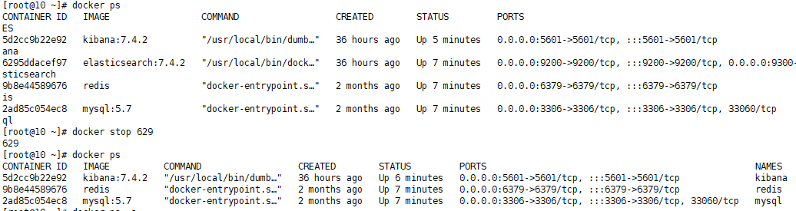
- 移除 ES 实例
  - 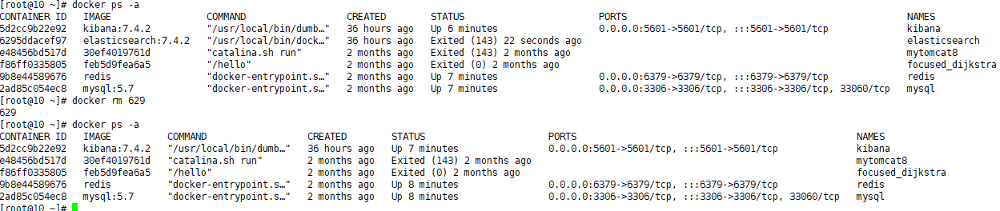
- 查看旧 ES 实例的挂载数据：
  - 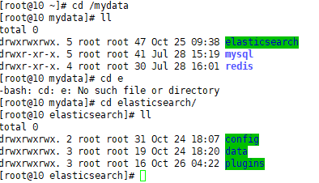
- 创建新实例：设置最大内存 512m
  - 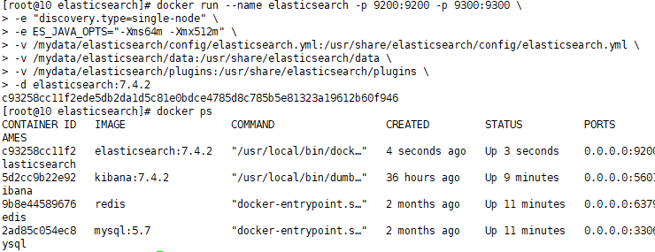

```
docker run --name elasticsearch -p 9200:9200 -p 9300:9300 \
-e "discovery.type=single-node" \
-e ES_JAVA_OPTS="-Xms64m -Xmx512m" \
-v /mydata/elasticsearch/config/elasticsearch.yml:/usr/share/elasticsearch/config/elasticsearch.yml \
-v /mydata/elasticsearch/data:/usr/share/elasticsearch/data \
-v /mydata/elasticsearch/plugins:/usr/share/elasticsearch/plugins \
-d elasticsearch:7.4.2
```

## 第 2 章 ES 的使用

### 2.1 基本检索

#### 2.1.1 \_cat 路径

- GET /\_cat/nodes： 查看所有节点
  - 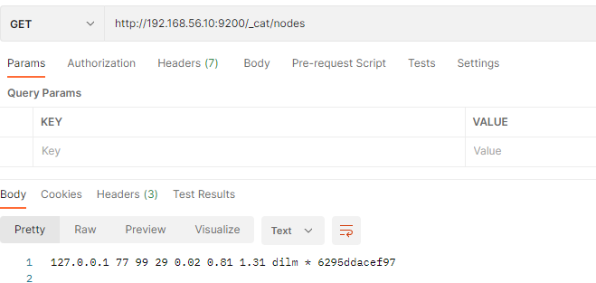
- GET /\_cat/health： 查看 es 健康状况
  - 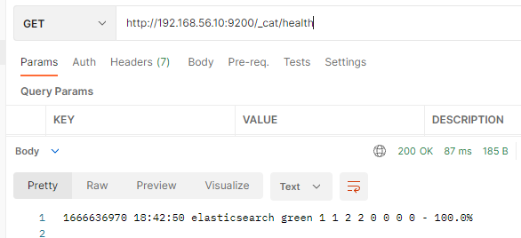
- GET /\_cat/master： 查看主节点
  - 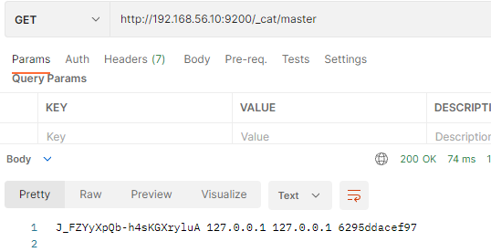
- GET /\_cat/indices： 查看所有索引，相当于 mysql 的 show databases;
  - 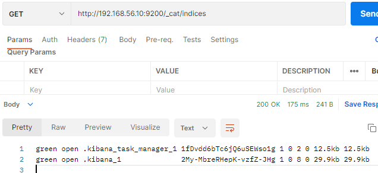

#### 2.1.2 索引一个文档（mysql 保存一条记录）

保存一个数据， 保存在哪个索引的哪个类型下， 指定用哪个唯一标识。【注意 ES6 已经移除了类型，ES7 会给予警告，ES8 将完全不支持类型】

`PUT customer/external/1`：在 customer 索引下的 external 类型下保存 id 为 1 的数据：

```json
{
  "name": "John Doe"
}
```

PUT 和 POST 都可以：

- POST 新增。 如果不指定 id， 会自动生成 id。 指定 id 就会修改这个数据， 并新增版本号。
  - 不指定 id，会生成唯一 id，多次发送均为 created，更新 id
    - 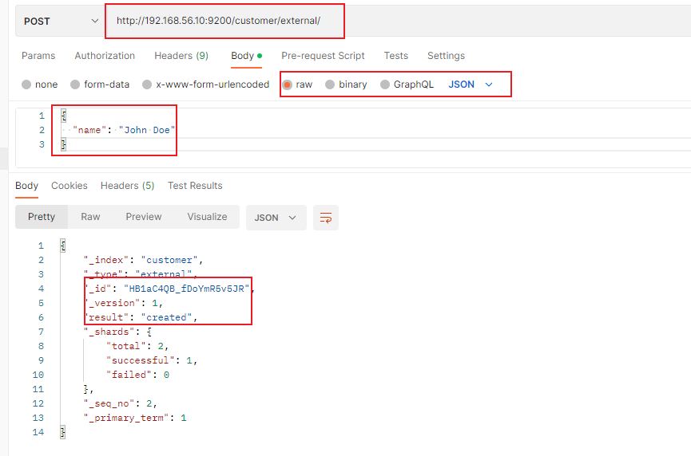
  - 指定 id，同 put。
- PUT 可以新增可以修改。 必须指定 id； 由于 PUT 需要指定 id， 我们一般都用来做修改操作， 不指定 id 会报错。
  - 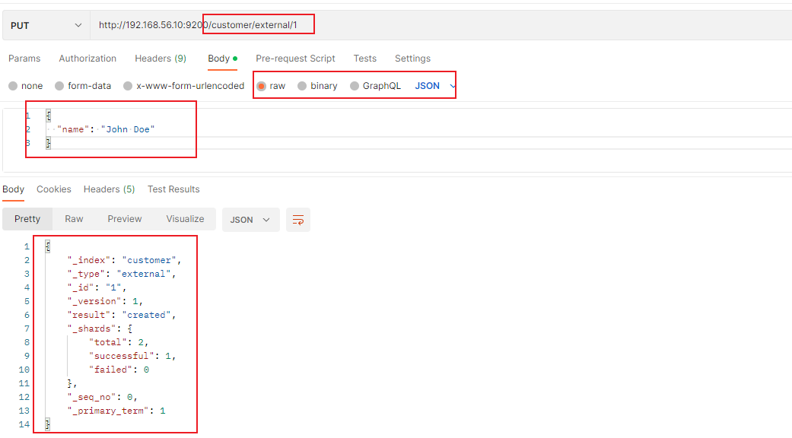
  - 同样的请求（请求地址一致）表示更新操作，会更新版本号，并显示为 update：
    - 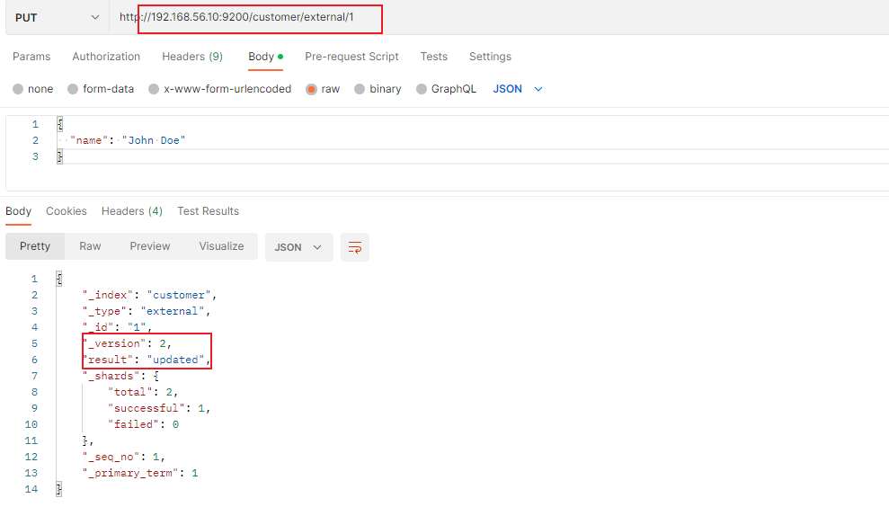

#### 2.1.3 查询文档

将索引文档时的请求类型转为 GET 即为查询。如`GET customer/external/1`
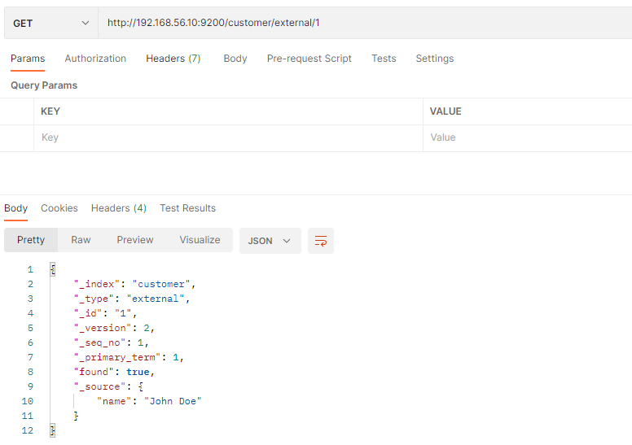

```json
{
  "_index": "customer", //在哪个索引
  "_type": "external", //在哪个类型
  "_id": "1", //记录 id
  "_version": 2, //版本号
  "_seq_no": 1, //并发控制字段， 每次更新就会+1， 用来做乐观锁
  "_primary_term": 1, //同上， 主分片重新分配， 如重启， 就会变化
  "found": true,
  "_source": {
    //真正的内容
    "name": "John Doe"
  }
}
```

#### 2.1.4 更新文档

除了上述保存的时候更新外，还可以使用 post 请求进行专门的更新：

- `POST customer/external/1/_update`
  - 使用`_update`必须传递`doc`参数。
  - 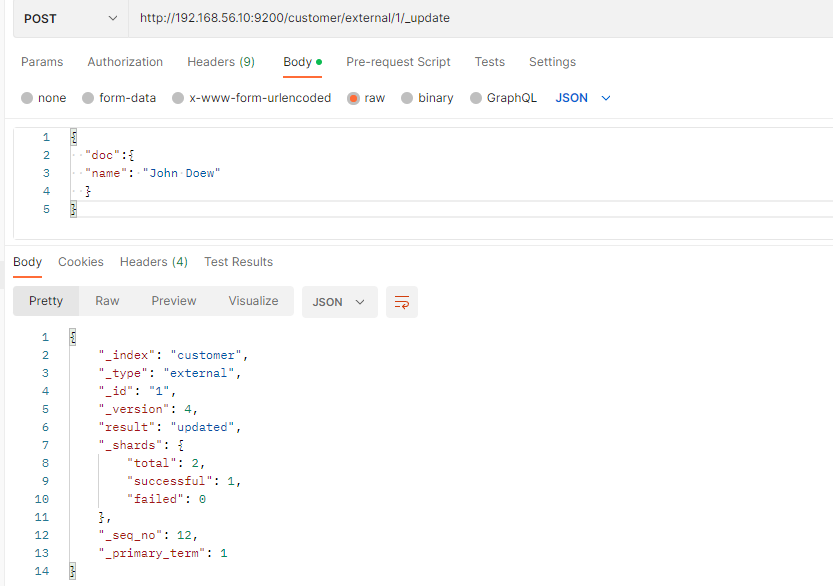
  - 多次更新同一条数据会对比原数据，如果一致不会进行更新，即：result 变为 noop，\_version 和\_seq_no 不会变化。
    - 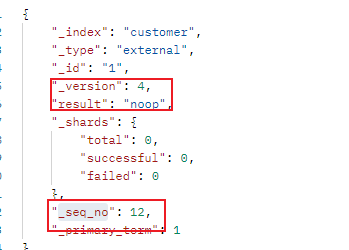

```json
{
  "doc": {
    "name": "John Doew"
  }
}
```

- put 请求和 post 不带 update 的请求一样，总是进行更新，不会比较旧数据。

#### 2.1.5 更新的并发控制

携带`_seq_no`和`_primary_term`字段，传递参数：`?if_seq_no=0&if_primary_term=1`
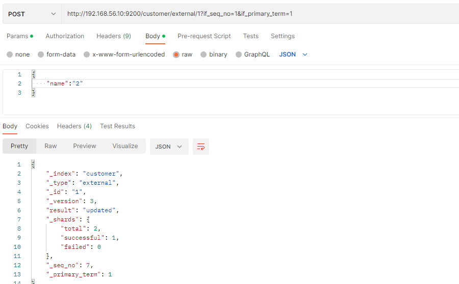
上述为乐观锁的控制过程。post、put 请求均可，上述为使用了正确的锁，修改成功的情况。

#### 2.1.6 删除文档&索引

删除文档：`DELETE customer/external/1`


删除索引：`DELETE customer`

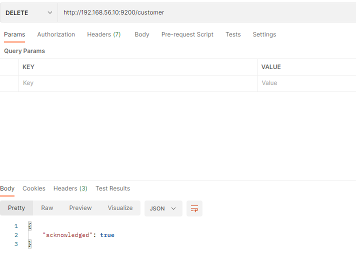

#### 2.1.7 bulk 批量 API

语法格式：`POST customer/external/_bulk`

- 注意：数据格式不是 json

```json
{ action: { metadata }}
{ request body }
{ action: { metadata }}
{ request body }
```

简单案例：

```json
{"index":{"_id":"1"}}
{"name": "John Doe" }
{"index":{"_id":"2"}}
{"name": "Jane Doe" }
```

- POSTMAN 不能测试，需要使用 Kibana
- 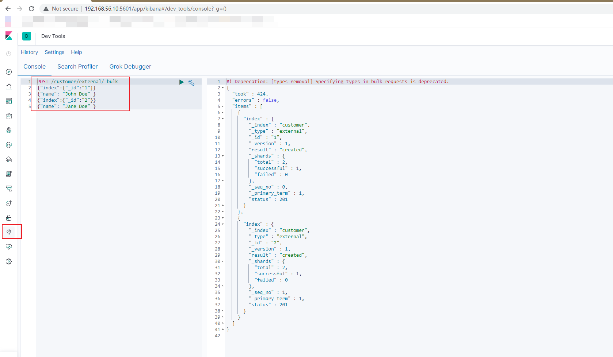
- 每条数据都是独立执行的，上一条的失败不会影响下一条。

复杂案例：

```json
{ "delete": { "_index": "website", "_type": "blog", "_id": "123" }}
{ "create": { "_index": "website", "_type": "blog", "_id": "123" }}
{ "title": "My first blog post" }
{ "index": { "_index": "website", "_type": "blog" }}
{ "title": "My second blog post" }
{ "update": { "_index": "website", "_type": "blog", "_id": "123"} }
{ "doc" : {"title" : "My updated blog post"} }
```

- 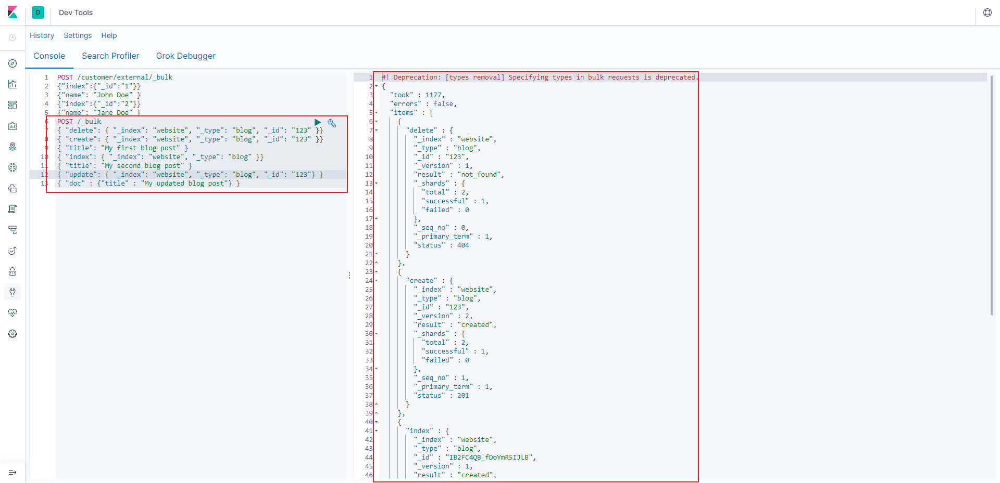

导入测试数据：官方数据地址（百度即可找到）`POST /bank/account/_bulk`
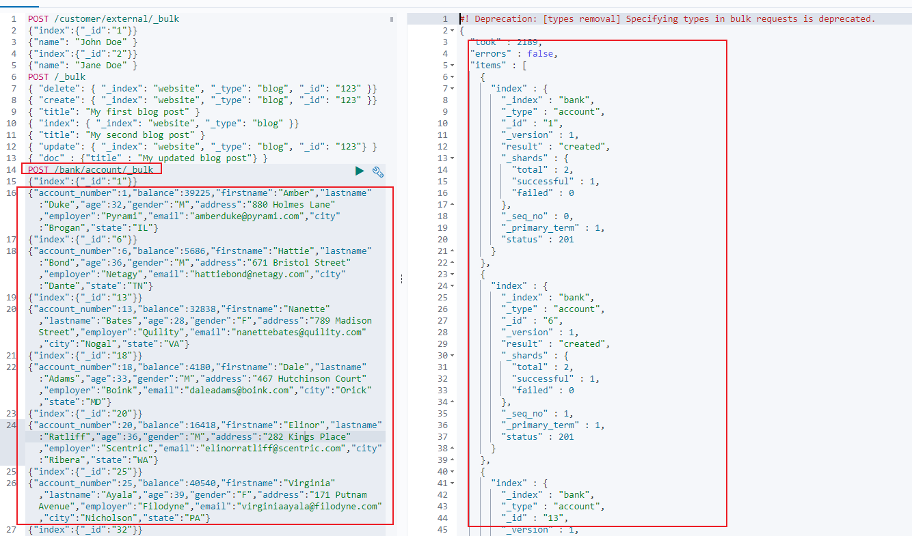
在 postman 查询索引：
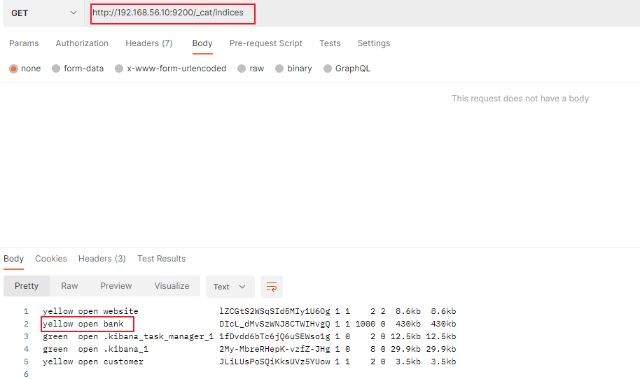

## 2.2 进阶检索（复杂检索）

官方文档：
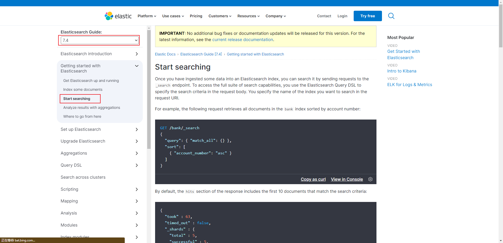

#### 2.2.1 ES 检索方式

ES 支持两种基本方式检索：

- 一个是通过使用 REST request URI 发送搜索参数（uri+检索参数）
  - `GET bank/_search?q=*&sort=account_number:asc`
  - 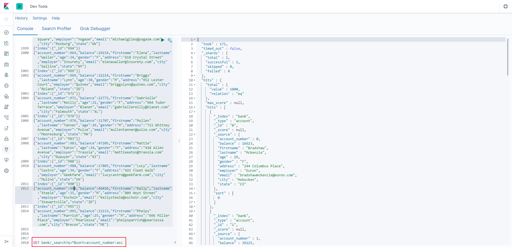
- 另一个是通过使用 REST request body 来发送它们（uri+请求体）
  - `GET bank/_search`

```json
{
  "query": {
    "match_all": {}
  },
  "sort": [
    {
      "account_number": { "order": "desc" }
    }
  ]
}
```

响应结果解释：

- took - Elasticsearch 执行搜索的时间（ 毫秒）
- time_out - 告诉我们搜索是否超时
- \_shards - 告诉我们多少个分片被搜索了， 以及统计了成功/失败的搜索分片
- hits.total - 搜索结果
- hits.hits - 实际的搜索结果数组（ 默认为前 10 的文档）
- hits.hits.sort - 结果的排序 key（ 键）（没有则按 score 排序）
- score 和 max_score –相关性得分和最高得分（ 全文检索用）

一旦搜索的结果被返回， Elasticsearch 就完成了这次请求， 并且不会维护任何服务端的资源或者结果的 cursor（游标）。

#### 2.2.2 Query DSL

上文的查询中，使用了 GET 请求+请求体的方式，而 HTTP 客户端工具（POSTMAN），get 请求不能携带请求体。
Elasticsearch 提供了一个可以执行查询的 Json 风格的 DSL（ domain-specific language 领域特定语言），称为 Query DSL。

##### 2.2.2.1 语法格式

```json
GET bank/_search
{
  "query": {
    "match_all": {}
  },
  "from": 0,
  "size": 5,
  "sort": [
    {
      "account_number": {"order": "desc"}
    }
  ]
}
```

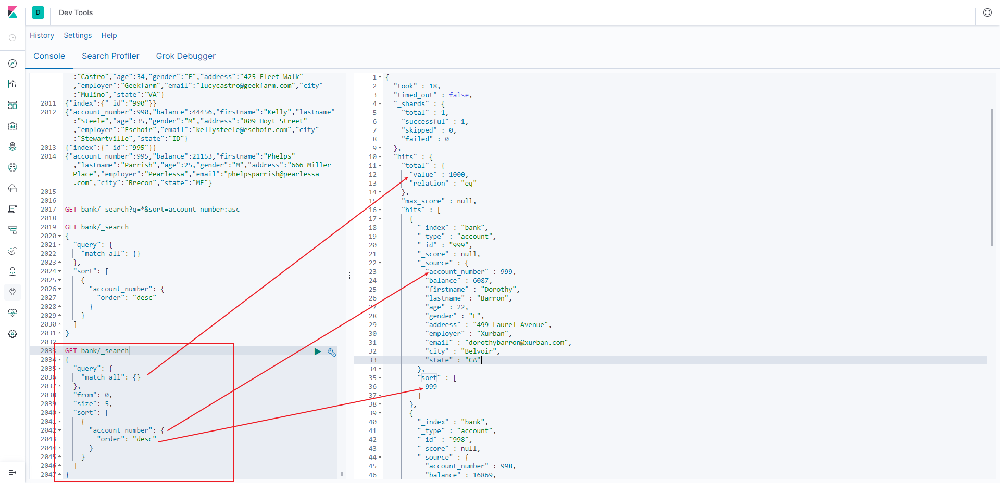

- query 定义一个查询
- match_all 查询类型【代表查询所有的所有】
- from+size 限定，完成分页功能
- sort 排序，多字段排序，会在前序字段相等时后续字段内部排序，否则以前序为准
  - account_number：排序字段
  - order：排序规则

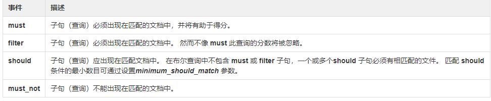

##### 2.2.2.2 \_source 返回部分字段

```json
GET bank/_search
{
  "query": {
    "match_all": {}
  },
  "from": 0,
  "size": 5,
  "_source": ["age","balance"]
}
```

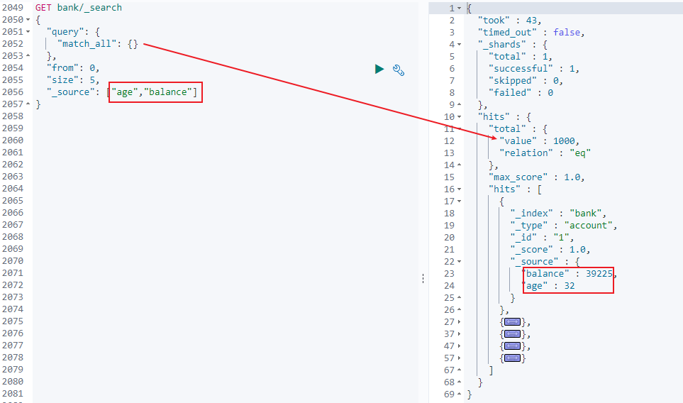

##### 2.2.2.3 match_all 匹配查询

查找当前索引所有数据，不能写匹配条件，写了会报错。
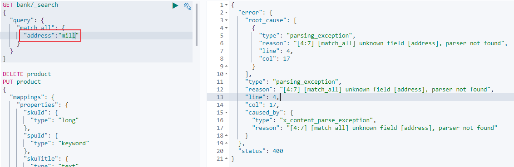

##### 2.2.2.3 match 匹配查询

match 可以查询各种类型。

1. 查询非字符串，表示精确匹配，查询结果必须与查询关键字完全一致
   - 20 带不带引号都可以。
   - 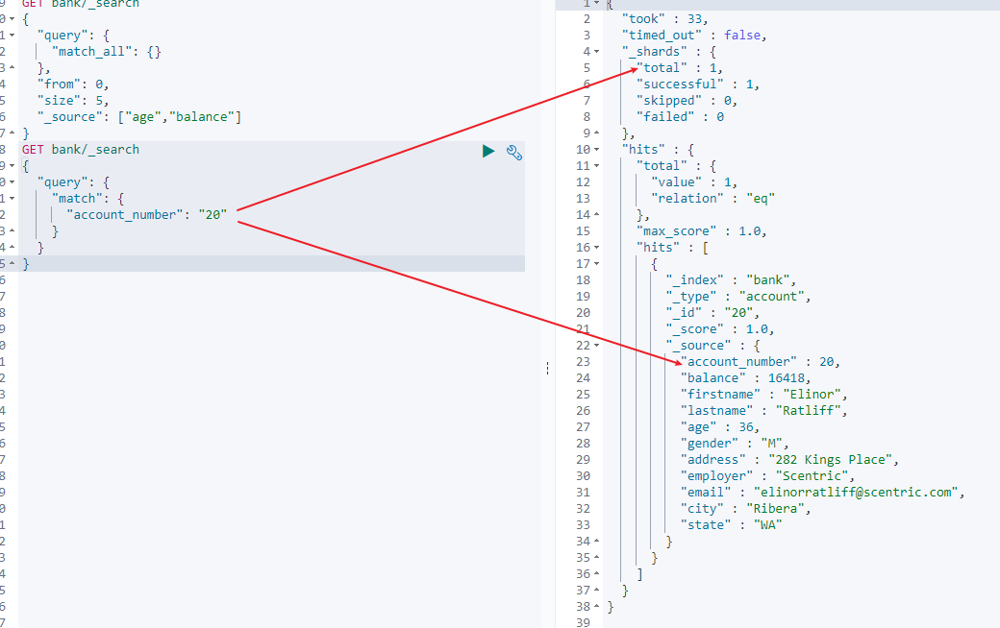

```json
GET bank/_search
{
  "query": {
    "match": {
      "account_number": "20"
    }
  }
}
```

2. 查询字符串表示全文索引，查询结果包含查询关键字即可
   - 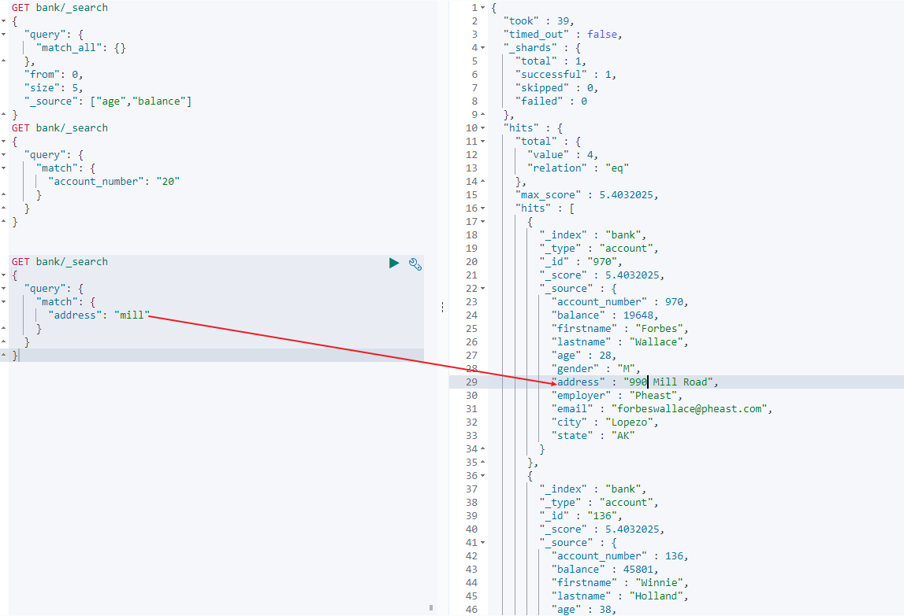

```json
GET bank/_search
{
  "query": {
    "match": {
      "address": "mill"
    }
  }
}
```

3. 查询多个字符串（ 分词+全文检索）表示包含任意一个检索词都算
   - 最终查询出 address 中包含 mill 或者 road 或者 mill road 的所有记录， 并给出相关性得分。
   - 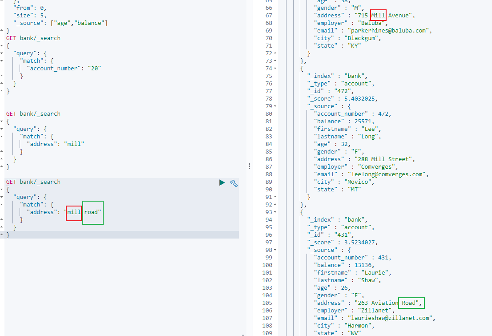

```json
GET bank/_search
{
  "query": {
    "match": {
      "address": "mill road"
    }
  }
}
```

##### 2.2.2.4 match_phrase【 短语匹配】

将需要匹配的值当成一个整体单词（ 不分词） 进行检索
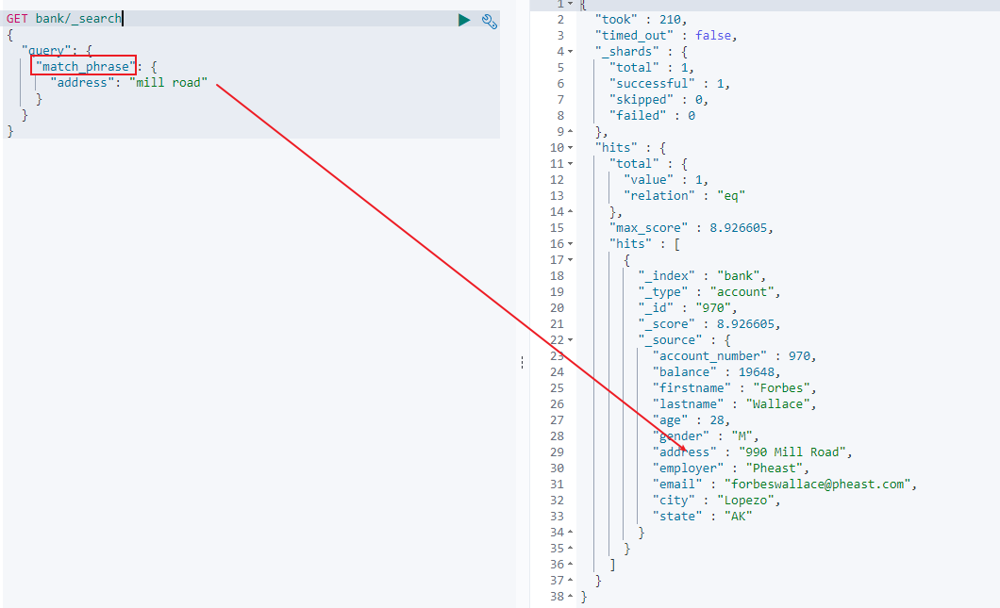

```json
GET bank/_search
{
  "query": {
    "match_phrase": {
      "address": "mill road"
    }
  }
}
```

##### 2.2.2.5 multi_match【 多字段匹配】

state 或者 address 包含 mill
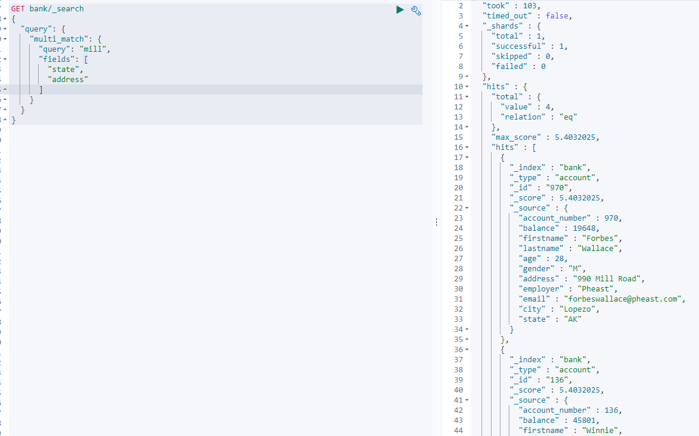

```json
GET bank/_search
{
  "query": {
    "multi_match": {
      "query": "mill",
      "fields": ["state","address"]
    }
  }
}
```

##### 2.2.2.6 bool【 复合查询】

复合语句可以合并 任何 其它查询语句， 包括复合语句， 使得复合语句之间可以互相嵌套， 可以表达非常复杂的逻辑。

1. must： 必须达到 must 列举的所有条件
   - 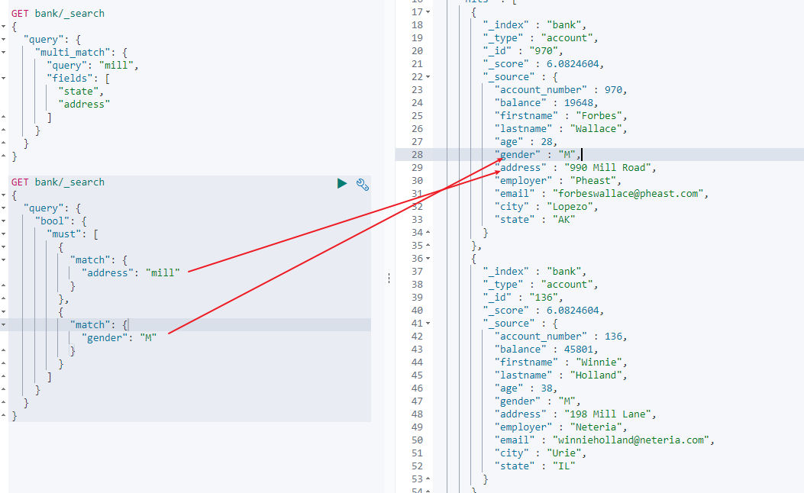

```json
GET bank/_search
{
  "query": {
    "bool": {
      "must": [
        {"match": { "address": "mill"}},
        {"match": { "gender": "M"}}
      ]
    }
  }
}
```

2. must_not 必须不是指定的情况： email 必须不包含 baluba.com
   - 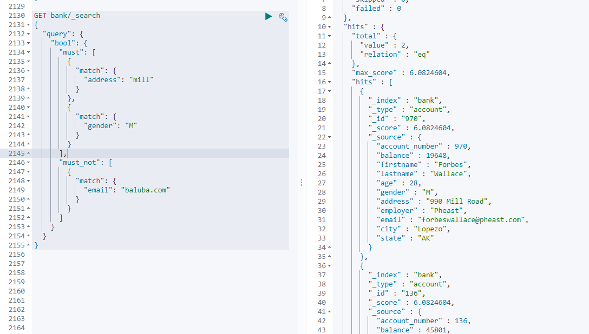

```json
GET bank/_search
{
  "query": {
    "bool": {
      "must": [
        { "match": { "address": "mill" } },
        { "match": { "gender": "M" } }
      ],
      "must_not": [
        { "match": { "email": "baluba.com" } }
      ]
    }
  }
}
```

3. should： 应该达到 should 列举的条件， 如果达到会增加相关文档的评分， 并不会改变查询的结果。 如果 query 中只有 should 且只有一种匹配规则， 那么 should 的条件就会被作为默认匹配条件而去改变查询结果。
   - 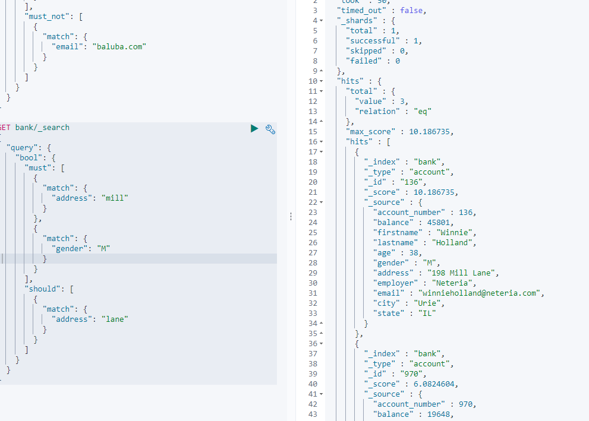

```json
GET bank/_search
{
  "query": {
    "bool": {
      "must": [
        { "match": { "address": "mill" } },
        { "match": { "gender": "M" } }
      ],
      "should": [
        {  "match": { "address": "lane" } }
      ]
    }
  }
}
```

4. 也可以复合 filter 查询

##### 2.2.2.7 filter【结果过滤】

与 must_not 相反，保留复合条件的结果。用于在不计算相关性得分时，自动检查场景并且优化查询。

```json
GET bank/_search
{
  "query": {
    "bool": {
      "filter": {
        "range": {
          "balance": {
            "gte": 20000,
            "lte": 30000
          }
        }
      }
    }
  }
}
```

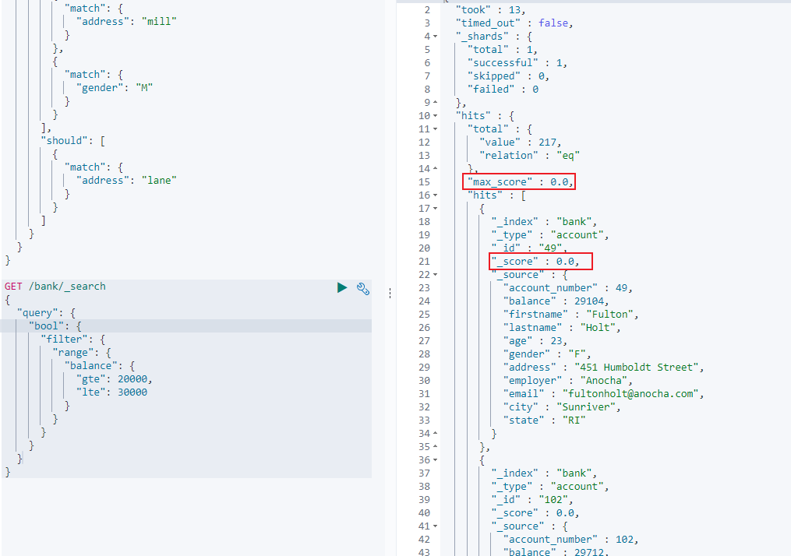

##### 2.2.2.8 term 和 terms【精确查询】

与 match 的区别在于 match 是模糊查询（全文检索），term 是精确查询。
term 和 terms 的区别在于，terms 可以匹配多个字段，满足其一。

```json
GET /_search
{
    "query": {
      "term": {
          "age": "28"
        }
    }
}
```

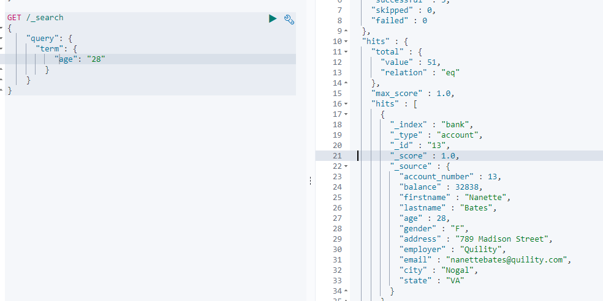
如果 term 匹配 text 文本，则匹配不到，需要用 match
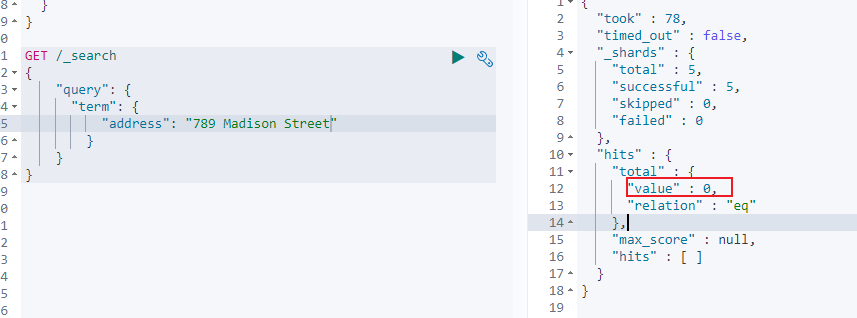
match 配合`属性.keyword`可以精确匹配 text，如同 term 匹配非 text。与 match_phrase 配合`属性`的区别在于 match 配合`属性.keyword`必须完整匹配 text，而 match_phrase 配合`属性`只要包含即可。
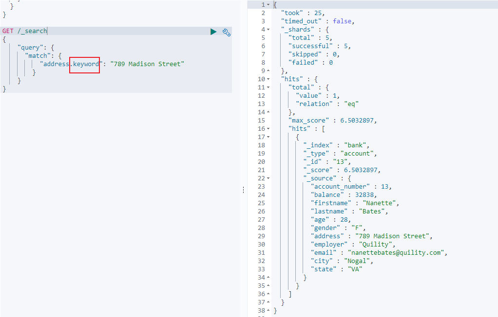
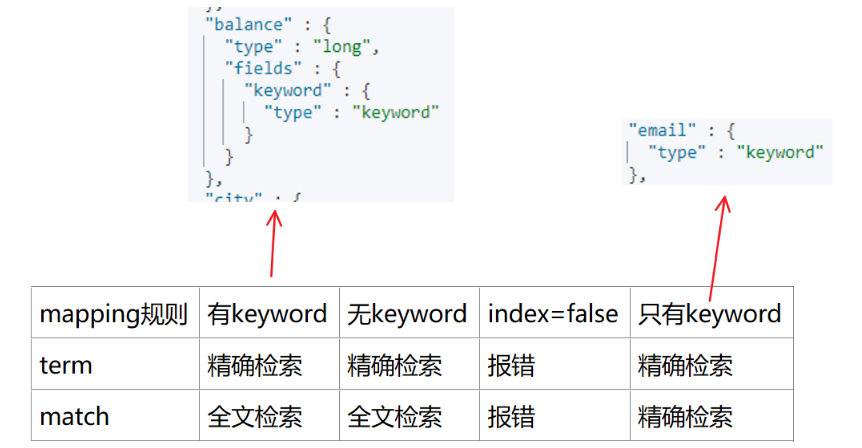

##### 2.2.2.9 aggregations【执行聚合】

聚合查询提供了从数据中分组和提取数据的能力，最简单的聚合方法大致等于 SQL GROUP BY 和 SQL 聚合函数。
语法结构：aggregations 和 aggs 等价。

```json
"aggregations" : {
    "<aggregation_name>" : {
        "<aggregation_type>" : {
            <aggregation_body>
        }
        [,"meta" : {  [<meta_data_body>] } ]?
        [,"aggregations" : { [<sub_aggregation>]+ } ]?
    }
    [,"<aggregation_name_2>" : { ... } ]*
}
```

聚合的方式有超多种，这里简单举 3 个案例进行体验。
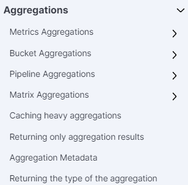

1. 案例一：搜索 address 中包含 mill 的所有人的年龄分布以及平均年龄， 但不显示这些人的详情。

```json
GET bank/_search
{
  "query": {
    "match": {
      "address": "mill"
    }
  },
  "aggs": {
    "group_by_state": {
      "terms": {
        "field": "age"
      }
    },
    "avg_age": {
      "avg": {
        "field": "age"
      }
    }
  },
  "size": 0
}

```

- size： 0 不显示搜索数据，size：10 取出前 10 条记录

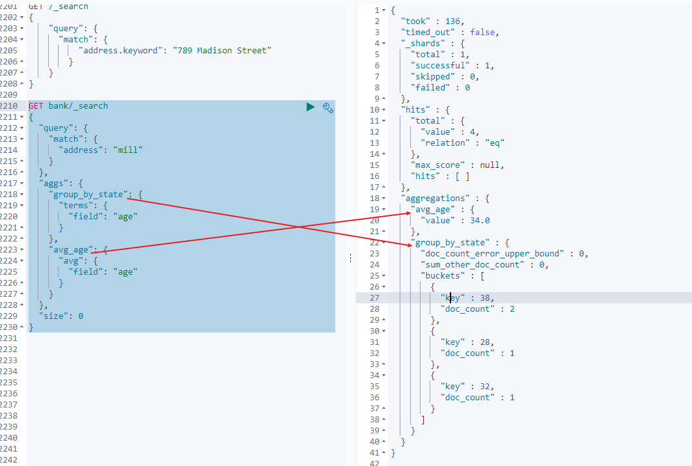

2. 案例二：按照年龄聚合， 并且请求这些年龄段的这些人的平均薪资

```json
GET bank/account/_search
{
  "query": {
    "match_all": {}
  },
  "aggs": {
    "age_avg": {
      "terms": {
        "field": "age",
        "size": 1000
      },
      "aggs": {
        "banlances_avg": {
          "avg": {
            "field": "balance"
          }
        }
      }
    }
  },
  "size": 1000
}
```

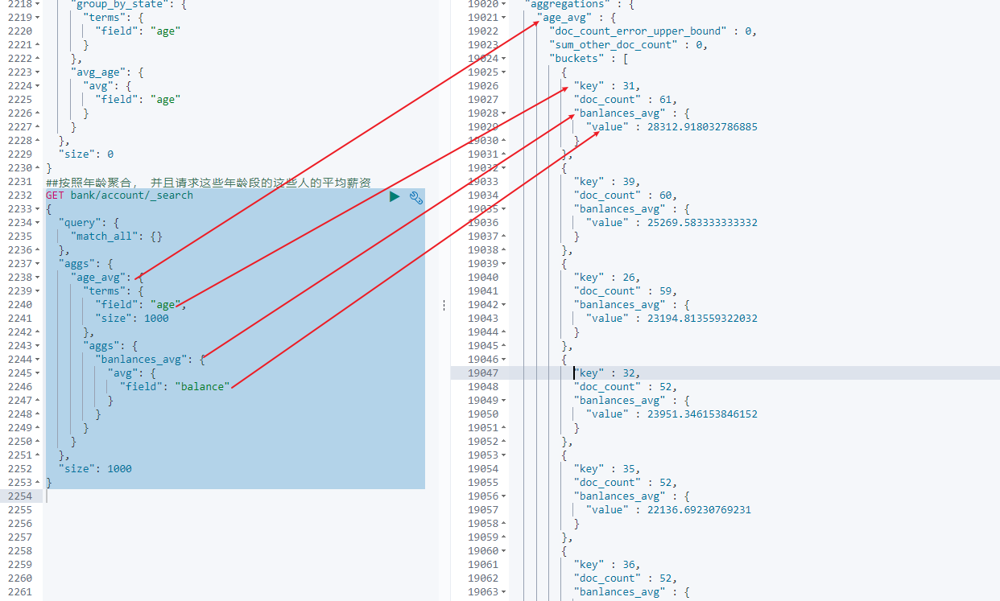

3. 案例三：查出所有年龄分布， 并且这些年龄段中 M（男） 的平均薪资和 F（女） 的平均薪资以及这个年龄段的总体平均薪资

```json
GET bank/account/_search
{
  "query": {
    "match_all": {}
  },
  "aggs": {
    "age_agg": {
      "terms": {
        "field": "age",
        "size": 100
      },
      "aggs": {
        "gender_agg": {
          "terms": {
            "field": "gender.keyword",
            "size": 100
          },
          "aggs": {
            "balance_avg": {
              "avg": {
                "field": "balance"
              }
            }
          }
        },
        "balance_avg": {
          "avg": {
            "field": "balance"
          }
        }
      }
    }
  },
  "size": 1000
}
```

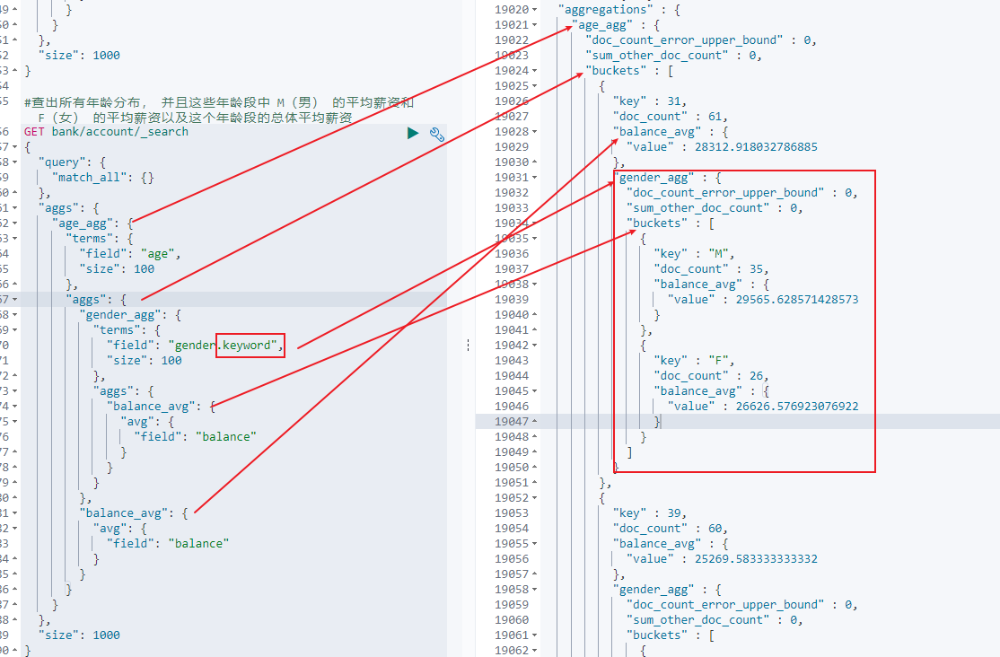

- 注意 keyword 的使用。否则会报错。

### 2.4 分词

一个 tokenizer（ 分词器） 接收一个字符流， 将之分割为独立的 tokens（ 词元， 通常是独立的单词）， 然后输出 tokens 流。

例如， whitespace tokenizer 遇到空白字符时分割文本。 它会将文本 "Quick brown fox!" 分割为 [Quick, brown, fox!]。

该 tokenizer（分词器） 还负责记录各个 term（词条） 的顺序或 position 位置（用于 phrase 短语和 word proximity 词近邻查询） ， 以及 term（词条） 所代表的原始 word（单词） 的 start（起始） 和 end（结束） 的 character offsets（字符偏移量） （用于高亮显示搜索的内容） 。

Elasticsearch 提供了很多内置的分词器， 可以用来构建 custom analyzers（自定义分词器）。

#### 2.4.1 ik 分词器

1. 安装：
   - 方式一：进入 ES 内部：`docker exec -it 容器id /bin/bash`，并进入`/plugins`文件中。执行安装命令：`wget https://github.com/medcl/elasticsearch-analysis-ik/releases/download/v7.4.2/elasticsearch-analysis-ik-7.4.2.zip`
     - 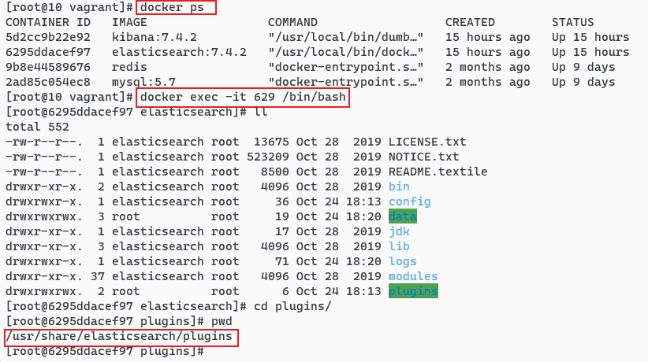
     - 找到对应的 ES 版本，我的为 7.4.2
   - 方式二：方式一存在的问题是 docker 中的 ES 太纯净，没有 wget 工具，安装会找不到。由于安装 ES 时文件路径与 Vagrant 路径进行了映射，所以可以在 Vagrant 中安装。
     - 安装 wget 工具：`yum install wget`
     - 安装分词器：`wget https://github.com/medcl/elasticsearch-analysis-ik/releases/download/v7.4.2/elasticsearch-analysis-ik-7.4.2.zip`
   - 方式三：方式二中，安装分词器会发现 github 不允许非浏览器的方式进行下载，会提示`Unable to establish SSL connection`。所以可以使用先下载好 ik 分词器的压缩包，使用 xshell 存放到`/plugins`目录中进行解压安装，如解压为 ik 文件夹：
     - 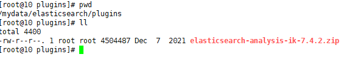
     - 提升文件夹权限：
     - 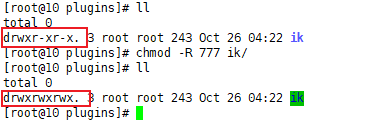
     - 重启 ES：`docker restart elasticsearch`
2. 测试：
   - 使用默认（不使用 ik 分词器）：
     - 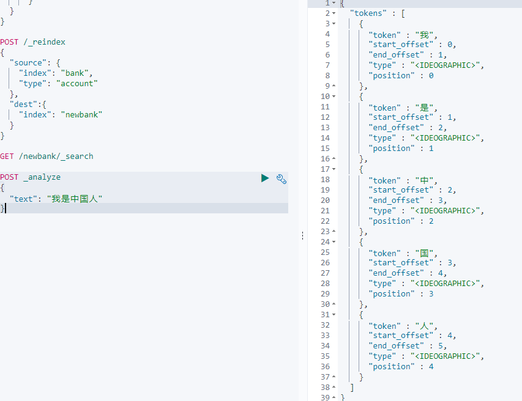
   - 使用 ik 分词器一：
     - 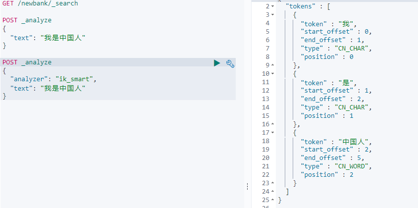
   - 使用 ik 分词器二：
     - 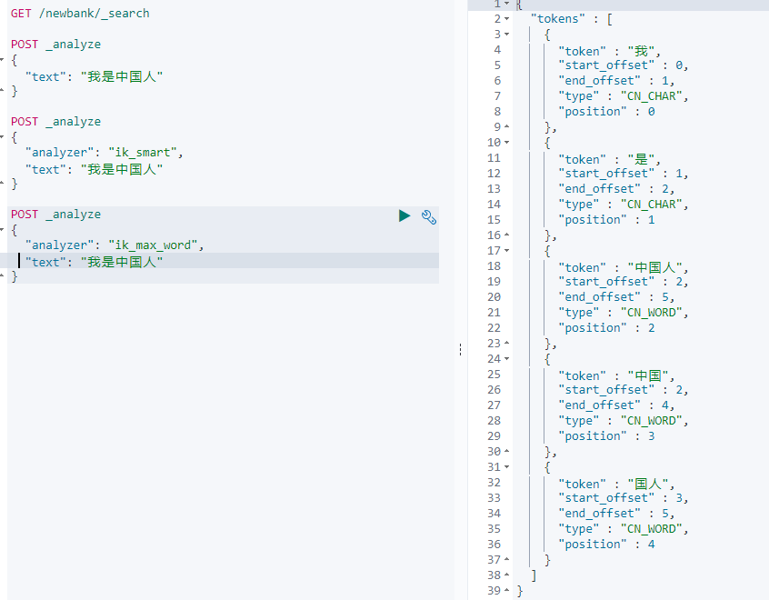

不同的分词器， 分词有明显的区别， 所以以后定义一个索引不能再使用默认的 mapping 了， 要手工建立 mapping, 因为要选择分词器。

#### 2.4.2 自定义词库

目标：搭建一个 nginx 服务器，作为 es 的远程分词库。

1. 在 nginx 服务器创建词库：
   - 在 nginx 的 html 目录下创建一个新的目录，如 es：
   - 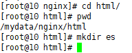
   - 在 es 目录中，创建一个 txt 文件，在里面输入分词，如：乔碧萝、殿下
   - 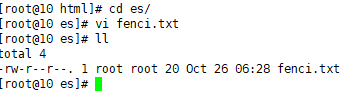
   - 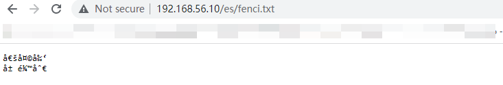
2. 连接 nginx 服务器的词库：
   - 修改`plugins/ik/config/IKAnalyzer.cfg.xml`文件
     - 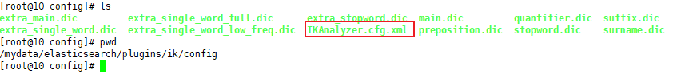
     - 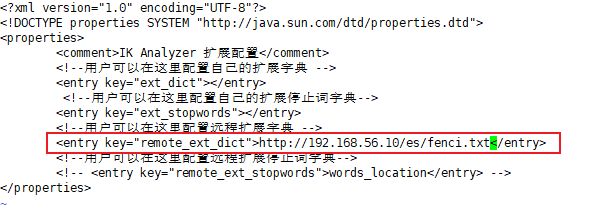
3. 重启 ES 实例
4. 测试分词效果
   - 设置自定义分词前：
     - 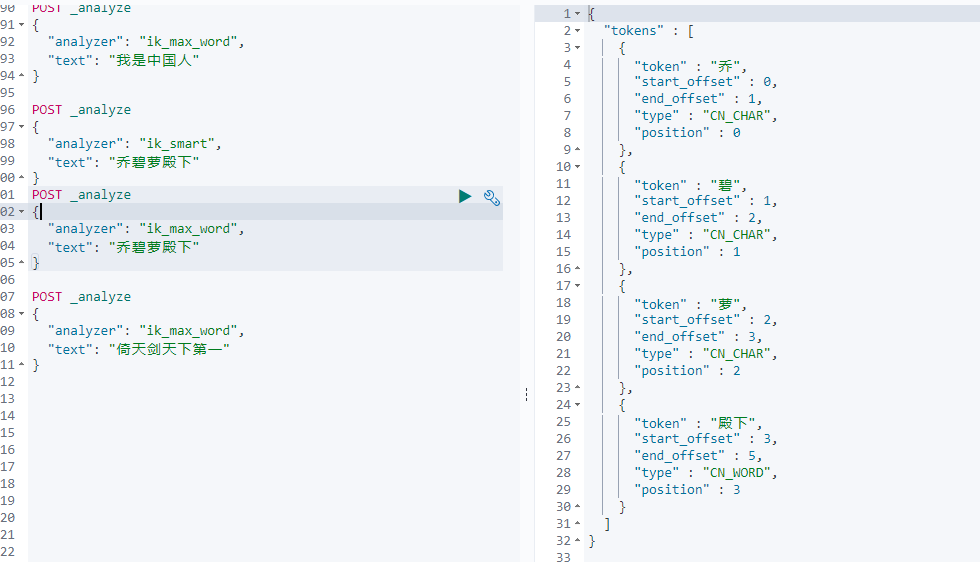
   - 设置自定义分词后：
     - 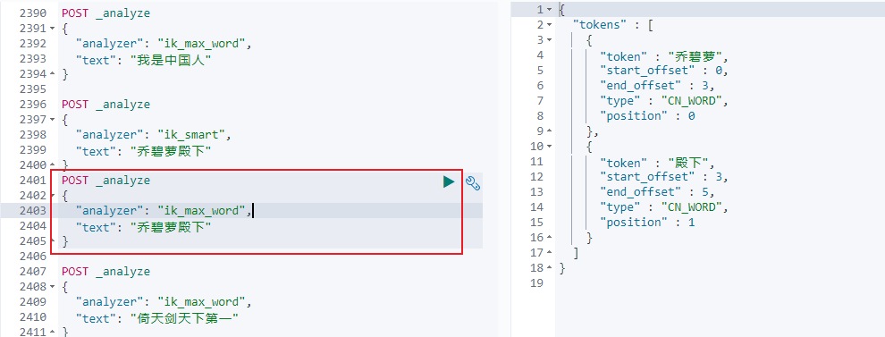

## 第 3 章 Java 操作 ES

### 3.1 方式一：连接 9300 端口

9300 端口建立 TCP 长连接。

要求：spring-data-elasticsearch:transport-api.jar；

缺点：springboot 版本不同， transport-api.jar 不同， 不能适配 es 版本。7.x 已经不建议使用， 8 以后就要废弃。

### 3.2 方式二：连接 9200 端口

9200 建立 HTTP 短连接。

工具及特点：

- JestClient： 非官方， 更新慢
- RestTemplate： 模拟发 HTTP 请求， ES 很多操作需要自己封装， 麻烦
- HttpClient： 同上
- Elasticsearch-Rest-Client： 官方 RestClient， 封装了 ES 操作， API 层次分明， 上手简单。

### 3.3 使用 Elasticsearch-Rest-Client

根据 3.2 的对比结论，最终选择 Elasticsearch-Rest-Client 作为连接工具。

注意：使用的是高阶工具
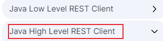

#### 3.3.1 springboot 整合 ES

1. 引入依赖

```xml
<dependency>
  <groupId>org.elasticsearch.client</groupId>
  <artifactId>elasticsearch-rest-high-level-client</artifactId>
  <version>7.4.2</version>
</dependency>
```

2. 配置 ES

```java
@Configuration
public class GulimallElasticSearchConfig {
    @Bean
    RestHighLevelClient client() {
        RestClientBuilder builder = RestClient.builder(new HttpHost("192.168.56.10", 9200,"http"));
        return new RestHighLevelClient(builder);
    }
}
```

3. 使用

```java
@Test
public void testSearch(){
// 1. 创建检索请求
SearchRequest searchRequest = new SearchRequest();
searchRequest.indices("bank");//指定索引
SearchSourceBuilder searchSourceBuilder = new SearchSourceBuilder();
searchRequest.source(searchSourceBuilder);//指定DSL器
// 1.1 构造检索条件
//        searchSourceBuilder.query();
//        searchSourceBuilder.from();
//        searchSourceBuilder.size();
//        searchSourceBuilder.aggregation();
searchSourceBuilder.query(QueryBuilders.matchQuery("address", "mill"));
// 1.2 按照年龄的值分布进行聚合
TermsAggregationBuilder ageAgg = AggregationBuilders.terms("ageAgg").field("age").size(10);
searchSourceBuilder.aggregation(ageAgg);
// 1.3 计算平均薪资
TermsAggregationBuilder balanceAvg = AggregationBuilders.terms("balanceAvg").field("balance");
searchSourceBuilder.aggregation(balanceAvg);

System.out.println("检索条件" + searchSourceBuilder.toString());
searchRequest.source(searchSourceBuilder);

// 2. 执行检索
SearchResponse search = null;
try {
    search = restHighLevelClient.search(searchRequest, GulimallElasticSearchConfig.COMMON_OPTIONS);
} catch (IOException e) {
    e.printStackTrace();
}

// 3. 分析查询结果
//        System.out.println("检索结果" + search.toString());
//JSON.parseObject(search.toString(), Map.class);//使用Java的方式解析json
// 3.1 使用es的api处理——获取命中记录集
SearchHits hits = search.getHits();
SearchHit[] hitsHits = hits.getHits();
for (SearchHit hit : hitsHits){
    //            hit.getIndex(); hit.getType();hit.getId();
    String string = hit.getSourceAsString();//获取hit结果，转为json字符串
    Account account = JSON.parseObject(string, Account.class);//利用fastjson工具转换为Account对象
    System.out.println("account" + account);

}
// 3.2 获取本次检索到的聚合数据
Aggregations aggregations = search.getAggregations();
//        for(Aggregation aggregation : aggregations.asList()){
//            System.out.println("当前聚合" + aggregation.getName());
//        }
Terms ageAggResult = aggregations.get("ageAgg");
for(Terms.Bucket bucket : ageAggResult.getBuckets()){
    String keyAsString = bucket.getKeyAsString();
    System.out.println("年龄" + keyAsString + "====>" + bucket.getDocCount());
}
Avg balanceAvgResult = aggregations.get("balanceAvg");
System.out.println("平均薪资" + balanceAvgResult.getValue());
}
```

## 附录：安装 Nginx

### 1. 获得 nginx 的配置文件

随便启动一个 nginx 实例， 只是为了复制出配置：`docker run -p 80:80 --name nginx -d nginx:1.10`
将容器内的配置文件拷贝到当前目录：`docker container cp nginx:/etc/nginx .`
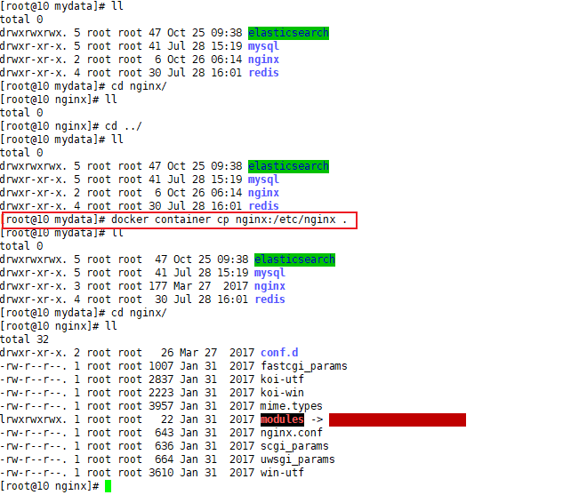

终止原容器：`docker stop nginx`

执行命令删除原容器： `docker rm $ContainerId`

修改文件名称：`mv nginx conf`
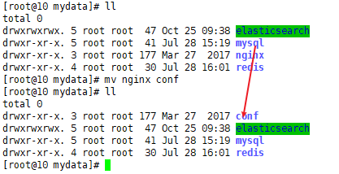
新建 nginx 文件夹，把这个 conf 移动到/mydata/nginx 下
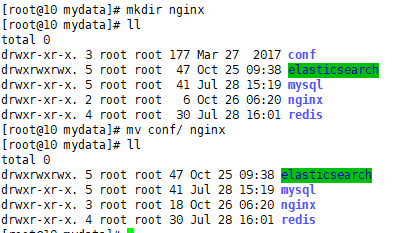

### 2. 创建新的 nginx 容器

```
docker run -p 80:80 --name nginx \
-v /mydata/nginx/html:/usr/share/nginx/html \
-v /mydata/nginx/logs:/var/log/nginx \
-v /mydata/nginx/conf:/etc/nginx \
-d nginx:1.10
```

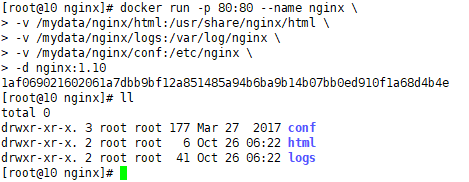
