*Nginx (engine x) 是一个高性能的HTTP和反向代理web服务器，同时也提供了IMAP/POP3/SMTP服务。因其稳定性、丰富的功能集、简单的配置文件和低系统资源的消耗而闻名。在BSD-like 协议下发行。其特点是占有内存少，并发能力强。*
<!-- more -->

> - 在这个虚拟机中
> - 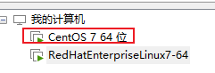

## 0. 准备

### 0.1 安装 Centos 迷你版

极简安装：一路默认。

### 0.2 网络配置

- centos7 中，查看本机 ip 指令变成了`ip addr`
	- 可以看到只有本机地址，没有网络地址
	- 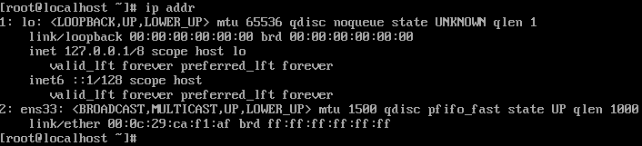
- 修改网卡配置，设置为开机即启动网卡：`vi /etc/sysconfig/network-scripts/ifcfg-ens33`
	- 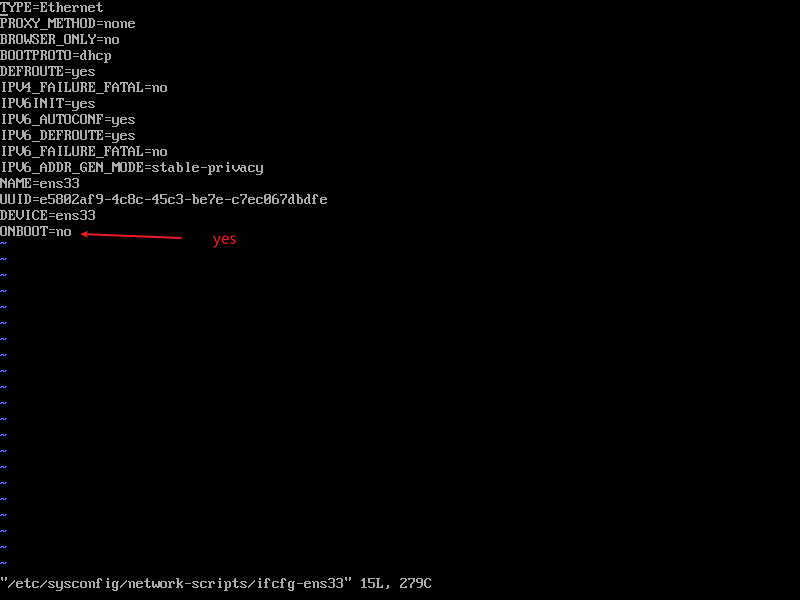
- 重启网路服务：`systemctl restart network`
	- 再次执行`ip addr`，可以看到显示网络地址了，证明网卡启动。
		- 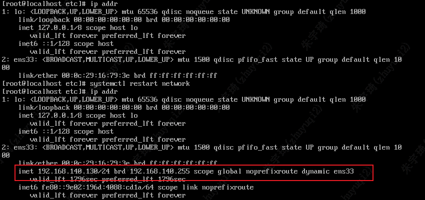

### 0.3 配置静态 ip

- 修改网卡配置：`vi /etc/sysconfig/network-scripts/ifcfg-ens33`
  - 
- 重启网路服务：`systemctl restart network`

### 0.4 解决设置静态 IP 后无法联网问题

无法联网表现：
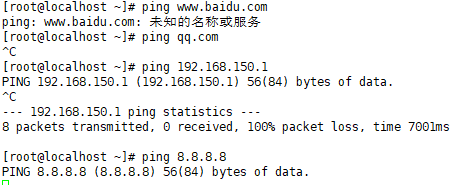

#### 0.4.1 排查网关设置是否正确

1. 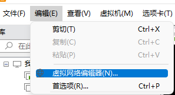
2. 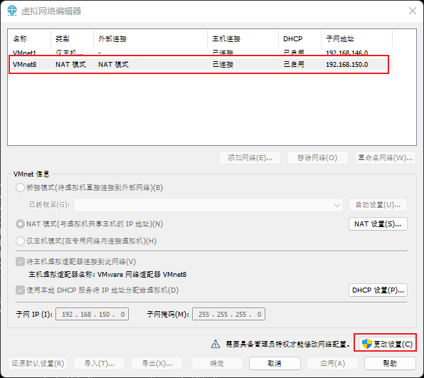
3. 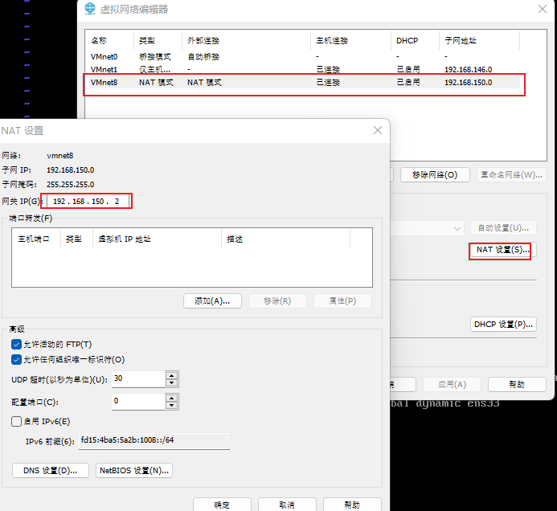

可以看到网关地址没有设置正确。按照 0.3 修改即可。

### 0.5 安装 Tomcat 服务器

安装 tomcat 服务器，作为应用服务器。

1. 复制文件：

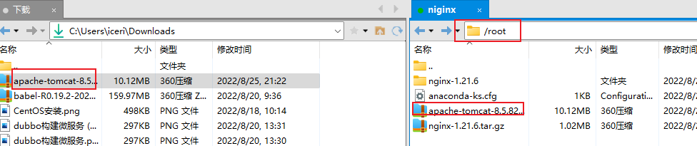

2. 解压缩：`tar -zxvf apache-tomcat-8.5.82.tar.gz `
3. 将解压目录移动至/usr/local/tomcat 文件夹下：`mv apache-tomcat-8.5.82 /usr/local/tomcat`
   - `mv apache-tomcat-8.5.82 /usr/local/tomcat`与`mv apache-tomcat-8.5.82/ /usr/local/tomcat`的区别
   - `mv apache-tomcat-8.5.82 /usr/local/tomcat`会把 apache-tomcat-8.5.82 里面的内容移到 tomcat 文件夹下，apache-tomcat-8.5.82 文件夹删除。
   - `mv apache-tomcat-8.5.82/ /usr/local/tomcat`会把 apache-tomcat-8.5.82 整个文件夹放在 tomcat 文件夹下
4. 进入 tomcat/bin 目录，执行`./startup.sh`
   - 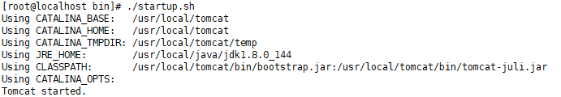
5. 访问测试：
   - 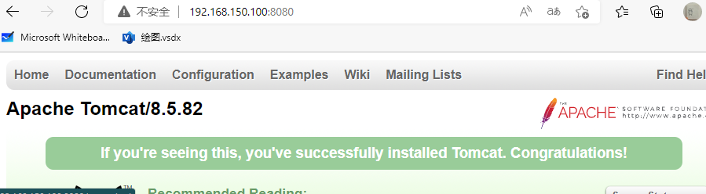
   - 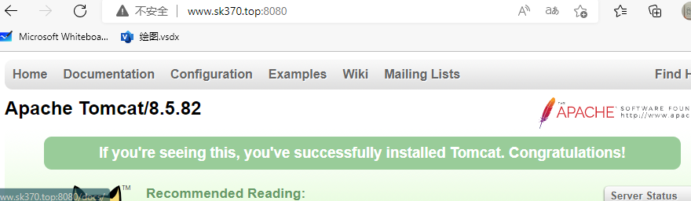
   - 注：这里已经提前关闭里 linux 的防火墙。同时也设置了阿里云域名解析。

## 1. Nginx 介绍

### 1.1 版本介绍

Nginx 开源版：http://nginx.org/

- 无其他额外功能

Nginx plus 商业版：https://www.nginx.com

- 什么都有，但收费

openresty：http://openresty.org/cn/

- 以 lua 脚本对 nginx 进行功能扩展，免费。

Tengine：http://tengine.taobao.org/

- 淘宝开源的以 C 语言对 nginx 进行扩展的项目，集成度非常高。

### 1.2 Nginx 开源版安装

1. 复制文件：

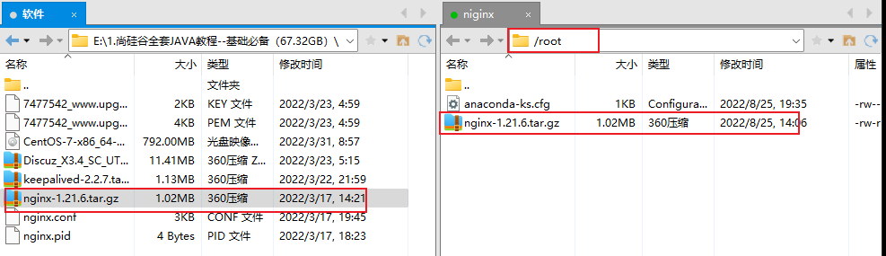

2. 解压缩：`tar -zxvf nginx-1.21.6.tar.gz`
3. 进入解压目录：`cd nginx-1.21.6`
4. 执行安装文件：`./configure`
   - 安装到指定目录：`./configure --prefix=/usr/local/nginx `
     - **这里安装到了**`**/usr/local/nginx**`**，相当于 c 盘 programfile**
   - 解决安装时报的 error：
     - 安装 gcc（c 语言编译器）：`yum install -y gcc`
     - 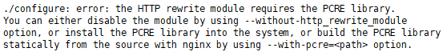
     - 安装 perl 库：`yum install -y pcre pcre-devel`
     - 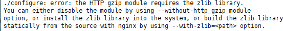
     - 安装 zlib 库：`yum install -y zlib zlib-devel`
   - 安装成功提示：
     - 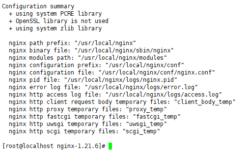
5. 进行编译：`make`
6. 进行安装：`make install`
7. 检查是否安装成功：
   - 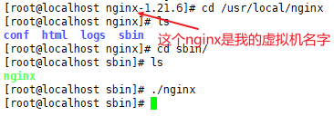
   - 关闭防火墙：`systemctl stop firewalld`
   - 本地主机浏览器查看：访问地址是设定的虚拟机的 ip，nginx 端口默认为 80，可以省略。
     - 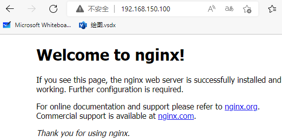
8. Nginx 命令：
   - `./nginx` 启动
   - `./nginx -s stop `快速停止
   - `./nginx -s quit` 优雅关闭，在退出前完成已经接受的连接请求
   - `./nginx -s reload` 重新加载配置，而不用重启 nginx 服务器。机制是 nginx 杀死原线程，开启一个新线程。
9. 给 nginx 设置脚本，快速启动 nignx，而不用进入安装目录去执行文件：
   - 创建服务脚本：`vi /usr/lib/systemd/system/nginx.service`
   - 写入文件：
    ```
    [Unit]
    Description=nginx - web server
    After=network.target remote-fs.target nss-lookup.target

    [Service]
    Type=forking
    PIDFile=/usr/local/nginx/logs/nginx.pid
    ExecStartPre=/usr/local/nginx/sbin/nginx -t -c /usr/local/nginx/conf/nginx.conf
    ExecStart=/usr/local/nginx/sbin/nginx -c /usr/local/nginx/conf/nginx.conf
    ExecReload=/usr/local/nginx/sbin/nginx -s reload
    ExecStop=/usr/local/nginx/sbin/nginx -s stop
    ExecQuit=/usr/local/nginx/sbin/nginx -s quit
    PrivateTmp=true
    [Install]
    WantedBy=multi-user.target
    ```
    - 重启系统加载服务：`systemctl daemon-reload`
    - 停止旧的 nginx 进程。
      - 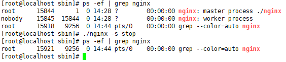
    - 使用脚本启动新 nginx：`systemctl start nginx.service`
    - 查看 nginx 状态：`systemctl status nginx`或者查看进程
      - 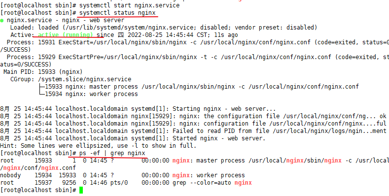

10. 利用脚本设置 nginx 开机启动：`systemctl enable nginx.service`

### 1.3 防火墙补充知识

关闭防火墙
`systemctl stop firewalld.service`
禁止防火墙开机启动
`systemctl disable firewalld.service`
放行端口
`firewall-cmd --zone=public --add-port=80/tcp --permanent`
重启防火墙
`firewall-cmd --reload`
查看防火墙状态
`systemctl status firewalld`
重载防火墙规则
`firewall-cmd --reload`
查看已配置防火墙规则
`firewall-cmd --list-all`
限定访问端口与访问 ip
`firewall-cmd --permanent --add-rich-rule="rule family="ipv4" source address="192.168.44.101" port protocol="tcp" port="8080" accept`
移除规则
`firewall-cmd --permanent --remove-rich-rule="rule family="ipv4" source address="192.168.44.101" port port="8080" protocol="tcp" accept`

### 1.4 文件结构

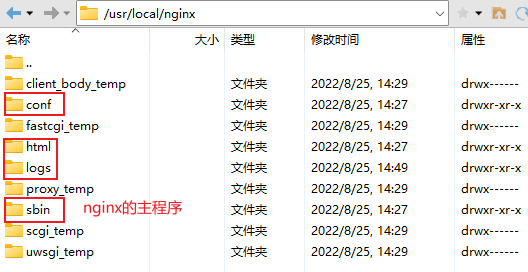
默认只有红框的几个文件，带 temp 的文件是运行过程的缓存文件。

### 1.5 基本运行原理

nginx 启动后会启动 master 主进程和 work 子进程，主进程负责协调子进程，主进程主要进行配置文件校验，子进程负责处理请求。

### 1.6 nginx 配置文件

#### 1.6.1 最小配置文件

```conf
worker_processes  1;

events {
    worker_connections  1024;
}

http {
  include       mime.types;
  default_type  application/octet-stream;

  sendfile        on;

  keepalive_timeout  65;

  server {
      listen       80;
      server_name  localhost;

      location / {
          root   html;
          index  index.html index.htm;
      }

      error_page   500 502 503 504  /50x.html;
      location = /50x.html {
          root   html;
      }
   }
 }
```

#### 1.6.2 配置解析

worker_processes 1; 默认为 1，表示开启一个业务进程
worker_connections 1024; 单个业务进程可接受连接数
include mime.types; 引入 http mime 类型。是一个文件，记录了常见的文件类型。
default_type application/octet-stream; 如果 mime 类型没匹配上，默认使用二进制流的方式传输。
sendfile on; 使用 linux 的 sendfile(socket, file, len) 高效网络传输，也就是数据 0 拷贝。
keepalive_timeout 65;
server：虚拟主机配置，一个 server 就是一个虚拟主机。

- listen：端口号
- server_name：主机名
- location：匹配路径
  - root：文件目录
  - index：默认页文件名称
- error_page：报错编码对应页面

## 2. Nginx 实战

### 2.0 实战基础

#### 2.0.1 虚拟主机与域名解析

1. 域名、dns、ip 地址的关系：


2. 浏览器、Nginx 与 http 协议的关系：
3. 虚拟主机原理：原本一台服务器只能对应一个站点，通过虚拟主机技术可以虚拟化成多个站点同时对外提供服务
   - 使用 server 配置，与虚拟机文件目录建立对应关系

#### 2.0.2 server_name

1. server_name 多域名配置：使用空格将多个域名分开
2. 域名匹配根据从上到下的顺序，只有一个入口。
3. 如果域名全部都没精确匹配，且域名解析设置了通配符匹配，则按照统配符的匹配规则进行。
4. server_name 也可以设置通配符匹配，匹配规则同阿里云解析。
5. 支持正则匹配

#### 2.0.3 域名解析技术架构

1. 本机 hosts 文件：本机设置了 127.0.0.1 与www.123.com的域名映射，所以访问www.123.com也能访问到。
   - 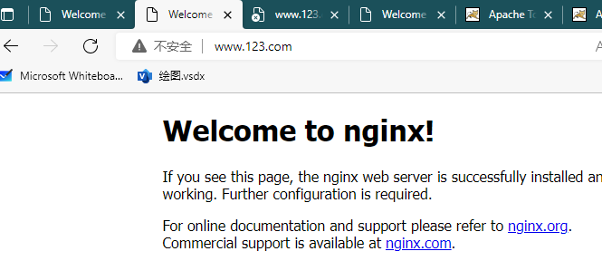
2. 阿里云 dns 服务：通过阿里云平台设置 dns 与 ip 的映射，可以测试到可以正常访问。
   - 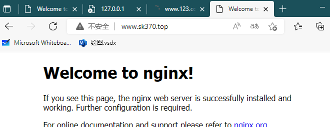
   - 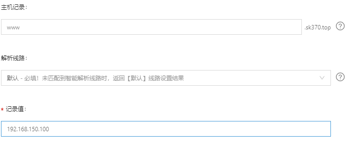

多用户二级域名
短网址
httpdns

### 2.1 反向代理

#### 2.1.1 正向代理

正向代理 是一个位于客户端和原始服务器(origin server)之间的服务器，为了从原始服务器取得内容，客户端向代理发送一个请求并指定目标(原始服务器)，然后代理向原始服务器转交请求并将获得的内容返回给客户端。客户端必须要进行一些特别的设置才能使用正向代理。

#### 2.1.2 反向代理

反向代理（Reverse Proxy）实际运行方式是指以代理服务器来接受 internet 上的连接请求，然后将请求转发给内部网络上的服务器，并将从服务器上得到的结果返回给 internet 上请求连接的客户端，此时代理服务器对外就表现为一个服务器。
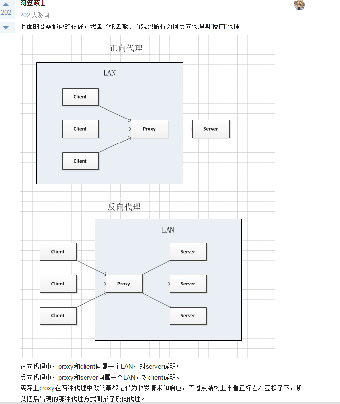

#### 2.1.3 反向代理配置

在虚拟机中开启了 nginx，在虚拟机中直接访问 localhost、127.0.0.1、192.168.150.110 三个地址均能访问到页面，其中 localhost、127.0.0.1 为虚拟机本机访问，用不到代理。代理服务器就是应用服务器的作用。

实现效果：本地或者网络的方式访问 nginx 服务器的地址，可以访问到其他服务器的内容，而请求地址没有发生变化。

如：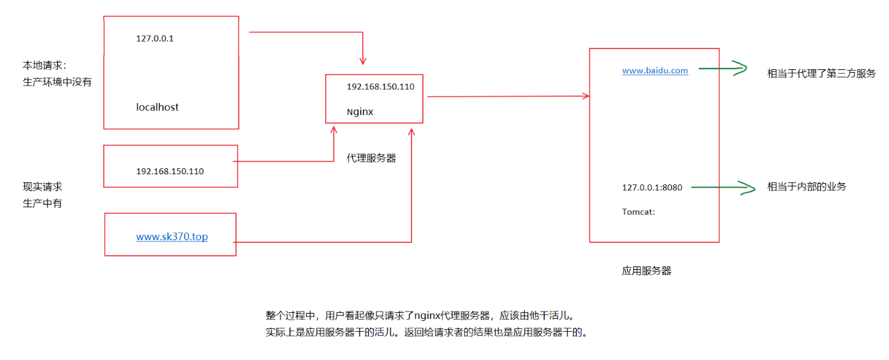
可以设计如下反向代理场景：

反向代理服务器 1：请求 192.168.150.110:80，返回http://www.baidu.com的页面

反向代理服务器 2：请求 192.168.150.110:81，返回http://www.sk370.top:8080

注意：1.由于 192.168.150.110 与www.sk370.top是域名解析，由阿里云服务器完成，不涉及代理服务器，二者本质是来自一个地方的请求。（www.sk370.top的请求会被阿里云服务器解析成ip地址去请求） 2.同时，在本地主机不能使用 localhost:80 或 81 和 127.0.0.1:80 或 81 去访问呢，这两个访问只能在虚拟机中进行。 3.http://www.sk370.top也可以写成http://127.0.0.1或者http://localhost:8080或者htttp://192.168.150.100

```
worker_processes  1;

events {
    worker_connections  1024;
}

http {
    include       mime.types;
    default_type  application/octet-stream;

    sendfile        on;

    keepalive_timeout  65;

    server {
        listen       80;
        server_name  localhost;

        location / {
           proxy_pass http://www.baidu.com;
    }

        error_page   500 502 503 504  /50x.html;
        location = /50x.html {
            root   html;
    }
  }
}
```

总结：反向代理的关键配置语句为 proxy_pass，地址必须写全协议，注意末尾分号。

#### 2.1.4 多 webapp（服务）配置

```
http {
	#此处省略一些基本配置

	upstream product_server{
		server www.helloworld.com:8081;
	}

	upstream admin_server{
		server www.helloworld.com:8082;
	}

	upstream finance_server{
		server www.helloworld.com:8083;
	}

	server {
		#此处省略一些基本配置
		#默认指向product的server
		location / {
			proxy_pass http://product_server;
		}

		location /product/{
			proxy_pass http://product_server;
		}

		location /admin/ {
			proxy_pass http://admin_server;
		}

		location /finance/ {
			proxy_pass http://finance_server;
		}
	}
}
```

#### 2.1.5 https 的反向代理

- HTTPS 的固定端口号是 443，不同于 HTTP 的 80 端口
- SSL 标准需要引入安全证书，所以在 nginx.conf 中你需要指定证书和它对应的 key

```
#HTTP服务器
server {
    #监听443端口。443为知名端口号，主要用于HTTPS协议
    listen       443 ssl;

    #定义使用www.xx.com访问
    server_name  www.helloworld.com;

    #ssl证书文件位置(常见证书文件格式为：crt/pem)
    ssl_certificate      cert.pem;
    #ssl证书key位置
    ssl_certificate_key  cert.key;

    #ssl配置参数（选择性配置）
    ssl_session_cache    shared:SSL:1m;
    ssl_session_timeout  5m;
    #数字签名，此处使用MD5
    ssl_ciphers  HIGH:!aNULL:!MD5;
    ssl_prefer_server_ciphers  on;

    location / {
        root   /root;
        index  index.html index.htm;
    }
}
```

### 2.2 负载均衡

#### 2.2.1 介绍

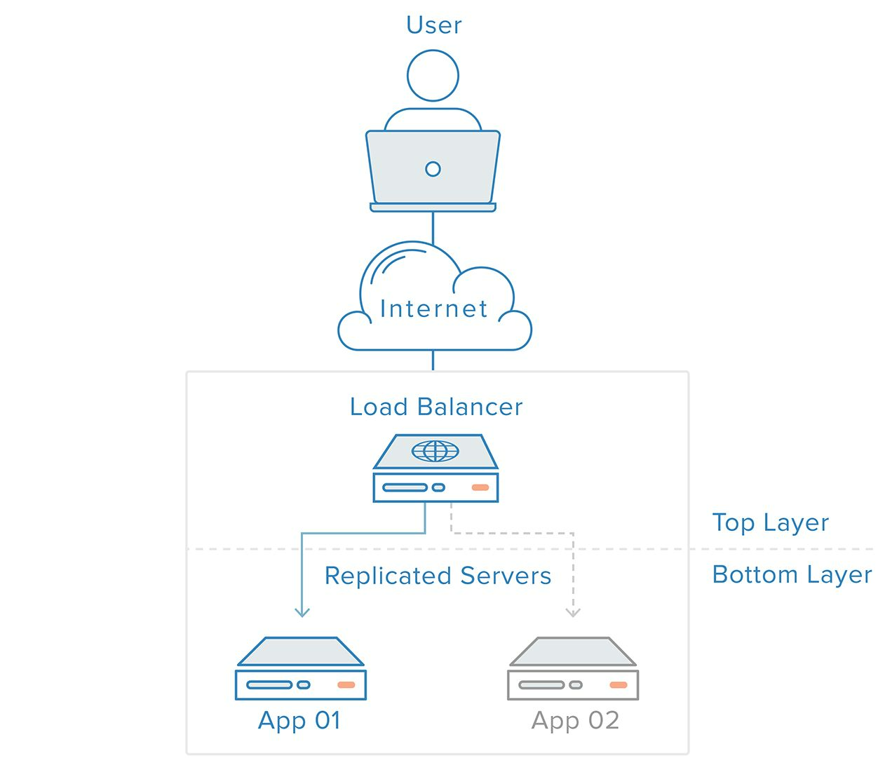

#### 2.2.2 简版负载均衡

将服务器 100 作为负载均衡器
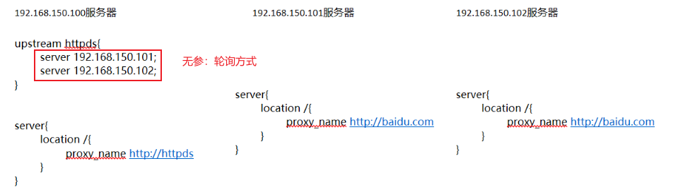

#### 2.2.3 配置权重

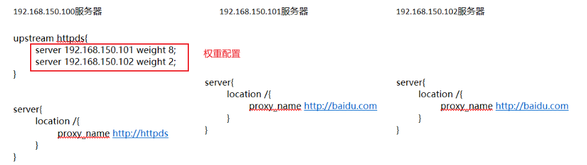

#### 2.2.4 取消代理作用

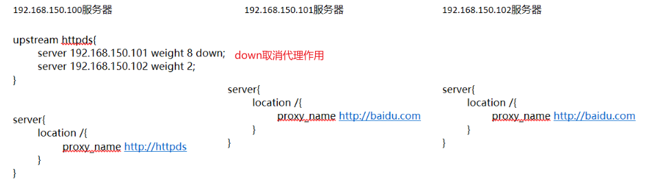

#### 2.2.5 backup 作用

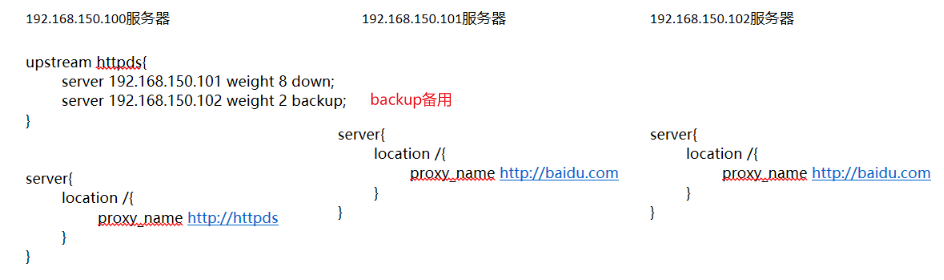

#### 2.2.6 其他策略

轮询存在问题：无法保持会话。（解决会话：使用基于客户端的无状态 token 会话保持机制，每次请求进行发送，服务器接收到后进行解密）

1. ip_hash 策略：根据客户端的 ip 转发同一台服务器。移动端 ip 根据基站位置确定，ip 根据位置变化而变化，也无法保持会话。

```
upstream bck_testing_01 {

  ip_hash;

  # with default weight for all (weight=1)
  server 192.168.250.220:8080
  server 192.168.250.221:8080
  server 192.168.250.222:8080

}
```

2. least_conn：将请求转发到当前连接数最少的用户。一般而言，连接少可能是因为权重低（设置低权重是因为配置低），这是与当初设计违背的。同时不支持动态上下线，比如新增了一台服务区，肯定当前连接数为 0，需要其他服务器将连接数转到新上线的服务器，过程耗时。下面是加权最小连接的配置，去掉权重就是普通最小连接的配置。

```
upstream bck_testing_01 {
  least_conn;

  server 192.168.250.220:8080   weight=3
  server 192.168.250.221:8080              # default weight=1
  server 192.168.250.222:8080              # default weight=1
}
```

3. url_hash：根据用于访问访问的 url 转发请求（定向流量转发），也不能维持会话。适用于访问固定资源不在同一服务器。
4. fair：根据后端的服务器响应时间转发请求。响应快的服务器接收的请求多，存在流量倾斜风险，且需要第三方插件实现。官方不推荐。

### 2.3 动静分离

#### 2.3.1 动静分离配置

概念：将静态资源放在 nginx 服务器或其他服务器。

```
location / {
  proxy_pass http://127.0.0.1:8080;
}
location /css {
  root /usr/local/nginx/static;
  index index.html index.htm;
}
location /images {
  root /usr/local/nginx/static;
  index index.html index.htm;
}
location /js {
  root /usr/local/nginx/static;
  index index.html index.htm;
}
```

#### 2.3.2 正则匹配优化 location 数目

1. location 前缀解释：
   - `/`通用匹配，所有请求都会匹配到。
   - `=`精确匹配，不是以指定模式开头
   - `~`正则匹配，区分大小写
   - `~*`正则匹配，不区分大小写。
   - `^~`非正则匹配，匹配以指定模式开头的
2. location 匹配顺序：
   - 多个正则 location 直接按书写顺序匹配，成功后就不会继续往后面匹配
   - 普通（非正则）location 会一直往下，直到找到匹配度最高的（最大前缀匹配）
   - 当普通 location 与正则 location 同时存在，如果正则匹配成功,则不会再执行普通匹配
   - 所有类型 location 存在时，“=”匹配 > “^~”匹配 > 正则匹配 > 普通（最大前缀匹配）

#### 2.3.3 alias 与 root

```
location ~*/(css|img|js) {
  root /usr/local/nginx/static;
  index index.html index.htm;
}
```

```
location /css {
  alias /usr/local/nginx/static/css;
  index index.html index.htm;
}
```

- root 用来设置根目录，而 alias 在接受请求的时候在路径上不会加上 location。
- alias 指定的目录是准确的，即 location 匹配访问的 path 目录下的文件直接是在 alias 目录下查找的；
- root 指定的目录是 location 匹配访问的 path 目录的上一级目录,这个 path 目录一定要是真实存在 root 指定目录下的；
- 使用 alias 标签的目录块中不能使用 rewrite 的 break（具体原因不明）；另外，alias 指定的目录后面必须要加上"/"符号！！
- alias 虚拟目录配置中，location 匹配的 path 目录如果后面不带"/"，那么访问的 url 地址中这个 path 目录后面加不加"/"不影响访问，访问时它会自动加上"/"； 但是如果 location 匹配的 path 目录后面加上"/"，那么访问的 url 地址中这个 path 目录必须要加上"/"，访问时它不会自动加上"/"。如果不加上"/"，访问就会失败！
- root 目录配置中，location 匹配的 path 目录后面带不带"/"，都不会影响访问。

### 2.4 UrlRewrite

> 使用意义：
>
> - 配置短地址
> - 隐藏真实请求地址
> - 设置防火墙隔离

#### 2.4.1 rewrite 语法格式及参数语法

语法：`rewrite <regex> <replacement> [flag]`

- flag 标记说明：
  - last #本条规则匹配完成后，继续向下匹配新的 location URI 规则
  - break #本条规则匹配完成即终止，不再匹配后面的任何规则
  - redirect #返回 302 临时重定向，浏览器地址会显示跳转后的 URL 地址【用于给爬虫展示】
  - permanent #返回 301 永久重定向，浏览器地址栏会显示跳转后的 URL 地址 【用于给爬虫展示】

#### 2.4.2 示例

```
location / {
  rewrite ^/([0-9]+).html$ /index.jsp?pageNum=$1 break;
  proxy_pass http://127.0.0.1:8080;
}
```

效果：访问`http://192.168.150.100:8080/index.jsp?pageNum=1`浏览器地址栏显式的是`http://192.168.150.100:8080/1.html`

### 2.5 解决跨域

解决跨域问题一般有两种思路：

1. CORS：在后端服务器设置 HTTP 响应头，把你需要允许访问的域名加入 Access-Control-Allow-Origin 中。
2. jsonp：把后端根据请求，构造 json 数据，并返回，前端用 jsonp 跨域。

举例：[www.helloworld.com](http://www.helloworld.com/) 网站是由一个前端 app ，一个后端 app 组成的。前端端口号为 9000， 后端端口号为 8080。

前端和后端如果使用 http 进行交互时，请求会被拒绝，因为存在跨域问题。nginx 解决跨域如下：

首先，新建 enable-cors.conf 文件，设置 cors ：

```
# allow origin list
set $ACAO '*';

# set single origin
if ($http_origin ~* (www.helloworld.com)$) {
  set $ACAO $http_origin;
}

if ($cors = "trueget") {
	add_header 'Access-Control-Allow-Origin' "$http_origin";
	add_header 'Access-Control-Allow-Credentials' 'true';
	add_header 'Access-Control-Allow-Methods' 'GET, POST, OPTIONS';
	add_header 'Access-Control-Allow-Headers' 'DNT,X-Mx-ReqToken,Keep-Alive,User-Agent,X-Requested-With,If-Modified-Since,Cache-Control,Content-Type';
}

if ($request_method = 'OPTIONS') {
  set $cors "${cors}options";
}

if ($request_method = 'GET') {
  set $cors "${cors}get";
}

if ($request_method = 'POST') {
  set $cors "${cors}post";
}
```

在 nginx.conf 中 include enable-cors.conf 来引入跨域配置：

```
# ----------------------------------------------------
# 此文件为项目 nginx 配置片段
# 可以直接在 nginx config 中 include（推荐）
# 或者 copy 到现有 nginx 中，自行配置
# www.helloworld.com 域名需配合 dns hosts 进行配置
# 其中，api 开启了 cors，需配合本目录下另一份配置文件
# ----------------------------------------------------
upstream front_server{
  server www.helloworld.com:9000;
}
upstream api_server{
  server www.helloworld.com:8080;
}

server {
  listen       80;
  server_name  www.helloworld.com;

  location ~ ^/api/ {
    include enable-cors.conf;
    proxy_pass http://api_server;
    rewrite "^/api/(.*)$" /$1 break;
  }

  location ~ ^/ {
    proxy_pass http://front_server;
  }
}
```

### 2.6 网关

前面给 nginx 服务器配置了反向代理、负载均衡、UrlWrite、跨域等功能，已经不能叫一个普通的服务器了，此时叫做网关服务器。
网关服务器配置需要利用反向代理、防火墙实现。实现效果：外部请求只能发送到网关服务器，tomcat 只接受网关服务器的请求。

1. 指定请求地址与请求端口，让 tomcat 只接收网关的请求：`firewall-cmd --permanent --add-rich-rule="rule family="ipv4" source address="192.168.44.101" port protocol="tcp" port="8080" accept"`
2. 网关配置：

```
upstream httpds {
  server 192.168.44.102 weight=8 down;
  server 192.168.44.103:8080 weight=2;
  server 192.168.44.104:8080 weight=1 backup;
}
location / {
  rewrite ^/([0-9]+).html$ /index.jsp?pageNum=$1 redirect;
  proxy_pass http://httpds ;
}
```

###
