## 1. .NET框架

### 1.1 .NET组成

组成一：

1. 编程工具
2. CLR：Common Language Runtime，公共语言运行库——执行环境。
3. BCL：Base Class Library，基类库。

组成二：

1. CLR：Common Language Runtime，公共语言运行库——执行环境。
2. FCL：基类库，Framework Class Library。

   - FCL是BCL的超集。


### 1.2 源码执行过程

1. 源码→程序集

   1. 程序集特点：可执行，或为dll。
   2. 程序集语言：CIL（Common Intermediate Languange），公共中间语言。
   3. 程序集内容：

      - CIL
      - 类型元数据
      - 对其他程序集引用的元数据。


2. CIL→本机代码

## 2. C#基本语法规则

### 2.1 标识符

1. 数字不能开头。
2. @只能放开头，但不建议使用。

### 2.2 关键字

关键字：

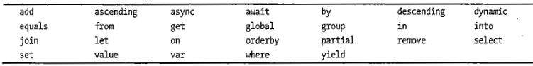

上下文关键字：

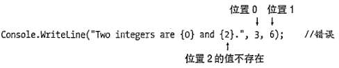

- 上下文关键字仅在特定的语言结构中充当关键字的标识符。
- 关键字不能被用作标识符，上下文关键字可以在代码的其他部分用作标识符。

### 2.3 Main方法

1. Main方法是所有C#程序的入口。
2. Main首字母大写。

### 2.4 空白

1. 空白指没有可视化输出。
2. 空白编译时忽略。
3. 空白增加可读性。
4. 分类：

   - 空格
   - 制表符
   - 换行符
   - 回车符


### 2.5 语句

1. 含义：描述一个类型或告诉程序执行某个动作的源代码指令。
2. 简单语句：以`;`结束。
3. 块：由一对`{}`包裹的0条或多条简单语句。

   - 在语法上相当于一条一句。
   - 块末尾的大括号不需要`;`


### 2.6 输出

BCL提供一个System命名空间的Console类，包含了输入和输出到控制台的方法。

#### 2.6.1 Write

1. 不换行输出。
2. 字符串使用双引号包裹。

#### 2.6.2 WriteLine

1. 换行输出。
2. 其他同Write

#### 2.6.3 格式字符串

Write和WriteLne输出多个参数时：

1. 语法：`Console.WriteLine("格式字符串{0}格式字符串{1}",替换值0,替换值1);`
2. 参数间使用逗号分隔。
3. 第一个参数必须是字符串，称为格式字符串。格式字符串包含替代标记。

   - 替代标记由一个整数及大括号组成，整数代表替换值的位置。
   - 替代标记的整数从0开始。

4. C#6.0引入字符串插值方法：

   ```c#
   int var1 = 3;
   int var2 = 6;
   Console.WriteLine($"Two Sample integers are {var1} and {var2}");
   ```


#### 2.6.4 多重标记和值

1. 替代标记位置和数量任意。

   - 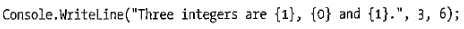

2. 替代标记的整数值不能超过替换值的数量。

   - 不会产生编译错误。
   - 会产生运行时错误（异常）。
   - 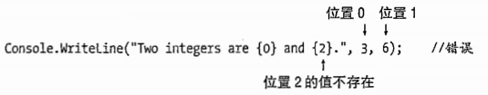


#### 2.6.5 格式化数字字符串

1. 对齐：

   1. 格式字符串语法：`{index,alignment}`
   2. alignment正数表示右对齐，负数表示左对齐。

      - alignment小于字符串的长度，则对齐忽略


2. 格式化：

   1. 语法：`{index:format}`

      - `:`和format之间不能有空格。

   2. format：

      - 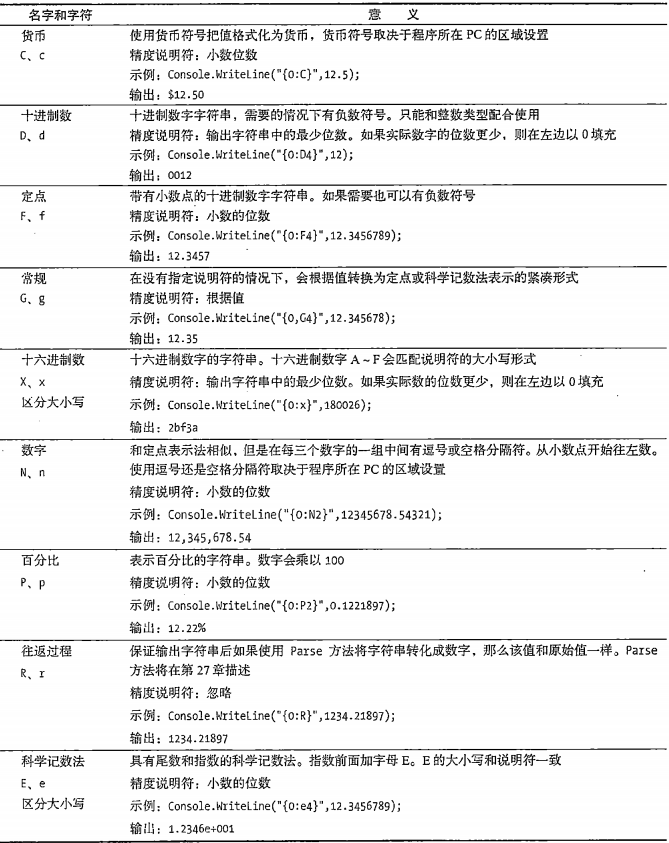


3. 对齐和格式化可以一起用，格式为：`{index,alignment:format}`

### 2.7 注释

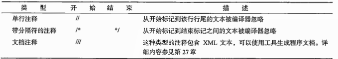

### 2.8 命名规范

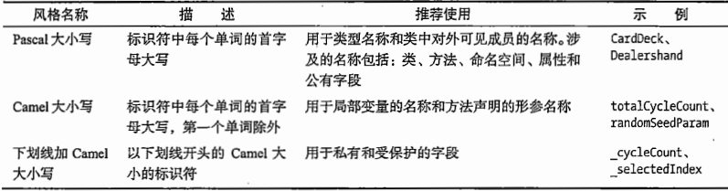

- 微软没有推荐第三种，但代码中大量使用了。
- 建议不要使用第三种。

## 3. 类型、存储和变量

1. C#程序是一组类型声明。

   1. C程序是一组函数和数据类型。
   2. C++程序是一组函数和类。

2. 类型是一种模板。组成：

   1. 名称
   2. 数据结构
   3. 一些行为和约束条件

3. 实例化类型：从某个类型模板创建的实际对象，成为实例化类型。
4. 数据成员和函数成员。

   1. 非简单类型可以包含不同类型的数据项，这些数据项个体称为成员。
   2. 数据成员：保存了与这个类的对象或整个类相关的数据。
   3. 函数成员：执行代码。定义类型行为。

5. 预定义类型：

   1. 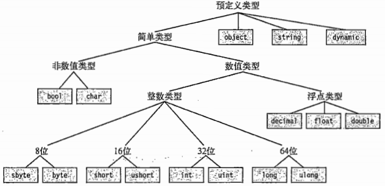
   2. 共16种，包含11种数值类型，1种unicode字符类型，1种bool类型，3种非简单类型：

      - string，unicode字符数组
      - object，所有其他类型的基类
      - dynamic，使用动态语言编写的程序集使用。

   3. 预定义类型的类型名称均为小写字母
   4. C#的类型名称底层映射到.net的类型名称，二者语法互相符合，但不建议使用.net的语法代替C#语法。
   5. 预定义简单类型：

      - 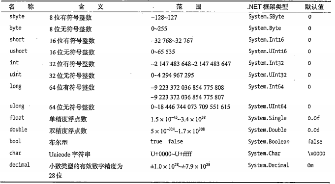

   6. 预定义非简单类型：

      - 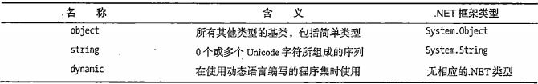


6. 用户自定义类型：

   1. 类类型：class
   2. 结构类型：struct
   3. 数组类型：array
   4. 枚举类型：enum
   5. 委托类型：delegate
   6. 接口类型：interface

7. 类型的分类：

   1. 值类型：数据存放在栈内存中，存储实际的数据。
   2. 引用类型：第一段数据，存放在堆内存中，存储实际的数据；第二段引用，存放指向数据在堆内存中的地址，在栈中。

      - 引用类型对象的成员：

        1. 数据部分始终存放在堆内存中。
        2. 值类型或引用类型的引用部分可能存放在堆中，也可能在栈中。
        3. 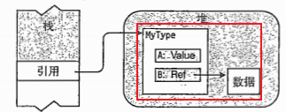


   3. 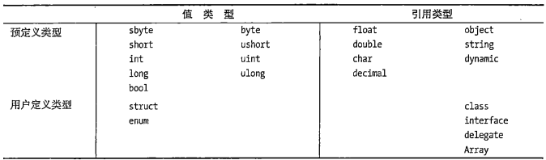

8. 变量：

   1. 分类：

      - 

   2. 默认初始化：

      | 变量类型 | 存储位置   | 自动初始化 | 用途                       |
      | -------- | ---------- | ---------- | -------------------------- |
      | 局部变量 | 栈或栈和堆 | 否         | 用于函数成员内部的局部计算 |
      | 类字段   | 堆         | 是         | 类的成员                   |
      | 结构字段 | 栈或堆     | 是         | 结构的成员                 |
      | 参数     | 栈         | 否         | 用于把值传入或传出         |
      | 数组元素 | 堆         | 是         | 数组的成员                 |

   3. 多变量声明：使用逗号分隔，类型必须一致，可以包含初始化语句。

      - 如：`double var1=2.5,var2;`


9. dynamic关键字：

   1. .net的一些程序集是动态语言编写的，而c#是静态语言，为了让C#能够使用这些程序集，并且在编译时解析类型，C#引入了dynamic关键字。
   2. dynamic类型的变量编译时不会进行类型检查，运行时会进行类型检查。

10. 可空类型：

   1. 作用：表示变量未存储有效值。
   2. 引用类型：将值赋为null，即可表示可空类型。
   3. 普通的值类型称为非可空类型。


## 4. 类的基本概念

### 4.1 类的概念

1. 定义：

   1. 类是程序的数据和功能被组织为逻辑上相关的数据项和函数的封装集合。
   2. 类是一个能存储数据并执行代码的数据结构。

2. 组成：

   1. 数据成员
   2. 函数成员

3. 成员的类型：

   1. 


### 4.2 声明类、创建类

1. 声明类并不创建类的实例，只创建用于创建实例的模板。
2. 组成：

   1. 类名
   2. 类成员
   3. 类特征：如关键字class

3. 声明类：即定义一个类。
4. 创建类（为类类型的变量分配内存）：使用new关键字。

### 4.3 类成员

1. 类成员有很多，最重要的为字段和方法，一个为数据成员，一个为函数成员。

按照另外一个分法：类成员可以分为：

- 实例成员：成员关联到类的一个实例。
- 静态成员：成员关联到整个类，即所有实例。

  1. 使用static修饰
  2. 使用类名访问
  3. 也可以使用`using static`

     ```c#
     using static System.Console
     ……
     WriteLine("")
     
     // 等价于：
     using System
     ……
     Console.WriteLine("")
     ```


#### 4.3.1 字段

1. 字段是一种变量，只能声明在类内部。
2. 字段可以显式初始化，也可以隐式初始化。隐式初始化时，字段值会被编译器设置为默认值，默认值由字段类型决定。

#### 4.3.2 方法

1. 概念：具有名称的可执行代码块。
2. 组成：

   1. 方法头：

      1. 返回类型
      2. 名称
      3. 参数列表

         - 名称和参数列表组成签名。不包括返回类型。


   2. 方法体：

      1. 局部变量
      2. 控制流结构
      3. 方法调用
      4. 内嵌的块
      5. 其他方法：称为局部函数


3. 静态方法：使用static修饰符声明的方法

   1. 不能访问实例成员，可以访问其他静态成员。


#### 4.3.3 属性

```c#
class C1{
    private int theRealValue;   //字段，分配内存
    public int MyValue{         //属性，未分配内存
        set{
            theRealValue = value;
        }
        get{
            return theRealValue;
        }
    }
}
// c#7.0
class C1{
    private int theRealValue;   //字段，分配内存
    public int MyValue{         //属性，未分配内存
        set => value;
        get => theRealValue
    }
}
```

1. 写入属性：`MyValue = 5;`赋值：隐式调用set方法。
2. 读取属性：`z = MyValue;`表达式：隐式调用get方法。
3. 不能显式调用访问器（get和set）会编译报错：

   1. `y = MyValue.get()`
   2. `MyValue.set(5)`

4. 属性和关联字段：通常类中会使用private声明字段，使用public声明属性，该属性用于操作private声明的字段。

   1. 名称约定方式一：

      ```c#
      private int firstField;
      public int FirstField{}
      ```

   2. 名称约定方式二：

      ```c#
      private int _secondField;
      public int SecondField{}
      ```


5. 只有get称为只读属性，只有set称为只写属性。set和get必须定义一个，否则会编译报错。
6. 计算只读属性;

   1. 属性只有get
   2. 属性没有与之唯一对应的字段。

7. 自动实现属性：由于通常属性与字段一一对应，为了简化编码，C#提供自动实现属性（自动属性），只用声明属性，而不用声明字段，编译器会自动创建字段并与属性进行挂接。

   1. 自动属性的get和set不能有方法体。


#### 4.3.4 实例构造函数

1. 特殊的方法：

   1. 名称和类名一致。
   2. 没有返回类型。
2. 在创建类实例时调用
3. 类声明中没有显式提供实例构造函数，会默认生成隐式实例构造函数：

   1. 无参。
   2. 方法体为空。
   3. 一旦有显式的实例构造函数，该函数不会生成。
   4. 可以使用访问修饰符。
4. 静态实例构造函数使用static修饰，初始化类级别的项：

   1. 实例静态函数调用时机：

      - 引用任何静态成员之前
      - 创建类实例之前

   2. 特点：

      - 不能显式调用静态构造函数。
      - 一个类只能有一个不带参的静态实例构造函数。
      - 不能有访问修饰符。
      - 不能使用this访问器。
5. 对象初始化语句：
   1. 形式（2种）：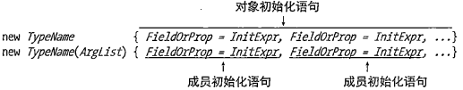
   2. 组成：new关键字、类名或构造函数、对象初始化语句。
   3. 作用：创建新的对象实例时，设置字段和属性的值。
   4. 执行时机：构造方法执行之后。
6. 匿名类型：
   1. 组成：new关键字、对象初始化语句。
   2. 形式：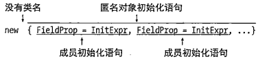
   3. 示例：
      1. 
   4. 注意事项：
      1. 只能用于局部变量，不能用于类成员。
      2. 只能使用var关键字推断变量类型。
      3. 创建的匿名类型的对象属性是只读的。

#### 4.3.5 析构函数

1. 析构函数执行在类的实例被销毁之前需要清理或释放非托管资源的行为；

   1. 非托管资源：通过 Win32API获得的文件句柄，或非托管内存块。

      - 使用.net资源无法获取。


#### 4.3.6 索引器

1. 索引器是一组get和set访问器，与属性类似。
2. 索引器定义后，调用类实例对象的字段，可以使用`实例名[index]`的形式获取字段值——类似于数组访问。
3. 与属性的异同：

   1. 索引器不用分配内存来存储
   2. 索引器和属性都用来访问其他数据成员，但属性通常表示单个数据成员，索引器表示多个数据成员。
   3. 不能显式调用索引器的set和get

4. *可以简单的认为索引器是类的多个数据成员的get和set访问属性组合。*
5. 注意事项：

   1. 索引器get、set访问器可以只有一个，也可以都有
   2. 索引器不能声明为static。因为static不能访问非static的字段。

6. 声明：

   ```c#
   ReturnType this [Type param1, ...]{
       get{
   
       }
       set{
   
       }
   }
   ```

   1. this是关键字
   2. 索引器没有名称
   3. 参数列表使用`[]`
   4. 参数列表至少声明一个参数。

7. 示例：

   ```c#
   class Employee{
       public string LastName;
       public string FirstName;
       public string CityOfBirth;
   
       public string this[int index]{
           set{
               switch(index){
                   case 0:LastName = value;
                       break;
                   case 1:FirstName = value;
                       break;
                   case 2:CityOfBirth = value;
                       break;
   
                   default:
                       throw new ArgumentOutOfRangeException("index");
               }
           }
   
           get{
               case 0:return LastName;
               case 1:return FirstName;
               case 2:return CityOfBirth;
   
               default:
                   throw new ArgumentOutOfRangeException("index");
           }
       }
   }
   ```

8. 索引器重载：索引器使用不同的参数列表，所以类可以有任意多个索引器。

### 4.4 修饰符

#### 4.4.1 访问修饰符

1. 作用：指明程序的其他部分如何访问成员。
2. 分类：

   1. 私有的——private

      - 只能从声明它的类的内部访问，其他类看不见或不可访问。
      - 默认不写即为私有。

   2. 公有——public

      - 对所有程序集的所有类可见。

   3. 受保护——proctected

      - 对本类成员和所有继承类（基类可能在其他程序集）可见。

   4. 内部——internal

      - 对本类所在的程序集的所有类可见。

   5. 受保护内部——protected internal

      - protected和internal的并集，对本类所在的程序集，继承类（基类可能在其他程序集）可见

   6. 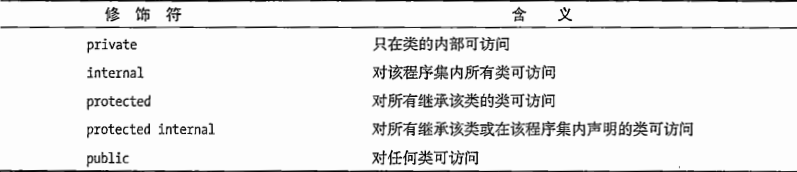
   7. 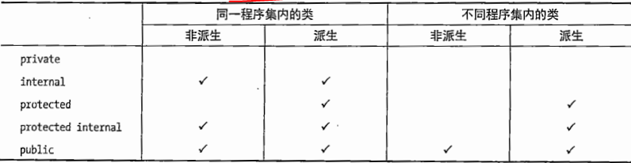

3. 级别

   1. 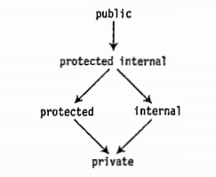

4. 类的访问修饰符：public和internal

   1. public可以被系统内任何程序集访问
   2. internal只能被自己所在程序集访问。默认为internal

5. 成员的可访问行不能比它的类高。

#### 4.4.2 static修饰符


打勾的可以声明为static类型。

#### 4.4.3 readonly修饰符

1. 修饰字段。

   1. 可以在字段声明时初始化。类似于const。
   2. 如果字段只声明，可以在构造函数中初始化。

      - 如果字段是static修饰的且只声明，则必须在构造函数中初始化。


2. 与const的区别：

   1. const必须在声明时初始化
   2. const必须在编译阶段确定值，readonly可以在运行时确定。


#### 4.4.4 this关键字

1. 只能用于代码块中，指代对当前实例的引用：

   1. 实例构造函数
   2. 实例方法
   3. 属性和索引器的实例访问器

2. 不能用于任何静态函数成语的代码中。因为静态成员不是实例的一部分，它是类的一部分。
3. 作用：

   1. 区分类成员和局部变量、区分类成员和参数
   2. 作为调用方的实参


#### 4.4.5 set和get的访问修饰符

1. 默认情况下set和get访问器的访问修饰符同它们所在的属性或索引器
2. 也可以为get和set设置不同的访问级别

   1. 一般set设置为private
   2. 一般get设置为public

3. 注意事项：

   1. 只有set和get同时存在才能使用访问修饰符
   2. set和get只能有一个使用访问修饰符。
   3. 访问器的访问级别必须小于等于属性/索引器的访问级别。没理解？


### 4.5 分部类和分部类型

1. 类的声明可以分割成几部分，每部分叫分部类

   1. 分部类可以在同一个文件，也可以在不同文件
   2. 每个分部类都含有一些类成员声明。
   3. 每个分部类都必须标注为`partial class`

      - `partial`可以用在class、struct、interface之前


## 5. 方法

方法的特性适用于类、struct。

### 5.1 方法体成员

#### 5.1.1 局部变量

1. 字段通常保存和对象状态有关的数据。
2. 局部变量经常用于保存局部或临时的计算数据。
3. 关键字var：

   1. 只能用于局部变量，不能用于字段。
   2. 声明变量时必须同时初始化。
   3. 编译器推断出变量的类型，之后不能更改。

4. 局部变量的生命周期只作用于最小的块单元。
5. 局部常量：

   1. 声明：`const Type Identifier = value;`
   2. 声明时必须初始化。
   3. 声明后值不能改变。


#### 5.1.2 控制流

同流程控制。

#### 5.1.3 方法调用

在方法体内调用其他方法。

#### 5.1.4 内嵌的块

无特别情况。

#### 5.1.5 局部函数

C#7.0开始，可以在一个方法中声明另一个单独的方法。同时该方法只能在声明它的方法内部调用。

### 5.2 方法头成员

#### 5.2.1 参数列表

##### 5.2.1.1 形参

形参是局部变量，声明在参数列表中，而不是方法体中。

##### 5.2.1.2 实参

1. 用于初始化形参的表达式或变量。
2. 实参类型必须与形参类型想匹配，或实参类型可以隐式转换为形参类型。

##### 5.2.1.3 值参数

1. 值参数：实参的值复制给形参。

   1. 值类型的形参：复制数据。形参和实参数据独立。
   2. 引用类型的形参：复制引用。形参和实参引用独立，但数据公用。
   3. 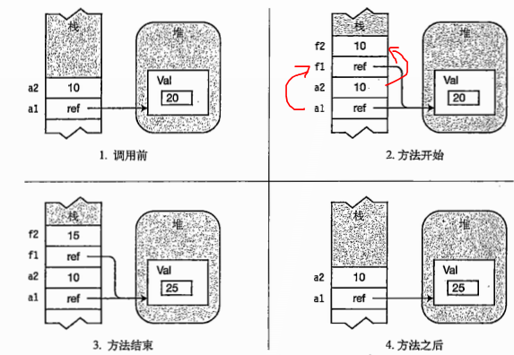

2. 在栈中为形参分配空间。
3. 值参数的实参可以是变量，也可以是计算成相应数据类型的表达式。

##### 5.2.1.4 引用参数

1. 方法声明和调用都使用ref修饰符。
2. 实参必须是变量。且该变量在用作实参前必须被赋值。
3. 引用参数不会在栈中为形参分配空间。

   1. 引用参数的形参与实参指向相同的位置。即不论是值类型还是引用类型，形参改变实参随之改变。
   2. 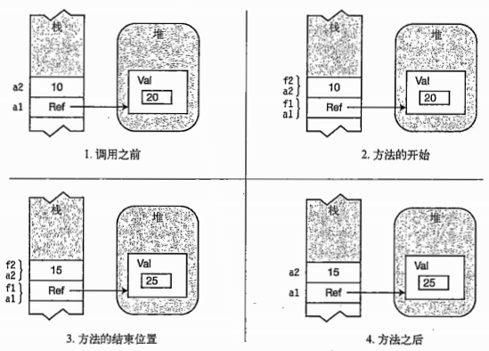

4. 值参数、引用参数对比：

   1. 值类型：值参数形参和实参相互独立，二者数据互不影响；引用参数实参和形参栈中是同一块地址，二者数据保持一致。
   2. 引用类型：

      - 值参数形参和实参栈中的地址独立，但指向的数据地址一致，方法完成调用后，形参和形参指向的对象销毁；
      - 
      - 引用参数实参和形参在栈中是同一块地址，调用完成形参销毁、实参指向的原始对象销毁、实参指向新的对象。
      - 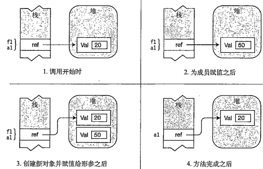


##### 5.2.1.5 输出参数

1. 用于把数据从方法体内传出到调用代码。
2. 方法声明和调用都必须使用out修饰符。
3. 实参必须是变量。
4. 输出参数不会在栈中为形参分配空间（同引用参数）。

   1. 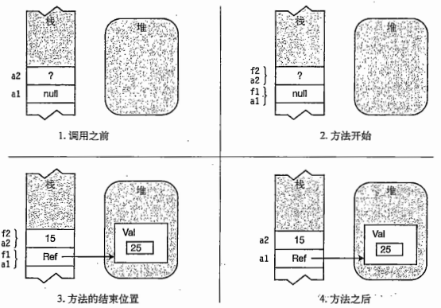

5. 与引用参数的不同：

   1. 引用参数的实参在调用前，必须初始化。
   2. 输出参数在调用时，在方法体内初始化实参。


##### 5.2.1.6 参数数组

1. 参数数组允许有0个或多个实参对应一个特定的形参。
2. 一个参数列表最多只能有一个参数数组。
3. 参数数组必须放在参数列表的最后。
4. 参数数组的数据类型必须一致。
5. 参数数组在声明时使用params修饰符，数据类型后使用`[]`
6. 调用参数数组：

   1. 一个逗号分隔该数据类型的元素列表：`ListInt(10, 20, 30)`

      - 参数数组元素是值类型：值被复制，实参在方法内部不受影响。
      - 参数数组元素是引用类型：引用被复制，实参引用的对象在方法内受影响。
      - 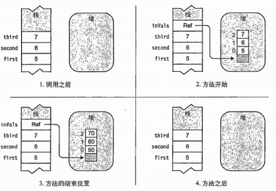

   2. 一个一维数组：`ListInt(intArray)`

      - 参数数组元素不论是值类型还是引用类型，实参均在方法体内受影响。


##### 5.2.1.7 参数类型总结

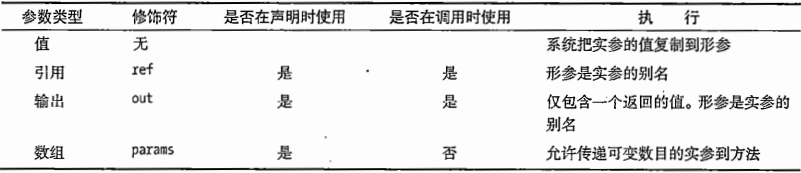

##### 5.2.1.8 命名参数

1. 调用方法时，形参名称后面跟冒号和实际的参数值或表达式。
2. 可以同时使用位置参数和命名参数，但所有的位置参数必须先列出。

##### 5.2.1.9 可选参数

1. 调用方法是可以包含整个参数，也可以省略该参数。
2. 值参数需要在声明时赋予默认值。
3. 只有值类型的参数和默认值为null的引用类型才能作为可选参数。

   1. 即默认值不确定不能作为可选参数
   2. 其他类型不能作为可选参数：

      - 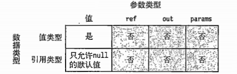


4. 方法声明时：必填参数在前，可选参数在中，参数数组在后。

### 5.3 ref局部变量和ref返回

#### 5.3.1 ref局部变量

1. 语法：`ref int y = ref x;`
2. 规则：

   1. 不论是值类型还是引用类型，二者的数据共同发生变化。
   2. ref局部变量只能被赋值一次。


#### 5.3.2 ref返回

1. 语法：

   1. 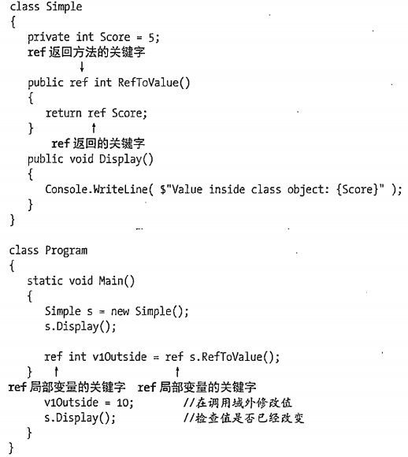

2. 规则:

   1. 返回类型为void的方法不能使用ref
   2. ref return不能返回如下内容：

      - 空值
      - 常量
      - 枚举成员
      - 类或结构体的属性
      - 指向只读位置的指针

   3. ref retrn表达式只能指向原先就在调用域内的位置或者字段。即不能指向方法的局部变量。

      - *不明白，如果指向是方法的形参呢，形参不是局部变量吗？*

   4. 声明为ref返回的方法，调用时可以不用ref关键字，但此时值传递为普通方法。


### 5.4 方法重载

1. 同一个类中方法名称相同，但其他方法签名（参数列表）不同。
2. 方法签名：

   1. 方法名称
   2. 参数数量
   3. 参数数据类型及顺序
   4. 参数修饰符。

3. 方法返回值类型不是方法签名。
4. 仅方法返回值类型不同的方法会便宜报错

   1. 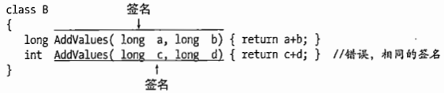


### 5.5 栈帧

1. 保存和方法关联的一些数据项：

   1. 返回地址：方法退出后继续执行的位置
   2. 分配内存的参数：值参数或参数数组
   3. 和方法调用相关的其他管理数据项。


### 5.6 递归

1. 方法自己调用自己。

### 5.7 分部方法

1. 分部方法是声明在分部类中不同部分的方法。

   1. 分部方法的不同部分可以声明在分部类的不同部分，也可以在同一部分。
   2. 即分部方法的方法签名和实现部分可以分离。

2. 注意点：

   1. 返回类型必须是void
   2. 签名不能包括访问修饰符，是隐式私有的。
   3. 参数列表不能包含out参数
   4. 分部方法签名和实现部分必须包含上下文关键字`partial`，且必须放在void之前

3. 示例：

   1. 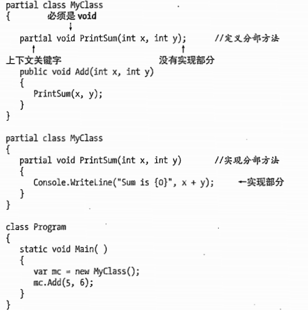


## 6. 继承

### 6.1 类继承

1. 声明：

   ```c#
   class OtherClass : BaseClass{
   
   }
   ```

2. 继承的特性、Object类、使用BaseClass的成员：同Java

### 6.2 屏蔽基类成员

1. 派生类的成员使用与基类成员相同的名称，从而达到只使用派生类的目的。
2. 特点：

   1. 使用new关键字重新声明类的成员

      - 不使用new关键字也可以屏蔽，但编译器会报一个警告。

   2. 可以屏蔽静态成员

3. 示例：

   1. 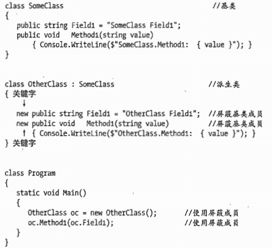


### 6.3 基类访问

1. 派生类要访问被隐藏的继承成员，可以使用基类访问表达式：

   1. `base.成员`

      - `base`是关键字

   2. 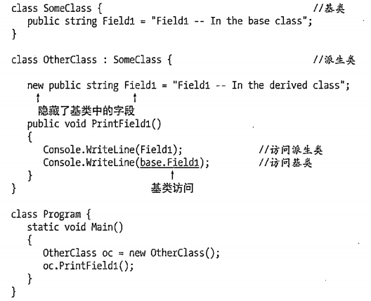


### 6.4 基类的引用

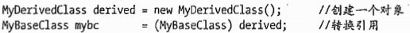

mybc由子类强转而来，只能访问基类的成员。

#### 6.4.1 虚方法和覆写方法

虚方法：使用virtual修饰，在基类中。

覆写方法：使用override修饰，在派生类中。

1. 虚方法的目的是使基类的引用能够访问派生类的对象。

   1. 派生类的方法和基类的方法有相同的返回值类型和方法签名。
   2. 基类的方法使用`virtual`标注
   3. 派生类的方法使用`override`标注
   4. 派生类的方法不使用`new`标注。

2. 覆写和被覆写的方法必须用于相同的可访问性。
3. 方法、属性、索引器、事件都可以被声明为virtual和override
4. 基类的引用调用虚方法时，会执行最顶层的覆写方法。

### 6.5 构造函数的执行

1. 初始化实例成员
2. 调用基类构造函数
3. 执行实例构造函数的方法体

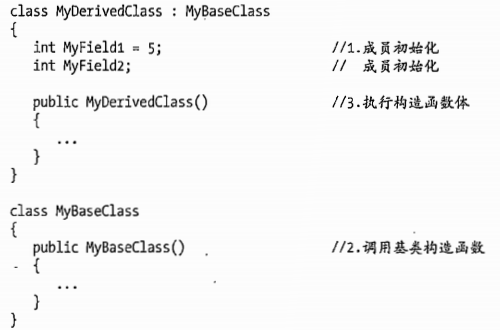

**调用基类指定构造函数：**

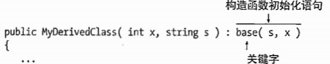

**调用当前类指定构造函数：**

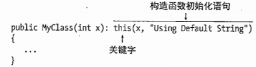

### 6.6 一些类的特殊特征

#### 6.6.1 抽象成员

1. abstract修饰。
2. 只能声明方法、属性、事件、索引器。
3. abstract和virtual不能同时使用。
4. 派生类必须实现基类的所有abstract成员，并使用override修饰符。
5. 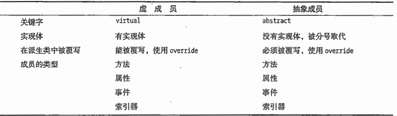

#### 6.6.2 抽象类

1. abstract修饰
2. 包含抽象成员，也可以包含普通成员。

#### 6.6.3 密封类

1. sealed修饰
2. 不能被继承

#### 6.6.4 静态类

1. 静态类所有的成员都是静态的。
2. static修饰。
3. 静态类可以有一个静态构造函数，但不能有实例构造函数。
4. 静态类不能被继承。他是密封的，但不需要sealed修饰。

#### 6.6.5 扩展方法

可以扩展一些不能继承的类。

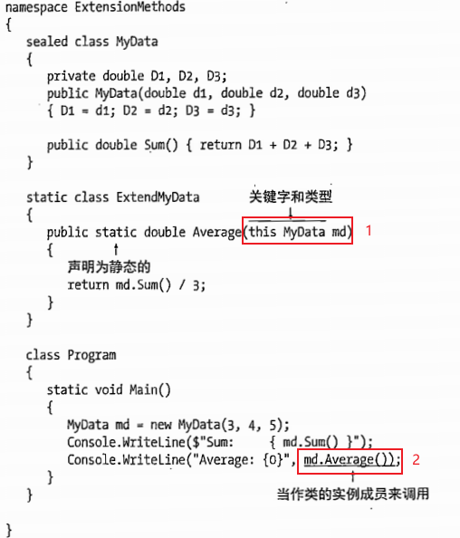

如果1的位置没有this，则2的位置需要使用`ExtendMyData.Average()`

## 7. 表达式和运算符

### 7.1 表达式

1. 表达式是运算符和操作数的字符串。

   1. 运算符：是一个符号。
   2. 操作数：作为运算符输入的数据元素。

      - 字面量
      - 常量
      - 变量
      - 方法调用
      - 元素访问器（如数组访问器和索引器）
      - 其他表达式


2. 表达式求值是将每个运算符以适当的顺序应用到他的操作数以产生一个值的过程。

### 7.2 字面量

1. 字面量是源代码中键入的数字或字符串，表示一个指定的类型的明确的、固定的值。
2. 字面量必须在编译时可知。

#### 7.2.1 整数字面量


#### 7.2.2 实数字面量

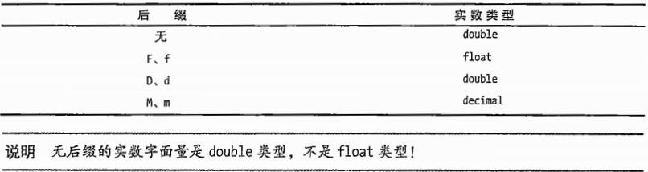

#### 7.2.3 字符字面量

1. 字符字面量类型是char
2. 字符字面量用于表示：单个字符、非打印字符或执行特殊任务的字符。

| 名称   | 转义序列 | 十六进制编码 |
| ------ | -------- | ------------ |
| 空字符 | \0       | 0x0000       |
| 警告   | \a       | 0x0007       |

#### 7.2.4 字符串字面量

1. 字符串字面量可以表示：

   1. 字符
   2. 简单转义序列
   3. 十六进制和Unicode转义序列

2. 编译器让相同字符串字面量共享堆中同一内存位置以节约内存。

### 7.3 运算

#### 7.3.1 优先级

从高到底：

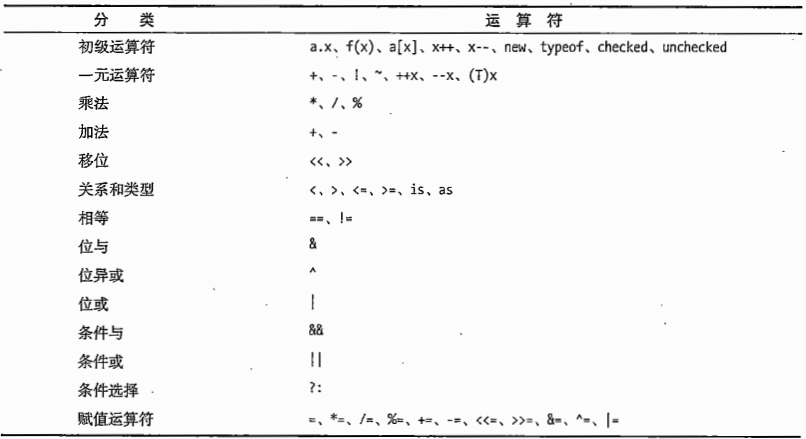

### 7.3.2 结合性

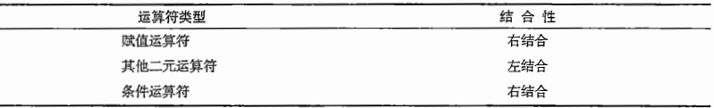

1. 左结合：从左往右执行。
2. 右结合：从右往左执行。

#### 7.3.3 简单算数运算符

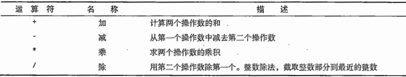

#### 7.3.4 求余运算符

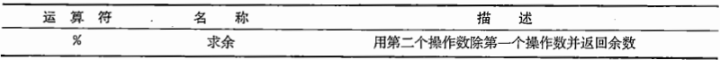

#### 7.3.5 比较运算符

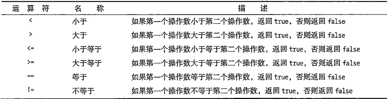

1. 比较方式：

   1. 浅比较：只比较内存地址，不比较内容。
   2. 深比较：不比较内存地址，只比较内容。

2. 引用类型比较内存中指向的对象，为浅比较。
3. string类型是引用类型，但比较时比较的是长度和内容（区分大小写），为深比较。
4. 委托引用类型，为深比较。
5. 数值表达式比较类型和数值。
6. enum类型比较操作数的实际值。

#### 7.3.6 递增运算符和递减运算符


- 无论前置还是后置，语句运行结束变量值均相等。
- 不同的是返回给表达式的值。

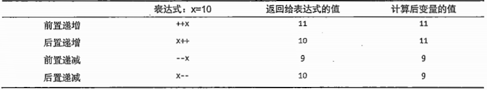

#### 7.3.7 条件逻辑运算符

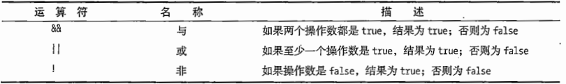

#### 7.3.8 逻辑运算符

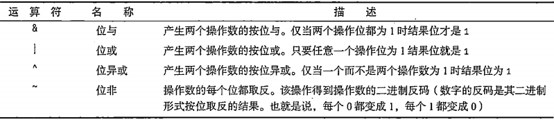

#### 7.3.9 移位运算符

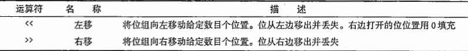

#### 7.3.10 赋值运算符

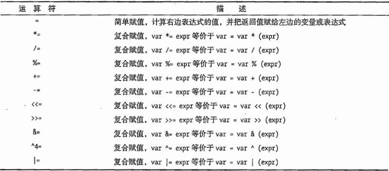

1. 赋值表达式是一个表达式，因此会返回值。
2. 可以放在赋值运算符左边的有：

   1. 变量（局部变量、字段、参数）
   2. 属性
   3. 索引器
   4. 事件

3. 符合赋值：

   1. `x += y - z`，等价于`x = x + (y - z)`
   2. `x *= y - z`，等价于`x = x * (y - z)`


##### 7.3.11 条件运算符

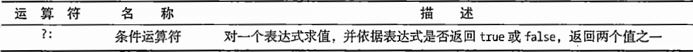

与if else的不同：

1. if else是控制流语句，执行两个行为中的一个。
2. 条件运算符返回一个表达式，应用返回两个值中的一个。

#### 7.3.12 一元算数运算符

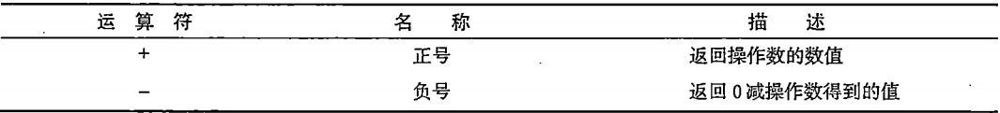

#### 7.3.13 typeof运算符


1. typeof是一元运算符
2. typeof不能重载
3. `Type t = typeof(SomeClass)`：Type是System命名空间的一个类。
4. 类的实例对象可以调用GetType()，GetType()会调用typeof

#### 7.3.14 nameof运算符

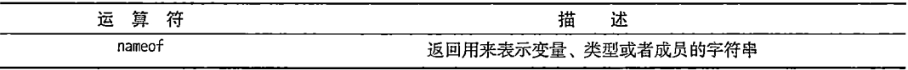

1. nameof运算符只返回传入参数的非限定名称。

   1. 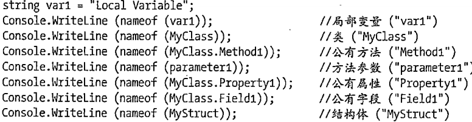

2. nameof也适用于静态类和静态方法。

#### 7.3.15 其他运算符

1. 可空类型的特殊运算符：

   1. 空接合运算符
   2. 空条件运算符


### 7.4 自定义类型转换

#### 7.4.1 隐式转换

编译器自动执行转换。

声明隐式转换：


```c#
using System;

class LimitedInt
{
   const int MaxValue = 100;
   const int MinValue = 0;

   public static implicit operator int( LimitedInt li ) // Convert type
   {
      return li.TheValue;
   }

   public static implicit operator LimitedInt( int x ) // Convert type
   {
      LimitedInt li = new LimitedInt();
      li.TheValue   = x;

      return li;
   }

   private int _theValue = 0;

   public int TheValue // Property
   {
      get { return _theValue; }
      set
      {
         if ( value < MinValue )
            _theValue = 0;
         else
            _theValue = value > MaxValue
                              ? MaxValue
                              : value;
      }
   }
}

class Program
{
   static void Main()               // Main
   {
      LimitedInt li    = 500;       // Convert 500 to LimitedInt
      int        value = li;        // Convert LimitedInt to int
      Console.WriteLine( "li: {0}, value: {1}", li.TheValue, 
         value );
   }
}
```

分析：

1. `LimitedInt li = 500;`隐式调用`public static implicit operator LimitedInt( int x )`，将500赋值给了新创建的li对象成员TheValue，TheValue是一个属性，执行了set，最后得到100，且将_theValue赋值为100。
2. `int value = li`隐式调用`public static implicit operator int( LimitedInt li )`，执行了TheValue属性的get，最终返回_theValue的值。

#### 7.4.2 显式转换

程序员手动进行强制转换。

显式转换声明：

```c#
public static explicit operate TargetType (SourceType Identifier){
    return ObjectOfTargetType;
}
```

### 7.5 运算符重载

1. 运算符重载只能用于类和结构

   1. 一元运算符重载方法只有一个参数，且参数是class或struct
   2. 二元运算符重载方法有两个参数，且其中一个参数必须是class或struct

2. 重载方法声明必须同时使用public 和static修饰。
3. 运算符必须是要操作的类或结构的成员。即参数必须是方法所在的类或结构。
4. 可重载的一元运算符：`+ - ! ~ ++ -- true false`
5. 可重载的二元运算符：`+ - * / % & | ^ << >> == != > < >= <=`

```c#
using System;

class LimitedInt
{
   const int MaxValue = 100;
   const int MinValue = 0;
   public static LimitedInt operator -( LimitedInt x )
   {
      // In this strange class, negating a value just sets its value to 0.
      LimitedInt li = new LimitedInt();
      li.TheValue   = 0;

      return li;
   }

   public static LimitedInt operator -( LimitedInt x, LimitedInt y )
   {
      LimitedInt li = new LimitedInt();
      li.TheValue   = x.TheValue - y.TheValue;

      return li;
   }

   public static LimitedInt operator +( LimitedInt x, double y )
   {
      LimitedInt li = new LimitedInt();
      li.TheValue   = x.TheValue + (int) y;

      return li;
   }

   private int _theValue = 0;
   public int TheValue
   {
      get { return _theValue; }
      set
      {
         if ( value < MinValue )
            _theValue = 0;
         else
            _theValue = value > MaxValue
                              ? MaxValue
                              : value;
      }
   }
}

class Program
{
   static void Main()
   {
      LimitedInt li1 = new LimitedInt();
      LimitedInt li2 = new LimitedInt();
      LimitedInt li3 = new LimitedInt();

      li1.TheValue = 10;
      li2.TheValue = 26;
      Console.WriteLine( " li1: {0}, li2: {1}", li1.TheValue, li2.TheValue );

      li3 = -li1;
      Console.WriteLine( "-{0} = {1}", li1.TheValue, li3.TheValue );

      li3 = li2 - li1;
      Console.WriteLine( " {0} - {1} = {2}",

      li2.TheValue, li1.TheValue, li3.TheValue );
      li3 = li1 - li2;
      Console.WriteLine( " {0} - {1} = {2}",
                           li1.TheValue, li2.TheValue, li3.TheValue );
   }
}
```


## 8. 语句

### 8.1 语句简述

1. 语句是描述某个类型或让程序执行某个动作的源代码指令。
2. 语句类型：

   1. 声明语句：声明类型或变量
   2. 嵌入语句：执行动作或管理控制流
   3. 标签语句：控制跳转

3. 语句形式：

   1. 简单语句由一个表达式和后面跟着的分号组成
   2. 块是由一对大括号包裹的语句序列

      - 声明语句
      - 嵌入语句
      - 标签语句
      - 嵌套块

   3. 空语句仅由一个分号组成

4. 块可以看作一条嵌入的简单语句。

### 8.2 控制流语句

分类：

1. 条执行语句：

   1. if
   2. if else
   3. switch

2. 循环语句

   1. do
   2. while
   3. for
   4. foreach

3. 跳转语句：

   1. break
   2. continue
   3. goto
   4. return
   5. throw


#### 8.2.1 if语句

```c#
if(x <= 20)
    z = x - 1;  //简单语句不需要大括号
```

#### 8.2.2 if else语句

```c#
if(x <= 20)
    z = x - 1;  //简单语句不需要大括号
else{
    y = x - 5;
    z = x + 5;
}
```

#### 8.2.3 switch语句

1. swith语句测试表达式在c#7.0之前只允许使用：char、string、bool、integer（byte、int、long）、enum。7.0之后允许任何类型。
2. 对于非整数类型，测试表达式使用深度比较（比较里面的值）
3. default语句可选，但如果有了，则必须有跳转语句。

#### 8.2.4 for循环

1. 语法：

   ```c#
   for(Initializer;TestExpr;IterationExpr)
       Statement
   ```

2. Initializer、TestExpr、IterationExpr均可省略
3. 任何声明在Initializer中的变量只在该for循环语句内部可见。

#### 8.2.5 goto语句

1. 结合标签语句使用：

   - 

2. 结合switch语句使用：

   - 
   - case后只能是编译时常量，即c#7.0之前。


### 8.3 其他语句

#### 8.3.1 标签语句


1. 标签可以是任何有效的标识符。
2. 标签语句只允许在块内部。
3. 标签语句结合goto语句使用。

#### 8.3.2 using语句

1. 作用：

   1. 某些非托管对象有数量限制或很耗费系统资源。

      - 资源指实现了`System.IDisposable`接口的类或结构。
      - `IDisposable`接口含有一个单独的名为`Dispose()`

   2. using语句可以简化使用上述对象的控制。

2. 注意区分using语句和using指令
3. 语法结构：

   1. 
   2. 

      - 必须保证资源类型相同

   3. 
   4. 

      - 不能放置using语句已经释放了管理的非托管对象，可能导致状态不一致，不推荐使用。


4. 示例：

   ```c#
   using System;                                // using DIRECTIVE; not using statement
   
   using System.IO;                             // using DIRECTIVE; not using statement
   
   class Program
   {
       static void Main()
       {
           // using statement
           using ( TextWriter tw = File.CreateText( "Lincoln.txt" ) )
           {
               tw.WriteLine( "Four score and seven years ago, ..." );
           }
   
           // using statement
           using ( TextReader tr = File.OpenText( "Lincoln.txt" ) )
           {
               string InputString;
               while ( null != ( InputString = tr.ReadLine() ) )
                   Console.WriteLine( InputString );
           }
       }
   }
   ```


#### 8.3.3 其他语句


## 9. 结构

### 9.1 结构简述

1. 结构是程序员声明的数据类型，具有数据成员和函数成员。
2. 与类的不同：

   1. 类是引用类型，结构是值类型。
   2. 结构式隐式密封的，所以不能派生。
   3. 结构的成员只声明，不初始化。

3. 结构类型的内存分配：

   1. 只给元素分配，在栈空间

4. 结构的成员不能使用下列修饰符：

   1. protected
   2. protected internal
   3. abstract
   4. sealed
   5. virtual

5. 结构派生自`System.ValueType`

```c#
class CSimple
{
   public int X;
   public int Y;
}

struct Simple
{
   public int X;
   public int Y;
}

class Program
{
   static void Main()
   {
      CSimple cs1 = new CSimple();
      Simple ss1  = new Simple();
```


### 9.2 结构间赋值

1. 把一个结构赋值给另一个结构，就是把该结构的值赋值给另一个结构，两个机构具有相同的成员

```c#
class CSimple
{
   public int X;
   public int Y;
}

struct Simple
{
   public int X;
   public int Y;
}

class Program
{
   static void Main()
   {
      CSimple cs1 = new CSimple(), cs2 = null;           // Class instances
      Simple ss1  = new Simple(),  ss2 = new Simple();   // Struct instances

      cs1.X = ss1.X = 5;                                 // Assign 5 to ss1.X and cs1.X.
      cs1.Y = ss1.Y = 10;                                // Assign 10 to ss1.Y and cs1.Y.

      cs2 = cs1;                                         // Assign class instance.
      ss2 = ss1;                                         // Assign struct instance.
   }
}
```


### 9.3 构造函数

结构有构造函数，但是没有析构函数。

#### 9.3.1 实例构造函数

1. 结构默认有一个无参构造函数

   1. 值成员设置成默认值。
   2. 引用成员设置成null。

2. 可以手动编写构造函数，此时默认的无参构造函数仍然有效。
3. 与类的不同：

   1. 类只有在没有声明任何构造函数时，才会由编译器提供默认无参构造函数。
   2. 类声明了带参的构造函数，默认的无参构造函数会失效。

4. 创建结构对象：

   1. 方式一：使用new关键字，同class创建。
   2. 方式二：不使用new关键字，声明结构后，使用结构对成员初始化后才能使用。
   3. 


#### 9.3.2 静态构造函数

1. 静态构造函数创建并初始化静态数据成员。
2. 静态构造函数不能引用实例成员。
3. 特点

   1. 不能显式调用静态构造函数。
   2. 允许有一个不带参的静态实例构造函数？那多个呢？
   3. 不能有访问修饰符

4. 调用时机：

   1. 调用显式声明的构造函数
   2. 引用结构的静态成员


#### 9.3.3 结构函数和析构函数小结


### 9.4 字段和属性初始化

1. 声明结构体时，不允许使用实例属性和字段的初始化语句。
2. 结构体的静态属性和静态字段都可以在声明结构体时初始化。


### 9.5 结构的其他内容

#### 9.5.1 拆箱和装箱

1. 装箱：将结构实例作为引用类型对象。

   1. 装箱的过程就是制作值类型变量的引用类型副本。


#### 9.5.2 结构作为返回值和参数

1. 返回值：创建结构的副本，并从函数成员返回。
2. 值参数：创建实参结构的副本，该副本在方法中执行。
3. 结构被用作ref或out参数，传入的实参是该结构的一个引用，可以修改其他数据成员。

#### 9.5.3 其他

1. 预定义简单类型，在c#中视为原始类型，在.net中都实现为结构。
2. 结构也可以声明为分部结构。
3. 结构可以实现接口。

## 10. 枚举

### 10.1 枚举简述

1. 枚举是值类型。
2. 枚举的元素是值为整数的常量。
3. 枚举底层都有一个整数类型，默认为int
4. 声明枚举类型时，增加`: 类型名`可以指定枚举底层的整数类型。
5. 枚举的值默认从0开始，后续加1，如果中间手动修改过值，后续的值在修改值的基础上加1。
6. 枚举不能有重复的名称，但可以有重复的值。


### 10.2 位标志

没懂。

### 10.3 其他内容

1. 枚举的成员不能使用修饰符，默认具有与枚举相同的可访问性。
2. 枚举是静态的，可以直接通过枚举名称访问成员。

   1. c#6.0之后，可以使用`usting static 枚举名`的方式，直接使用枚举的成员名称。

3. 比较不同欸据类型的成员时会产生编译错误。

   1. 

4. enum基于.net Enum类型，而.net Enum还有一些静态方法：

   1. `GetName(enum,index)`获取指定index的枚举成员名称
   2. `GetNames(eunm)`获取所有的枚举成员名称。


## 11. 数组

### 11.1 认识数组

1. 数组是由一个变量名称表示的同类型元素。
2. 相关概念：

   1. 元素：数组的独立数据项，必须类型相同，或继承自相同的类型。
   2. 秩/维度：
   3. 维度长度
   4. 数组长度：所有维度中的元素总数

3. 数组一旦创建，大小固定。
4. 分类：

   1. 一维数组：
   2. 多维数组：

      - 矩形数组：每个维度的子数组都具有相同的数组长度
      - 交错数组：各维度子数组长度不同。


### 11.2 数组的声明

#### 11.2.1 一维数组和矩形数组

1. 一位数组和矩形数组语法类似。
2. 声明格式`long[] myArray`:

   1. `[]`中的逗号数代表数组维度+1
   2. 

3. 实例化：

   1. 一维数组：

      - `int[] arr = new int[4];`

   2. 矩形数组：

      - `int[,,] arr = new int[3,6,2];`


4. 显式初始化：

   1. 一维数组

      - `int[] arr = new int[4]{10, 20, 30, 40};`
      - `int[] arr = new int[]{10, 20, 30, 40};`

   2. 矩形数组

      - `int[,] arr = new [4,2]{{1,10}, {2,20}, {3,30}, {4,40}};`

   3. 不必输入数组维度长度。
   4. 实例化后，初始化前，数组的每个元素都自动初始化为类型的默认值。

5. 快捷初始化（不需要new）：

   1. 一维数组：

      - `int[] arr = {10, 20, 30, 40};`

   2. 矩形数组：

      - `int[,] arr = {{1,10}, {2,20}, {3,30}, {4,40}};`


6. 隐式初始化（不需要数据类型）：

   1. 一维数组：

      - `var arr = new []{10, 20, 30, 40};`

   2. 矩形数组：

      - `var arr = new [,]{{1,10}, {2,20}, {3,30}, {4,40}};`


#### 11.2.2 交错数组

1. 声明：

   1. `int[][] arr1`
   2. `int[][][] arr2`

2. 实例化：

   1. `int[][] arr1 = new int[3][]`
   2. 不能在声明语句中初始化顶层数组之外的数组：

      - 


3. 初始化：

   1. 

4. 矩形数组和交错数组的数据结构区别;

   1. 
   2. 矩形数组只有一个数组对象
   3. 交错数组由4个数组对象


#### 11.2.3 比较


### 11.2 数组的存储

1. 数组实例是从System.Array继承的对象。
2. Rank：返回数组维度的属性
3. Length：返回数组长度的属性
4. 数组是引用类型，引用在栈或堆上，数组对象本身在堆上。

   1. 

5. 继承自System.Array有用的属性和方法：

   1. 
   2. Clone()：对数组进行浅复制，产生两个数组引用，指向同一个对象

      - Clone()返回object对象，所以需要强转：`int[] arr2 = (int[])arr1.Clone()`
      - 值类型：

        - 

      - 引用类型：

        - 


### 11.3 foreach访问数组元素

1. 语法：`foreach(Type Identifier in ArrayName);`

   1. Type是数组中的元素类型
   2. Identifier是迭代变量的名称
   3. ArrayName是要处理的数组名称。

2. Type是值类型的数组，不能改变Identifier的值。
3. Type是引用类型的数组，可以改变Identifier的数组，但不能改变其指向的地址。
4. 矩形数组只用一条foreach就可以输出元素：

   ```c#
   using System;
   
   class Program
   {
   static void Main()
   {
       int total = 0;
       int[,] arr1 = { { 10, 11 }, { 12, 13 } };
   
       foreach ( var element in arr1 )
       {
           total += element;
           Console.WriteLine( "Element: {0}, Current Total: {1}", element, total );
       }
   }
   }
   ```

5. 交错数组需要对每个维度都使用一个foreach

   ```c#
   using System;
   
   class Program
   {
       static void Main()
       {
           int[][,] Arr;                    // An array of 2D arrays
           Arr = new int[3][,];             // Instantiate an array of three 2D arrays.
   
           Arr[0] = new int[,] { { 10, 20 },
                                   { 100, 200 } };
   
           Arr[1] = new int[,] { { 30, 40, 50 },
                                   { 300, 400, 500 } };
   
           Arr[2] = new int[,] { { 60, 70, 80, 90 },
                                   { 600, 700, 800, 900 } };
   
           for ( int i = 0; i < Arr.GetLength( 0 ); i++ )
           {
               for ( int j = 0; j < Arr[i].GetLength( 0 ); j++ )
               {
                   for ( int k = 0; k < Arr[i].GetLength( 1 ); k++ )
                   {
                   Console.WriteLine
                               ( "[{0}][{1},{2}] = {3}", i, j, k, Arr[i][j, k] );
                   }
                   Console.WriteLine( "" );
               }
               Console.WriteLine( "" );
           }
       }
   }
   ```


### 11.4 数组协变

1. 数组是A类型，B类型继承于A类型，创建了A类型的数组，按理A数组只能保存A类型的对象，但也保存了B类型的对象。这种现象称为数组协变。

### 11.5 ref返回和ref局部变量

1. ref返回和ref局部变量的常见用途是把一对数组元素的引用传递回调用域。


## 12. 委托

### 12.1 委托简述

1. 委托和类一样，是一种用户定义的类型。

   1. 可以认为委托是持有一个或多个方法的对象。
   2. 委托不需要在类内部声明。

2. 委托声明：

   1. 

3. 委托是引用类型，因此有引用和对象。
4. 创建委托对象：

   1. 完全体方式：

      - 

   2. 快捷语法（不要new）：

      - 


### 12.2 组合委托

1. 组合委托指委托的调用列表的方法不止一个。
2. 组合委托形式：

   1. 
   2. delC的调用列表有两个方法，依次为`myInstObj.MyM1`、`SClass.OtherM2`。


### 12.3 委托添加方法和移除方法

1. 添加方法：

   1. 
   2. 
   3. +=的实际发生过程为创建一个新的委托，其调用列表为左边的委托加上右边的方法组合。
   4. 旧委托会被垃圾回收器回收。

2. 移除方法：

   1. 
   2. 移除方法本质是创建一个新委托。
   3. 委托的调用列表有多个方法时，从调用列表的最后一个匹配，移除匹配到的第一个。
   4. 删除委托中不存在的方法无效。
   5. 委托的调用列表为空，则委托为null，调用空委托会抛出异常。


### 12.4 调用委托

1. 调用委托的形式有两种，一种类似于调用方法，一种时使用委托的Invoke方法：

   1. 

2. 委托有返回值并且在调用列表的方法大于一个，则：

   1. 调用列表中最后一个方法的返回值就是委托调用的返回的值。
   2. 调用列表中所有其他方法的返回值都会被忽略。
   3. 

3. 委托有参数时，调用委托参时，数值会作用到每个调用列表的方法上（输出参数除外）：

   1. 
   2. 

4. 委托有引用参数时，调用委托时，参数值会根据调用列表方法的计算结果而传递。

   1. 
   2. 


### 12.5 匿名方法

1. 语法：

   1. 声明不变。
   2. 调用：

      - 


2. 声明委托时委托的参数列表不包含任何out参数，并且调用委托时委托的匿名方法不使用任何参数，可以省略匿名方法的括号：

   1. 

3. 声明委托时委托的参数列表包含了params参数，调用委托时匿名方法的参数列表可以忽略params关键字：

   1. 
   2. 


### 12.6 Lambda表达式

1. Lambda是对匿名方法语法的一种优化。
2. 变化过程：

   1. 删除delegate管家字
   2. 调用的匿名方法，在参数列表和匿名方法主体之间放置Lambda=>运算符，读作goes to。

3. 进一步简化：

   1. 编译器可以从委托声明推断委托参数类型。

      - 带有类型的参数列表称为显示类型
      - 省略类型的参数列表称为隐式类型。

   2. 只有一个隐式类型的参数时，可以省略两端的圆括号。
   3. 匿名方法主体是一句表达式时，并且是一个return表达式时，可以省略方法主体的大括号和return关键字。

4. 示例：

   1. 
   2. 


## 13. 事件

### 13.1 发布者和订阅者

#### 13.1.1 认识事件


1. 发布者：类或者结构。发布事件，通知其他类事件的发生。
2. 订阅者：类或者结构。注册事件，发生事件时得到通知。
3. 事件处理程序：订阅者注册到事件的方法，发布者触发事件时执行。

   - 可以定义在事件所在的类或者结构中，也可以不在。

4. 触发事件/调用事件：事件被触发时，所有注册到它的方法会依次调用。

#### 13.1.2 事件的特征

1. 事件是专门用于某种特殊用途的简单委托。
2. 事件包含了一个私有的委托：

   1. 
   2. 由于委托私有，所以无法直接访问委托。
   3. 事件中只能添加、删除或调用事件处理程序。
   4. 事件被触发时，调用委托来依次调用列表中的方法。

3. 举例：

   1. 


### 13.2 事件的代码组成


1. 委托类型声明：事件（发布者类中）和事件处理程序（订阅者类中）必须有相同的方法签名和返回类型。*它们通过委托类型进行描述？*
2. 事件处理程序声明：不一定是显式命名的方法，还可以是匿名方法或Lambda表达式。
3. 事件声明：发布者类声明的事件为public时，称为发布了事件。
4. 事件注册：将事件处理程序（订阅者类）与事件（发布者类）相连的代码。
5. 触发事件的代码：发布者类中，触发订阅者中的所有事件处理程序。

#### 13.2.1 事件声明

1. 特征：发布者类中；只需要委托类型和事件名称即可创建事件。

   1. 
   2. 必须为public。
   3. 不能new创建事件对象。

2. 一次可以声明多个事件。

   1. 

3. 可以使用static修饰：

   1. 

4. 注意事项：

   1. 事件被隐式自动初始化为null。
   2. 事件声明需要委托类型的名称。

      1. 可以自己声明委托类型，也可使用系统提供的委托类型。BCL声明了一个叫做EventHandler的委托，专门用于处理系统事件。


#### 13.2.2 订阅事件


1. 订阅者类中。
2. `+=`右边是事件处理程序，`+=`表示订阅，`-=`表示移除，一个处理程序向事件注册了多次，移除时一次只移除最后一个实例。
3. 事件处理程序可以是：

   1. 实例方法的名称
   2. 静态方法的名称
   3. 匿名方法
   4. lambda表达式


#### 13.2.3 触发事件


1. 发布者类中。
2. 触发事件之前进行非null判断，确认有方法可执行。
3. 触发事件：语法同调用方法；参数列表必须与事件的委托类型相匹配。

### 13.3 事件的标准用法

1. GUI编程是最佳场景。
2. System命名空间声明了EventHandelr委托类型：

   1. `public delegate void EventHandler(object sender, EventArgs e);`
   2. 第一个参数保存触发事件的对象的引用。
   3. 第二个参数保存状态信息，指明适用于该程序的类型。

      1. 不能传递任何数据，需要传递数据时，必须声明一个派生自EventArgs的类。


### 13.4 事件访问器

1. 事件访问器：add和remove

   1. 具有叫做value的隐式值参数。
   2. 接受实例或静态方法的调用。

2. 用于改变`+=`和`-=`运算符的行为。
3. 事件访问器表现为void方法， 不能使用返回值的return语句。


## 14. 接口

### 14.1 接口认识

1. 接口：指定一组函数成员，却没有实现它们的引用类型。
2. 接口只能由类和结构实现。

### 14.2 声明接口

1. 接口不能包含以下成员：

   - 数据成员
   - 静态成员

2. 接口只能包含如下类型：

   - 方法
   - 属性
   - 事件
   - 索引器

3. 接口声明可以使用任何访问修饰符。
4. 接口成员不允许有任何访问修饰符，成员是隐式public的，也不能显式使用public。

### 14.3 实现接口

1. 类派生自基类并实现了接口，则基类必须放在接口之前。
2. 如果一个类实现了多个接口，并且其中一些接口成员具有相同的签名和返回类型，则类只需要实现一次该成员即可满足所有接口。

   1. 如果想给每个接口定义不同的实现，可以使用“限定接口名称”来声明。
   2. 
   3. 此时不存在MyClass类级别的PrintOut方法，不能使用MyClass的对象去调用PrintOut。
   4. 

3. 接口和基类有相同的方法签名和返回类型：

   1. 
   2. 派生类可以通过继承父类的方法实现接口，而不用自己实现。


### 14.4 接口调用方法


1. 不能直接通过类对象的成员访问接口。

   1. 问题：*不能像java一样，不能直接**`IIfc1 ifc = mc`* *IIfc1 ifc = mc**吗？没有多态特征吗？*

      1. 可以的，引用类型的隐式转换，不知道书里为什么这么举例。


2. 可以将类对象引用强制转换为接口类型来获取指向接口的引用。
3. 有了这个接口的引用，就可以调用实现方法。
4. as操作符可以防止不具有实现关系的类和接口之前的强转异常，转换失败会返回null。

   1. 


## 15. 转换

### 15.1 转换的含义

1. 含义：接受一个类型的值，并将它用作另一个类型的等价值的过程。
2. 分类：

   1. 隐式转换：语言自动进行的数据类型转换（如8位的值转换为16位）

      1. 零扩展：无符号类型，源类型位数少，目标类型位数多，目标类型多出来的最高位以0填充。
      2. 符号扩展：有符号类型，多出来的位数使用符号填充。

   2. 强制转换（显式转换）：源类型的任意值转换为目标类型时丢失值。

3. 装箱：将任何值类型可以转换为：

   1. `object`类型
   2. `System.ValueType`类型

4. 拆箱：将一个装箱的值转换为原始类型。

### 15.2 数字类型转换

#### 15.2.1 checked和unchecked

1. 溢出检测上下文：代码片段是否被检查。

   1. 默认位不检查。

2. checked和unchecked运算符：

   1. `checked(表达式)`：忽略溢出
   2. `unchecked(表达式)`：溢出时抛出OverflowException。

3. checked和unchecked语句：

   1. `checked{语句}`：忽略溢出
   2. `unchecked{语句}`：溢出时抛出OverflowException。
   3. 可以任意嵌套：

      1. 


#### 15.2.2 隐式类型转换

#### 

#### 15.2.3 显式类型转换

1. 整数类型到整数类型：

   - 

2. 浮点类型到整数类型：

   1. 

3. decimal到整数类型：

   1. 

4. double到float：

   1. 

5. 浮点型到decimal：

   1. 

6. decimal到浮点型：

   1. 


### 15.3 引用类型转换

#### 15.3.1 隐式引用转换

1. 所有类型可以被隐式转换为object类型。
2. 所有接口可以隐式转换为它继承的接口。
3. 类可以隐式转换为：

   1. 它继承链中的任何类。
   2. 它实现的任何接口。
   3. 

4. 委托可以转换为`.NET BCL`类和接口。
5. `ArrayS`可以转换为

   1. `.NET BCL`类和接口
   2. 另一个数组`ArrayT`，但要求：

      1. 数组维度一致。
      2. 数组元素都是引用类型，不是值类型，且存在隐式转换。


6. 

#### 15.3.2 显式引用转换

1. 显式转换包括：所有隐式转换的逆过程。
2. 有效显式引用转换：

   1. 默认有隐式转换，使用显式转换的方式进行转换，则总是成功的。
   2. 源引用是null：

      1. 

   3. 由原因用指向的实际数据可以安全地进行隐式转换：

      1. 


### 15.4 装箱转换

1. 装箱是一种隐式转换，指将值类型转换为引用类型。
2. 装箱是创建副本：装箱后值有两份副本——原始值类型和引用类型副本，每一个都可以独立操作。
3. 任何值类型`ValueTypeS`都可以被隐式转换为object、`System.ValueType`或`InterfaceT`类型（`InterfaceS`实现了`InterfaceT`）

   1. 


### 15.5 拆箱转换

1. 拆箱是一种显式转换，指把装箱后的对象还原位值类型的过程。
2. 尝试拆箱一个非原始类型时会抛出`InvalidCastException`。
3. 

### 15.6 用户自定义转换

1. 可以为类和结构定义隐式和显式转换。
2. 自定义转换声明：

   1. 
   2. public和static必须。

3. 约束：

   1. 只可以为类和结构定义用户自定义转换。
   2. 不能重新定义标准的隐式或显式转换。
   3. 对于源类型S和目标类型T，如下命题为真：

      1. S和T必须是不同类型。
      2. S和T不能有继承关系。
      3. S和T波偶不能时接口类型或object类型。
      4. 转换运算符必须时S或T的成员。

   4. 对于相同的S和T，不能声明两种转换，一个是隐式转换而另一个是显式转换。

      1. 没懂


4. 用户自定义转换最多可以有3个步骤：

   1. 预备标准转换；
   2. 用户自定义转换
   3. 后续标准转换
   4. 这个链中不可能有一个以上的用户自定义转换
   5. 


### 15.7 is运算符

1. is运算符用来检查转换是否会成功，成功则返回true。
2. 语法：

   1. 

3. 只能用于引用转换、装箱转换、拆箱转换，不能用于用户自定义转换。

### 15.8 as运算符

1. as运算符同强制转换，只是不抛出异常，转换失败时返回null。
2. 语法：

   1. 

3. as运算符返回引用表达式，可以用作复制操作符中的源。
4. as运算符只能用于引用转换、装箱转换，不能用于用户自定义转换或到值类型的转换。

## 16. 泛型

### 16.1 C#的泛型

1. 类型不是对象，而是对象的模板。
2. 泛型不是类型，而是类型的模板。
3. C#的泛型有五种：类、结构、接口、委托和方法。
4. 可以使用`var`关键字让编译器推断泛型类型。

### 16.2 泛型约束


不是所有的T类型，都能用`<`比较，因此为编译器提供额外的信息，让编译器知道能够接受哪些类型叫做约束。

#### 16.2.1 Where子句

1. 语法：

   1. 

2. 举例：

   1. 

3. 约束类型：

   1. 

4. 约束次序：

   1. 

5. 举例：

   1. 


### 16.3 泛型方法

1. 泛型方法可以在泛型和非泛型的类以及结构和接口中声明。
2. 泛型方法有两个参数列表：

   1. 圆括号内的方法参数列表
   2. 尖括号内的类型参数列表

3. 方法参数列表之后可以放where约束子句
4. 语法：

   1. 

5. 如果方法参数列表的类型和类型参数列表的类型一致，可以省略类型参数列表类型和尖括号，由编译器进行推断：

   1. 
   2. 


### 16.4 扩展方法和泛型类

1. 泛型类的扩展方法：

   1. 必须声明为static
   2. 必须是静态类的成员
   3. 第一个参数类型必须由this关键字，后面爱是扩展的泛型类的名字

2. 举例：

   1. 
   2. 注意this后没逗号。


### 16.5 其他泛型

1. 泛型结构：和泛型类类似，可以由类型参数和约束，规则同泛型类。
2. 泛型委托：与非泛型委托类似，但类型参数决定了能接受的方法类型。
3. 泛型接口：与非泛型接口类似。

   1. 类型参数不同，实例化后的接口不同。
   2. 非泛型类型可以实现泛型接口。


### 16.6 协变和逆变

#### 16.6.1 协变

1. 赋值的兼容性：派生类型的对象可以赋值给基类型的变量。
2. 协变：仅将派生类型用作输出值与构造委托有效性之间的常熟关系。

   1. 使用out关键字标记委托声明中的类型参数。
   2. `delegate T Factory<out T>()`

3. 没有协变，下面代码会编译报错：

   ```c#
   class Animal{public int Legs = 4;}
   class Dog : Animal {}
   delegate T Factory <T>();
   class Program{
       static Dog MakeDog(){
           return new Dog();
       }
       static void Main(){
           Factory<Dog> dogMaker = MakeDog;
           Factory<Animal> animalMaker = dogMaker;//编译报错
           Console.WriteLine9(animalMaker().Legs).ToString()}
       }
   }
   ```

   - 报错的原因是：`Factory<Dog>`和`Factory<Animal>`并没有继承关系。


#### 16.6.2 逆变

1. 逆变：在期望传入基类时允许传入派生对象的特性。

   1. 使用in关键字编辑委托类型声明中的类型参数。
   2. `delegate void Action1<in T>(T a)；`

2. 举例：

   ```c#
   class Animal{public int Legs = 4;}
   class Dog : Animal {}
   class Program{
   	delegate void Action<in T>(T a);
       static void ActOnAnimal(Animal a){Console.WriteLine9(a.Legs)}
       static void Main(){
           Action1<Animal> act1 = ActOnAnimal;
           Factory<Dog> dog1 = act1;
           dog1(new Dog());
       }
   }
   ```


#### 16.6.3 协变和逆变的不同


#### 16.6.4 接口的协变和逆变

1. 同委托。

#### 16.6.5 其他特性

1. 可变形的处理让使用基类型替换派生类型变得安全。
2. in和out关键字的显式变化只适用于委托和接口，不适用于类、结构和方法。
3. 没有使用in或out关键字的委托和类型接口参数是不变的。

   1. 


## 17. 枚举器和迭代器

### 17.1 枚举器和可枚举类型

1. 实现`GetEnumerator`方法的类型叫做可枚举类型。
2. 枚举器：可枚举类型调用`GetEnumerator`方法获取到的对象。
3. 可枚举类型使用foreach语句获取每一个迭代对象。

#### 17.1.1 IEnumerator接口

1. 实现了`IEnumerator`接口的类包含3个函数成员：

   1. Current：返回序列中但钱位置项的属性。

      1. 只读。
      2. 返回object类型的引用。

   2. MoveNext：将枚举器的位置前进到集合中下一项。返回bool。

      1. 新的位置有效，返回true
      2. 新的位置无效（如当前已是尾部），返回false。
      3. 必须在第一次使用Current之前调用。

   3. Reset：将位置重置为原始状态。


#### 17.1.2 IEnumerable接口

1. 实现了IEnumerable接口的类称为可枚举类。
2. IEnumerable接口只有一个成员：`GetEnumerator`方法，返回对象的枚举器。

#### 17.1.3 泛型枚举接口

1. 非泛型接口的实现不是类型安全的，返回object类型的引用，然后需要转换为实际类型。
2. 泛型接口的实现类型是类型安全的，返回实际类型的引用。

### 17.2 迭代器

1. 迭代器是一种结构。
2. 迭代器的作用是简化用户自定义的看枚举类和枚举器。

#### 17.2.1 迭代器块

1. 迭代器块是由一个或多个yield语句组成的代码块：

   1. 方法主体
   2. 访问器主体
   3. 运算符主体

## 18. LINQ

### 18.1 LINQ简介

1. 含义：发音为link，Language Integrated Query，表示语言集成查询。
2. 作用：像SQL查询数据库一样的方式查询数据集合。
3. 来源：.NET框架的扩展。

### 18.2 LINQ提供程序

1. LINQ可查询的数据源，都有对应的根据该数据源类型实现LINQ查询的代码模块，这些代码模块称为LINQ提供程序。
2. LINQ体系结构：
   1. 

## 19. 异步编程

## 20. 命名空间和程序集

## 21. 异常

## 22. 预处理指令

## 23. 反射和特性

## 24. C#6.0和C#7.0新特性

## 25. 其他内容

### 25.1 字符串

1. C#的string类型 = .NET的System.String类型。
2. string是Unicode字符数组。