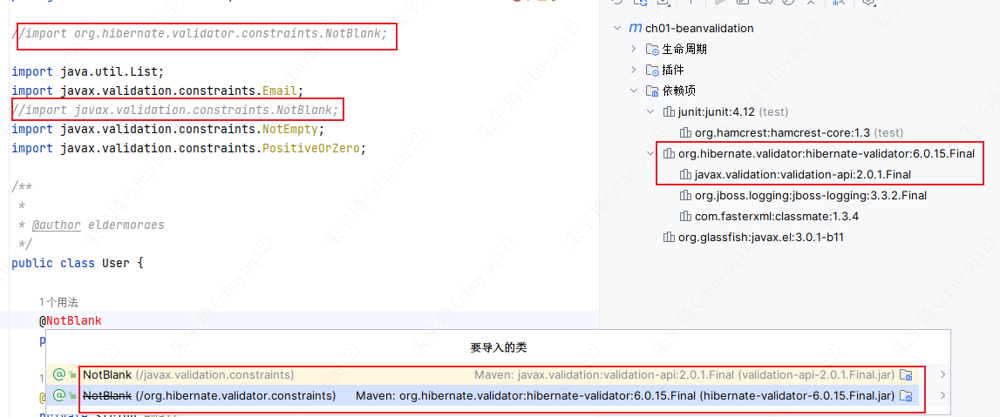
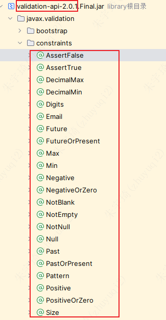
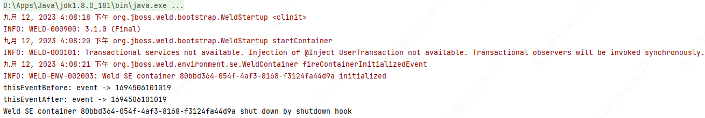
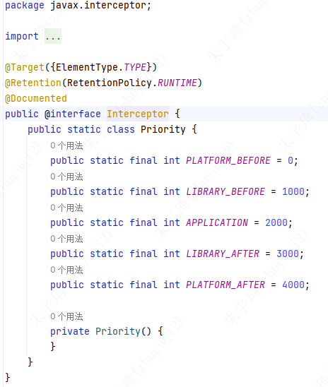
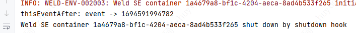
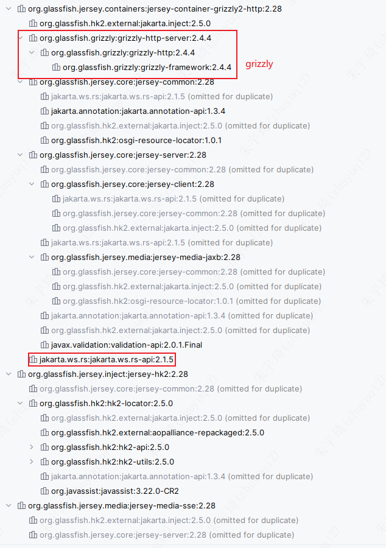
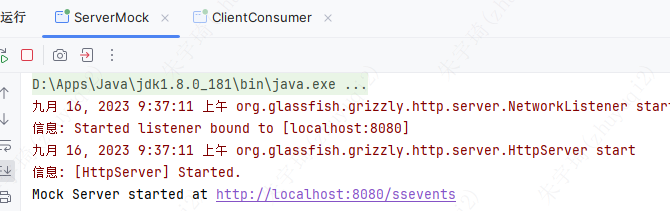
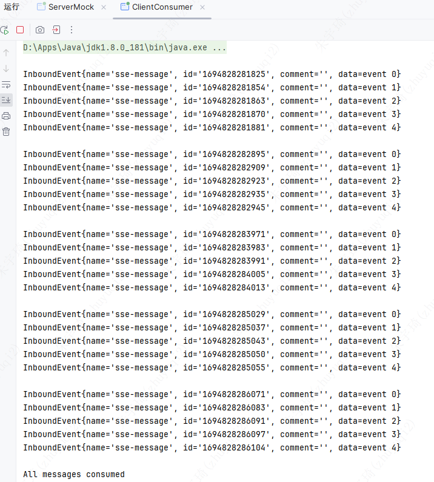
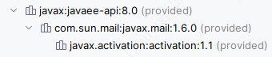

---
tags:
  - Jakarta
  - Jakarta
categories:
  - Java EE
---
>[!note]
> 基于Jakarta EE 8，但是Jakarta EE 9也完美适配。

## 1. New Features and Improvements

### 1.1 Jakarta Bean Validation 2.0

数据校验，保证数据安全。

适用于Java SE和Jakarta EE。

#### 1.1.1 引入依赖

```xml
<dependencies>
	<dependency>
		<groupId>org.hibernate.validator</groupId>
		<artifactId>hibernate-validator</artifactId>
		<version>6.0.15.Final</version>
	</dependency>
</dependencies>
```



#### 1.1.2 指定校验规则

```java
import java.util.List;  
import javax.validation.constraints.Email;  
import javax.validation.constraints.NotBlank;  
import javax.validation.constraints.NotEmpty;  
import javax.validation.constraints.PositiveOrZero;  
  
/**  
 * * @author eldermoraes */
public class User {  
  
    @NotBlank  
    private String name;  
      
    @Email  
    private String email;  
      
    @NotEmpty  
    private List<@PositiveOrZero Integer> profileId;  
  
    public User(String name, String email, List<Integer> profileId) {  
        this.name = name;  
        this.email = email;  
        this.profileId = profileId;  
    }  
      
}
```



#### 1.2.3 使用校验规则

```java  
import com.eldermoraes.ch01.bv.User;  
import static java.util.Arrays.asList;  
import java.util.Set;  
import javax.validation.ConstraintViolation;  
import javax.validation.Validation;  
import javax.validation.Validator;  
import static org.junit.Assert.assertEquals;  
import static org.junit.Assert.assertTrue;  
import org.junit.BeforeClass;  
import org.junit.Test;  
  
/**  
 * * @author eldermoraes */public class UserTest {  
      
    private static Validator validator;  
      
    @BeforeClass  
    public static void setUpClass() {  
        validator = Validation.buildDefaultValidatorFactory().getValidator();  
    }  
      
    @Test  
    public void validUser() {  
        User user = new User(  
                "elder",   
                "elder@eldermoraes.com",   
                asList(1,2));  
          
        Set<ConstraintViolation<User>> cv = validator.validate(user);  
        assertTrue(cv.isEmpty());  
    }  
      
    @Test  
    public void invalidName() {  
        User user = new User(  
                "",   
                "elder@eldermoraes.com",   
                asList(1,2));  
          
        Set<ConstraintViolation<User>> cv = validator.validate(user);  
        assertEquals(1, cv.size());  
    }  
  
    @Test  
    public void invalidEmail() {  
        User user = new User(  
                "elder",   
                "elder-eldermoraes_com",   
                asList(1,2));  
          
        Set<ConstraintViolation<User>> cv = validator.validate(user);  
        assertEquals(1, cv.size());  
    }      
      
    @Test  
    public void invalidId() {  
        User user = new User(  
                "elder",   
                "elder@eldermoraes.com",  
                asList(-1,-2,1,2));  
          
        Set<ConstraintViolation<User>> cv = validator.validate(user);  
        assertEquals(2, cv.size());  
    }      
      
}
```

1. 实例化校验器：

```java
@BeforeClass  
public static void setUpClass() {  
    validator = Validation.buildDefaultValidatorFactory().getValidator();  
}
```

2. 调用校验器

```java
Set<ConstraintViolation<User>> cv = validator.validate(user);
```

`cv`是一个校验结果集，如果全部通过则为空，未通过记录未通过的结果集（次数）。

3. `assertTrue()` 和 `assertEquals()` 是junit框架的方法，分别判断是否为真，结果是否为指定值。

### 1.2 Jakarta CDI 2.0

上下文依赖和注入——Jakarta Contexts and Dependency Injection (CDI)。

适用于Java SE和Jakarta EE。

#### 1.2.1 引入依赖

*此处为了不使用Jakarta EE server，简化使用，引入下述依赖：*

```xml
<dependencies>  
    <dependency>  
        <groupId>org.jboss.weld.se</groupId>  
        <artifactId>weld-se-shaded</artifactId>  
        <version>3.1.0.Final</version>  
    </dependency>          
</dependencies>
```

*此为元依赖，不依赖其他依赖。*

#### 1.2.2 新特性——有序观察器

1. 创建被观察的事件类

```java
public class MyEvent {
    
    private final String value;
    
    public MyEvent(String value){
        this.value = value;
    }
    
    public String getValue(){
        return value;
    }
}
```

2. 创建观察器并创建服务激活事件

```java
import javax.annotation.Priority;  
import javax.enterprise.event.Observes;  
import javax.enterprise.inject.se.SeContainer;  
import javax.enterprise.inject.se.SeContainerInitializer;  
import javax.interceptor.Interceptor;  
  
public class OrderedObserver {  
  
    public static void main(String[] args) {  
        SeContainer container = SeContainerInitializer.newInstance().initialize();  
        container.getBeanManager().fireEvent(new MyEvent("event -> " + System.currentTimeMillis()));  
    }  
  
    public void thisEventBefore(@Observes @Priority(Interceptor.Priority.APPLICATION - 200) MyEvent event) {  
        System.out.println("thisEventBefore: " + event.getValue());  
    }  
  
    public void thisEventAfter(@Observes @Priority(Interceptor.Priority.APPLICATION + 200) MyEvent event) {  
        System.out.println("thisEventAfter: " + event.getValue());  
    }  
  
}
```

3. 创建`beans.xml`文件

```xml
<?xml version="1.0" encoding="UTF-8"?>  
<beans xmlns="http://xmlns.jcp.org/xml/ns/javaee"  
       xmlns:xsi="http://www.w3.org/2001/XMLSchema-instance"  
       xsi:schemaLocation="http://xmlns.jcp.org/xml/ns/javaee http://xmlns.jcp.org/xml/ns/javaee/beans_1_1.xsd"  
       bean-discovery-mode="all">  
</beans>
```

4. 执行结果



#### 1.2.3 执行原理

1. 创建有序观察器：`SeContainer container = SeContainerInitializer.newInstance().initialize();`
2. 激活要被观察的对象：`container.getBeanManager().fireEvent(new MyEvent("……"));`
3. `@Observers`：必选。告诉观察器激活被观察的对象时，要执行的方法。
4. `@Priority(int)`：可选。执行方法的优先级，接受一个整数值。`Interceptor`是java提供的一个整数对象。
	- 

没有`@Priority(int)`时执行如下：

```java
import javax.annotation.Priority;  
import javax.enterprise.event.Observes;  
import javax.enterprise.inject.se.SeContainer;  
import javax.enterprise.inject.se.SeContainerInitializer;  
import javax.interceptor.Interceptor;  
  
/**  
 * @author eldermoraes */public class OrderedObserver {  
  
    public static void main(String[] args) {  
        SeContainer container = SeContainerInitializer.newInstance().initialize();  
        container.getBeanManager().fireEvent(new MyEvent("event -> " + System.currentTimeMillis()));  
    }  
    public void test(@Observes MyEvent event) {  
       System.out.println("thisEventAfter: " + event.getValue());  
    }  
}
```



#### 1.2.4 扩展

实际业务中，已经有了Java EE Server，所以不需要引入上面的依赖，而是使用下述这个：

```xml
<dependency> 
	<groupId>jakarta.platform</groupId> 
	<artifactId>jakarta.jakartaee-api</artifactId>
	<version>8.0.0</version> 
</dependency>
```

- *这也是个元依赖。*
- *使用了上述依赖后，代码还是按上面那样写，不报错，但是运行报错。不知道怎么改。*
### 1.3 JAX-RS 2.1

Jakarta RESTful Web Service（JAX-RS 2.1）用于便携、标准的构建RESTful web services。

JAX-RS 2.1最酷的特性是引入了SSE（Server-Sent Events），这是HTML5的规范。SSE建立了从服务器到客户端的单向通道。

SSE是一种传输数据的消息协议。
#### 1.3.1 引入依赖

```xml
<dependencies>  
    <dependency>  
        <groupId>org.glassfish.jersey.containers</groupId>  
        <artifactId>jersey-container-grizzly2-http</artifactId>  
        <version>2.28</version>  
    </dependency>  
    <dependency>  
        <groupId>org.glassfish.jersey.inject</groupId>  
        <artifactId>jersey-hk2</artifactId>  
        <version>2.28</version>  
    </dependency>  
    <dependency>  
        <groupId>org.glassfish.jersey.media</groupId>  
        <artifactId>jersey-media-sse</artifactId>  
        <version>2.28</version>  
    </dependency>  
</dependencies>
```



这里使用了jersey，这是因为jersey实现了所有jaxrs的特性。同时jersey还包含了grizzly，可以本地启动一个小服务，用来展示SSE行为。

#### 1.3.2 使用SSE

1. 创建服务：

```java
import java.io.IOException;  
import java.net.URI;  
import org.glassfish.grizzly.http.server.HttpServer;  
import org.glassfish.jersey.grizzly2.httpserver.GrizzlyHttpServerFactory;  
import org.glassfish.jersey.server.ResourceConfig;  
  
public class ServerMock {  
  
    public static final URI CONTEXT = URI.create("http://localhost:8080/");  
    public static final String BASE_PATH = "ssevents";  
  
    public static void main(String[] args) {  
        try {  
            final ResourceConfig resourceConfig = new ResourceConfig(SseResource.class);  
  
            final HttpServer server = GrizzlyHttpServerFactory.createHttpServer(CONTEXT, resourceConfig, false);  
            server.start();  
  
            System.out.println(String.format("Mock Server started at %s%s", CONTEXT, BASE_PATH));  
  
            Thread.currentThread().join();  
        } catch (IOException | InterruptedException ex) {  
            System.out.println(ex.getMessage());  
        }  
    }  
}
```

2. 创建jax-rs端点，发送事件给客户端

```java
import java.io.IOException;  
import javax.ws.rs.GET;  
import javax.ws.rs.POST;  
import javax.ws.rs.Path;  
import javax.ws.rs.Produces;  
import javax.ws.rs.core.Context;  
import javax.ws.rs.core.MediaType;  
import javax.ws.rs.sse.Sse;  
import javax.ws.rs.sse.SseEventSink;  
  
@Path(ServerMock.BASE_PATH)  
public class SseResource {  
  
    private static volatile SseEventSink SINK = null;  
  
    @GET  
    @Produces(MediaType.SERVER_SENT_EVENTS)  
    public void getMessageQueue(@Context SseEventSink sink) {  
        SseResource.SINK = sink;  
    }  
  
    @POST  
    public void addMessage(final String message, @Context Sse sse) throws IOException {  
        if (SINK != null) {  
            SINK.send(sse.newEventBuilder()  
                    .name("sse-message")  
                    .id(String.valueOf(System.currentTimeMillis()))  
                    .data(String.class, message)  
                    .comment("")  
                    .build());  
        }  
    }  
}
```

3. 创建客户端消费在服务端生成的事件

```java
import javax.ws.rs.client.Client;  
import javax.ws.rs.client.ClientBuilder;  
import javax.ws.rs.client.Entity;  
import javax.ws.rs.client.WebTarget;  
import javax.ws.rs.sse.SseEventSource;  
  
public class ClientConsumer {  
  
    public static final Client CLIENT = ClientBuilder.newClient();  
    public static final WebTarget WEB_TARGET = CLIENT.target(ServerMock.CONTEXT + ServerMock.BASE_PATH);  
      
    public static void main(String[] args) {  
        consume();  
    }  
  
    private static void consume() {  
  
        try (final SseEventSource sseSource =  
                     SseEventSource  
                             .target(WEB_TARGET)  
                             .build()) {  
  
            sseSource.register(System.out::println);  
            sseSource.open();
  
            for (int counter=0; counter < 5; counter++) {  
                System.out.println(" ");  
                for (int innerCounter=0; innerCounter < 5; innerCounter++) {  
                    WEB_TARGET.request().post(Entity.json("event " + innerCounter));  
                }  
                Thread.sleep(1000);  
            }  
              
            CLIENT.close();  
            System.out.println("\nAll messages consumed");  
        } catch (InterruptedException e) {  
            System.out.println(e.getMessage());  
        }  
    }  
}
```

4. 启动服务端，然后启动客户端，输出如下：





#### 1.3.4 执行原理

`ServerMock`是服务，`SseResource`是SSE引擎，`ClientConsumer`是客户端。

1. 当`ServerMock`初始化时，就会注册`SseResource`：
	- `final HttpServer server = GrizzlyHttpServerFactory.createHttpServer(CONTEXT, resourceConfig, false);`
2. `SseResource`添加message到服务队列。
	- `addMessage(final String message, @Context Sse sse)`
3. `SseResource`消费队列中的消息，并发送到客户端：
	- `@GET@Produces(MediaType.SERVER_SENT_EVENTS)public void getMessageQueue(@Context SseEventSink sink)`
	- `SERVER_SENT_EVENTS`是此版本引入的媒体类型。
4. `ClientConsumer`发送和消费本消息：
	- 消费消息：`sseSource.register(System.out::println);sseSource.open();`
	- 发送消息：`ServerMock.WEB_TARGET.request().post(Entity.json("event " + innerCounter));`

### 1.4 JSF 2.3

Jakarta Server Faces (JSF)是一种简化UI构建过程的Java技术。

#### 1.4.1 引入依赖

```xml
<dependency>           
	<groupId>jakarta.platform</groupId>   
	<artifactId>jakarta.jakartaee-api</artifactId>      
	<version>8.0.0</version>   
</dependency>
```




#### 1.4.2 使用JSF

1. 创建`User`：

```java
import java.io.Serializable;

public class User implements Serializable {

    private String name;
    private String email;

    public User(String name, String email) {
        this.name = name;
        this.email = email;        
    }   

    public String getName() {
        return name;
    }

    public void setName(String name) {
        this.name = name;
    }

    public String getEmail() {
        return email;
    }

    public void setEmail(String email) {
        this.email = email;
    }              

}
```

2. `UserBean`管理UI

```java  
import java.io.Serializable;  
import javax.annotation.PostConstruct;  
import javax.enterprise.context.RequestScoped;  
import javax.faces.application.FacesMessage;  
import javax.faces.context.FacesContext;  
import javax.inject.Named;  
  
@Named  
@RequestScoped  
public class UserBean implements Serializable {  
      
    private User user;  
      
    @PostConstruct  
    public void init(){  
        user = new User("Elder Moraes", "elder@eldermoraes.com");  
    }  
      
    public UserBean(){  
          
    }  
  
    public void userAction(){  
        FacesContext.getCurrentInstance().addMessage(null,   
                new FacesMessage("Name|Password welformed"));  
    }  
  
    public User getUser() {  
        return user;  
    }  
  
    public void setUser(User user) {  
        this.user = user;  
    }  
      
}
```

3. 