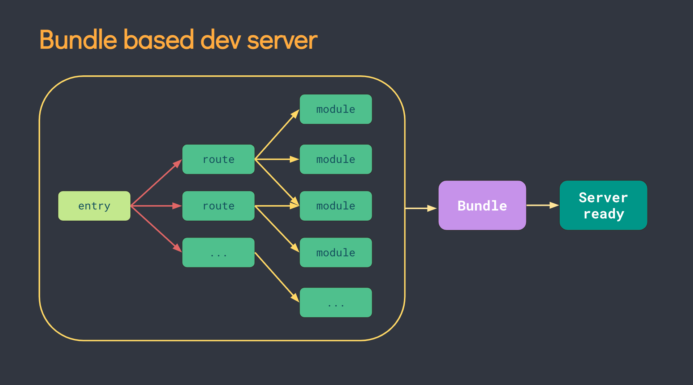
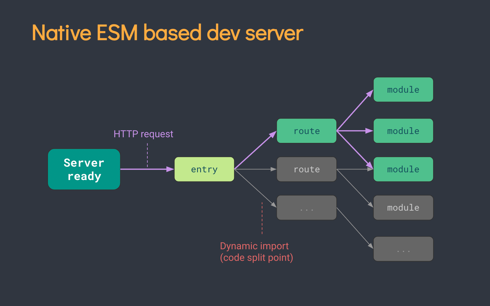

> https://vue3.chengpeiquan.com/

## 1. 前端工程化

### 1.1 VUE“数据驱动”编程

原生 JavaScript 需要频繁的操作 DOM 才能达到输入内容即时体现在文本 DOM 上面，并且还要考虑 DOM 是否已渲染完毕，否则操作会出错。

如果在一个页面上频繁且大量的操作真实 DOM ，频繁的触发浏览器回流（ Reflow ）与重绘（ Repaint ），会带来很大的性能开销，从而造成页面卡顿，在大型项目的性能上很是致命。

而 Vue 则是通过操作虚拟 DOM （ Virtual DOM ，简称 VDOM ），每一次数据更新都通过 Diff 算法找出需要更新的节点，只更新对应的虚拟 DOM ，再去映射到真实 DOM 上面渲染，以此避免频繁或大量的操作真实 DOM 。

### 1.2 框架与类库库的区别

Vue.js 是一个框架，框架除了简化编码过程中的复杂度之外，面对不同的业务需求还提供了通用的解决方案，而这些解决方案，通常是**将前端工程化里的很多种技术栈组合起来串成一条条技术链**，一环扣一环，串起来就是一个完整的工程化项目。

### 1.3 现代化开发概念

#### 1.3.1 MPA与SPA

MPA：Multi-Page Application，多页面应用是最传统的网站体验，当一个网站有多个页面时，会对应有多个实际存在的 HTML 文件，访问每一个页面都需要经历一次完整的页面请求过程：

> 从用户点击跳转开始：
>
> - 浏览器打开新的页面
> - 请求【所有】资源
> - 加载 HTML 、CSS 、 JS 、 图片等资源
> - 完成新页面的渲染

SPA:Single-Page Application，单页面应用。不论站点内有多少个页面，在 SPA 项目实际上只有一个 HTML 文件，也就是 index.html 首页文件。

> 从用户点击跳转开始：
>
> - 浏览器通过 `pushState` 等方法更新 URL
> - 请求接口数据（如果有涉及到前后端交互）
> - 通过 JavaScript 处理数据，拼接 HTML 片段
> - 把 HTML 片段渲染到指定位置，完成页面的 “刷新”

SPA 在页面跳转的时候，地址栏也会发生变化，主要有以下两种方式：

1. 通过修改 `Location:hash` 修改 URL 的 Hash 值（也就是 # 号后面部分），例如从 `https://example.com/#/foo` 变成 `https://example.com/#/bar`
2. 通过 `History API` 的 pushState 方法更新 URL ，例如从`https://example.com/foo` 变成 `https://example.com/bar`

这两个方式的共同特点是更新地址栏 URL 的时候，均不会刷新页面，只是单纯的变更地址栏的访问地址，而网页的内容则通过 AJAX 更新，配合起来就形成了一种网页的 “前进 / 后退” 等行为效果。

#### 1.3.2 CSR和SSR

|名词|	全称|	中文|
|-|-|-|
|CSR|	Client-Side Rendering|	客户端渲染|
|SSR|	Server-Side Rendering|	服务端渲染|

CSR是一种利用 AJAX 技术，把渲染工作从服务端转移到客户端完成。因此，大部分情况下， CSR 等同于 SPA。

传统的服务端渲染通常由后端开发者一起维护前后端代码，而 SSR 服务端渲染则是交给前端开发者来维护，利用 Node 提供的能力进行同构渲染。

SSR 技术利用的同构渲染方案（ Isomorphic Rendering ），指的是一套代码不仅可以在客户端运行，也可以在服务端运行，在一些合适的时机先由服务端完成渲染（ Server-Side Rendering ）再直出给客户端激活（ Client-Side Hydration ）。

#### 1.3.3 Pre-Rendering和SSG

#### 1.3.4 ISR和DPR

#### 1.3.5 SEO的TKD

网页的 TKD 三要素是指一个网页的三个关键信息，含义如下：

- T ，指 Title ，网站的标题，即网页的 `<title>`网站的标题`</title>` 标签。
- K ，指 Keywords ，网站的关键词，即网页的 `<meta name="Keywords" content="关键词1,关键词2,关键词3" />` 标签。
- D ，指 Description ，网站的描述，即网页的 `<meta name="description" content="网站的描述" />` 标签。

这三个要素标签都位于 HTML 文件的 `<head />` 标签内。

### 1.4 前端的扩展

#### 1.4.1 服务端开发

nodejs使得前端变为全栈。

Node 本身是一个 JavaScript 的运行时，由于提供了 HTTP 模块 可以启动一个本地 HTTP 服务，当 Node 项目部署到服务器上时，就可以运行一个可对外访问的公网服务。

但 Node 的原生服务端开发成本比较高，因此在 GitHub 开源社区也诞生了很多更方便的、开箱即用、功能全面的服务端框架，根据它们的特点，可以简单归类如下：

以 Express 、 Koa 、 Fastify 为代表的轻量级服务端框架。这一类框架的特点是 “短平快” ，对于服务端需求不高，只是跑一些小项目的话，开箱即用非常地方便，比如 Build 了一个 Vue 项目，然后提供一个读取静态目录的服务来访问它。

但是 “短平快” 框架带来了一些团队协作上的弊端，如果缺少一些架构设计的能力，很容易把一个服务端搭的很乱以至于难以维护，比如项目的目录结构、代码的分层设计等等，每个创建项目的人都有自己的想法和个人喜好，就很难做到统一管理。

因此在这些框架的基础上，又诞生了以 Nest （底层基于 Express ，可切换为 Fastify ）、 Egg （基于 Koa ）为代表的基于 MVC 架构的企业级服务端框架，这一类框架的特点是基于底层服务进行了更进一步的架构设计并实现了代码分层，还自带了很多开箱即用的 Building Blocks ，例如 TypeORM 、WebSockets 、Swagger 等等，同样也是开箱即用，对大型项目的开发更加友好。

#### 1.4.2 App开发

常规的 Native App 原生开发需要配备两条技术线的支持：使用 Java / Kotlin 语言开发 Android 版本，使用 Objective-C / Swift 语言开发 iOS 版本。

Hybrid App 的出现，使得前端开发者也可以使用 JavaScript / TypeScript 来编写混合 App ，最大的特色就是一套代码可以运行到多个平台，这是因为整个 App 只有一个基座，里面的 App 页面都是使用 UI WebView 来渲染的 Web 界面。

构建 Hybrid App 的时候还可以顺带输出一个 Web App 版本，也就是让这个 App 在被用户下载前，也有一模一样的网页版可以体验。

基于 Vue 的 uni-app 、基于 React 的 React Native 。

#### 1.4.3 桌面程序开发

以前要开发一个 Windows 桌面程序，需要用上 QT / WPF / WinForm 等技术栈，还要学习 C++ / C# 之类的语言。

Electron / Tauri 等技术栈的出现，使得前端也可以构建桌面给程序。其中 Electron 的成熟度最高、生态最完善、最被广泛使用。

#### 1.4.4 应用脚本开发

同桌面程序，只是桌面脚本有GUI。

Pkg工具 ，它可以把 Node 项目打包为一个可执行文件，可以让没有node环境的情况下运行脚本。

### 1.5 实践工程化的流程

|常用方案	|Runtime|	构建工具|	前端框架|
|-|-|-|-|
|方案一	|Node|	Webpack	|Vue|
|方案二	|Node|	Vite|	Vue|

### 1.6 Nodejs

Node.js （简称 Node ） 是一个基于 Chrome V8 引擎构建的 JS 运行时（ JavaScript Runtime ）。

Runtime ，可以叫它 “运行时” 或者 “运行时环境” ，这个概念是指，项目的代码在哪里运行，哪里就是运行时。

传统的 JavaScript 只能跑在浏览器上，每个浏览器都为 JS 提供了一个运行时环境，可以简单地把浏览器当成一个 Runtime。

Node 就是一个让 JS 可以脱离浏览器运行的环境，当然，这里并不是说 Node 就是浏览器，没有 Window 、没有 Document 、没有 DOM 、没有 Web API ，没有 UI 界面，同时提供了很多浏览器做不到的能力，比如和操作系统的交互。

### 1.7 工程化构建工具

1. 流行的构建工具：[Grunt](https://github.com/gruntjs/grunt) 、 [Gulp](https://github.com/gulpjs/gulp) 、 [Webpack](https://github.com/webpack/webpack) 、 [Snowpack](https://github.com/FredKSchott/snowpack) 、 [Parcel](https://github.com/parcel-bundler/parcel) 、 [Rollup](https://github.com/rollup/rollup) 、 [Vite](https://github.com/vitejs/vite)
2. 构建工具的理解：构建工具通常集 “语言转换 / 编译” 、 “资源解析” 、 “代码分析” 、 “错误检查” 、 “任务队列” 等非常多的功能于一身。是一套工具链、工具集。
3. 构建工具作用：

	- 浏览器不支持的语言转换/编译
	- 代码检查、css转换
	- 上线前期代码混淆

**webpack和vite对比：**

1. Webpack 会先打包，再启动开发服务器，访问开发服务器时，会把打包好的结果直接给过去。

	- 

2. Vite 是基于浏览器原生的 ES Module ，所以不需要预先打包，而是直接启动开发服务器，请求到对应的模块的时候再进行编译。

	- 

**开发环境、生产环境判断**：

1. 在 Webpack ，可以使用 `process.env.NODE_ENV` 来区分开发环境（ development ）还是生产环境（ production ），它会返回当前所处环境的名称。
2. 在 Vite ，还可以通过判断 `import.meta.env.DEV` 为 `true` 时是开发环境，判断 `import.meta.env.PROD` 为 `true` 时是生产环境（这两个值永远相反）。

## 2. 工程化项目

### 2.1 node项目

#### 2.1.1 package.json

`npm init`或`npm init -y`会初始化一个node项目，项目的相关信息会保存在package.json文件中。

| 字段名             | 含义                                                                                                                                                                |
| --------------- | ----------------------------------------------------------------------------------------------------------------------------------------------------------------- |
| name            | 项目名称，如果打算发布成 npm 包，它将作为包的名称                                                                                                                                       |
| version         | 项目版本号，如果打算发布成 npm 包，这个字段是必须的，遵循 [语义化版本号](https://vue3.chengpeiquan.com/guide.html#%E8%AF%AD%E4%B9%89%E5%8C%96%E7%89%88%E6%9C%AC%E5%8F%B7%E7%AE%A1%E7%90%86) 的要求   |
| description     | 项目的描述                                                                                                                                                             |
| keywords        | 关键词，用于在 npm 网站上进行搜索                                                                                                                                               |
| homepage        | 项目的官网 URL                                                                                                                                                         |
| main            | 项目的入口文件                                                                                                                                                           |
| scripts         | 指定运行脚本的命令缩写，常见的如 `npm run build` 等命令就在这里配置，详见 [脚本命令的配置](https://vue3.chengpeiquan.com/guide.html#%E8%84%9A%E6%9C%AC%E5%91%BD%E4%BB%A4%E7%9A%84%E9%85%8D%E7%BD%AE) |
| author          | 作者信息                                                                                                                                                              |
| license         | 许可证信息，可以选择适当的许可证进行开源                                                                                                                                              |
| dependencies    | 记录当前项目的生产依赖，安装 npm 包时会自动生成，详见：[依赖包和插件](https://vue3.chengpeiquan.com/guide.html#%E4%BE%9D%E8%B5%96%E5%8C%85%E5%92%8C%E6%8F%92%E4%BB%B6)                           |
| devDependencies | 记录当前项目的开发依赖，安装 npm 包时会自动生成，详见：[依赖包和插件](https://vue3.chengpeiquan.com/guide.html#%E4%BE%9D%E8%B5%96%E5%8C%85%E5%92%8C%E6%8F%92%E4%BB%B6)                           |
| type            | 配置 Node 对 CJS 和 ESM 的支持                                                                                                                                           |

**name字段：**

如果打算发布成 npm 包，它将作为包的名称，可以是普通包名，也可以是范围包的包名。

| 类型  | 释义                                                          | 例子                                            |
| --- | ----------------------------------------------------------- | --------------------------------------------- |
| 范围包 | 具备 `@scope/project-name` 格式，一般有一系列相关的开发依赖之间会以相同的 scope 进行命名 | 如 `@vue/cli` 、 `@vue/cli-service` 就是一系列相关的范围包 |
| 普通包 | 其他命名都属于普通包                                                  | 如 `vue` 、 `vue-router`                        |

**version字段：**

Node 项目遵循 [语义化版本号](https://semver.org/lang/zh-CN/) 的规则，例如 `1.0.0` 、 `1.0.1` 、 `1.1.0` 这样的版本号。

基本格式与升级规则：

版本号的格式为： `Major.Minor.Patch` （简称 `X.Y.Z` ），它们的含义和升级规则如下：

|英文|中文|含义|
|---|---|---|
|Major|主版本号|当项目作了大量的变更，与旧版本存在一定的不兼容问题|
|Minor|次版本号|做了向下兼容的功能改动或者少量功能更新|
|Patch|修订号|修复上一个版本的少量 BUG|

一般情况下，三者均为正整数，并且从 `0` 开始，遵循这三条注意事项：

- 当主版本号升级时，次版本号和修订号归零
- 当次版本号升级时，修订号归零，主版本号保持不变
- 当修订号升级时，主版本号和次版本号保持不变

下面以一些常见的例子帮助快速理解版本号的升级规则：

- 如果不打算发布，可以默认为 `0.0.0` ，代表它并不是一个进入发布状态的包
- 在正式发布之前，可以将其设置为 `0.1.0` 发布第一个测试版本，自此，代表已进入发布状态，但还处于初期开发阶段，这个阶段可能经常改变 API ，但不需要频繁地更新主版本号
- 在 `0.1.0` 发布后，修复了 BUG ，下一个版本号将设置为 `0.1.1` ，即更新了一个修订号
- 在 `0.1.1` 发布后，有新的功能发布，下一个版本号可以升级为 `0.2.0` ，即更新了一个次版本号
- 当觉得这个项目已经功能稳定、没有什么 BUG 了，决定正式发布并给用户使用时，那么就可以进入 `1.0.0` 正式版了

版本标识符：

以上是一些常规的版本号升级规则，也可以通过添加 “标识符” 来修饰的版本更新：

格式为： `Major.Minor.Patch-Identifier.1` ，其中的 `Identifier` 代表 “标识符” ，它和版本号之间使用 `-` 短横线来连接，后面的 `.1` 代表当前标识符的第几个版本，每发布一次，这个数字 +1 。

|标识符|含义|
|---|---|
|alpha|内部版本，代表当前可能有很大的变动|
|beta|测试版本，代表版本已开始稳定，但可能会有比较多的问题需要测试和修复|
|rc|即将作为正式版本发布，只需做最后的验证即可发布正式版|

**scripts字段：**

```json
{
  "scripts": {
    "dev": "vue-cli-service serve",
    "build": "vue-cli-service build"
  }
}
```

运行 `npm run dev` 也可以相当于运行了 `vue-cli-service serve`。

**type字段：**

type 字段涉及到模块规范的支持，它有两个可选值： `commonjs` 和 `module` ，其默认值为 `commonjs` 。

- 当不设置或者设置为 `commonjs` 时，扩展名为 `.js` 和 `.cjs` 的文件都是 CommonJS 规范的模块，如果要使用 ES Module 规范，需要使用 `.mjs` 扩展名。
- 当设置为 `module` 时，扩展名为 `.js` 和 `.mjs` 的文件都是 ES Module 规范的模块，如果要使用 CommonJS 规范，需要使用 `.cjs` 扩展名。

### 2.2 模块化设计

前端工程中，符合软件设计”单一原则“的代码块，就叫做模块（Module），模块有自己的作用域，功能与业务解耦，方便复用和移植。

主流模块化机制：

|模块化方案|全称|适用范围|
|---|---|---|
|CJS|CommonJS|Node 端|
|AMD|Async Module Definition|浏览器|
|CMD|Common Module Definition|浏览器|
|UMD|Universal Module Definition|Node 端和浏览器|
|ESM|ES Module|Node 端和浏览器|

ESM （ ES Module ） 是 JavaScript 在 ES6（ ECMAScript 2015 ）版本推出的模块化标准，旨在成为浏览器和服务端通用的模块解决方案。

CJS （ CommonJS ） 原本是服务端的模块化标准（设计之初也叫 ServerJS ），是为 JavaScript 设计的用于浏览器之外的一个模块化方案， Node 默认支持了该规范。

#### 2.2.1 CJS

```bash
hello-node
│ # 源码文件夹
├─src
│ │ # 业务文件夹
│ └─cjs
│   │ # 入口文件
│   ├─index.cjs
│   │ # 模块文件
│   └─module.cjs
│ # 项目清单
└─package.json
```

package.json文件：

```json
{
  "scripts": {
    "dev:cjs": "node src/cjs/index.cjs"
  }
}
```

命令行执行 `npm run dev:cjs` 命令，就可以测试刚刚添加的 CJS 模块了。

**基本语法：**

CJS 使用 `module.exports` 语法导出模块，可以导出任意合法的 JavaScript 类型，例如：字符串、布尔值、对象、数组、函数等等。

使用 `require` 导入模块，在导入的时候，当文件扩展名是 `.js` 时，可以只写文件名，而此时使用的是 `.cjs` 扩展名，所以需要完整的书写。

**默认导入和导出**：

默认导出的时候，一个模块只包含一个值。

```js
// src/cjs/module.cjs 导出：
module.exports = 'Hello World'
```

```js
// src/cjs/index.cjs 导入：
const m = require('./module.cjs')
console.log(m)
```

**命名导入和导出：**

命名导入和导出，一个模块可以包含多个值。

```js
// src/cjs/module.cjs 导出：
function foo() {
  console.log('Hello World from foo.')
}

const bar = 'Hello World from bar.'

module.exports = {
  foo,
  bar,
}
```

```js
// src/cjs/index.cjs 导入：
const m = require('./module.cjs')
console.log(m.foo())

或

// src/cjs/index.cjs
const { foo, bar } = require('./module.cjs')
foo()
console.log(bar)

导入时重命名：

// src/cjs/index.cjs
const {
  foo: foo2,  // 这里进行了重命名为foo2
  bar,
} = require('./module.cjs')
```

#### 2.2.1 ESM

```bash
hello-node
│ # 源码文件夹
├─src
│ │ # 这次要用的 ES Module 测试文件
│ └─esm
│   │ # 入口文件
│   ├─index.mjs
│   │ # 模块文件
│   └─module.mjs
│
│ # 项目清单
└─package.json
```

package.json文件：

```json
{
  "scripts": {
    "dev:esm": "node src/esm/index.mjs"
  }
}
```

命令行执行 `npm run dev:esm` 命令，就可以测试刚刚添加的 ESM 模块了。

**基本语法：**

ESM 使用 `export default` （默认导出）和 `export` （命名导出）这两个语法导出模块，和 CJS 一样， ESM 也可以导出任意合法的 JavaScript 类型，例如：字符串、布尔值、对象、数组、函数等等。

使用 `import ... from ...` 导入模块，在导入的时候，如果文件扩展名是 `.js` 则可以省略文件名后缀，否则需要把扩展名也完整写出来。

**默认导入和导出**：

默认导出的时候，一个模块只包含一个值。与CJS一致。

```js
// src/cjs/module.cjs 导出：
export default 'Hello World'
```

```js
// src/cjs/index.cjs 导入：
import m from './module.mjs'
console.log(m)
```

**命名导入和导出：**

命名导入和导出，一个模块可以包含多个值。与CJS不同。

```js
// src/cjs/module.cjs 导出：
export function foo() { 
  console.log('Hello World from foo.') 
} 

export const bar = 'Hello World from bar.'
```

```js
// src/cjs/index.cjs 导入：
import { foo, bar } from './module.mjs' //这种大括号导入的方式只能适配明明导入，不能适配默认导入（export default）

foo()
console.log(bar)

或

// src/cjs/index.cjs
import * as m from './module.mjs' 

m.foo() 
console.log(m.bar)

导入时重命名：

// src/cjs/index.cjs
import {
  foo as foo2,  // 这里进行了重命名为foo2
  bar,
} from './module.mjs' 
```

### 2.3 组件化设计

模块化属于 JavaScript 的概念，把代码块的职责单一化，一个函数、一个类都可以独立成一个模块。组件就是把一些可复用的 HTML 结构和 CSS 样式再做一层抽离，然后再放置到需要展示的位置。

在 Vue ，是通过 Single-File Component （简称 SFC ， `.vue` 单文件组件）来实现组件化开发。

一个 Vue 组件是由三部分组成的：

```vue
<template>
  <!-- HTML 代码 -->
</template>

<script>
// JavaScript 代码
</script>

<style scoped>
/* CSS 代码 */
</style>
```

### 2.4 插件包和依赖

插件在 Node 项目里的体现是一个又一个的依赖包。在 Node 项目里，包可以简单理解为模块的集合，一个包可以只提供一个模块的功能，也可以作为多个模块的集合集中管理。

node_modules 是 Node 项目下用于存放已安装的依赖包的目录，如果不存在，会自动创建。

如果是本地依赖，会存在于项目根目录下，如果是全局依赖，会存在于环境变量关联的路径下。

执行 `npm install` 的时候，添加 `--save` 或者 `-S` 选项可以将依赖安装到本地，并列为生产依赖（项目在上线后仍需用到的包，如 `vue-router` ）。`--save` 或者 `-S` 选项在实际使用的时候可以省略，因为它是默认选项。

`package.json` 文件里的 `dependencies` 字段查看是否已安装成功:

```json
// package.json
{
  // 会安装到这里
  "dependencies": {
    // 以 "包名"："版本号" 的格式写入
    "vue-router": "^4.0.14"
  }
}
```

执行 `npm install` 的时候，如果添加 `--save-dev` 或者 `-D` 选项，可以将依赖安装到本地，并写入开发依赖里（构建部署到生产环境时可能会被抛弃，如`ESLint`）。

`package.json` 文件里的 `devDependencies` 字段查看是否已安装成功：

```json
// package.json
{
  // 会安装到这里
  "devDependencies": {
    // 以 "包名"："版本号" 的格式写入
    "eslint": "^8.6.0"
  }
}
```

执行 `npm install` 的时候，如果添加 `--global` 或者 `-g` 选项，可以将依赖安装到全局，它们将被安装在 [配置环境变量](https://vue3.chengpeiquan.com/guide.html#%E9%85%8D%E7%BD%AE%E7%8E%AF%E5%A2%83%E5%8F%98%E9%87%8F) 里配置的全局资源路径里。

项目的依赖建议优先选择本地安装，这是因为本地安装可以把依赖列表记录到 package.json 里，多人协作的时候可以减少很多问题出现，特别是当本地依赖与全局依赖版本号不一致的时候。

包的导入和在模块化设计一节了解到的模块导入用法是一样的，只是把 `from` 后面的文件路径换成了包名。

#### 2.4.1 包管理器npm

| 指令                                                       | 含义              |
| -------------------------------------------------------- | --------------- |
| `npm -v`                                                 | 输出npm版本号        |
| `npm config get registry`                                | 查看当前的 npm 配置    |
| `npm config set registry https://registry.npmmirror.com` | 绑定国内镜像源         |
| `npm config rm registry`                                 | 删除自定义镜像源，恢复默认   |
| `npm install --save <package-name>`                      | 安装依赖到本地，并作为生产依赖 |
| `npm install --save-dev <package-name>`                  | 安装依赖到本地，并作为开发依赖 |
| `npm install --global <package-name>`                    | 安装依赖到全局         |
| `npm install <package-name>@<version \| tag>`            | 安装指定版本依赖        |
| `npm update`                                             | 更新全部包           |
| `npm update <package-name>`                              | 更新指定包           |
| `npm uninstall <package-name>`                           | 卸载本地指定包         |
| `npm uninstall --global <package-name>`                  | 卸载全局指定包         |

#### 2.4.2 使用包

1. 导入：`import md5 from 'md5'`
2. 查询API：npmjs 主页上会有 API 和用法的说明。

### 2.5 Babel的使用

#### 2.5.1 安装Babel

```bash
npm i -D @babel/core @babel/cli @babel/preset-env
```

|依赖|作用|文档|
|---|---|---|
|@babel/cli|安装后可以从命令行使用 Babel 编译文件|[查看文档](https://babel.dev/docs/en/babel-cli)|
|@babel/core|Babel 的核心功能包|[查看文档](https://babel.dev/docs/en/babel-core)|
|@babel/preset-env|智能预设，可以通过它的选项控制代码要转换的支持版本|[查看文档](https://babel.dev/docs/en/babel-preset-env)|

#### 2.5.2 配置Babel

根目录下创建一个名为 babel.config.json 的文件，写入：

```json
{
  "presets": [
    [
      "@babel/preset-env",
      {
        "targets": {
          "chrome": "41"
        },
        "modules": false,
        "useBuiltIns": "usage",
        "corejs": "3.6.5"
      }
    ]
  ]
}
```

#### 2.5.3 编译代码

```json
{
  "scripts": {
    "dev:cjs": "node src/cjs/index.cjs",
    "dev:esm": "node src/esm/index.mjs",
    "compile": "babel src/babel --out-dir compiled",
    "serve": "node server/index.js"
  }
}
```

compile的含义是使用 Babel 处理 src/babel 目录下的文件，并输出到根目录下的 compiled 文件夹。

```bash
npm run compile
# 如同：
babel src/babel --out-dir compiled
```

## 3. TypeScript

### 3.1 使用原因

TypeScript 简称 TS ，既是一门新语言，也是 JS 的一个超集，它是在 JavaScript 的基础上增加了一套类型系统，它支持所有的 JS 语句，为工程化开发而生，最终在编译的时候去掉类型和特有的语法，生成 JS 代码。

带有类型系统的前端语言不止 TypeScript （例如 Facebook 推出的 [Flow.js](https://github.com/facebook/flow) ），但TypeScript 无疑是更好的选择。

JavaScript 的弊端在于过于灵活，没有类型的约束，很容易因为类型的变化导致一些本可避免的 BUG 出现，而且这些 BUG 通常需要在程序运行的时候才会被发现，很容易引发生产事故。

TypeScript 的出现，在编译的时候就可以执行检查来避免掉这些问题。

### 3.2 使用过程

```bash
npm install -D typescript ts-node
```

编译：

```bash
s-node src/ts/index.ts
```

### 3.3 常用TS类型

#### 3.3.1 原始数据类型

|原始数据类型|JavaScript|TypeScript|
|---|---|---|
|字符串|String|string|
|数值|Number|number|
|布尔值|Boolean|boolean|
|大整数|BigInt|bigint|
|符号|Symbol|symbol|
|不存在|Null|null|
|未定义|Undefined|undefined|

```ts
// 字符串
const str: string = 'Hello World'
// 数值
const num: number = 1
// 布尔值
const bool: boolean = true

// 这样也不会报错，因为 TS 会推导它们的类型
const str = 'Hello World'
const num = 1
const bool = true
```

#### 3.3.2 数组

| 数组里的数据 | 类型写法 1      | 类型写法 2             |
| ------ | ----------- | ------------------ |
| 字符串    | string[]    | `Array<string>`    |
| 数值     | number[]    | `Array<number>`    |
| 布尔值    | boolean[]   | `Array<boolean>`   |
| 大整数    | bigint[]    | `Array<bigint>`    |
| 符号     | symbol[]    | `Array<symbol>`    |
| 不存在    | null[]      | `Array<null>`      |
| 未定义    | undefined[] | `Array<undefined>` |

```ts
// 字符串数组
const strs: string[] = ['Hello World', 'Hi World']
// 数值数组
const nums: number[] = [1, 2, 3]
// 布尔值数组
const bools: boolean[] = [true, true, false]

// 这种有初始项目的数组， TS 也会推导它们的类型
const strs = ['Hello World', 'Hi World']
const nums = [1, 2, 3]
const bools = [true, true, false]

// 这个时候会认为是 any[] 或者 never[] 类型
const nums = []
// 这个时候再 push 一个 number 数据进去，也不会使其成为 number[]
nums.push(1)
```

### 3.4 对象（接口）