## 1. 基础入门

**电气工程师发展路径：**

电路→电工→电气→PLC→DCS→机器人

**电：**

- 直流DC：220V，工频50HZ
- 交流AC：
	- 单相：一个火线，L代表火线，N代表零线（左零右火）
	- 三相：三根火线，L1、L2、L3

PLC供电一般DC24V，发出指令后，控制一个供电220V的电气件，带动一个AC380V的电机。

**按钮开关：**

- 不带自锁：按下后自动复位。
- 带自锁：按下后保持。
- 红色代表常闭（NC），绿色代表常开（NO）。

**逆变器（逆变电源）：**

- AC220V转变为AC380V
- 其他转换

**交流接触器：**

- 组成：线圈、主触点、辅助触点
- 动作：线圈得电，常开吸合，常闭断开；线圈失电，所有常开常闭复位。

**热继电器：**

**熔断器：**

### 1.1 点动控制

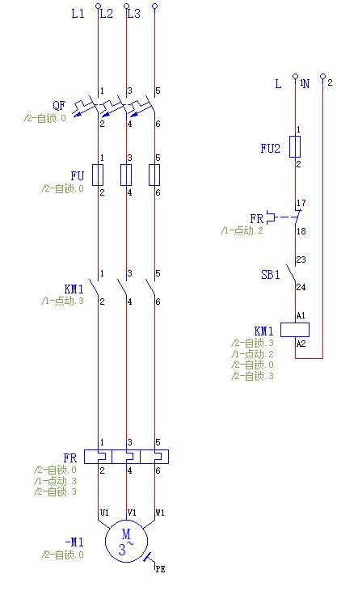

### 1.2 起保停

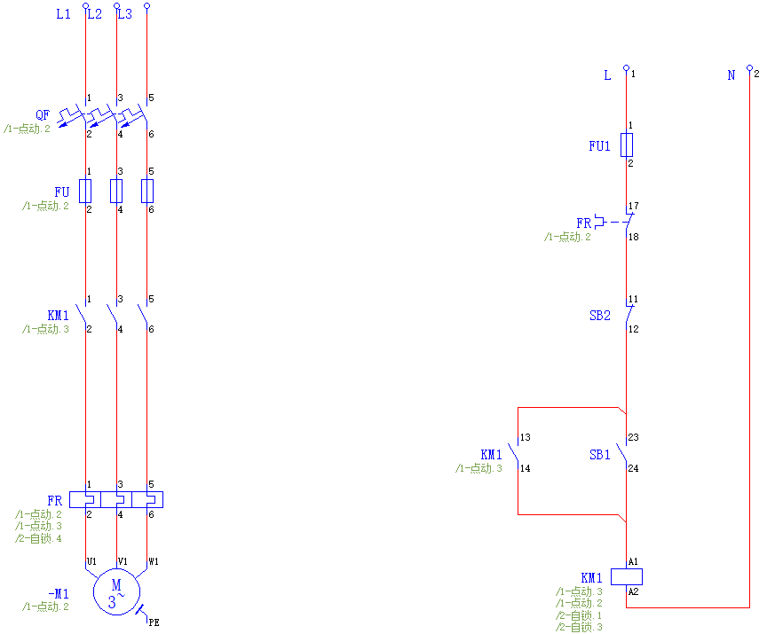

### 1.3 启动优先

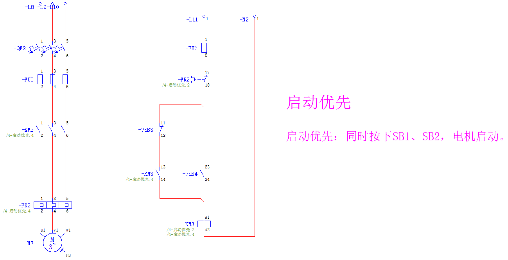

### 1.4 停止优先

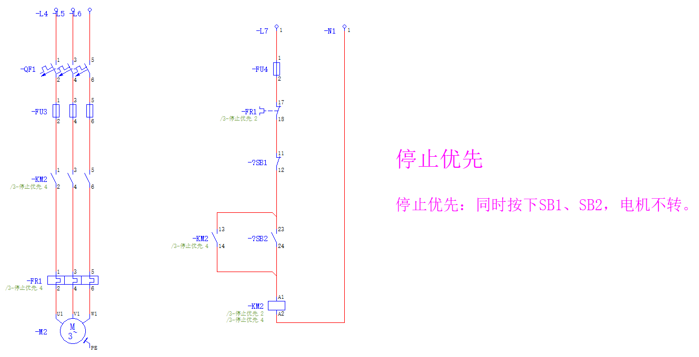

### 1.5 顺序启动

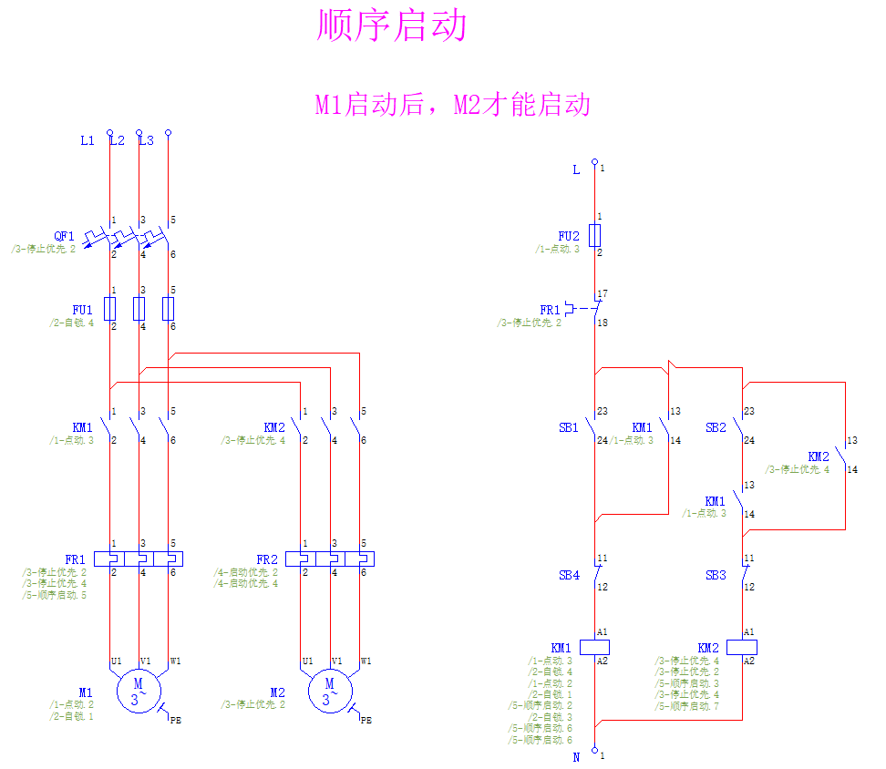

### 1.6 顺序启动，逆序停止

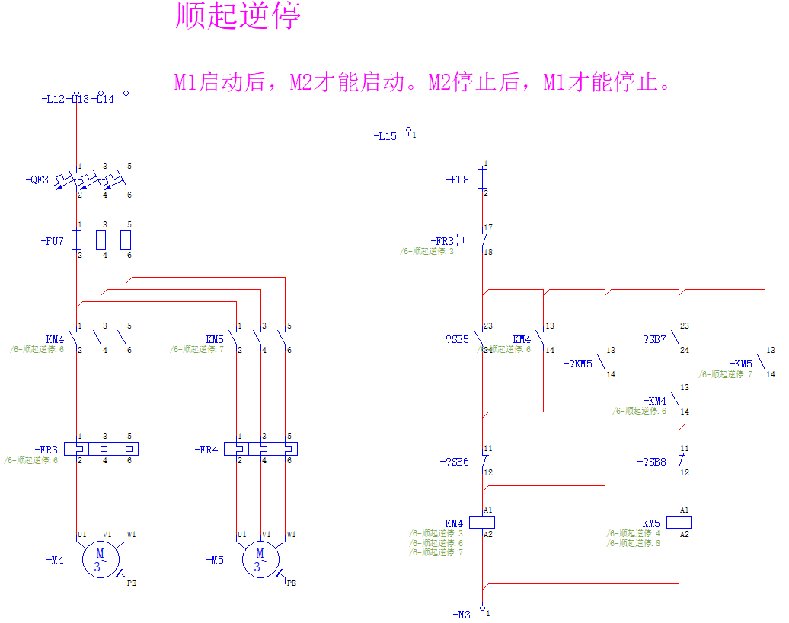

### 1.7 正反转

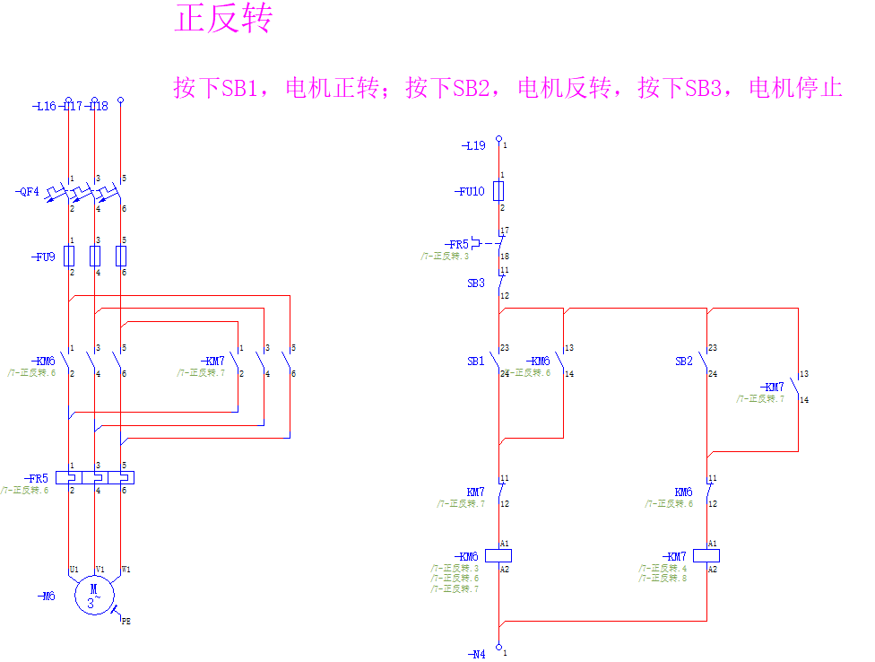

### 1.8 顺起逆停（中继器）

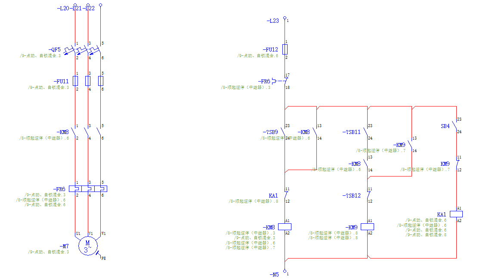

### 1.9 点动自锁混合启动

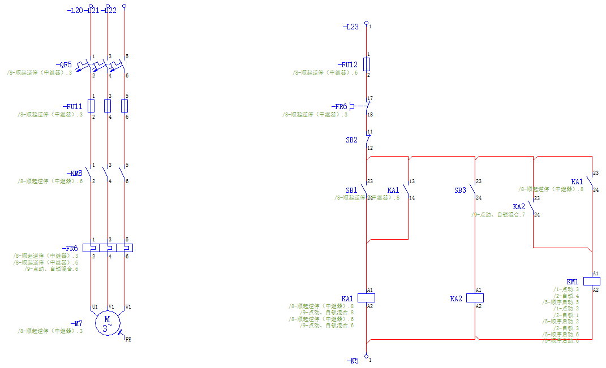

### 1.10 延时启动

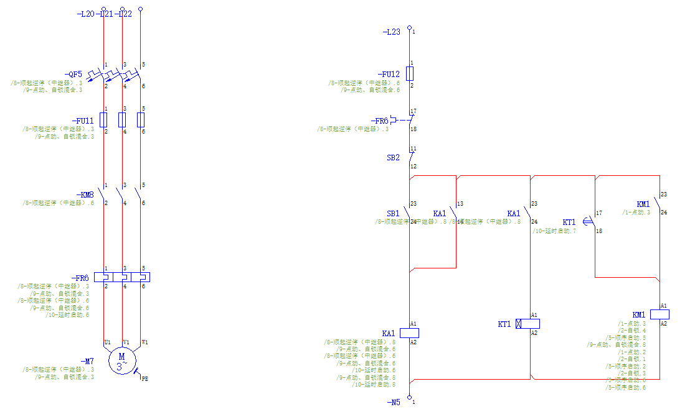

### 1.11 延时停止

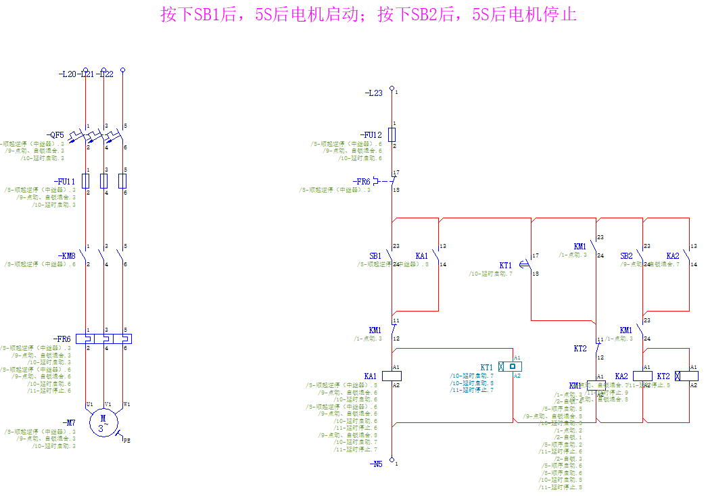

## 2. PLC认识

西门子PLC:

- 小：s7-200cn（停产）→s7200smart：使用软件smart
- 中：s7-1200，s8-300（停产）：使用软件TIA
- 大：s7-400, s7-1500：使用软件step7

s7-200smart分类：

- S：标准型，可扩展

	- ST：晶体管，速度快，带步进，伺服
		- ST60：表示有60个输入输出信号，西门子输入信号占3/5，输出信号点位占2/5
	- SR：继电器，速度慢，不能带步进、伺服

- C：紧凑型（经济型），不可扩展

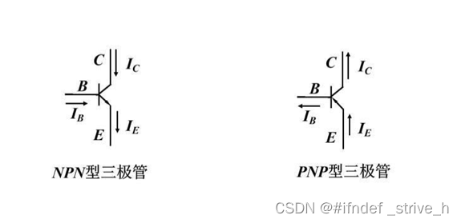

- NPN两入一出
- PNP一入两出
- 棕正蓝负黑信号，信号线接传感器

### 2.1 PLC接线

- L+接24+
- M接0
- 1M可接+可接0
- 2L+接24+
- 2M接0

输入信号点位规律：

- I0.0、I0.1、I0.2、I0.3、I0.4、I0.5、I0.6、I0.7
- I1.0、I1.1、I1.2、I1.3、I1.4、I1.5、I1.6、I1.7
- I2.0、I2.1、I2.2、I2.3、I2.4、I2.5、I2.6、I2.7
- 八进制……

输出信号点位规律：

- 八进制……
- 由于O容易混淆，使用Q代替
- Q0.0、Q0.1、Q0.2、Q0.3、Q0.4、Q0.5、Q0.6、Q0.7
- Q1.0、Q1.1、Q1.2、Q1.3、Q1.4、Q1.5、Q1.6、Q1.7

### 2.2 电路图转梯形图

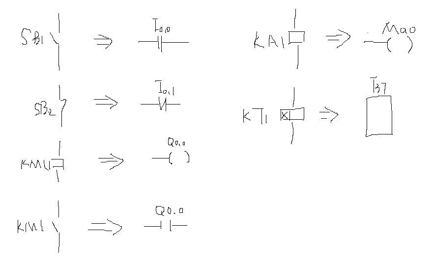

### 2.3 安装软件

STEP7 MICROWIN SMART V2.6