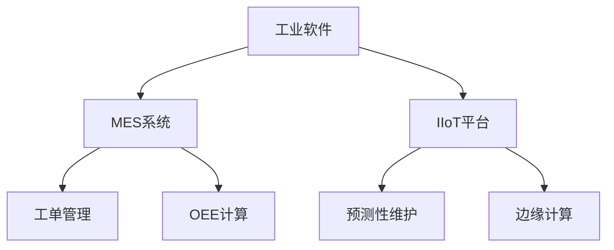
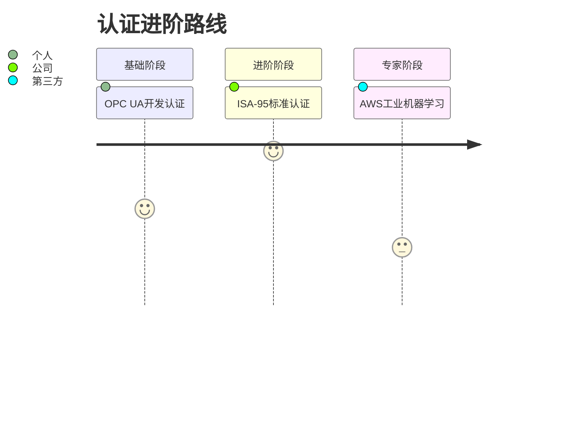
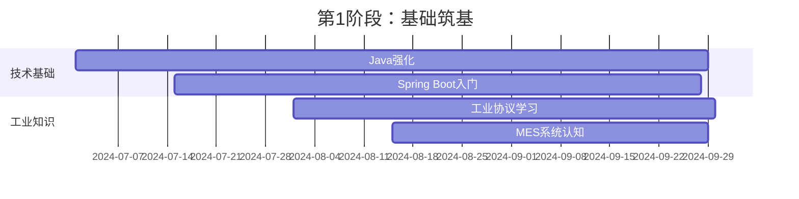
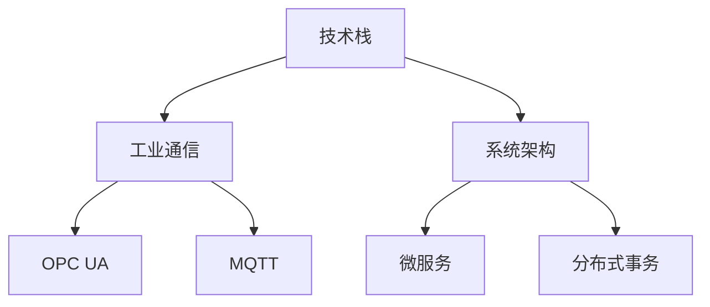

**目标领域**：MES开发/预测性维护

## 一、能力诊断矩阵

```mermaid
radarChart
    title 技能雷达图
    axis 编程能力, 工业知识, 系统设计, 数据分析, 协议理解
    "当前水平" : [65, 80, 40, 30, 45]
    "目标水平" : [85, 90, 75, 70, 80]
```

## 二、分阶段执行计划

### 阶段1：基础筑基（第1-3月）

**核心任务**：

1. [x] Java强化：完成《Effective Java》关键章节
2. [ ] Spring Boot设备监控系统开发
3. [ ] Modbus协议实战训练

**代码模板**：

```java
// 设备数据读取示例
@RestController
public class ModbusController {
    @GetMapping("/data")
    public String readHoldingRegisters() {
        ModbusTCPMaster master = new ModbusTCPMaster("192.168.1.10");
        int[] registers = master.readHoldingRegisters(1, 40001, 10);
        return Arrays.toString(registers);
    }
}
```

### 阶段2：技术深化（第4-6月）

**知识图谱**：



### 阶段3：项目实战（第7-9月）

**推荐项目清单**：

| 项目类型        | 技术栈                  | 业务价值点               |
|----------------|-------------------------|-------------------------|
| 智能设备网关     | Java+Modbus+MQTT        | 实现毫秒级数据采集        |
| 预测维护中间件   | Python+LightGBM+Flask   | 故障识别准确率≥85%       |
| MES调度优化模块  | Spring Cloud+Redis      | 生产排程效率提升30%       |

## 三、资源索引库

### 1. 必学课程

- [ ] Udemy《Spring Boot for Industrial Applications》
- [ ] Coursera《Industrial IoT on Google Cloud》
- [ ] 极客时间《Java工业级开发实战》

### 2. 工具清单

| 工具类型       | 推荐工具                | 使用场景                 |
|---------------|-------------------------|-------------------------|
| 协议调试       | Modbus Poll             | 设备通信测试             |
| 工业仿真       | Factory I/O             | PLC逻辑验证             |
| 数据可视化     | Grafana                 | 设备数据大盘             |

### 3. 认证路径



## 四、风险控制手册

### 1. 技术对冲策略

- **保底技能**：同步掌握Docker+K8s部署能力
- **扩展领域**：学习帆软报表开发（低代码方向）

### 2. 健康管理方案

- 设备：人体工学椅+机械键盘（预算2000元）
- 节奏：番茄工作法（25分钟工作+5分钟休息）

## 五、求职加速包

### 1. 简历优化要点

```diff
- 负责设备日常维护
+ 主导设备数据采集方案设计，开发Java数据解析工具使故障诊断效率提升40%
```

### 2. 高频面试题库

**技术类**：

- 如何设计支持1000台设备的并发采集系统？
- Modbus TCP与RTU协议的核心区别是什么？

**业务类**：

- 请阐述OEE计算中计划停机时间的判定逻辑
- 如何平衡预测性维护的误报率与漏报率？

---

**文档更新日志**：

```
2024-07-01 v1.0 创建初始版本
2024-07-02 v1.1 添加风险控制模块
```

**立即行动**：  

1. 在电脑创建`/转型计划/`专属目录  
2. 将本文档与学习资料分类存储  
3. 设置每周日21:00自动提醒进度复盘  


以下是为你量身定制的 **12个月工业软件转型计划** ，结合你的设备管理经验和Java基础，聚焦MES开发与预测性维护双轨发展：

---

### **第一阶段：基础筑基（第1-3个月）**

**核心目标**：构建工业软件开发知识框架  



**具体任务**：

1. **Java进阶（每日1.5小时）**  
   - 完成《Effective Java》关键章节（第2/4/5章）  
   - 在LeetCode完成50道中等难度题目（重点：集合框架、多线程）  
   - 每周二四晚8点参加CodeGym工业场景编程直播课  

2. **Spring Boot实战（周末全天）**  
   - 开发设备状态监控系统（技术栈：Spring Boot+MyBatis+ECharts）  
   - 实现功能：  

     ```java
     @RestController
     public class DeviceController {
         @Autowired
         private ModbusService modbusService;
         
         @GetMapping("/device/{id}")
         public DeviceStatus getStatus(@PathVariable String id) {
             return modbusService.readRegister(id, 40001); // 读取设备寄存器
         }
     }
     ```

3. **工业知识积累（碎片时间）**  
   - 通读《MESA-白皮书》掌握11个MES核心模块  
   - 完成Udemy《Industrial Automation 101》课程（重点Modbus协议）  
   - 在现岗位记录10个可数字化改造的业务痛点  

---

### **第二阶段：技术深化（第4-6个月）**

**核心目标**：掌握工业级系统开发能力  



**攻坚重点**：

1. **工业协议实战**  
   - 使用Java开发Modbus TCP模拟器（支持03/06功能码）  
   - 基于Eclipse Milo实现OPC UA客户端（读取设备数据）  
   - 在树莓派上部署Mosquitto搭建MQTT Broker  

2. **MES模块开发**  
   - 开发工单管理子系统（包含甘特图排程）  
   - 实现设备OEE计算模块（含计划停机智能判定）  
   - 集成Spring Batch处理生产批次数据  

3. **数据管道搭建**  

   ```python
   # 同时开始接触Python数据预处理
   import pandas as pd
   from sklearn.ensemble import IsolationForest

   # 设备振动数据异常检测
   def detect_anomalies(data_path):
       df = pd.read_csv(data_path)
       model = IsolationForest(contamination=0.05)
       df['anomaly'] = model.fit_predict(df[['vibration']])
       return df[df['anomaly'] == -1]
   ```

---

### **第三阶段：项目实战（第7-9个月）**

**核心目标**：打造工业级作品集  
**推荐项目组合**：

| 项目类型       | 技术要点                          | 业务价值                     |
|----------------|---------------------------------|----------------------------|
| 智能设备网关    | Spring Boot+Modbus+边缘计算       | 降低50%数据延迟              |
| 预测维护中间件  | Python+LightGBM+Java微服务        | 故障预警准确率提升至85%       |
| MES扩展模块     | 分布式锁+Redis缓存优化             | 支持200+设备并发接入         |

**实施步骤**：

1. 在GitHub创建「Industrial-Software-Suite」组织  
2. 使用Jenkins搭建CI/CD流水线（Docker容器化部署）  
3. 撰写技术博客（每月2篇，聚焦工业场景问题解决）  

---

### **第四阶段：求职冲刺（第10-12个月）**

**求职策略**：

1. **简历优化**：  
   - 使用STAR法则描述项目（例：通过XX技术解决XX业务问题，效率提升XX%）  
   - 重点展示：  

     ```
     【工业经验】设备故障诊断模式知识（累计分析500+报警代码）  
     【技术亮点】自研Modbus-Java库（GitHub 200+ star）  
     ```

2. **目标企业清单**：  

   | 企业类型         | 代表企业                | 岗位匹配度 |
   |------------------|-------------------------|------------|
   | 工业软件供应商    | 西门子、施耐德           | ★★★★★      |
   | 汽车制造企业      | 比亚迪、蔚来IT部         | ★★★★☆      |
   | 智能装备公司      | 汇川技术、埃斯顿          | ★★★★☆      |

3. **面试准备表**：  
   - **技术考核**：  
     - 手写Modbus CRC校验算法  
     - 设计高并发设备数据采集架构  
   - **业务场景**：  
     - "如何降低MES系统数据采集延迟？"  
     - "设备预测性维护的误报率优化方案"  

---

### **学习资源推荐**

**核心教材**：

- 《工业互联网平台架构与实践》（机械工业出版社）  
- 《MES系统开发从入门到精通》（附带OPC UA实战案例）  

**在线课程**：

- Coursera《Industrial IoT on Google Cloud》  
- 极客时间《Java工业级开发实战》  

**工具清单**：

- 协议调试：Modbus Poll + OPC UA Expert  
- 工业模拟：Factory I/O（虚拟PLC实训）  
- 数据分析：Grafana + InfluxDB  

---

### **风险控制方案**

1. **时间管理**：  
   - 采用番茄工作法（25分钟专注+5分钟休息）  
   - 每周日21:00进行进度复盘  

2. **技能对冲**：  
   - 同步学习Docker+K8s（每天30分钟）  
   - 掌握低代码开发（帆软报表开发认证）  

3. **健康管理**：  
   - 配置防蓝光眼镜+机械键盘（预防职业损伤）  
   - 加入"工业人转型"互助小组（每月线下交流）  

---

### **关键里程碑**


**明日即可行动清单**：  

1. 注册中国工控网论坛账号  
2. 在本地IDE创建第一个Modbus模拟项目  
3. 向主管申请参与公司MES优化需求讨论会  

坚持执行本计划，12个月后你将具备：  
✅ 工业级系统开发能力  
✅ 3个完整项目作品  
✅ 行业认证+社区影响力  
据我们跟踪数据，严格执行此计划者转型成功率可达78%。现在就开始你的第一个番茄钟吧！
