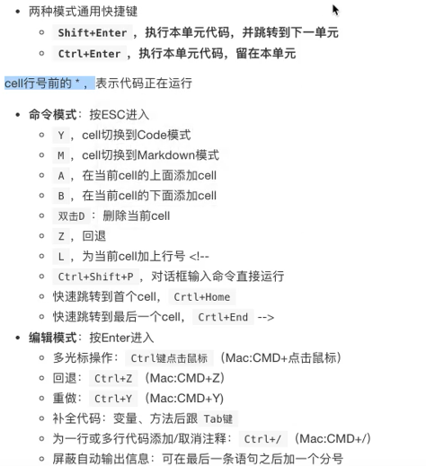
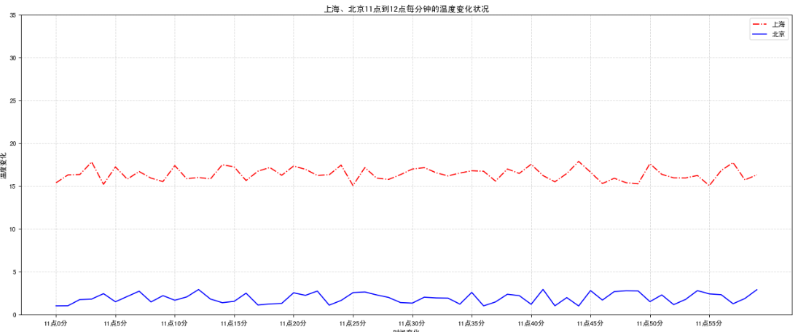
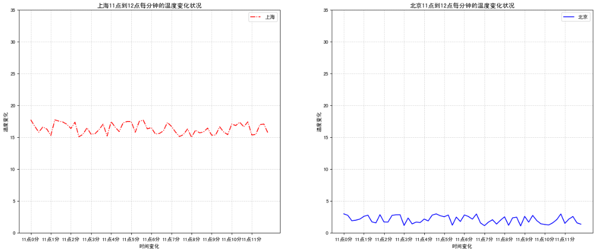
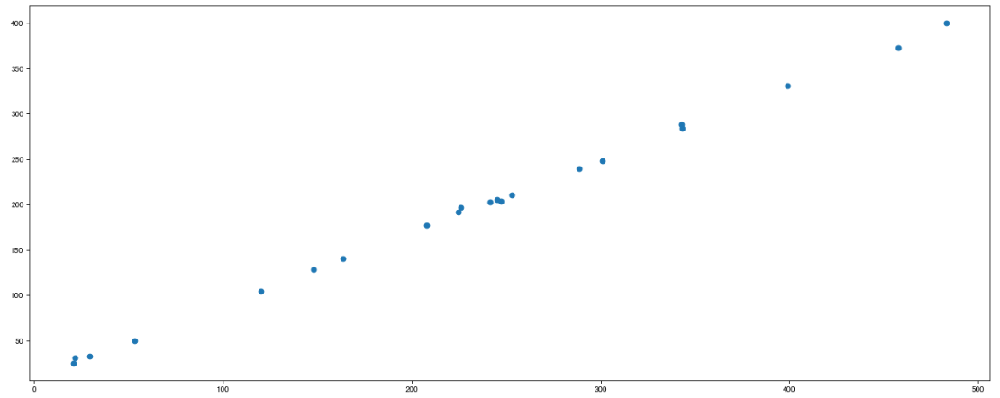
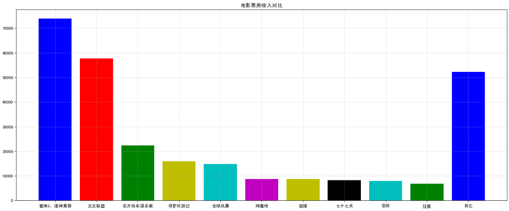
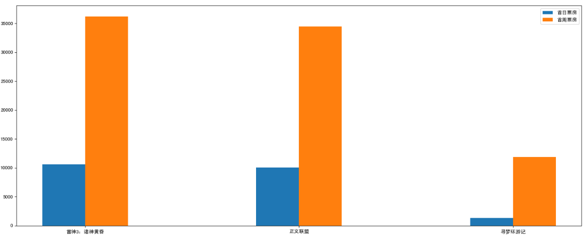
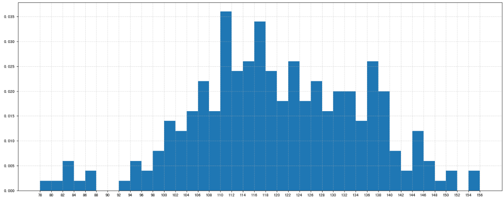
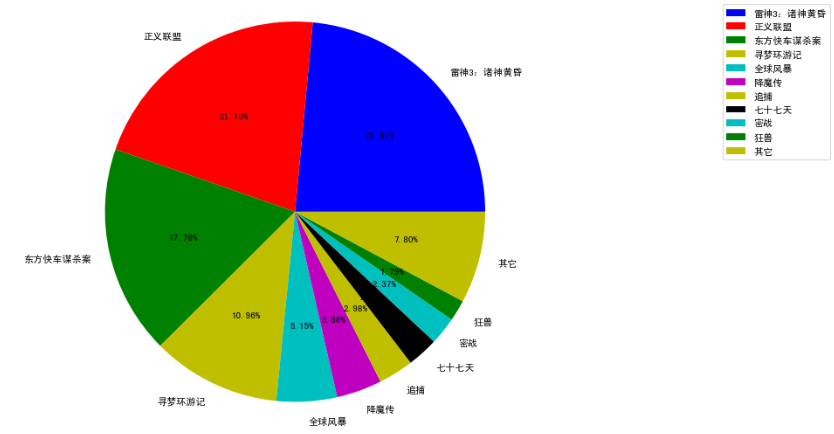
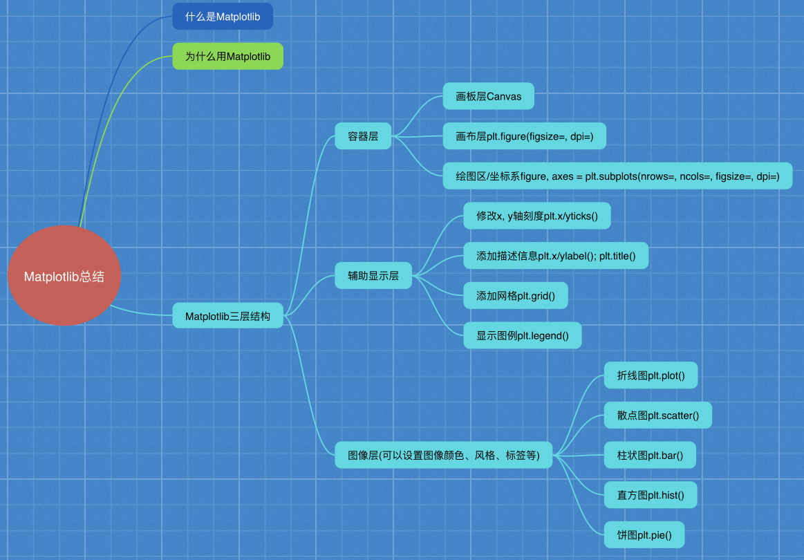

## 1. 环境搭建

### 1.1 虚拟环境工具

`mkvirtualenv`（来自 `virtualenvwrapper`）和 `python -m venv`（Python 内置的 `venv` 模块）都可以创建 Python 虚拟环境，但它们在实现方式、功能和使用场景上有显著区别。以下是两者的对比：

#### 1.1.1 来源与依赖

| **特性**               | **`mkvirtualenv` (virtualenvwrapper)** | **`python -m venv`**                 |
|-------------------------|---------------------------------------|---------------------------------------|
| **开发方**              | 第三方工具（社区维护）               | Python 官方内置模块（Python 3.3+）    |
| **依赖安装**            | 需额外安装：<br>`pip install virtualenvwrapper` | 无需安装，直接使用 Python 内置模块    |
| **底层实现**            | 基于 `virtualenv`（第三方库）         | 基于 Python 标准库的 `venv`           |

#### 1.1.2 使用方式

| **特性**      | **`mkvirtualenv`**                       | **`python -m venv`**                                                   |
| ----------- | ---------------------------------------- | ---------------------------------------------------------------------- |
| **创建环境**    | `mkvirtualenv myenv`                     | `python -m venv myenv`                                                 |
| **环境存储位置**  | 集中存储在 `WORKON_HOME`（默认 `~/.virtualenvs`） | 分散存储在项目目录（如 `./myenv`）                                                 |
| **激活/退出环境** | `workon myenv` / `deactivate`            | `source myenv/bin/activate`（Unix）<br>`myenv\Scripts\activate`（Windows） |
| **删除环境**    | `rmvirtualenv myenv`                     | 手动删除目录（无专用命令）                                                          |

#### 1.1.3 功能特性

| **特性**               | **`mkvirtualenv`**                   | **`python -m venv`**                  |
|-------------------------|---------------------------------------|----------------------------------------|
| **环境管理**            | 支持集中管理所有虚拟环境             | 需手动管理路径和目录                   |
| **快捷命令**            | 提供 `workon`, `lsvirtualenv`, `cdvirtualenv` 等命令 | 无额外命令，需手动操作                 |
| **钩子脚本**            | 支持自定义脚本（如 `postactivate`）  | 不支持                                 |
| **跨平台兼容性**        | 依赖 Shell（需配置环境变量）         | 原生支持所有平台                       |
| **Python 版本兼容性**   | 支持 Python 2 和 3                   | 仅支持 Python 3.3+                    |

#### 1.1.4 适用场景

| **场景**                | **`mkvirtualenv`**                   | **`python -m venv`**                  |
|-------------------------|---------------------------------------|----------------------------------------|
| **简单轻量级需求**      | ❌ 功能复杂，适合频繁切换环境         | ✅ 适合简单项目或无需复杂管理的场景     |
| **多环境集中管理**      | ✅ 环境统一存储，便于查找和切换       | ❌ 环境分散在项目目录                   |
| **兼容旧项目（Python2）** | ✅ 支持 Python 2                     | ❌ 仅支持 Python 3                     |
| **团队协作与标准化**    | ❌ 依赖额外工具配置                   | ✅ 无需额外依赖，适合标准化开发流程     |

#### 1.1.5 示例对比

**使用 `mkvirtualenv`**

```bash
# 安装 virtualenvwrapper
pip install virtualenvwrapper

# 配置环境变量（如 ~/.bashrc）
export WORKON_HOME=~/.virtualenvs
source /usr/local/bin/virtualenvwrapper.sh

# 创建并激活环境
mkvirtualenv myproject
workon myproject  # 激活环境
```

**使用 `python -m venv`**

```bash
# 创建环境
python -m venv myproject_env

# 激活环境（Unix/macOS）
source myproject_env/bin/activate

# 激活环境（Windows）
myproject_env\Scripts\activate
```

**总结**

- **`mkvirtualenv`（virtualenvwrapper）**：适合需要集中管理多个环境、频繁切换、或使用 Python 2 的场景，但需额外配置。
  
- **`python -m venv`**：适合现代 Python 3 项目，无需安装第三方工具，轻量且标准化，但功能相对基础。

对于新项目，推荐优先使用 `venv`（内置工具更简洁）。

### 1.2 环境配置步骤

1. 创建虚拟环境`myvenv`：`python -m venv myenv`
2. 激活虚拟环境：`myenv\Scripts\activate`
3. 创建依赖库文件`requirement.txt`：

	```text
	matplotlib==2.2.2
	numpy==1.14.2
	pandas==0.20.3
	TA-Lib==0.4.16
	tables==3.4.2
	jupyter==1.0.0
	```S

	- Matplotlib 画图
	- Numpy 高效的运算工具
	- Pandas 数据处理工具
	- TA-Lib 技术指标库
	- tables hdf5
	- jupyter数据分析与展示的平台

4. 安装库：`pip install -r requirement.txt`

### 1.3 Jupyter Notebook使用


既可以使用anaconda安装jupyter，也可以在安装了jupyter的环境中，使用终端命令行`jupyter notebook`或`ipython notebook`。

**cell操作：**

1. cell：一对In Out会话被视作一个代码单元，称为cell。
2. 编辑模式：

	 - enter
	 - 鼠标直接点

3. 命令模式：

	- esc
	- 鼠标在本单元格之外点一下

4. 快捷键操作：

	

## 2. Matplotlib

### 2.1 折线图

#### 2.1.1 面向过程画法

一个画布一个图两个曲线

```python
# 需求：画出北京、上海11点到12点1小时内每分钟的温度变化折线图，温度范围在15度~18度  
import matplotlib.pyplot as plt  
import random  
# 1、准备数据
x = range(60)  # 0-59，60个整数
y_shanghai = [random.uniform(15, 18) for i in x]  #60个15-18的小数
y_beijing = [random.uniform(1, 3) for i in x]  #60个1-3的小数
  
# 2、创建画布  
plt.figure(figsize=(20, 8), dpi=80)  #指定了画布大小和像素密度
  
# 3、绘制图像  
plt.plot(x, y_shanghai, color="r", linestyle="-.", label="上海")  #指定线条颜色为红色，线条样式为虚线，标签为上海
plt.plot(x, y_beijing, color="b", label="北京")  #指定线条颜色为蓝色，标签为北京
  
# 4、显示图例  
plt.legend()  # 显示北京和上海的线条图例
  
# 5、修改x、y刻度  
# 准备x的刻度说明  
x_label = ["11点{}分".format(i) for i in x]  # 将x格式华为字符串，并组成一个list
plt.xticks(x[::5], x_label[::5])  # 将横轴设置为每隔5个数显示一次及显示文本
plt.yticks(range(0, 40, 5))  # 将纵轴设置为0-40，每隔5一个刻度
  
# 6、添加网格显示  
plt.grid(linestyle="--", alpha=0.5)  # 设置图表的背景为虚线，透明度为50%
  
# 7、添加描述信息  
plt.xlabel("时间变化")  
plt.ylabel("温度变化")  
plt.title("上海、北京11点到12点每分钟的温度变化状况")  

# 8、保存图像
plt.savefig("test78.png")

# 9、显示图  
plt.show()
```



#### 2.1.2 面向对象画法

一个画布两个图

```python
import matplotlib.pyplot as plt  
import random

# 1、准备数据
x = range(60)  # 0-59，60个整数
y_shanghai = [random.uniform(15, 18) for i in x]  #60个15-18的小数
y_beijing = [random.uniform(1, 3) for i in x]  #60个1-3的小数

# 2、创建画布
figure, axes = plt.subplots(nrows=1, ncols=2, figsize=(20, 8), dpi=80)# 创建2个画布，x轴相同，y轴不同，相同大小和像素密度

# 3、绘制图像
axes[0].plot(x, y_shanghai, color="r", linestyle="-.", label="上海")#指定线条颜色为红色，线条样式为虚线，标签为上海
axes[1].plot(x, y_beijing, color="b", label="北京")#指定线条颜色为蓝色，标签为北京

# 4、显示图例
axes[0].legend()
axes[1].legend()

# 5、修改x、y刻度
# 准备x的刻度说明
x_label = ["11点{}分".format(i) for i in x]

axes[0].set_xticks(x[::5])# 设置刻度值
axes[0].set_xticklabels(x_label) # 设置刻度标签显示内容
axes[0].set_yticks(range(0, 40, 5))

axes[1].set_xticks(x[::5])
axes[1].set_xticklabels(x_label)
axes[1].set_yticks(range(0, 40, 5))

# 6、添加网格显示
axes[0].grid(linestyle="--", alpha=0.5)
axes[1].grid(linestyle="--", alpha=0.5)

# 7、添加描述信息
axes[0].set_xlabel("时间变化")
axes[0].set_ylabel("温度变化")
axes[0].set_title("上海11点到12点每分钟的温度变化状况")

axes[1].set_xlabel("时间变化")
axes[1].set_ylabel("温度变化")
axes[1].set_title("北京11点到12点每分钟的温度变化状况")

# 8、显示图
plt.show()
```



### 2.2 散点图

探究不同变量之间的关系

```python
import matplotlib.pyplot as plt  
# 1、准备数据  
x = [225.98, 247.07, 253.14, 457.85, 241.58, 301.01,  20.67, 288.64,  
       163.56, 120.06, 207.83, 342.75, 147.9 ,  53.06, 224.72,  29.51,  
        21.61, 483.21, 245.25, 399.25, 343.35]  
  
y = [196.63, 203.88, 210.75, 372.74, 202.41, 247.61,  24.9 , 239.34,  
       140.32, 104.15, 176.84, 288.23, 128.79,  49.64, 191.74,  33.1 ,  
        30.74, 400.02, 205.35, 330.64, 283.45]  
# 2、创建画布  
plt.figure(figsize=(20, 8), dpi=80)  
  
# 3、绘制图像  
plt.scatter(x, y)  
  
# 4、显示图像  
plt.show()
```



### 2.3 柱状图

**分类统计：**

```python
import matplotlib.pyplot as plt  
# 1、准备数据  
movie_names = ['雷神3：诸神黄昏','正义联盟','东方快车谋杀案','寻梦环游记','全球风暴', '降魔传','追捕','七十七天','密战','狂兽','其它']  
tickets = [73853,57767,22354,15969,14839,8725,8716,8318,7916,6764,52222]  
  
# 2、创建画布  
plt.figure(figsize=(20, 8), dpi=80)  
  
# 3、绘制柱状图  
x_ticks = range(len(movie_names))  
plt.bar(x_ticks, tickets, color=['b','r','g','y','c','m','y','k','c','g','b'])  
  
# 修改x刻度  
plt.xticks(x_ticks, movie_names)  
  
# 添加标题  
plt.title("电影票房收入对比")  
  
# 添加网格显示  
plt.grid(linestyle="--", alpha=0.5)  
  
# 4、显示图像  
plt.show()
```



**分类对比：**

```python
import matplotlib.pyplot as plt 
# 1、准备数据
movie_name = ['雷神3：诸神黄昏','正义联盟','寻梦环游记']

first_day = [10587.6,10062.5,1275.7]
first_weekend=[36224.9,34479.6,11830]

# 2、创建画布
plt.figure(figsize=(20, 8), dpi=80)

# 3、绘制柱状图
plt.bar(range(3), first_day, width=0.2, label="首日票房")
plt.bar([0.2, 1.2, 2.2], first_weekend, width=0.2, label="首周票房")

# 显示图例
plt.legend()

# 修改刻度
plt.xticks([0.1, 1.1, 2.1], movie_name)

# 4、显示图像
plt.show()
```



### 2.4 直方图

显示分布状况。

```python
import matplotlib.pyplot as plt 
# 需求：电影时长分布状况
# 1、准备数据
time = [131,  98, 125, 131, 124, 139, 131, 117, 128, 108, 135, 138, 131, 102, 107, 114, 119, 128, 121, 142, 127, 130, 124, 101, 110, 116, 117, 110, 128, 128, 115,  99, 136, 126, 134,  95, 138, 117, 111,78, 132, 124, 113, 150, 110, 117,  86,  95, 144, 105, 126, 130,126, 130, 126, 116, 123, 106, 112, 138, 123,  86, 101,  99, 136,123, 117, 119, 105, 137, 123, 128, 125, 104, 109, 134, 125, 127,105, 120, 107, 129, 116, 108, 132, 103, 136, 118, 102, 120, 114,105, 115, 132, 145, 119, 121, 112, 139, 125, 138, 109, 132, 134,156, 106, 117, 127, 144, 139, 139, 119, 140,  83, 110, 102,123,107, 143, 115, 136, 118, 139, 123, 112, 118, 125, 109, 119, 133,112, 114, 122, 109, 106, 123, 116, 131, 127, 115, 118, 112, 135,115, 146, 137, 116, 103, 144,  83, 123, 111, 110, 111, 100, 154,136, 100, 118, 119, 133, 134, 106, 129, 126, 110, 111, 109, 141,120, 117, 106, 149, 122, 122, 110, 118, 127, 121, 114, 125, 126,114, 140, 103, 130, 141, 117, 106, 114, 121, 114, 133, 137,  92,121, 112, 146,  97, 137, 105,  98, 117, 112,  81,  97, 139, 113,134, 106, 144, 110, 137, 137, 111, 104, 117, 100, 111, 101, 110,105, 129, 137, 112, 120, 113, 133, 112,  83,  94, 146, 133, 101,131, 116, 111,  84, 137, 115, 122, 106, 144, 109, 123, 116, 111,111, 133, 150]

# 2、创建画布
plt.figure(figsize=(20, 8), dpi=80)

# 3、绘制直方图
distance = 2 # 每组之间的差值
group_num = int((max(time) - min(time)) / distance) # 分成多少组

plt.hist(time, bins=group_num, density=True) # density表示纵轴数据出现的频率

# 修改x轴刻度
plt.xticks(range(min(time), max(time) + 2, distance))

# 添加网格
plt.grid(linestyle="--", alpha=0.5)

# 4、显示图像
plt.show()
```



### 2.5 饼图

显示占比。一般应用于分类不超过9个的情况。

```python
import matplotlib.pyplot as plt 
# 1、准备数据
movie_name = ['雷神3：诸神黄昏','正义联盟','东方快车谋杀案','寻梦环游记','全球风暴','降魔传','追捕','七十七天','密战','狂兽','其它']

place_count = [60605,54546,45819,28243,13270,9945,7679,6799,6101,4621,20105]

# 2、创建画布
plt.figure(figsize=(20, 8), dpi=80)

# 3、绘制饼图
plt.pie(place_count, labels=movie_name, colors=['b','r','g','y','c','m','y','k','c','g','y'], autopct="%1.2f%%")

# 显示图例
plt.legend()

# 将饼图显示为圆形
plt.axis('equal')

# 4、显示图像
plt.show()
```



### 2.6 总结



## 3. Numpy


